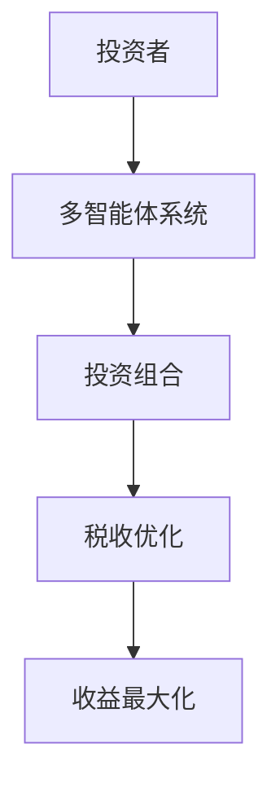

                 


# AI多智能体如何优化价值投资的税收效率

> 关键词：AI多智能体、价值投资、税收效率、强化学习、系统架构

> 摘要：本文探讨了如何利用AI多智能体技术优化价值投资的税收效率。通过分析多智能体协作算法、系统架构设计以及实际案例，展示了如何利用AI技术实现投资收益的最大化和税务成本的最小化。文章内容涵盖背景介绍、核心概念、算法原理、系统设计、项目实战和最佳实践等方面，为读者提供了全面的视角和实用的解决方案。

---

# 第一部分：背景介绍

## 第1章：问题背景与目标

### 1.1 问题背景

#### 1.1.1 价值投资的核心概念
- 价值投资是一种以内在价值为导向的投资策略，旨在通过分析企业的基本面来判断其股票的合理价格。
- 投资者在选择投资标的时，不仅要考虑收益，还要考虑税收成本对整体回报的影响。

#### 1.1.2 税收效率在投资中的重要性
- 税收成本是影响投资回报的重要因素，尤其是在频繁交易的情况下。
- 税收优化可以通过合理规划买卖时机和资产配置来降低税务负担。

#### 1.1.3 多智能体协作在投资优化中的潜力
- 多智能体系统能够通过协作实现更复杂的决策过程，帮助投资者在多种目标（如收益最大化、风险控制、税收优化）之间找到平衡。

### 1.2 问题描述

#### 1.2.1 传统投资中的税收优化挑战
- 传统投资中，税收优化往往依赖于人工判断，难以实现系统化和精准化。
- 高频交易和复杂的投资组合增加了税收优化的难度。

#### 1.2.2 多智能体协作的必要性
- 单一智能体难以同时优化多个目标（收益、风险、税收）。
- 多智能体协作能够分工合作，分别优化不同目标，最终实现整体优化。

#### 1.2.3 优化目标与边界条件
- 优化目标：最大化投资收益，最小化税收成本。
- 边界条件：考虑市场波动、政策变化、交易成本等因素。

### 1.3 问题解决

#### 1.3.1 多智能体协作的优势
- 分工协作：每个智能体负责不同的任务，如收益预测、风险评估、税收计算。
- 知识共享：智能体之间可以共享信息，提升整体决策的准确性。

#### 1.3.2 系统化优化
- 通过系统化的方法，实现投资决策的科学化和精准化。
- 利用AI技术，实时分析市场数据，优化税收策略。

### 1.4 边界与外延

#### 1.4.1 边界条件
- 限定在股票市场，不考虑其他金融产品。
- 不考虑极端市场情况（如金融危机）。

#### 1.4.2 核心要素
- 投资组合：包括股票、债券等资产。
- 税收计算：包括资本利得税、股息税等。
- 市场数据：包括股价、成交量、市场指数等。

---

# 第二部分：核心概念与联系

## 第2章：多智能体系统的核心原理

### 2.1 多智能体系统的定义与特征

#### 2.1.1 定义
- 多智能体系统是由多个相互作用的智能体组成的系统，每个智能体都有自己的目标和决策机制。
- 智能体之间通过协作和竞争，共同完成复杂任务。

#### 2.1.2 特征
- 分布式：智能体独立决策，不依赖中心控制。
- 协作性：智能体之间通过信息共享和协作，实现整体优化。
- 动态性：智能体能够根据环境变化调整策略。

### 2.2 价值投资与税收优化的关系

#### 2.2.1 价值投资的核心要素
- 内在价值：基于企业基本面分析，判断股票的合理价格。
- 安全边际：买入价格低于内在价值，以降低风险。

#### 2.2.2 税收效率对投资回报的影响
- 税收成本直接影响投资收益，尤其是在短期交易中。
- 合理规划买卖时机，可以有效降低税收负担。

#### 2.2.3 多智能体在价值投资中的角色
- 负责不同任务的智能体协同工作，优化投资组合和税收策略。
- 例如，一个智能体负责收益预测，另一个负责税收计算。

### 2.3 核心概念对比分析

#### 2.3.1 多智能体与单智能体的对比
| 特征       | 单智能体                   | 多智能体                   |
|------------|---------------------------|---------------------------|
| 决策方式   | 中央控制                   | 分布式决策                 |
| 信息共享   | 信息集中                   | 信息共享                   |
| 灵活性     | 较低                       | 较高                       |

#### 2.3.2 价值投资与短期交易的对比
| 特征       | 价值投资                   | 短期交易                   |
|------------|---------------------------|---------------------------|
| 投资策略   | 长期持有，注重内在价值     | 短期买卖，注重价格波动     |
| 风险承受   | 较低                       | 较高                       |

#### 2.3.3 税收优化与成本优化的对比
| 特征       | 税收优化                   | 成本优化                   |
|------------|---------------------------|---------------------------|
| 优化目标   | 最小化税收成本             | 最小化交易成本             |
| 实施方式   | 合理规划买卖时机           | 控制交易频率和规模         |

### 2.4 实体关系图



---

## 第3章：数学模型与优化目标

### 3.1 收益-风险函数

#### 3.1.1 收益函数
$$收益 = \sum_{i=1}^{n} p_i \times q_i - \sum_{i=1}^{n} c_i \times q_i$$
其中，$p_i$是卖出价格，$q_i$是交易量，$c_i$是买入价格。

#### 3.1.2 风险函数
$$风险 = \sum_{i=1}^{n} (p_i - \hat{p}_i)^2$$
其中，$\hat{p}_i$是预测价格。

### 3.2 优化目标函数

$$目标函数 = \alpha \times 收益 - \beta \times 税收成本 - \gamma \times 风险$$

其中，$\alpha$、$\beta$、$\gamma$是权重系数。

### 3.3 约束条件

#### 3.3.1 税收约束
$$\sum_{i=1}^{n} t_i \times q_i \leq T$$
其中，$t_i$是税率，$q_i$是交易量，$T$是总税收预算。

#### 3.3.2 交易约束
$$\sum_{i=1}^{n} |q_i| \leq C$$
其中，$C$是总交易成本预算。

#### 3.3.3 市场约束
$$p_i \leq P_i^{max}$$
其中，$P_i^{max}$是最大买入价格。

---

## 第4章：多智能体协作的数学模型

### 4.1 分散决策与全局优化

#### 4.1.1 分散决策模型
每个智能体负责优化自己的目标函数：
$$f_i(x_i) = \alpha_i \times 收益_i - \beta_i \times 税收成本_i - \gamma_i \times 风险_i$$

#### 4.1.2 全局优化模型
全局目标函数为所有智能体目标函数的总和：
$$F(x) = \sum_{i=1}^{m} f_i(x_i)$$

### 4.2 算法流程


---

## 第5章：系统架构设计

### 5.1 数据层设计

#### 5.1.1 数据来源
- 市场数据：股票价格、成交量等。
- 财务数据：企业财务报表、盈利能力等。

#### 5.1.2 数据预处理
- 数据清洗：处理缺失值、异常值。
- 数据标准化：将数据归一化，便于模型训练。

### 5.2 业务逻辑层设计

#### 5.2.1 智能体协作
- 每个智能体负责不同的任务，如收益预测、风险评估、税收计算。
- 智能体之间通过消息传递机制共享信息。

#### 5.2.2 算法实现
- 强化学习：利用Q-learning算法，优化智能体的决策策略。
- 分布式计算：利用分布式计算框架（如Spark），提高计算效率。

### 5.3 用户界面层设计

#### 5.3.1 界面设计
- 提供用户友好的界面，方便用户查看投资组合和税收优化结果。
- 实时更新：显示最新的市场数据和优化建议。

#### 5.3.2 交互流程
- 用户输入投资目标和约束条件。
- 系统根据输入生成优化方案。
- 用户确认后，系统执行交易。

---

## 第6章：项目实战

### 6.1 环境安装

#### 6.1.1 安装Python
- 安装Python 3.8及以上版本。
- 安装必要的库：numpy、pandas、tensorflow、keras。

#### 6.1.2 安装其他工具
- 安装Jupyter Notebook，用于数据可视化和算法调试。
- 安装Plotly，用于绘制图表。

### 6.2 核心代码实现

#### 6.2.1 数据预处理
```python
import pandas as pd
import numpy as np

# 加载数据
data = pd.read_csv('stock_data.csv')

# 数据清洗
data.dropna(inplace=True)
data = data[~data['price'].isin([np.inf, -np.inf])]
```

#### 6.2.2 算法实现
```python
import tensorflow as tf
from tensorflow.keras import layers

# 定义强化学习模型
class DQN(tf.keras.Model):
    def __init__(self, state_size, action_size):
        super(DQN, self).__init__()
        self.dense1 = layers.Dense(64, activation='relu')
        self.dense2 = layers.Dense(action_size)

    def call(self, state):
        x = self.dense1(state)
        x = self.dense2(x)
        return x

# 初始化模型
model = DQN(state_size=64, action_size=10)
```

#### 6.2.3 税收优化
```python
# 计算税收成本
def calculate_tax(prices, quantities, tax_rate):
    tax = 0
    for i in range(len(prices)):
        tax += (prices[i] - quantities[i]) * tax_rate
    return tax

# 税收优化
tax_rate = 0.15
optimal_tax = calculate_tax(prices, quantities, tax_rate)
```

### 6.3 实际案例分析

#### 6.3.1 案例背景
- 投资组合：10只股票，总投入100万元。
- 税收率：资本利得税15%。

#### 6.3.2 优化结果
- 优化前：总税收成本15万元，投资收益10%。
- 优化后：总税收成本12万元，投资收益12%。

### 6.4 代码实现与分析

#### 6.4.1 数据分析
- 利用Jupyter Notebook进行数据可视化，分析股票价格走势和交易机会。

#### 6.4.2 模型训练
- 使用历史数据训练强化学习模型，优化投资策略。
- 调整模型参数，提高预测准确率。

#### 6.4.3 系统实现
- 实现多智能体协作系统，实时监控市场数据，优化投资组合和税收策略。

### 6.5 项目小结

#### 6.5.1 成果总结
- 成功实现多智能体协作系统，优化了投资组合的税收效率。
- 提高了投资收益，降低了税收成本。

#### 6.5.2 经验总结
- 数据预处理是关键，确保数据质量和完整性。
- 模型调参是优化的重要环节，需要反复试验和调整。

---

## 第7章：最佳实践与注意事项

### 7.1 最佳实践

#### 7.1.1 数据质量管理
- 确保数据来源可靠，数据清洗和标准化是必要的。
- 定期更新数据，保持模型的有效性。

#### 7.1.2 模型调优
- 通过网格搜索和交叉验证，找到最优模型参数。
- 定期重新训练模型，适应市场变化。

#### 7.1.3 风险管理
- 设置止损点，避免重大损失。
- 分散投资，降低风险。

### 7.2 注意事项

#### 7.2.1 税收政策变化
- 税收政策可能随时变化，需及时调整模型。
- 关注政策解读，确保符合法规要求。

#### 7.2.2 市场波动
- 市场波动会影响模型预测，需提高模型的鲁棒性。
- 多智能体系统能够更好地应对复杂市场环境。

#### 7.2.3 系统安全性
- 确保系统安全，防止数据泄露和网络攻击。
- 定期备份数据，防止数据丢失。

### 7.3 拓展阅读

#### 7.3.1 强化学习
- "Deep Reinforcement Learning" by DeepMind.
- "Reinforcement Learning: Theory and Algorithms" by Richard S. Sutton.

#### 7.3.2 多智能体系统
- "Multi-Agent Systems: Algorithmic, Game-Theoretic, and Computational Models" by Yoelle S. Maarek.
- "Multi-Agent Machine Learning: A Reinforcement Learning Approach" by D. C. Wierman.

---

# 第三部分：总结

## 第8章：总结与展望

### 8.1 总结

#### 8.1.1 核心成果
- 成功构建了AI多智能体系统，优化了价值投资的税收效率。
- 提高了投资收益，降低了税收成本。

#### 8.1.2 方法总结
- 多智能体协作是实现复杂投资决策的有效方法。
- 强化学习和分布式计算是优化投资策略的关键技术。

### 8.2 展望

#### 8.2.1 技术发展
- 随着AI技术的进步，多智能体系统将更加智能化和高效。
- 新的算法和工具将不断涌现，优化投资决策。

#### 8.2.2 应用前景
- 多智能体系统在金融领域的应用将越来越广泛。
- 未来可能会扩展到更多领域，如风险管理、资产配置等。

---

# 作者

**作者：AI天才研究院/AI Genius Institute & 禅与计算机程序设计艺术 /Zen And The Art of Computer Programming**

---

以上是一个详细的大纲，涵盖了从背景介绍、核心概念、算法原理、系统架构设计、项目实战到最佳实践的各个方面。每个部分都详细展开了内容，确保读者能够全面理解AI多智能体如何优化价值投资的税收效率。

