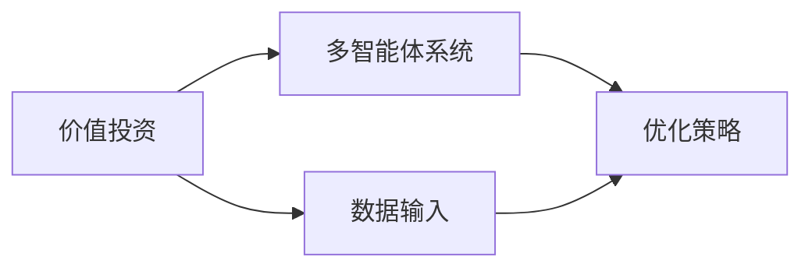
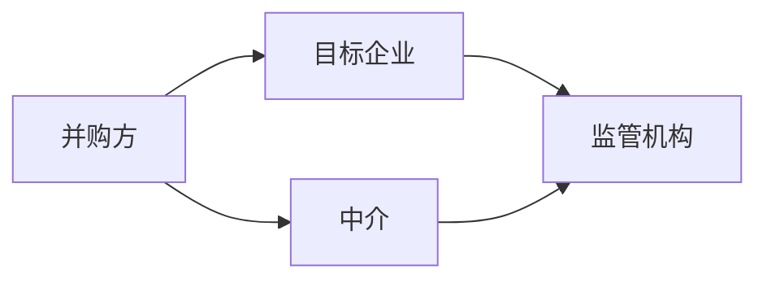
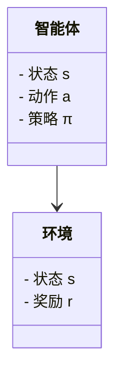
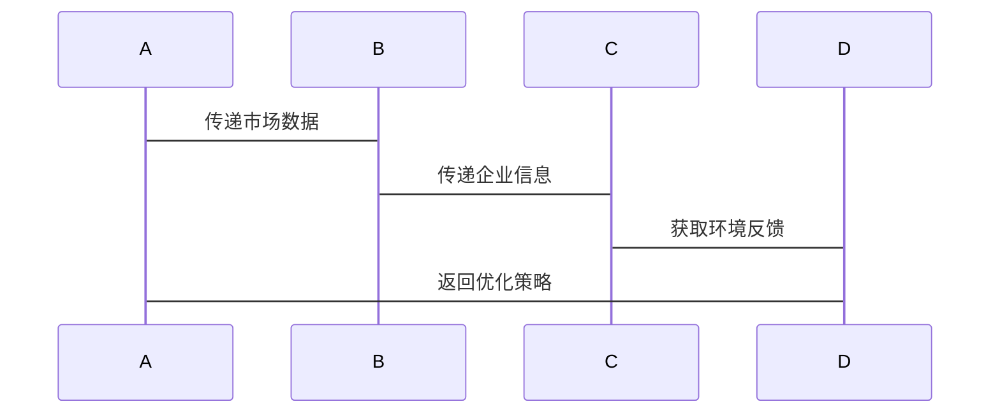

                 


# AI多智能体如何优化价值投资的跨境并购策略

## 关键词：AI多智能体，价值投资，跨境并购，策略优化，博弈论，系统架构

## 摘要：本文探讨了如何利用AI多智能体技术优化价值投资的跨境并购策略。通过分析多智能体系统在金融领域的应用潜力，结合价值投资的核心理念和跨境并购的实际挑战，提出了一种基于博弈论的多智能体算法，用于优化并购决策。本文还详细介绍了系统架构设计和实际案例分析，展示了如何通过AI技术提升并购效率和成功率。

---

# 第1章: 背景介绍

## 1.1 多智能体系统的定义与特点

### 1.1.1 多智能体系统的定义

多智能体系统（Multi-Agent System, MAS）是由多个相互作用的智能体组成的系统，这些智能体能够通过感知环境、协同合作或竞争来实现共同目标或个体目标。多智能体系统的核心在于智能体之间的互动和信息共享。

### 1.1.2 多智能体系统的特征

- **分布式性**：智能体分布在不同的位置，独立决策。
- **协作性**：智能体之间可以通过协作提高整体效率。
- **反应性**：智能体能够实时感知环境变化并做出反应。
- **自主性**：智能体具有自主决策的能力。

### 1.1.3 多智能体系统与单智能体系统的区别

| 特性         | 单智能体系统                     | 多智能体系统                     |
|--------------|---------------------------------|---------------------------------|
| 决策中心化   | 单一决策中心                   | 分布式决策，多个决策中心       |
| 信息共享     | 信息集中于一个决策中心         | 信息在多个智能体之间共享       |
| 灵活性       | 较低                           | 较高                           |

## 1.2 价值投资的定义与分析框架

### 1.2.1 价值投资的核心理念

价值投资是一种投资策略，通过分析企业的内在价值，寻找被市场低估的投资标的。核心在于“买入低于内在价值的资产”。

### 1.2.2 价值投资的关键指标

- **市盈率（P/E）**：股价与每股收益的比率。
- **市净率（P/B）**：股价与每股净资产的比率。
- **股息率**：股息与股价的比率。

### 1.2.3 价值投资与短期投资的对比

| 特性         | 价值投资                     | 短期投资                     |
|--------------|----------------------------|-----------------------------|
| 投资期限     | 长期                        | 短期                        |
| 投资策略     | 基于基本面分析              | 基于技术分析或市场情绪       |
| 风险承受能力 | 较低                       | 较高                       |

## 1.3 跨境并购的定义与挑战

### 1.3.1 跨境并购的基本概念

跨境并购是指一家企业收购另一家位于不同国家或地区的企业的行为。它涉及复杂的法律、税务和文化差异。

### 1.3.2 跨境并购的主要挑战

- **法律风险**：不同国家的法律法规差异。
- **税务规划**：跨国税务问题复杂。
- **文化差异**：管理风格和企业文化差异可能影响整合。

### 1.3.3 跨境并购的战略意义

- **资源获取**：快速获取技术、市场或资源。
- **市场扩展**：进入新市场。
- **成本优化**：通过规模效应降低成本。

## 1.4 多智能体系统在金融领域的应用前景

### 1.4.1 多智能体系统在金融中的潜在应用

- **股票交易**：多智能体协同决策优化投资组合。
- **风险管理**：实时监控和应对市场风险。
- **并购顾问**：辅助企业做出并购决策。

### 1.4.2 多智能体系统的优势与劣势

| 特性         | 优势                       | 劣势                       |
|--------------|----------------------------|---------------------------|
| 决策效率     | 高                        | 可能存在信息过载           |
| 灵活性       | 高                        | 协调成本高                |
| 智能性       | 强                        | 系统复杂性高              |

### 1.4.3 多智能体系统在跨境并购中的应用价值

通过多智能体系统的协同，可以实时分析多个市场的数据，优化并购决策，降低风险。

---

# 第2章: 多智能体系统的核心概念与联系

## 2.1 多智能体系统的实体关系图


## 2.2 价值投资与多智能体系统的关联



## 2.3 跨境并购的多智能体系统架构



---

# 第3章: 多智能体系统的算法原理

## 3.1 多智能体系统的算法概述

### 3.1.1 多智能体系统的主要算法

- **基于博弈论的算法**：模拟智能体之间的博弈过程。
- **分布式算法**：通过分布式计算优化决策。

### 3.1.2 基于博弈论的算法流程


### 3.1.3 分布式多智能体算法的特点

- **去中心化**：没有单一的控制中心。
- **并行计算**：多个智能体可以同时处理信息。

## 3.2 基于博弈论的算法流程

### 3.2.1 博弈论的基本概念

- **纳什均衡**：所有智能体都不愿意单方面改变策略的状态。

### 3.2.2 多智能体博弈的流程


## 3.3 分布式多智能体算法的数学模型

$$ V = \max_{\theta} \sum_{i=1}^{n} \log p(a_i|s_i) $$

其中：
- \( V \) 是价值函数
- \( \theta \) 是参数
- \( a_i \) 是动作
- \( s_i \) 是状态

## 3.4 本章小结

---

# 第4章: 价值投资的数学模型与分析

## 4.1 价值投资的核心公式

$$ V = \frac{EFCF}{g} $$

其中：
- \( V \) 是内在价值
- \( EFCF \) 是企业自由现金流
- \( g \) 是增长率

## 4.2 多智能体系统的优化目标

通过优化每个智能体的决策，使得整体投资组合的内在价值最大化。

---

# 第5章: 系统分析与架构设计方案

## 5.1 问题场景介绍

如何利用多智能体系统优化价值投资的跨境并购策略？

## 5.2 项目介绍

构建一个基于多智能体的跨境并购优化系统，帮助投资者做出更明智的并购决策。

## 5.3 系统功能设计

### 5.3.1 领域模型



### 5.3.2 系统架构


### 5.3.3 系统接口设计

- **输入接口**：接收市场数据和企业信息。
- **输出接口**：输出优化后的并购策略。

### 5.3.4 系统交互流程



## 5.4 本章小结

---

# 第6章: 项目实战

## 6.1 环境安装

安装必要的Python库，如numpy、pandas、scikit-learn等。

## 6.2 系统核心实现源代码

```python
import numpy as np
import pandas as pd

class Agent:
    def __init__(self, state_space, action_space):
        self.state_space = state_space
        self.action_space = action_space
        self.value_function = np.zeros(state_space)

    def act(self, state):
        # 返回最优动作
        return np.argmax(self.value_function[state])

# 初始化环境
env = Environment()

# 初始化智能体
agent = Agent(env.state_space, env.action_space)

# 训练过程
for episode in range(num_episodes):
    state = env.reset()
    while not done:
        action = agent.act(state)
        next_state, reward, done = env.step(action)
        # 更新价值函数
        agent.value_function[state] += learning_rate * (reward + discount_factor * np.max(agent.value_function[next_state]) - agent.value_function[state])
```

## 6.3 代码应用解读与分析

通过训练智能体，使其在跨境并购中做出更优的决策。

## 6.4 实际案例分析

分析一个具体的跨境并购案例，展示如何利用多智能体系统优化并购策略。

## 6.5 本章小结

---

# 第7章: 总结与展望

## 7.1 本章总结

本文探讨了如何利用AI多智能体技术优化价值投资的跨境并购策略，通过数学模型和实际案例展示了其应用价值。

## 7.2 未来研究方向

- 更复杂的多智能体协同算法。
- 多智能体系统的实时性和可扩展性优化。

---

# 作者：AI天才研究院/AI Genius Institute & 禅与计算机程序设计艺术 /Zen And The Art of Computer Programming

