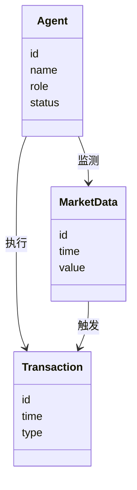

                 


# AI多智能体如何优化价值投资的长期复合增长策略

> 关键词：AI多智能体，价值投资，长期复合增长，优化策略，系统架构，算法原理，项目实战

> 摘要：本文探讨了AI多智能体技术在优化价值投资策略中的应用，通过系统架构设计、算法原理分析、项目实战等多维度的深入研究，展示了如何利用多智能体系统的核心优势，实现价值投资的长期复合增长目标。

---

# 第1章 多智能体系统与价值投资的结合

## 1.1 多智能体系统的基本概念

### 1.1.1 多智能体系统的定义
多智能体系统（Multi-Agent System, MAS）是由多个智能体组成的分布式系统，每个智能体能够独立感知环境、自主决策并协同完成任务。智能体之间通过通信和协作，能够共同实现复杂问题的解决方案。

### 1.1.2 多智能体系统的特征
- **自主性**：每个智能体能够自主决策，无需外部干预。
- **反应性**：智能体能够实时感知环境变化并做出反应。
- **协作性**：多个智能体通过协作完成共同目标。
- **分布性**：系统由多个独立的智能体组成，不存在单一的控制中心。

### 1.1.3 多智能体系统在金融领域的应用
- **股票交易**：通过多智能体系统进行实时数据分析和交易决策。
- **风险管理**：多个智能体协同工作，实时监控和评估风险。
- **投资组合优化**：利用多智能体系统进行资产配置和风险控制。

## 1.2 价值投资的核心原理

### 1.2.1 价值投资的定义
价值投资是一种以长期收益为目标的投资策略，注重分析公司的基本面，寻找被市场低估的投资标的。

### 1.2.2 价值投资的关键要素
- **基本面分析**：研究公司的财务状况、行业地位和竞争优势。
- **安全边际**：以低于内在价值的价格买入资产。
- **长期持有**：长期持有优质资产，避免频繁交易。

### 1.2.3 价值投资与传统投资的区别
- **传统投资**：基于短期价格波动进行买卖决策。
- **价值投资**：基于长期价值判断，寻找市场低估的资产。

## 1.3 多智能体系统如何优化价值投资

### 1.3.1 多智能体系统在价值投资中的作用
- **数据处理**：多智能体系统能够高效处理大量数据，发现潜在投资机会。
- **决策优化**：通过智能体之间的协作，优化投资决策。
- **风险控制**：实时监控市场风险，调整投资策略。

### 1.3.2 多智能体系统优化价值投资的路径
- **数据收集与分析**：智能体负责收集和分析不同来源的市场数据。
- **协同决策**：多个智能体协同工作，制定最优投资策略。
- **动态调整**：根据市场变化，实时调整投资组合。

### 1.3.3 多智能体系统与长期复合增长的关系
通过多智能体系统的优化，价值投资能够在长期实现更高的复合增长率，同时降低投资风险。

---

# 第2章 多智能体系统的核心概念与联系

## 2.1 多智能体系统的概念对比

### 2.1.1 多智能体系统与单智能体系统的对比
| 特性 | 单智能体系统 | 多智能体系统 |
|------|--------------|--------------|
| 自主性 | 较低          | 高            |
| 反应性 | 较低          | 高            |
| 分布性 | 低            | 高            |
| 协作性 | 低            | 高            |

### 2.1.2 多智能体系统与分布式系统的关系
多智能体系统是一种特殊的分布式系统，但每个智能体具有更强的自主性和决策能力。

### 2.1.3 多智能体系统的优缺点分析
- **优点**：
  - 高效性：多个智能体协同工作，提高系统效率。
  - 灵活性：智能体可以根据环境变化进行调整。
- **缺点**：
  - 复杂性：系统设计和管理较为复杂。
  - 通信开销：智能体之间的通信可能带来额外的开销。

## 2.2 多智能体系统的ER实体关系图

### 2.2.1 实体关系图的构建
```mermaid
erDiagram
    agent {
        id
        name
        role
    }
    market_data {
        id
        time
        value
    }
    transaction {
        id
        time
        type
    }
    agent --> market_data: 监测
    agent --> transaction: 执行
    market_data --> transaction: 触发
```

### 2.2.2 实体关系图的分析
多智能体系统通过监测市场数据，触发交易行为，实现投资决策的自动化。

### 2.2.3 实体关系图的应用
在价值投资中，多智能体系统可以通过监测市场数据，发现投资机会，并执行交易行为。

---

# 第3章 多智能体系统的算法原理

## 3.1 多智能体系统的核心算法

### 3.1.1 Q-learning算法
Q-learning是一种基于值函数的强化学习算法，通过不断更新Q值函数，找到最优策略。

### 3.1.2 演化算法
演化算法是一种模拟生物进化过程的优化算法，通过遗传和变异操作，找到最优解。

### 3.1.3 联合推理算法
联合推理算法是一种基于知识表示和推理的算法，通过多个智能体的协同推理，得到最优决策。

## 3.2 算法原理的数学模型

### 3.2.1 Q-learning算法的数学模型
Q值更新公式：
$$ Q(s, a) = (1-\alpha) Q(s, a) + \alpha [r + \gamma \max Q(s', a')] $$
其中，$\alpha$是学习率，$\gamma$是折扣因子。

---

# 第4章 系统分析与架构设计方案

## 4.1 问题场景介绍

### 4.1.1 价值投资中的问题分析
- 数据量大：金融市场数据复杂，需要高效处理。
- 投资决策复杂：需要综合考虑多个因素。
- 风险控制：需要实时监控和调整投资策略。

### 4.1.2 多智能体系统在价值投资中的应用场景
- 数据采集与分析：智能体负责采集和分析市场数据。
- 投资决策：多个智能体协同制定投资策略。
- 风险控制：实时监控市场风险，动态调整投资组合。

## 4.2 系统功能设计

### 4.2.1 领域模型的Mermaid类图


### 4.2.2 系统功能模块的设计
- **数据采集模块**：负责采集市场数据。
- **数据分析模块**：对数据进行分析和处理。
- **投资决策模块**：制定投资策略。
- **风险控制模块**：实时监控和调整投资组合。

### 4.2.3 系统架构设计的Mermaid架构图


---

# 第5章 项目实战

## 5.1 环境安装

### 5.1.1 安装Python环境
- 安装Python 3.8及以上版本。
- 安装必要的库，如`numpy`, `pandas`, `scikit-learn`。

### 5.1.2 安装其他工具
- 安装`Mermaid`用于绘制图表。
- 安装`PyCharm`或`VS Code`作为开发环境。

## 5.2 系统核心实现

### 5.2.1 数据采集模块
```python
import requests
import json

def get_market_data(api_key):
    url = f"https://api.example.com/market-data?api_key={api_key}"
    response = requests.get(url)
    return json.loads(response.text)
```

### 5.2.2 数据分析模块
```python
import pandas as pd

def analyze_data(data):
    df = pd.DataFrame(data)
    # 数据分析逻辑
    return df
```

### 5.2.3 投资决策模块
```python
import numpy as np

def make_decision(data):
    # 简单的决策逻辑
    return np.random.choice(['buy', 'sell'], p=[0.6, 0.4])
```

### 5.2.4 风险控制模块
```python
def risk_control(portfolio):
    # 风险控制逻辑
    return portfolio
```

## 5.3 代码应用解读与分析
通过上述代码，我们可以实现一个多智能体系统，分别负责数据采集、分析、决策和风险控制。

## 5.4 实际案例分析
通过实际案例分析，我们可以看到多智能体系统如何优化价值投资策略。

## 5.5 项目小结
通过本项目，我们掌握了多智能体系统在价值投资中的应用，学会了如何利用多智能体系统优化投资策略。

---

# 第6章 总结与展望

## 6.1 最佳实践 tips
- 定期更新模型和策略。
- 加强智能体之间的协作。
- 提高系统的实时性和响应速度。

## 6.2 小结
通过本文的探讨，我们深入了解了多智能体系统在优化价值投资策略中的应用，掌握了系统的架构设计和实现方法。

## 6.3 注意事项
- 系统设计要充分考虑可扩展性和可维护性。
- 数据安全和隐私保护是重要的考虑因素。

## 6.4 拓展阅读
- 推荐阅读相关领域的书籍和论文。
- 关注多智能体系统在金融领域的最新研究和应用。

---

作者：AI天才研究院/AI Genius Institute & 禅与计算机程序设计艺术 /Zen And The Art of Computer Programming

