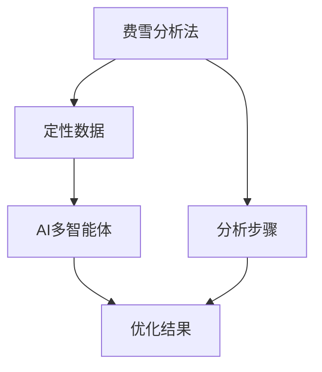
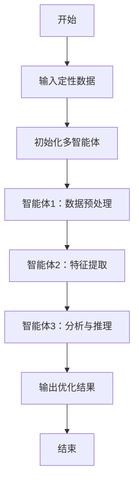
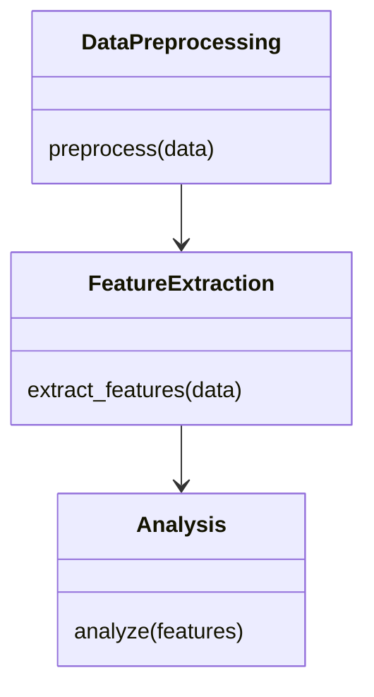
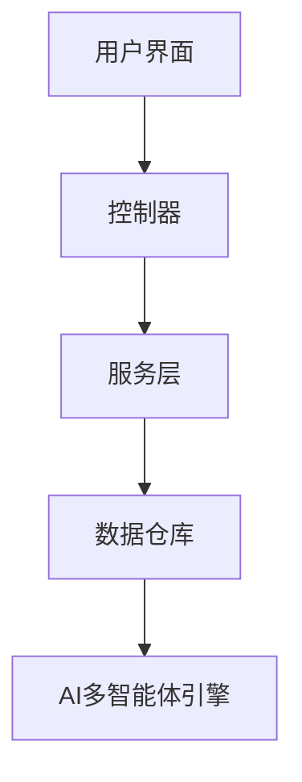
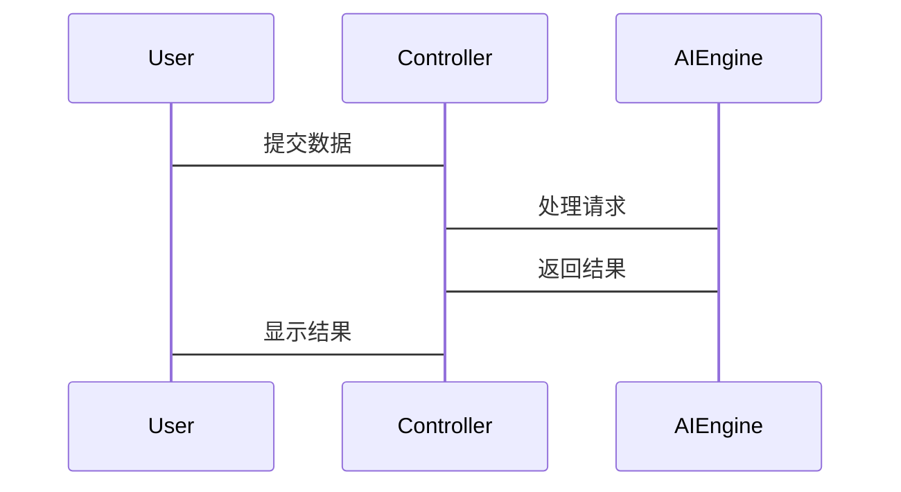

                 


# AI多智能体如何优化费雪的定性分析方法

> 关键词：AI多智能体，定性分析方法，费雪分析法，优化，算法原理

> 摘要：本文探讨了如何利用AI多智能体技术优化费雪的定性分析方法。通过分析AI多智能体的协作机制与定性分析方法的结合，提出了优化后的算法模型，并通过实例验证了其有效性和优势。

---

# 目录大纲

## 第一部分：AI多智能体与费雪定性分析方法的背景介绍

### 第1章：AI多智能体与定性分析方法概述

#### 1.1 AI多智能体的基本概念
- 1.1.1 多智能体系统的定义
- 1.1.2 AI多智能体的核心特点
- 1.1.3 多智能体与传统AI的区别

#### 1.2 定性分析方法的背景
- 1.2.1 定性分析的基本概念
- 1.2.2 定性分析在各领域的应用
- 1.2.3 费雪定性分析法的起源与发展

#### 1.3 费雪定性分析法的核心思想
- 1.3.1 费雪分析法的基本原理
- 1.3.2 费雪分析法的关键步骤
- 1.3.3 费雪分析法的优缺点

#### 1.4 AI多智能体优化费雪分析法的必要性
- 1.4.1 定性分析的局限性
- 1.4.2 AI多智能体的优势
- 1.4.3 优化的目标与意义

#### 1.5 本章小结

## 第二部分：AI多智能体优化费雪定性分析方法的核心概念

### 第2章：AI多智能体与费雪分析法的核心概念

#### 2.1 AI多智能体的原理
- 2.1.1 多智能体系统的组成
- 2.1.2 AI多智能体的通信机制
- 2.1.3 多智能体的协作与决策

#### 2.2 费雪分析法的详细解读
- 2.2.1 费雪分析法的步骤分解
- 2.2.2 费雪分析法的数学模型
- 2.2.3 费雪分析法的实现框架

#### 2.3 AI多智能体与费雪分析法的联系
- 2.3.1 多智能体在定性分析中的角色
- 2.3.2 AI多智能体如何优化费雪分析法
- 2.3.3 优化后的优势与挑战

#### 2.4 核心概念对比表格
| 概念 | 费雪分析法 | AI多智能体优化 |
|------|------------|----------------|
| 输入 | 定性数据    | 结构化与非结构化数据 |
| 输出 | 定性结果    | 综合分析结果     |
| 处理方式 | 人工分析    | 自动化与协作分析  |

#### 2.5 ER实体关系图


#### 2.6 本章小结

## 第三部分：AI多智能体优化费雪定性分析方法的算法原理

### 第3章：算法原理与实现

#### 3.1 算法原理概述
- 3.1.1 优化后的算法框架
- 3.1.2 算法的核心思想
- 3.1.3 算法的创新点

#### 3.2 算法流程图


#### 3.3 数学模型与公式
- 3.3.1 定性数据分析的数学模型
$$ y = f(x) $$
- 3.3.2 AI多智能体协作的优化公式
$$ x_{new} = x_{old} + \Delta x $$

#### 3.4 Python核心代码实现
```python
def optimize_fisher_analysis(data):
    # 智能体1：数据预处理
    preprocessed_data = preprocess(data)
    # 智能体2：特征提取
    features = extract_features(preprocessed_data)
    # 智能体3：分析与推理
    result = analyze(features)
    return result

# 示例调用
data = [...]  # 输入数据
result = optimize_fisher_analysis(data)
print(result)
```

#### 3.5 本章小结

## 第四部分：系统架构与项目实战

### 第4章：系统分析与架构设计

#### 4.1 项目背景
- 4.1.1 项目目标
- 4.1.2 项目范围
- 4.1.3 项目需求

#### 4.2 系统功能设计
- 4.2.1 领域模型类图


#### 4.3 系统架构设计


#### 4.4 接口设计与交互流程图


#### 4.5 本章小结

### 第5章：项目实战与案例分析

#### 5.1 环境安装与配置
- 5.1.1 安装Python
- 5.1.2 安装必要的库（如numpy, pandas）
- 5.1.3 配置开发环境

#### 5.2 系统核心代码实现
```python
class AIEngine:
    def __init__(self):
        self.preprocessing = DataPreprocessing()
        self.feature_extraction = FeatureExtraction()
        self.analysis = Analysis()

    def optimize_analysis(self, data):
        preprocessed = self.preprocessing.preprocess(data)
        features = self.feature_extraction.extract_features(preprocessed)
        result = self.analysis.analyze(features)
        return result

# 示例运行
engine = AIEngine()
data = [...]  # 示例数据
result = engine.optimize_analysis(data)
print(result)
```

#### 5.3 案例分析与结果解读
- 5.3.1 数据准备
- 5.3.2 系统运行
- 5.3.3 结果分析

#### 5.4 本章小结

## 第五部分：AI多智能体优化费雪定性分析方法的最佳实践

### 第6章：最佳实践与小结

#### 6.1 小结
- 6.1.1 核心观点总结
- 6.1.2 实践中的关键点

#### 6.2 注意事项
- 6.2.1 数据质量的重要性
- 6.2.2 系统性能的优化
- 6.2.3 安全与隐私保护

#### 6.3 拓展阅读
- 6.3.1 相关文献推荐
- 6.3.2 未来研究方向

#### 6.4 本章小结

## 作者：AI天才研究院/AI Genius Institute & 禅与计算机程序设计艺术 /Zen And The Art of Computer Programming

---

**注意：** 上述大纲只是一个结构化的框架，实际内容需要根据具体研究进行详细编写。每个章节和子章节都需要根据实际内容进行扩展和丰富，确保逻辑清晰、内容详实。

