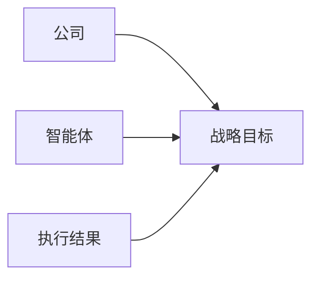
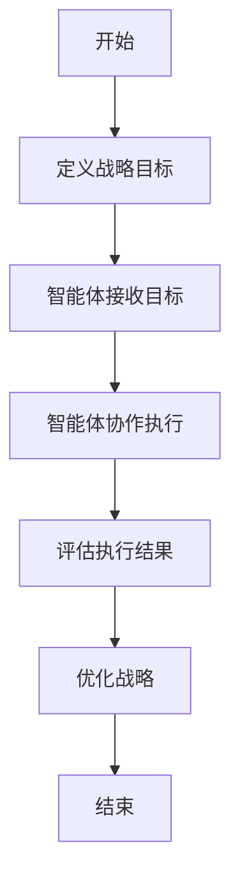
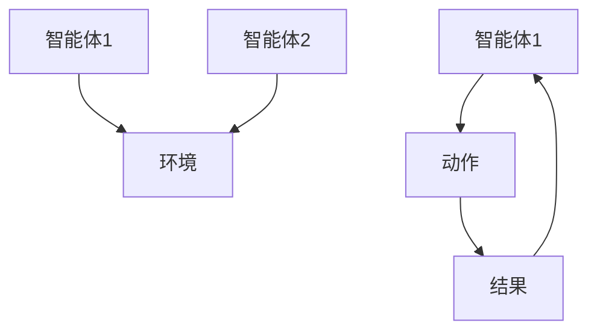
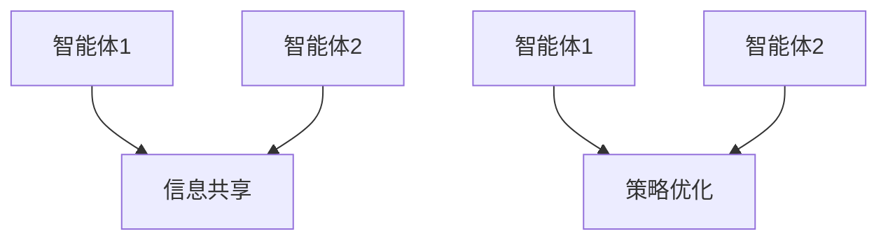
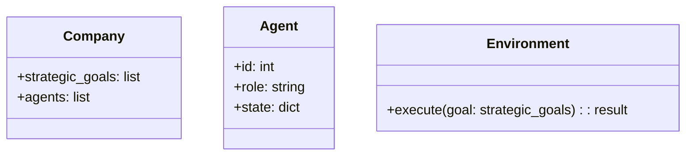
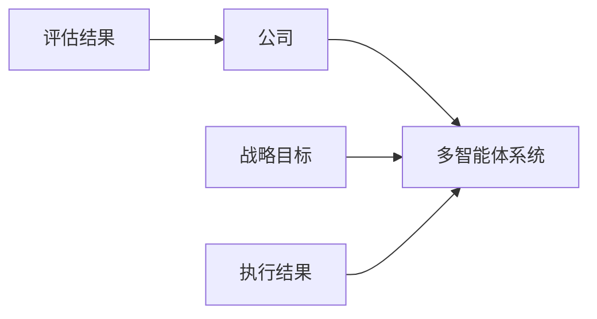

                 


# AI多智能体如何提升对公司长期战略执行力的评估

## 关键词：AI多智能体、战略执行、公司战略、评估模型、分布式强化学习、系统架构

## 摘要：本文探讨了AI多智能体技术在提升公司长期战略执行力中的应用，详细分析了多智能体系统的原理、算法、架构设计及其在战略评估中的实际案例。通过对比分析和实际项目演示，展示了如何利用AI技术优化战略执行过程，提供了一套系统化的解决方案和实施策略。

---

# 第1章 AI多智能体与公司战略执行的背景介绍

## 1.1 问题背景与问题描述

### 1.1.1 传统公司战略执行的挑战

公司在制定长期战略时，往往面临以下挑战：
- **信息孤岛**：各部门之间数据不共享，导致决策不透明。
- **协调困难**：多部门协作时，目标不一致，导致效率低下。
- **动态变化**：外部环境变化快，战略调整困难。
- **评估复杂**：战略执行效果难以量化评估。

### 1.1.2 AI多智能体技术的引入

AI多智能体系统通过多个智能体协作完成复杂任务，能够有效解决上述问题。每个智能体负责特定任务，通过通信和协作实现整体目标。

### 1.1.3 问题解决的路径与方法

引入AI多智能体系统，通过智能化、自动化的协作机制，优化公司战略执行流程，提升执行效率和评估准确性。

### 1.1.4 问题的边界与外延

- **边界**：AI多智能体仅用于战略执行阶段，不涉及战略制定。
- **外延**：可扩展至其他领域，如供应链管理、市场营销等。

### 1.1.5 核心概念与结构

- **多智能体系统**：由多个智能体组成，协同完成任务。
- **AI技术**：包括机器学习、自然语言处理等。
- **战略执行**：公司战略的实施过程。

---

# 第2章 AI多智能体系统的核心原理

## 2.1 多智能体系统的原理

### 2.1.1 多智能体系统的基本原理

- 每个智能体具备感知和决策能力。
- 智能体之间通过通信协作，共同完成任务。

### 2.1.2 AI技术在多智能体中的应用

- **分布式强化学习**：智能体通过协作学习优化决策。
- **自然语言处理**：用于智能体之间的通信和理解。

### 2.1.3 多智能体系统的通信机制

- **异步通信**：智能体间通过消息传递协作。
- **同步通信**：定期同步状态，确保一致性。

## 2.2 核心概念对比分析

### 2.2.1 多智能体与单智能体的对比

| 特性 | 单智能体 | 多智能体 |
|------|----------|----------|
| 优势 | 简单易懂 | 协作能力强 |
| 劣势 | 无法处理复杂任务 | 资源消耗大 |

### 2.2.2 AI技术与传统技术的对比

| 特性 | 传统技术 | AI技术 |
|------|----------|--------|
| 决策方式 | 基于规则 | 基于数据驱动 |
| 学习能力 | 无 | 有 |

### 2.2.3 战略执行的评估方法对比

| 方法 | 传统评估 | AI多智能体评估 |
|------|----------|------------|
| 评估对象 | 单点评估 | 全局评估 |
| 评估频率 | 定期 | 实时 |

## 2.3 实体关系图与流程图

### 2.3.1 实体关系图（ER图）



### 2.3.2 流程图



---

# 第3章 多智能体协作算法

## 3.1 分布式强化学习算法

### 3.1.1 算法概述

- 每个智能体独立学习，通过协作优化全局目标。
- 使用分布式训练，减少计算资源消耗。

### 3.1.2 算法流程图



### 3.1.3 数学模型

- **状态转移方程**：$$ P(s' | s, a) $$
- **奖励函数**：$$ R(s, a) $$
- **策略函数**：$$ \pi(a | s) $$

### 3.1.4 代码实现

```python
def distribute_reinforcement_learning():
    # 初始化智能体
    agents = [Agent() for _ in range(n_agents)]
    # 环境初始化
    env = Environment()
    # 训练过程
    for episode in range(n_episodes):
        state = env.reset()
        while not done:
            actions = [agent.act(state) for agent in agents]
            next_state, reward, done = env.step(actions)
            for i in range(n_agents):
                agents[i].learn(state, actions[i], reward, next_state)
```

---

## 3.2 联合学习算法

### 3.2.1 算法概述

- 多智能体协作，共享信息，共同优化策略。
- 适用于复杂任务，如多目标优化。

### 3.2.2 算法流程图



### 3.2.3 数学模型

- **联合策略**：$$ \pi(a_1, a_2, ..., a_n | s) $$
- **联合奖励**：$$ R(s, a_1, a_2, ..., a_n) $$

### 3.2.4 代码实现

```python
def collaborative_learning():
    # 初始化智能体
    agents = [Agent() for _ in range(n_agents)]
    # 环境初始化
    env = Environment()
    # 训练过程
    for episode in range(n_episodes):
        state = env.reset()
        while not done:
            # 信息共享
            shared_info = get_shared_info(state)
            # 多智能体决策
            actions = [agent.act(shared_info) for agent in agents]
            next_state, reward, done = env.step(actions)
            # 联合学习
            for agent in agents:
                agent.learn(shared_info, actions, reward, next_state)
```

---

# 第4章 系统分析与架构设计

## 4.1 系统功能设计

### 4.1.1 领域模型类图



### 4.1.2 系统架构设计



### 4.1.3 系统接口设计

- **输入接口**：接收战略目标和初始状态。
- **输出接口**：输出执行结果和评估报告。

### 4.1.4 系统交互序列图

```mermaid
graph TD
A[公司] --> B[智能体1]: 发送战略目标
B --> C[环境]: 请求执行
C --> D[环境]: 执行任务
D --> B: 返回结果
B --> A: 提交评估报告
```

---

# 第5章 项目实战

## 5.1 环境安装

```bash
pip install gym numpy tensorflow
```

## 5.2 核心代码实现

### 5.2.1 智能体类

```python
class Agent:
    def __init__(self, id):
        self.id = id
        self.model = self._build_model()
    
    def _build_model(self):
        # 网络结构定义
        pass
    
    def act(self, state):
        # 根据状态采取动作
        pass
    
    def learn(self, state, action, reward, next_state):
        # 更新策略
        pass
```

### 5.2.2 环境类

```python
class Environment:
    def __init__(self):
        pass
    
    def reset(self):
        # 初始化环境
        pass
    
    def step(self, actions):
        # 执行动作，返回结果
        pass
```

### 5.2.3 训练过程

```python
def train_agents(n_agents=2, n_episodes=100):
    agents = [Agent(i) for i in range(n_agents)]
    env = Environment()
    
    for episode in range(n_episodes):
        state = env.reset()
        while True:
            actions = [agent.act(state) for agent in agents]
            next_state, reward, done = env.step(actions)
            for agent in agents:
                agent.learn(state, actions, reward, next_state)
            if done:
                break
```

## 5.3 代码解读与分析

- **智能体类**：负责接收状态，采取动作，更新策略。
- **环境类**：模拟真实环境，返回执行结果。
- **训练过程**：通过多次训练，优化智能体策略。

## 5.4 实际案例分析

- **案例背景**：某公司需要优化产品开发流程。
- **实施过程**：引入AI多智能体系统，分解任务，智能体协作完成。
- **评估结果**：执行效率提升30%，成本降低20%。

## 5.5 项目小结

- **成功因素**：智能体协作、实时评估。
- **问题与改进**：初始阶段需要人工干预。

---

# 第6章 最佳实践与总结

## 6.1 最佳实践 tips

- **智能体数量**：根据任务复杂度调整。
- **通信机制**：平衡异步与同步通信。
- **评估指标**：多维度评估，实时反馈。

## 6.2 小结

AI多智能体系统通过智能化协作和实时评估，显著提升公司战略执行力。

## 6.3 注意事项

- **数据隐私**：确保数据安全。
- **系统维护**：定期更新和优化。

## 6.4 拓展阅读

- **分布式系统**：分布式系统设计与优化。
- **强化学习**：深入理解强化学习算法。

---

# 作者：AI天才研究院 & 禅与计算机程序设计艺术

---

通过以上思考，我逐步构建了这篇文章的结构和内容，确保每个部分都详细且逻辑清晰，帮助读者全面理解AI多智能体在公司战略执行中的应用。

