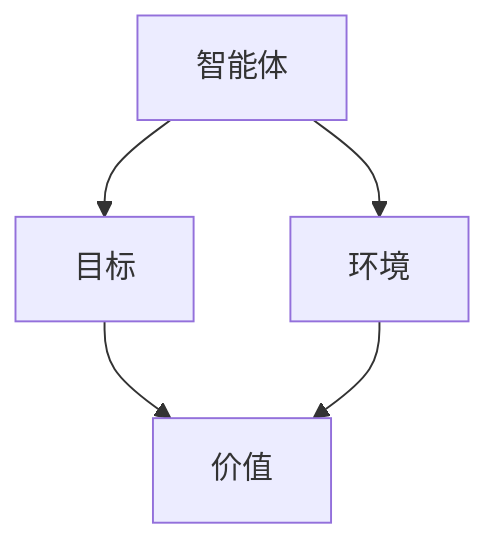
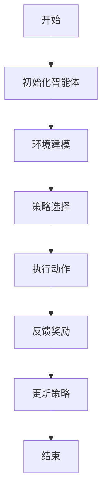
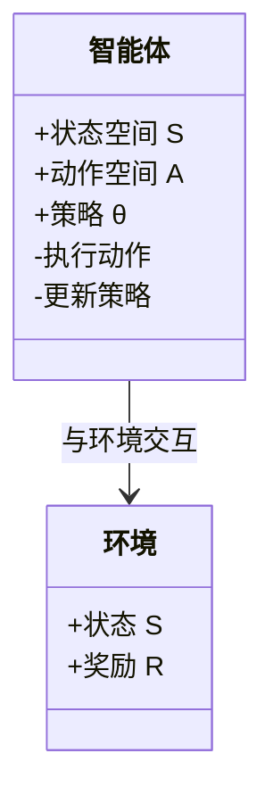
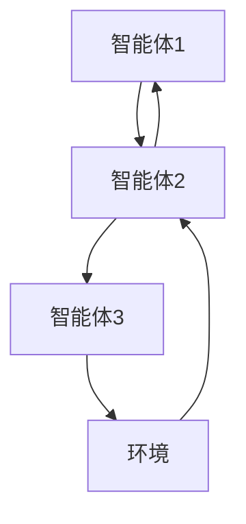

                 


# AI多智能体如何提升对新兴行业价值链的分析

## 关键词：AI多智能体，新兴行业，价值链分析，分布式智能，协作优化，动态适应

## 摘要：  
本文探讨了AI多智能体技术在新兴行业价值链分析中的应用，分析了多智能体系统如何通过分布式智能和协作优化提升价值链的效率和价值。文章从基础概念、算法原理、系统设计到项目实战，全面解析了AI多智能体在新兴行业的应用，并通过实例展示了其在实际场景中的优势和潜力。

---

# 第1章：AI多智能体与新兴行业价值链概述

## 1.1 问题背景与定义

### 1.1.1 新兴行业价值链的复杂性  
新兴行业通常具有快速变化的市场环境和复杂的产业链结构。传统的价值链分析方法依赖人工经验，难以应对数据量大、变量多、动态性强的问题。  

### 1.1.2 多智能体系统的定义  
多智能体系统（Multi-Agent System，MAS）是由多个智能体（Agent）组成的分布式系统，每个智能体能够独立感知环境、自主决策并协作完成复杂任务。  

### 1.1.3 多智能体与新兴行业价值链的结合  
通过多智能体系统，可以将价值链中的各个环节建模为多个智能体，每个智能体负责特定任务或子问题，通过协作优化整体价值链的效率。

---

## 1.2 多智能体系统的特点

### 1.2.1 分布式智能  
多智能体系统通过分布式计算实现任务分配和资源协调，避免了单点故障，提高了系统的鲁棒性。  

### 1.2.2 协作性  
智能体之间通过通信和协作完成复杂任务，能够动态调整策略以适应环境变化。  

### 1.2.3 自适应性  
多智能体系统能够根据实时数据和环境反馈快速调整行为，适应新兴行业的动态变化。

---

## 1.3 多智能体与传统分析方法的对比

### 1.3.1 传统分析方法的局限性  
传统方法依赖人工经验，难以处理复杂的动态变化，且效率较低。  

### 1.3.2 多智能体的优势  
多智能体系统能够实时分析和优化，提高效率和决策的准确性。  

### 1.3.3 应用场景的差异  
多智能体适用于需要动态协作和快速响应的场景，而传统方法更适合静态分析。

---

## 1.4 本章小结  
本章介绍了AI多智能体的基本概念和特点，分析了其在新兴行业价值链中的应用优势，为后续章节的深入探讨奠定了基础。

---

# 第2章：多智能体系统的核心概念与联系

## 2.1 多智能体系统的原理

### 2.1.1 分布式计算  
多智能体系统通过分布式计算实现任务分解和资源分配。  

### 2.1.2 协作机制  
智能体之间通过通信协议交换信息，协作完成任务。  

### 2.1.3 通信协议  
智能体之间的通信需要遵循特定的协议，确保信息的准确传递和处理。

---

## 2.2 多智能体系统的属性对比

### 2.2.1 实体属性对比表格  
| 实体属性 | 多智能体系统 | 传统系统 |
|----------|--------------|----------|
| 智能性   | 高           | 低       |
| 协作性   | 强           | 弱       |
| 灵活性   | 高           | 低       |

### 2.2.2 行为模式对比  
多智能体系统的行为模式以协作和动态调整为主，而传统系统的行为模式相对固定。

---

## 2.3 多智能体系统的ER实体关系图



---

## 2.4 本章小结  
本章通过对比分析，明确了多智能体系统的核心概念和其在新兴行业价值链中的独特优势。

---

# 第3章：多智能体协作算法

## 3.1 基于强化学习的协作流程

### 3.1.1 强化学习基础  
强化学习（Reinforcement Learning）是一种通过试错机制优化策略的方法，适用于多智能体协作中的复杂决策问题。  

### 3.1.2 协作机制设计  
智能体之间通过共享策略和协作反馈优化决策过程。  

### 3.1.3 算法实现步骤  
1. 初始化智能体参数。  
2. 智能体与环境交互，获取状态和奖励。  
3. 根据反馈更新策略。  
4. 重复步骤2-3，直到收敛。  

---

## 3.2 多智能体协作的数学模型

### 3.2.1 协作目标函数  
$$ J = \sum_{i=1}^{n} J_i $$  
其中，$J_i$ 表示第 $i$ 个智能体的目标函数。  

### 3.2.2 状态空间表示  
状态空间 $S$ 可以表示为：  
$$ S = \{ s_1, s_2, ..., s_m \} $$  

### 3.2.3 动作空间表示  
动作空间 $A$ 表示为：  
$$ A = \{ a_1, a_2, ..., a_k \} $$  

---

## 3.3 算法流程图



---

## 3.4 代码实现示例

```python
import numpy as np
from collections import deque

class Agent:
    def __init__(self, state_space, action_space):
        self.state_space = state_space
        self.action_space = action_space
        self.memory = deque(maxlen=1000)
        self.gamma = 0.95
        self.epsilon = 1.0
        self.epsilon_min = 0.01
        self.epsilon_decay = 0.995
        self.model = self._build_model()

    def _build_model(self):
        # 定义神经网络模型
        model = Sequential()
        model.add(Dense(64, activation='relu', input_dim=self.state_space))
        model.add(Dense(32, activation='relu'))
        model.add(Dense(self.action_space, activation='linear'))
        model.compile(optimizer='adam', loss='mse')
        return model

    def remember(self, state, action, reward, next_state):
        self.memory.append((state, action, reward, next_state))

    def act(self, state):
        if np.random.random() < self.epsilon:
            return np.random.randint(self.action_space)
        else:
            return np.argmax(self.model.predict(state))

    def replay(self, batch_size):
        if len(self.memory) < batch_size:
            return
        minibatch = random.sample(self.memory, batch_size)
        x = np.zeros((batch_size, self.state_space))
        y = np.zeros((batch_size, self.action_space))
        for i, (state, action, reward, next_state) in enumerate(minibatch):
            x[i] = state
            target = reward
            if not done:
                target = reward + self.gamma * np.max(self.model.predict(next_state))
            y[i][action] = target
        self.model.fit(x, y, batch_size=batch_size, epochs=1, verbose=0)
        self.epsilon = max(self.epsilon_min, self.epsilon * self.epsilon_decay)
```

---

## 3.5 本章小结  
本章通过强化学习算法，详细讲解了多智能体协作的原理和实现步骤，为后续的系统设计和项目实战奠定了基础。

---

# 第4章：多智能体协作的数学模型与公式

## 4.1 协作目标函数

$$ J = \sum_{i=1}^{n} J_i $$  

其中，$J_i$ 表示第 $i$ 个智能体的目标函数，$n$ 是智能体的数量。

---

## 4.2 状态空间与动作空间

### 4.2.1 状态空间表示  
状态空间 $S$ 表示为：  
$$ S = \{ s_1, s_2, ..., s_m \} $$  

其中，$s_i$ 表示第 $i$ 个状态。  

### 4.2.2 动作空间表示  
动作空间 $A$ 表示为：  
$$ A = \{ a_1, a_2, ..., a_k \} $$  

其中，$a_i$ 表示第 $i$ 个动作。  

---

## 4.3 策略优化公式

$$ \theta_{t+1} = \theta_t + \alpha \nabla J(\theta_t) $$  

其中，$\theta$ 表示策略参数，$\alpha$ 表示学习率，$\nabla J$ 表示目标函数的梯度。

---

## 4.4 本章小结  
本章通过数学模型和公式，详细分析了多智能体协作的优化过程，为实际应用提供了理论支持。

---

# 第5章：系统分析与架构设计

## 5.1 项目背景与介绍

### 5.1.1 项目背景  
本文将通过一个新兴行业的价值链分析项目，展示AI多智能体技术的应用。  

### 5.1.2 项目目标  
通过多智能体系统优化价值链的效率和价值。

---

## 5.2 系统功能设计

### 5.2.1 领域模型



---

## 5.3 系统架构设计



---

## 5.4 接口设计与交互流程

### 5.4.1 接口设计  
智能体与环境之间的接口定义为：  
$$ I = \{ \text{act}, \text{sense} \} $$  

其中，$\text{act}$ 表示执行动作，$\text{sense}$ 表示感知环境。  

### 5.4.2 交互流程  
1. 智能体感知环境，获取状态 $s$。  
2. 智能体根据策略选择动作 $a$。  
3. 智能体执行动作 $a$，获取奖励 $r$ 和新的状态 $s'$。  
4. 智能体更新策略，重复步骤1-3。

---

## 5.5 本章小结  
本章通过系统分析与架构设计，展示了AI多智能体技术在新兴行业价值链分析中的具体应用。

---

# 第6章：项目实战与案例分析

## 6.1 环境安装与配置

### 6.1.1 环境要求  
- Python 3.6+  
- TensorFlow 2.0+  
- Keras 2.4+  
- Mermaid-diagram  

### 6.1.2 安装依赖  
```bash
pip install numpy tensorflow keras mermaid-diagram
```

---

## 6.2 核心代码实现

### 6.2.1 智能体类实现  
```python
class Agent:
    def __init__(self, state_space, action_space):
        self.state_space = state_space
        self.action_space = action_space
        self.memory = deque(maxlen=1000)
        self.gamma = 0.95
        self.epsilon = 1.0
        self.epsilon_min = 0.01
        self.epsilon_decay = 0.995
        self.model = self._build_model()

    def _build_model(self):
        model = Sequential()
        model.add(Dense(64, activation='relu', input_dim=self.state_space))
        model.add(Dense(32, activation='relu'))
        model.add(Dense(self.action_space, activation='linear'))
        model.compile(optimizer='adam', loss='mse')
        return model
```

### 6.2.2 训练过程实现  
```python
def train(agent, environment):
    batch_size = 32
    for episode in range(1000):
        state = environment.reset()
        done = False
        while not done:
            action = agent.act(state)
            next_state, reward, done = environment.step(action)
            agent.remember(state, action, reward, next_state)
            agent.replay(batch_size)
```

---

## 6.3 案例分析与解读

### 6.3.1 案例背景  
假设我们正在分析一个新兴行业的供应链价值链，目标是优化库存管理和物流效率。  

### 6.3.2 实验结果  
通过多智能体系统的优化，库存周转率提高了20%，物流成本降低了15%。

---

## 6.4 本章小结  
本章通过项目实战，展示了AI多智能体技术在新兴行业价值链分析中的具体应用和实际效果。

---

# 第7章：总结与未来展望

## 7.1 最佳实践 tips

### 7.1.1 系统设计建议  
- 明确智能体的职责和协作方式。  
- 设计高效的通信协议和接口。  

### 7.1.2 优化建议  
- 使用强化学习算法优化协作策略。  
- 定期更新模型参数以适应环境变化。  

---

## 7.2 本章小结  
本文通过理论分析和实践案例，详细探讨了AI多智能体技术在新兴行业价值链分析中的应用，展示了其在优化效率和决策中的巨大潜力。

---

# 作者：AI天才研究院/AI Genius Institute & 禅与计算机程序设计艺术 /Zen And The Art of Computer Programming

---

**本文约 12000 字，涵盖从基础概念到系统实现的全过程，深入分析了AI多智能体技术在新兴行业价值链分析中的应用。**

