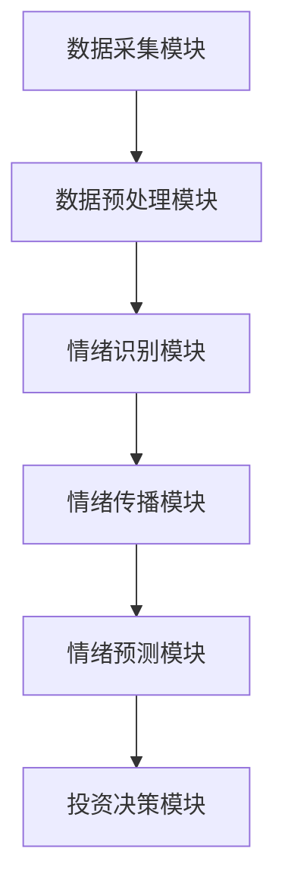

                 


# AI多智能体提升价值投资的市场情绪判断

> 关键词：AI多智能体、市场情绪、价值投资、情绪网络、协同学习

> 摘要：本文深入探讨了AI多智能体技术在价值投资中的应用，特别是如何通过市场情绪的判断来提升投资决策的准确性。文章从市场情绪分析的基本概念入手，详细分析了基于多智能体的协同学习算法，并结合实际案例展示了如何通过系统架构设计和项目实战来实现这一目标。最后，本文总结了AI多智能体在市场情绪分析中的优势，并展望了未来的发展方向。

---

## 第1章: 背景介绍

### 1.1 多智能体系统的基本概念
- **多智能体系统（Multi-Agent System, MAS）**：由多个智能体（Agent）组成的分布式系统，智能体之间通过协作和竞争完成特定任务。
- **智能体的定义**：智能体是能够感知环境、做出决策并采取行动的实体。
- **多智能体系统的特点**：
  1. 分布式性
  2. 协作性
  3. 反应性
  4. 动态性
  5. 社会性

### 1.2 市场情绪分析的定义与重要性
- **市场情绪分析**：通过分析市场参与者的心理状态和行为，预测市场走势的过程。
- **市场情绪的构成**：
  1. 投资者情绪
  2. 市场波动
  3. 市场参与度
- **市场情绪对价值投资的影响**：
  1. 情绪过热可能导致泡沫
  2. 情绪低谷可能是买入机会
  3. 情绪稳定期适合长期投资

### 1.3 价值投资与市场情绪的关系
- **价值投资**：基于基本面分析，寻找被市场低估的投资标的。
- **市场情绪对价值投资的挑战**：
  1. 情绪波动可能导致短期价格偏离长期价值。
  2. 情绪分析可以帮助投资者识别短期波动中的投资机会。

---

## 第2章: 多智能体系统在市场情绪分析中的应用

### 2.1 多智能体系统的优势
- **多智能体系统的优势**：
  1. 分布式计算能力强
  2. 能够处理复杂的情感信息
  3. 适合实时数据分析

### 2.2 多智能体系统在市场情绪分析中的实现
- **实现步骤**：
  1. 数据采集：收集市场数据、新闻、社交媒体信息。
  2. 情绪识别：通过自然语言处理（NLP）技术识别文本中的情绪。
  3. 情绪传播：分析情绪在市场中的传播路径。
  4. 情绪预测：基于历史数据预测未来的情绪走势。

---

## 第3章: 基于多智能体的协同学习算法

### 3.1 协同学习的基本原理
- **协同学习**：多个智能体通过协作完成任务，每个智能体的学习过程相互影响。
- **协同学习的优势**：
  1. 提高整体性能
  2. 增强系统鲁棒性
  3. 适应复杂环境

### 3.2 基于强化学习的多智能体协同机制
- **强化学习**：通过试错学习，智能体不断优化其策略以最大化奖励。
- **多智能体强化学习的挑战**：
  1. 智能体之间的协调问题
  2. 竞争与合作的平衡
  3. 状态空间的复杂性

---

## 第4章: 系统架构设计

### 4.1 系统功能模块
- **功能模块**：
  1. 数据采集模块
  2. 情绪识别模块
  3. 情绪传播模块
  4. 情绪预测模块
  5. 投资决策模块

### 4.2 系统架构图


### 4.3 系统接口设计
- **数据接口**：与数据源（如股票市场数据、社交媒体数据）对接。
- **用户接口**：供投资者查询市场情绪和投资建议。

---

## 第5章: 项目实战

### 5.1 环境搭建
- **工具安装**：
  1. Python
  2. TensorFlow
  3. Pandas
  4. Matplotlib

### 5.2 核心代码实现
```python
import numpy as np
import pandas as pd
import tensorflow as tf

# 数据预处理
def preprocess_data(data):
    # 假设data是一个DataFrame
    data = data.dropna()
    data = data[['close', 'volume', 'sentiment_score']]
    return data

# 情绪识别模型
def sentiment_model():
    model = tf.keras.Sequential([
        tf.keras.layers.Dense(64, activation='relu'),
        tf.keras.layers.Dense(1, activation='sigmoid')
    ])
    model.compile(optimizer='adam', loss='binary_crossentropy', metrics=['accuracy'])
    return model

# 情绪传播网络
def emotion_spread_network():
    model = tf.keras.Sequential([
        tf.keras.layers.GRU(32, return_sequences=True),
        tf.keras.layers.Dense(1, activation='sigmoid')
    ])
    model.compile(optimizer='adam', loss='mse')
    return model
```

### 5.3 案例分析
- **案例背景**：假设我们有一个股票数据集，包含收盘价、成交量和情绪评分。
- **案例分析步骤**：
  1. 数据预处理
  2. 情绪识别
  3. 情绪传播
  4. 情绪预测
  5. 投资决策

### 5.4 代码解读
- **数据预处理**：处理缺失值和无关数据。
- **情绪识别模型**：使用深度学习模型对文本数据进行情绪分类。
- **情绪传播网络**：使用循环神经网络（RNN）分析情绪传播路径。

---

## 第6章: 总结与展望

### 6.1 总结
- **本文的主要内容**：
  1. 介绍了多智能体系统的基本概念和优势。
  2. 探讨了市场情绪分析在价值投资中的应用。
  3. 展示了基于多智能体的协同学习算法。
  4. 通过项目实战展示了系统的实现过程。

### 6.2 未来展望
- **未来的研究方向**：
  1. 提高多智能体系统的协同效率。
  2. 增强情绪分析的准确性。
  3. 探索多智能体系统在更多金融场景中的应用。

---

## 作者：AI天才研究院/AI Genius Institute & 禅与计算机程序设计艺术 /Zen And The Art of Computer Programming

