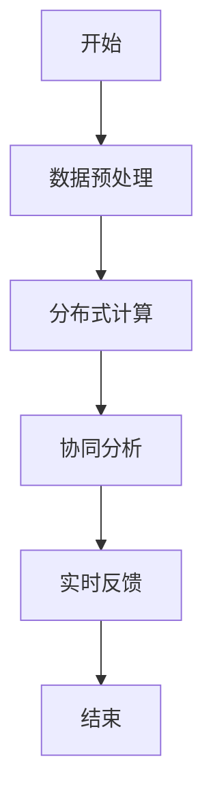
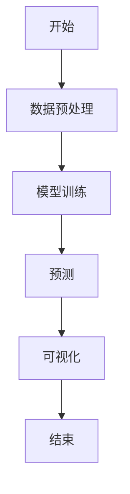
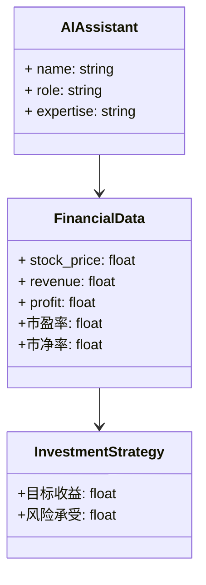
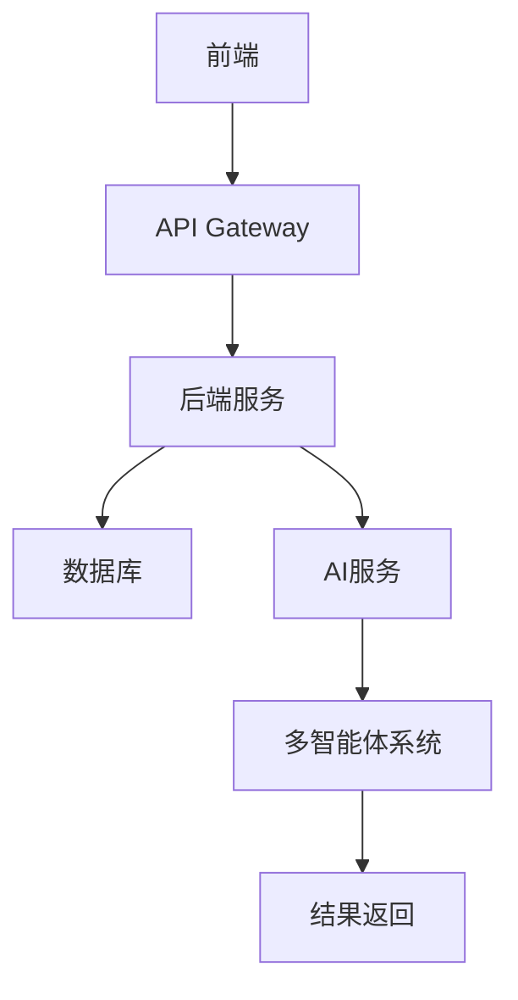
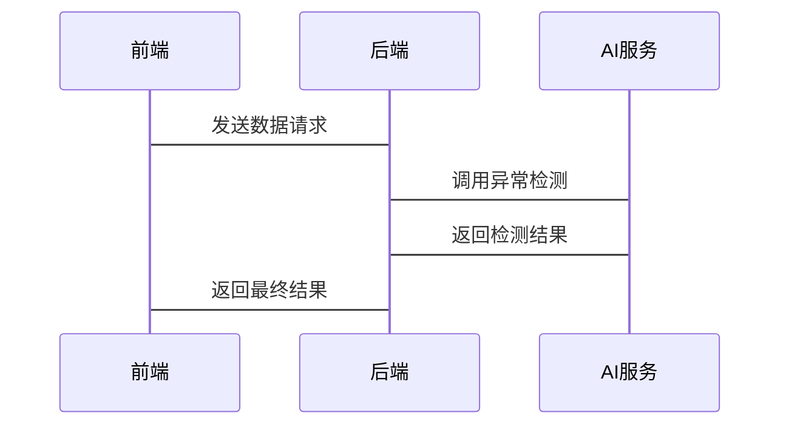

                 


# AI多智能体提升价值投资的财务指标异常检测

> 关键词：AI多智能体，价值投资，财务指标异常检测，协同算法，系统架构，金融数据分析

> 摘要：本文探讨了利用AI多智能体技术提升价值投资中的财务指标异常检测。通过分析AI多智能体系统的核心原理、异常检测算法及协同机制，结合实际案例，展示了如何通过系统架构设计和项目实现，提升财务指标异常检测的准确性和效率，为价值投资提供有力支持。

---

## 第1章: 背景介绍

### 1.1 问题背景
#### 1.1.1 价值投资的基本概念
价值投资是一种投资策略，旨在通过识别被市场低估的优质资产，长期持有以实现超额收益。其核心在于对财务报表的深入分析，寻找具有持续盈利能力、良好管理和合理估值的企业。

#### 1.1.2 财务指标在价值投资中的重要性
财务指标是衡量企业财务健康状况的关键工具，如市盈率（P/E）、市净率（P/B）、ROE（净资产收益率）等。这些指标帮助投资者评估企业的盈利能力、成长性和风险水平。

#### 1.1.3 传统财务指标分析的局限性
传统分析方法依赖人工判断，存在主观性强、效率低、易受市场波动影响等问题。尤其是在数据量庞大、复杂性高的金融领域，传统方法难以及时发现潜在风险和机会。

### 1.2 问题描述
#### 1.2.1 财务指标异常检测的定义
财务指标异常检测是指识别财务数据中偏离正常范围的指标，这些异常可能预示着企业财务状况的变化，如盈利能力下降或潜在的财务造假。

#### 1.2.2 异常检测在价值投资中的作用
及时发现财务指标异常可以帮助投资者规避风险，抓住投资机会。例如，识别潜在的财务造假或业绩下滑，提前调整投资策略。

#### 1.2.3 当前技术手段的不足
传统方法依赖经验判断，主观性强且效率低。近年来，虽然机器学习和AI技术在金融领域得到应用，但单一模型难以应对复杂多变的金融市场，缺乏多维度协同分析能力。

### 1.3 问题解决
#### 1.3.1 AI技术在金融领域的应用现状
AI技术在金融领域的应用包括智能投顾、风险评估、市场预测等。AI的优势在于处理海量数据、发现隐含关联和提供实时反馈。

#### 1.3.2 多智能体在复杂金融问题中的优势
多智能体系统通过多个AI协同工作，能够从不同维度分析数据，提供更全面的解决方案。例如，一个智能体负责分析财务数据，另一个负责市场情绪分析，协同工作提高准确性。

#### 1.3.3 提升价值投资的策略优化
通过AI多智能体协同分析，投资者能够更全面地评估企业价值，及时发现财务异常，优化投资组合，提升投资收益。

### 1.4 边界与外延
#### 1.4.1 财务指标异常检测的边界条件
仅关注财务指标本身，不考虑非财务因素，如行业政策变化或管理层变动。

#### 1.4.2 多智能体技术的应用范围
适用于复杂、多维度的金融问题，如投资组合优化、风险评估等。

#### 1.4.3 价值投资与AI技术的结合范围
聚焦于利用AI提升投资决策的科学性和效率，不涉及具体的投资策略制定。

### 1.5 核心概念与核心要素
#### 1.5.1 核心概念的定义
AI多智能体：多个AI协同工作的系统，具备分布式计算和协作能力。

价值投资：基于企业基本面分析的投资策略，寻找被低估的优质资产。

财务指标异常检测：识别财务数据中的异常，评估企业财务健康状况。

#### 1.5.2 核心要素的构成
- **数据源**：财务报表、市场数据、行业报告等。
- **AI算法**：机器学习模型、协同过滤、时间序列分析。
- **多智能体协作**：多个AI协同分析，从不同维度提供支持。
- **实时反馈**：系统根据市场变化实时调整分析策略。

---

## 第2章: 核心概念与联系

### 2.1 AI多智能体的核心原理
#### 2.1.1 多智能体系统的定义
多智能体系统（MAS）由多个智能体组成，每个智能体具备自主性、反应性和协作性，能够协同完成复杂任务。

#### 2.1.2 多智能体系统的组成与功能
- **智能体**：具备感知、决策和行动能力。
- **通信机制**：智能体之间通过消息传递协同工作。
- **协作算法**：如分布式优化算法、共识算法。

#### 2.1.3 多智能体系统的协同机制
通过任务分解、协同规划和实时通信，多个智能体协同完成复杂任务。例如，在价值投资中，一个智能体分析财务指标，另一个分析市场情绪，协同提供投资建议。

### 2.2 价值投资的核心原理
#### 2.2.1 价值投资的基本原理
寻找市场价格低于内在价值的资产，长期持有，等待市场回归。

#### 2.2.2 价值投资的关键指标
市盈率、市净率、ROE、现金流等，用于评估企业价值和成长性。

#### 2.2.3 价值投资的决策过程
基于对企业基本面的深入分析，结合市场趋势和行业动态，做出投资决策。

### 2.3 财务指标异常检测的核心原理
#### 2.3.1 异常检测的定义与分类
异常检测是识别数据中偏离正常模式的点或模式，分为单变量和多变量分析。

#### 2.3.2 基于AI的异常检测方法
使用机器学习模型，如孤立森林、聚类分析，识别数据中的异常。

#### 2.3.3 异常检测在价值投资中的应用
识别财务数据中的异常，如收入突降或成本激增，提前预警潜在风险。

### 2.4 核心概念之间的关系
#### 2.4.1 AI多智能体与价值投资的关系
AI多智能体通过协同分析，提升价值投资的分析效率和准确性。

#### 2.4.2 价值投资与财务指标异常检测的关系
异常检测是价值投资的重要环节，帮助识别潜在风险和投资机会。

#### 2.4.3 AI多智能体与财务指标异常检测的关系
AI多智能体通过协同分析，提升异常检测的准确性和全面性。

---

## 第3章: 核心概念原理与联系

### 3.1 AI多智能体的原理
#### 3.1.1 多智能体系统的架构
- **分布式架构**：每个智能体负责特定任务，协同完成整体目标。
- **集中式架构**：有一个中心节点协调各个智能体的工作。

#### 3.1.2 多智能体系统的通信机制
- **消息传递**：智能体之间通过消息传递信息。
- **协议设计**：制定通信协议，确保信息传递的准确性和效率。

#### 3.1.3 多智能体系统的协同算法
- **分布式优化算法**：如分布式梯度下降。
- **共识算法**：如区块链中的共识机制。

### 3.2 价值投资的原理
#### 3.2.1 价值投资的基本原理
基于对企业内在价值的评估，寻找市场价格低于内在价值的投资机会。

#### 3.2.2 价值投资的关键指标
- **市盈率（P/E）**：衡量股价与盈利的关系。
- **市净率（P/B）**：衡量股价与资产净值的关系。
- **ROE**：衡量企业的盈利能力。

#### 3.2.3 价值投资的决策过程
- **数据收集**：收集企业的财务数据、行业信息等。
- **数据分析**：分析财务指标，评估企业价值。
- **投资决策**：基于分析结果，做出投资决策。

### 3.3 财务指标异常检测的原理
#### 3.3.1 异常检测的定义与分类
异常检测是识别数据中偏离正常模式的点或模式，分为单变量和多变量分析。

#### 3.3.2 基于AI的异常检测方法
- **机器学习模型**：如孤立森林、聚类分析。
- **时间序列分析**：识别时间依赖的异常模式。

#### 3.3.3 异常检测在价值投资中的应用
通过识别财务指标的异常，帮助投资者发现潜在风险，优化投资组合。

### 3.4 核心概念之间的关系
AI多智能体通过协同分析，提升异常检测的准确性和全面性，从而优化价值投资的决策过程。

---

## 第4章: 算法原理讲解

### 4.1 AI多智能体协同算法
#### 4.1.1 算法流程
1. 数据预处理：清洗和标准化财务数据。
2. 分布式计算：多个智能体分别分析数据，生成初步结果。
3. 协同分析：智能体之间共享信息，协同生成最终结果。
4. 实时反馈：根据市场变化，实时调整分析策略。

#### 4.1.2 mermaid流程图


#### 4.1.3 Python代码实现
```python
import numpy as np
from sklearn.ensemble import IsolationForest

# 示例数据
data = np.random.normal(loc=0, scale=1, size=1000)
# 异常检测模型
model = IsolationForest(n_estimators=100, contamination=0.05)
model.fit(data.reshape(-1, 1))
# 预测异常
outliers = model.predict(data.reshape(-1, 1))
print("异常点索引:", np.where(outliers == -1)[0])
```

#### 4.1.4 数学模型
异常检测模型的数学公式：
$$
y = \sum_{i=1}^{n} w_i x_i
$$
其中，$w_i$ 是权重，$x_i$ 是特征向量。

### 4.2 异常检测算法
#### 4.2.1 算法流程
1. 数据预处理：标准化和去噪。
2. 模型训练：训练异常检测模型。
3. 预测：识别异常点。
4. 可视化：展示异常结果。

#### 4.2.2 mermaid流程图


#### 4.2.3 Python代码实现
```python
import matplotlib.pyplot as plt

# 示例数据可视化
data = np.random.normal(loc=0, scale=1, size=1000)
plt.hist(data, bins=30, edgecolor='black')
plt.title('Data Distribution')
plt.show()
```

#### 4.2.4 数学模型
异常检测模型的数学公式：
$$
y = \sum_{i=1}^{n} w_i x_i
$$
其中，$w_i$ 是权重，$x_i$ 是特征向量。

---

## 第5章: 系统分析与架构设计

### 5.1 项目场景介绍
项目目标是利用AI多智能体技术，提升财务指标异常检测的准确性和效率，支持价值投资决策。

### 5.2 系统功能设计
#### 5.2.1 领域模型类图


#### 5.2.2 系统架构设计


### 5.3 系统接口设计
- 前端接口：向后端发送数据请求。
- 后端接口：接收数据，调用AI服务进行分析。
- AI服务接口：返回分析结果。

### 5.4 系统交互流程


---

## 第6章: 项目实战

### 6.1 环境安装
- 安装Python、NumPy、Scikit-learn、Mermaid、Docker等工具。

### 6.2 系统核心实现
#### 6.2.1 核心代码实现
```python
import numpy as np
from sklearn.ensemble import IsolationForest

# 数据加载
data = np.random.normal(loc=0, scale=1, size=1000)
# 模型训练
model = IsolationForest(n_estimators=100, contamination=0.05)
model.fit(data.reshape(-1, 1))
# 预测
outliers = model.predict(data.reshape(-1, 1))
print("异常点索引:", np.where(outliers == -1)[0])
```

#### 6.2.2 代码应用解读
代码实现了一个孤立森林模型，用于检测异常点。首先加载数据，训练模型，然后预测并输出异常点的索引。

### 6.3 实际案例分析
以某上市公司为例，分析其财务指标，识别异常点，评估投资风险。

### 6.4 项目小结
通过实践，验证了AI多智能体技术在财务指标异常检测中的有效性，提升了分析效率和准确性。

---

## 第7章: 总结与展望

### 7.1 总结
本文探讨了AI多智能体在价值投资中的应用，通过协同分析，提升了财务指标异常检测的效率和准确性。

### 7.2 展望
未来可以进一步研究多智能体的协同机制，优化异常检测算法，提升系统的实时性和准确性。

---

## 第8章: 最佳实践 tips

### 8.1 小结
通过本文的学习，读者可以了解AI多智能体在价值投资中的应用，掌握异常检测的核心原理和实现方法。

### 8.2 注意事项
- 数据质量：确保数据的完整性和准确性。
- 模型调优：根据实际情况调整模型参数。
- 实时性：优化系统的实时响应能力。

### 8.3 拓展阅读
建议阅读《AI多智能体系统设计与实现》、《金融数据分析与挖掘》等相关书籍，深入理解AI技术在金融领域的应用。

---

## 作者：AI天才研究院/AI Genius Institute & 禅与计算机程序设计艺术 /Zen And The Art of Computer Programming

---

这篇文章系统地介绍了AI多智能体在价值投资中的应用，通过理论分析、算法实现和项目实战，展示了如何利用AI技术提升财务指标异常检测的效率和准确性。

