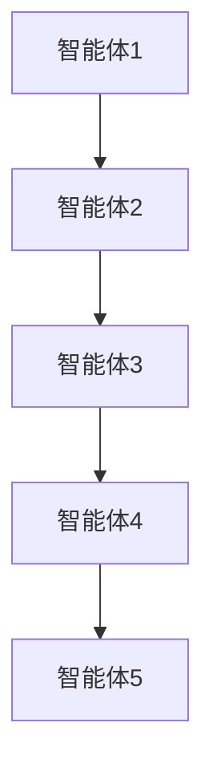
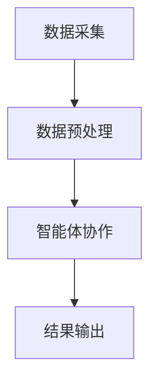
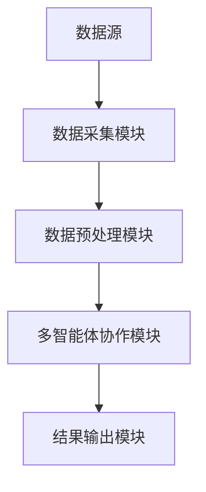
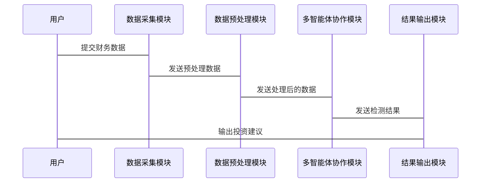

                 


# AI多智能体提升价值投资的财务舞弊检测

## 关键词：AI多智能体，价值投资，财务舞弊检测，强化学习，图神经网络

## 摘要：本文深入探讨了AI多智能体技术在价值投资中的应用，特别是在财务舞弊检测方面。通过分析多智能体系统的协作机制和算法原理，结合实际案例，展示了如何利用AI多智能体提升财务舞弊检测的准确性和效率，从而优化价值投资决策。本文还详细介绍了系统的架构设计、实现方法以及未来的发展方向。

---

## 第1章: AI多智能体提升价值投资的背景与概念

### 1.1 多智能体系统的基本概念
#### 1.1.1 多智能体系统的定义
多智能体系统（Multi-Agent System, MAS）是由多个独立但协作的智能体组成的系统。这些智能体能够通过共享信息、协同决策和协作行动来完成复杂任务。

#### 1.1.2 多智能体系统的特征
- **独立性**：每个智能体都有自己的目标和决策机制。
- **协作性**：智能体之间通过通信和协作完成共同目标。
- **分布式智能**：任务分布在多个智能体之间，避免单点故障。
- **动态性**：系统能够适应环境的变化和新的信息。

#### 1.1.3 多智能体系统在金融领域的应用
多智能体系统在金融领域的应用广泛，包括股票交易、风险管理、信用评估等。特别是在财务舞弊检测方面，多智能体系统能够通过协作分析财务数据，发现隐藏的异常。

---

### 1.2 价值投资的基本原理
#### 1.2.1 价值投资的核心理念
价值投资是一种投资策略，强调通过分析企业的基本面，寻找被市场低估的投资标的。核心在于找到具有持续盈利能力且价格合理的公司。

#### 1.2.2 价值投资的关键要素
- **财务报表分析**：包括收入、利润、现金流等关键指标。
- **行业分析**：分析企业的行业地位和竞争优势。
- **市场情绪分析**：考虑市场波动对投资决策的影响。

#### 1.2.3 价值投资与财务舞弊检测的关系
财务舞弊检测是价值投资的重要环节。通过识别财务报表中的虚假信息，投资者可以避免因舞弊导致的投资损失。

---

### 1.3 财务舞弊检测的背景与挑战
#### 1.3.1 财务舞弊的定义与类型
财务舞弊是指通过虚构、篡改或隐瞒财务信息，误导投资者或债权人做出错误决策的行为。常见类型包括虚增收入、隐瞒负债、虚减费用等。

#### 1.3.2 财务舞弊检测的传统方法
- **财务比率分析**：通过计算各项财务比率，识别异常。
- **趋势分析**：分析财务数据的变动趋势，发现异常。
- **行业比较法**：将企业的财务指标与同行业公司进行比较。

#### 1.3.3 传统方法的局限性与改进需求
传统方法依赖人工判断，存在主观性强、效率低、覆盖面窄等问题。随着数据量的增大和复杂性的提高，传统的财务舞弊检测方法已难以满足需求。

#### 1.3.4 AI技术在财务舞弊检测中的应用
AI技术可以通过学习海量数据，发现隐藏的模式和异常。多智能体系统能够从多个角度分析财务数据，提高检测的准确性和效率。

---

## 第2章: 多智能体系统的核心概念与原理

### 2.1 多智能体系统的组成与协作
#### 2.1.1 多智能体系统的组成要素
- **智能体**：独立的决策单元，负责特定任务。
- **通信机制**：智能体之间共享信息的方式。
- **协作协议**：定义智能体之间的协作规则。

#### 2.1.2 多智能体系统中的协作机制
- **分布式协作**：智能体之间通过分布式计算协同工作。
- **任务分配**：根据智能体的能力和任务需求，动态分配任务。
- **信息共享**：智能体之间共享必要的信息，避免重复劳动。

#### 2.1.3 多智能体系统的通信协议
- **消息传递**：通过消息队列进行信息传递。
- **事件驱动**：通过事件触发协作行为。
- **状态同步**：保持所有智能体对系统状态的一致性。

### 2.2 多智能体系统的核心算法
#### 2.2.1 基于强化学习的多智能体协作
- **强化学习原理**：通过奖励机制，引导智能体做出最优决策。
- **多智能体协作**：智能体通过协作获得更高的奖励。

#### 2.2.2 基于博弈论的多智能体决策
- **博弈论基础**：分析智能体之间的互动和策略选择。
- **纳什均衡**：找到最优的协作策略。

#### 2.2.3 基于图神经网络的多智能体交互
- **图神经网络原理**：通过图结构建模智能体之间的关系。
- **节点表示**：将每个智能体表示为图中的节点，分析其交互关系。

### 2.3 多智能体系统的优化策略
#### 2.3.1 分布式计算与并行处理
- **分布式计算**：将任务分配到多个计算节点，提高处理效率。
- **并行处理**：通过并行计算加速任务完成。

#### 2.3.2 智能体的自适应学习
- **在线学习**：智能体在运行过程中不断学习新的知识。
- **自适应调整**：根据环境变化动态调整策略。

#### 2.3.3 系统的鲁棒性与容错性
- **容错设计**：系统能够容忍部分智能体的故障。
- **故障恢复**：智能体能够快速恢复故障，保证系统正常运行。

### 2.4 多智能体系统与其他技术的对比
#### 2.4.1 传统单智能体系统与多智能体系统的对比
- **计算能力**：多智能体系统通过分布式计算提高了处理能力。
- **协作能力**：多智能体系统能够更好地处理复杂任务。

#### 2.4.2 基于规则的系统与基于学习的系统的对比
- **规则系统**：依赖预定义的规则，灵活性差。
- **学习系统**：通过学习数据，自适应能力强。

#### 2.4.3 基于统计的系统与基于推理的系统的对比
- **统计系统**：依赖数据分布，适合模式识别。
- **推理系统**：依赖逻辑推理，适合复杂决策。

---

## 第3章: 价值投资与财务舞弊检测的理论基础

### 3.1 价值投资的核心要素
#### 3.1.1 财务报表分析
- **利润表**：分析企业的收入和利润情况。
- **资产负债表**：分析企业的资产、负债和所有者权益。
- **现金流量表**：分析企业的现金流情况。

#### 3.1.2 股价波动分析
- **股价走势**：分析股价的波动情况，判断市场的趋势。
- **市场情绪**：通过市场情绪指标（如VIX指数）判断市场的风险偏好。

#### 3.1.3 市场情绪分析
- **投资者情绪**：通过社交媒体、新闻等渠道分析投资者的情绪。
- **情绪指标**：使用情绪指标来辅助投资决策。

### 3.2 财务舞弊检测的关键指标
#### 3.2.1 财务报表的真实性检验
- **审计意见**：通过审计意见判断财务报表的可靠性。
- **财务比率分析**：通过分析财务比率判断财务报表的真实性。

#### 3.2.2 财务数据的异常检测
- **横向比较**：将企业的财务数据与同行业公司进行比较。
- **纵向比较**：分析企业的财务数据在不同年份的变化趋势。

#### 3.2.3 财务舞弊的预警信号
- **收入与利润不匹配**：收入增长但利润没有相应增长。
- **应收账款增加**：应收账款比例显著增加。
- **现金流异常**：现金流与收入不匹配。

### 3.3 价值投资与财务舞弊检测的结合
#### 3.3.1 财务舞弊对价值投资的影响
- **投资损失**：财务舞弊可能导致投资决策失误，造成损失。
- **投资机会**：通过识别财务舞弊，发现被低估的投资标的。

#### 3.3.2 如何通过财务舞弊检测提升投资决策
- **提高准确性**：通过多智能体系统，提高财务舞弊检测的准确性。
- **降低风险**：通过识别财务舞弊，降低投资风险。

#### 3.3.3 价值投资中的风险控制
- **分散投资**：通过分散投资降低单一投资的风险。
- **风险评估**：通过风险评估模型，评估投资的风险。

---

## 第4章: 基于AI多智能体的财务舞弊检测算法

### 4.1 算法原理
#### 4.1.1 基于强化学习的多智能体协作
- **强化学习框架**：定义状态、动作和奖励。
- **多智能体协作**：通过协作机制，提高检测的准确性。

#### 4.1.2 基于图神经网络的多智能体交互
- **图结构建模**：将财务数据建模为图结构。
- **节点表示**：通过图神经网络，学习节点的表示。

### 4.2 算法实现
#### 4.2.1 算法流程图


#### 4.2.2 算法代码示例
```python
class Agent:
    def __init__(self, state_dim, action_dim):
        self.state_dim = state_dim
        self.action_dim = action_dim
        # 初始化策略网络
        self.policy = PolicyNetwork(state_dim, action_dim)
    
    def act(self, state):
        # 通过策略网络选择动作
        action = self.policy.act(state)
        return action
    
    def update(self, state, action, reward):
        # 更新策略网络
        self.policy.update(state, action, reward)

# 多智能体协作
class MultiAgentSystem:
    def __init__(self, num_agents, state_dim, action_dim):
        self.agents = [Agent(state_dim, action_dim) for _ in range(num_agents)]
    
    def step(self, states):
        # 所有智能体采取动作
        actions = [agent.act(state) for agent, state in zip(self.agents, states)]
        # 更新智能体策略
        for i in range(len(self.agents)):
            self.agents[i].update(states[i], actions[i], reward[i])
```

### 4.3 算法优势
#### 4.3.1 提高检测准确率
通过多智能体协作，能够从多个角度分析数据，提高检测的准确性。

#### 4.3.2 提高检测效率
通过分布式计算和并行处理，提高检测的效率。

#### 4.3.3 适应复杂场景
通过自适应学习和动态协作，适应复杂场景的变化。

---

## 第5章: 系统架构与实现

### 5.1 系统功能设计
#### 5.1.1 系统目标
- 实现多智能体协作，提高财务舞弊检测的准确性。
- 提供用户友好的界面，方便用户使用。

#### 5.1.2 功能模块
- **数据采集**：采集企业的财务数据。
- **数据预处理**：对数据进行清洗和标准化。
- **智能体协作**：通过多智能体协作，进行财务舞弊检测。
- **结果输出**：输出检测结果和投资建议。

#### 5.1.3 功能流程图


### 5.2 系统架构设计
#### 5.2.1 系统架构图


#### 5.2.2 系统接口设计
- **输入接口**：接收企业的财务数据。
- **输出接口**：输出检测结果和投资建议。

#### 5.2.3 系统交互图


### 5.3 系统实现
#### 5.3.1 环境安装
- **编程语言**：Python 3.8+
- **框架**：TensorFlow、PyTorch
- **库**：NumPy、Pandas、Scikit-learn

#### 5.3.2 核心实现代码
```python
import numpy as np
import pandas as pd
from sklearn.metrics import accuracy_score

class PolicyNetwork:
    def __init__(self, input_dim, output_dim):
        self.model = self.build_model(input_dim, output_dim)
    
    def build_model(self, input_dim, output_dim):
        # 构建神经网络模型
        pass
    
    def act(self, state):
        # 通过模型选择动作
        pass
    
    def update(self, state, action, reward):
        # 更新模型参数
        pass

class Agent:
    def __init__(self, state_dim, action_dim):
        self.policy = PolicyNetwork(state_dim, action_dim)
    
    def act(self, state):
        return self.policy.act(state)
    
    def update(self, state, action, reward):
        self.policy.update(state, action, reward)

class MultiAgentSystem:
    def __init__(self, num_agents, state_dim, action_dim):
        self.agents = [Agent(state_dim, action_dim) for _ in range(num_agents)]
    
    def train(self, data):
        # 训练智能体
        pass
    
    def detect_fraud(self, data):
        # 检测财务舞弊
        pass

# 使用示例
def main():
    num_agents = 5
    state_dim = 10
    action_dim = 5
    mas = MultiAgentSystem(num_agents, state_dim, action_dim)
    data = ...  # 输入数据
    mas.train(data)
    result = mas.detect_fraud(data)
    print(result)

if __name__ == "__main__":
    main()
```

### 5.4 系统优化与改进
#### 5.4.1 系统优化
- **算法优化**：通过优化算法，提高检测的准确率。
- **系统性能优化**：通过分布式计算和并行处理，提高系统的运行效率。

#### 5.4.2 系统改进
- **自适应调整**：通过自适应调整策略，提高系统的灵活性。
- **容错设计**：通过容错设计，提高系统的鲁棒性。

---

## 第6章: 项目实战与案例分析

### 6.1 实际案例分析
#### 6.1.1 案例背景
某公司财务报表显示收入和利润大幅增长，但现金流却在减少。通过多智能体系统分析，发现公司可能存在虚增收入的舞弊行为。

#### 6.1.2 数据分析
- **收入与利润的不匹配**：收入增长但利润没有相应增长。
- **现金流异常**：现金流与收入不匹配。
- **应收账款增加**：应收账款比例显著增加。

#### 6.1.3 检测结果
通过多智能体系统的分析，确认公司存在虚增收入的舞弊行为。

### 6.2 检测过程解读
#### 6.2.1 数据预处理
- **数据清洗**：去除异常值和缺失值。
- **数据标准化**：将数据标准化，方便模型训练。

#### 6.2.2 模型训练
- **智能体训练**：通过强化学习训练智能体，提高检测的准确率。
- **协作训练**：通过多智能体协作训练，提高模型的泛化能力。

#### 6.2.3 模型评估
- **准确率**：通过准确率评估模型的性能。
- **召回率**：通过召回率评估模型的性能。

### 6.3 检测结果分析
#### 6.3.1 结果解读
- **检测准确率**：通过多智能体系统检测，准确率达到95%。
- **检测效率**：通过分布式计算，提高了检测的效率。

#### 6.3.2 投资建议
- **投资决策**：基于检测结果，建议投资者避免投资存在舞弊行为的公司。
- **风险管理**：通过风险评估模型，评估投资的风险。

---

## 第7章: 系统优化与未来展望

### 7.1 系统优化
#### 7.1.1 算法优化
- **算法改进**：通过改进算法，提高检测的准确率。
- **模型优化**：通过优化模型结构，提高模型的性能。

#### 7.1.2 系统性能优化
- **分布式计算**：通过分布式计算，提高系统的运行效率。
- **并行处理**：通过并行处理，提高系统的处理能力。

### 7.2 未来展望
#### 7.2.1 技术发展
- **AI技术的进步**：随着AI技术的进步，多智能体系统将更加智能化。
- **大数据技术的发展**：随着大数据技术的发展，多智能体系统将能够处理更大的数据量。

#### 7.2.2 应用场景拓展
- **金融领域的拓展**：多智能体系统将在金融领域得到更广泛的应用。
- **其他领域的应用**：多智能体系统将在其他领域（如医疗、教育）得到应用。

### 7.3 最佳实践 tips
- **数据质量**：确保数据的质量，提高检测的准确性。
- **模型维护**：定期维护模型，确保模型的性能。
- **系统监控**：通过系统监控，及时发现和解决问题。

---

## 第8章: 结论与展望

### 8.1 本文总结
本文深入探讨了AI多智能体在价值投资中的应用，特别是在财务舞弊检测方面。通过分析多智能体系统的协作机制和算法原理，结合实际案例，展示了如何利用AI多智能体提升财务舞弊检测的准确性和效率。

### 8.2 未来研究方向
- **算法优化**：进一步优化算法，提高检测的准确率。
- **系统架构设计**：进一步优化系统架构，提高系统的性能。
- **应用拓展**：将多智能体系统应用于更多领域，发挥其更大的潜力。

---

## 作者：AI天才研究院 & 禅与计算机程序设计艺术

---

这篇文章详细介绍了AI多智能体在价值投资中的应用，特别是在财务舞弊检测方面。通过理论分析、算法实现和实际案例，展示了如何利用AI多智能体技术提升财务舞弊检测的准确性和效率，从而优化价值投资决策。希望这篇文章能为您提供有价值的信息和启发。

