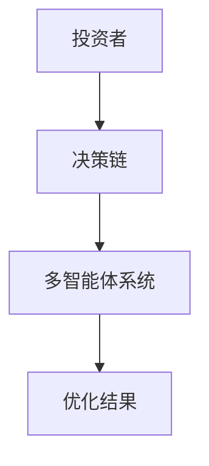
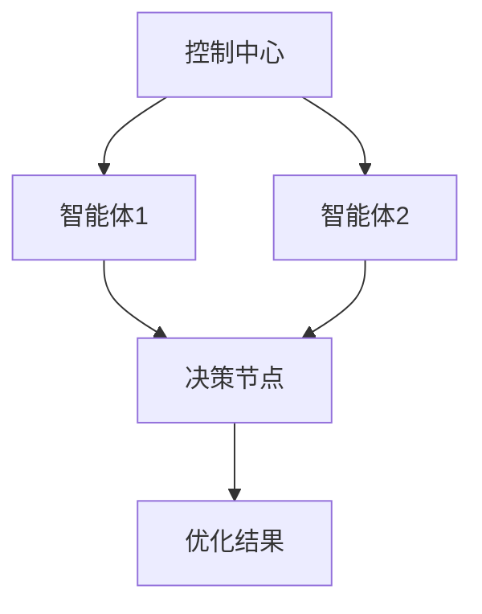
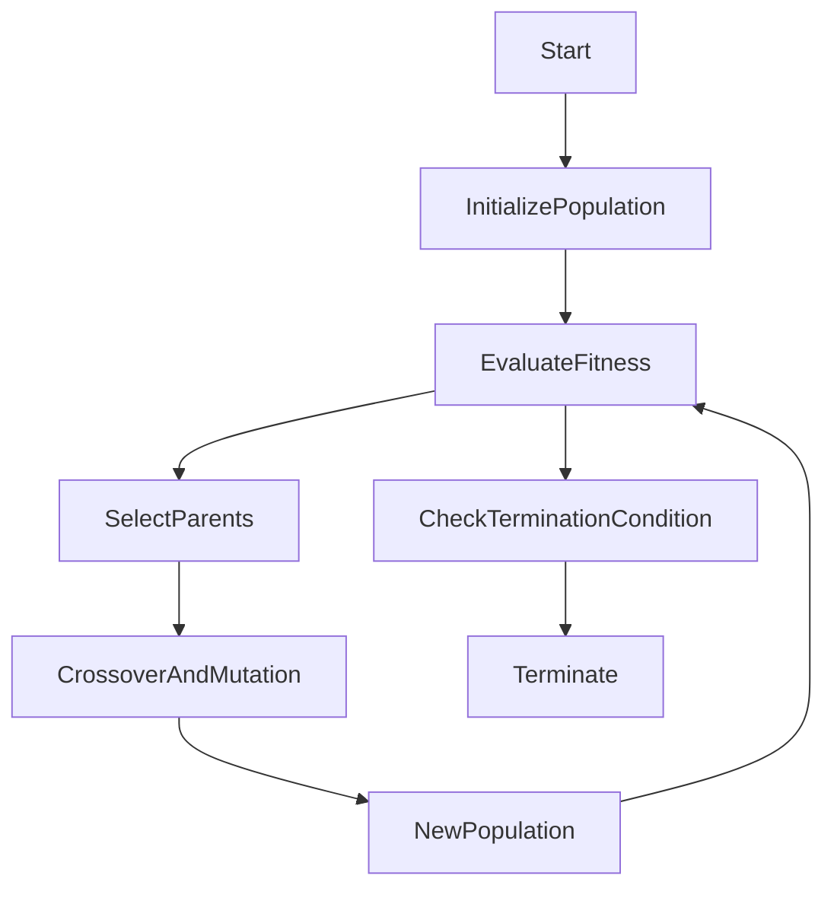
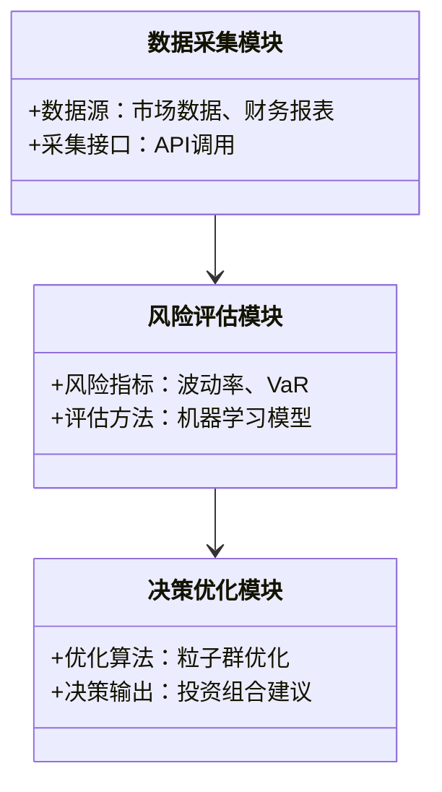
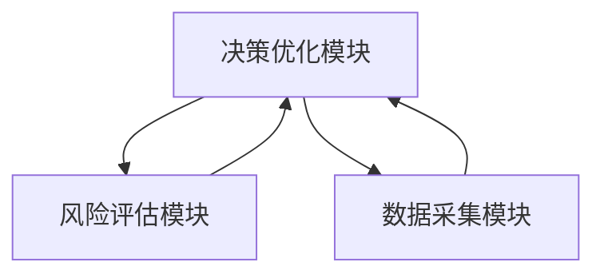
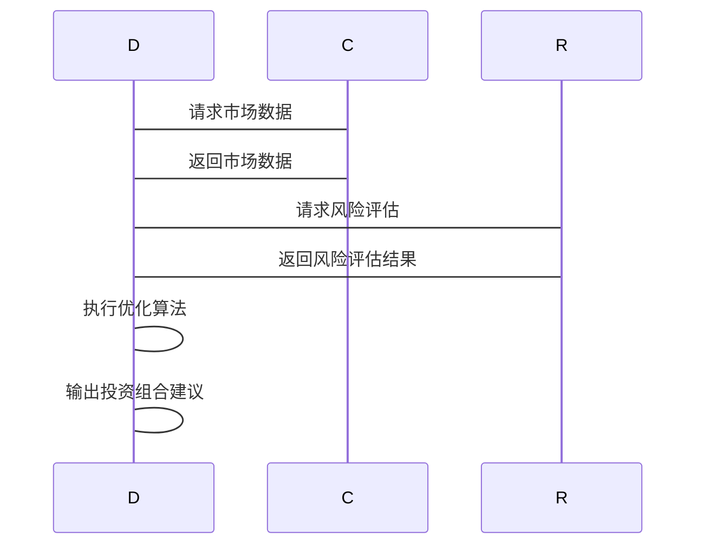

                 


# AI多智能体系统优化价值投资决策链

> 关键词：AI多智能体系统，价值投资，决策优化，算法原理，系统架构，项目实战

> 摘要：本文深入探讨了AI多智能体系统如何优化价值投资决策链。通过分析传统投资决策链的局限性，结合多智能体系统的优势，提出了一套基于AI多智能体系统的优化方案。文章详细阐述了系统的背景、核心概念、算法原理、系统架构设计、项目实战及最佳实践，为读者提供了一套完整的理论与实践指导。

---

# 第一部分: AI多智能体系统与价值投资决策链的背景介绍

# 第1章: AI多智能体系统与价值投资决策链的背景

## 1.1 问题背景与问题描述
### 1.1.1 传统投资决策链的局限性
传统投资决策链依赖人工分析，存在效率低下、主观性强、信息处理能力有限等问题。

### 1.1.2 问题解决与边界定义
多智能体系统通过协同合作，优化投资决策链中的信息处理、风险评估和决策执行环节。

### 1.1.3 价值投资决策链的核心要素
- 数据采集与处理
- 风险评估与优化
- 决策执行与反馈

## 1.2 核心概念与核心要素
### 1.2.1 多智能体系统的核心概念
- 分布式智能
- 协作与竞争
- 自适应优化

### 1.2.2 价值投资决策链的核心要素
- 数据源：市场数据、财务报表、新闻舆情
- 分析模型：机器学习、深度学习、强化学习
- 决策引擎：多智能体协同优化

## 1.3 本章小结
通过分析传统投资决策链的局限性，提出了基于AI多智能体系统的优化方案，并明确了系统的核心要素。

---

# 第二部分: AI多智能体系统的核心概念与联系

# 第2章: AI多智能体系统的原理与架构

## 2.1 核心概念原理
### 2.1.1 多智能体系统的定义与特征
- 定义：多个智能体协同工作，完成复杂任务。
- 特征：分布式、协作性、自适应性。

### 2.1.2 AI在多智能体系统中的作用
- 数据处理：机器学习模型分析市场数据。
- 智能决策：强化学习优化投资策略。

## 2.2 核心概念属性对比
### 2.2.1 实体关系图（ER图）


## 2.3 系统架构图


## 2.4 本章小结
通过分析多智能体系统的原理与架构，明确了AI在投资决策中的核心作用。

---

# 第三部分: AI多智能体系统的算法原理与数学模型

# 第3章: 多智能体系统优化算法

## 3.1 算法原理
### 3.1.1 群智能算法（如粒子群优化）


### 3.1.2 算法实现
```python
def particle_swarm_optimization():
    # 初始化粒子群
    particles = initialize_population()
    # 评估适应度
    fitness = evaluate_fitness(particles)
    # 选择父代
    parents = select_parents(particles, fitness)
    # 交叉与变异
    new_population = crossover_and_mutate(parents)
    # 评估新种群
    new_fitness = evaluate_fitness(new_population)
    # 检查终止条件
    if max(new_fitness) > current_max_fitness:
        current_max_fitness = max(new_fitness)
    if termination_condition_met():
        return current_max_fitness
    else:
        return particle_swarm_optimization()
```

### 3.1.3 数学模型
目标函数：$$f(x) = x^2 + 2x + 1$$  
优化目标：$$\min_{x} f(x)$$  
粒子更新规则：$$v_i = v_i + \alpha (p_i - x_i) + \beta (p_g - x_i)$$  

## 3.2 本章小结
通过分析群智能算法，提出了基于粒子群优化的投资决策优化方案。

---

# 第四部分: 系统分析与架构设计方案

# 第4章: 系统分析与架构设计

## 4.1 问题场景介绍
### 4.1.1 价值投资决策链的优化目标
- 提高决策效率
- 减少人为错误
- 实现自适应优化

## 4.2 系统功能设计
### 4.2.1 功能模块设计
- 数据采集模块
- 风险评估模块
- 决策优化模块

### 4.2.2 领域模型（mermaid类图）


## 4.3 系统架构设计
### 4.3.1 系统架构图


## 4.4 系统接口设计
### 4.4.1 接口设计
- 数据接口：RESTful API
- 优化接口：基于WebSocket的实时反馈

## 4.5 系统交互序列图


## 4.6 本章小结
通过系统分析与架构设计，明确了AI多智能体系统的实现路径。

---

# 第五部分: 项目实战

# 第5章: 项目实战

## 5.1 环境安装与配置
### 5.1.1 环境搭建
- Python 3.8+
- 安装依赖：numpy、pandas、scikit-learn、pymermaid

### 5.1.2 系统配置
- 数据源配置：API密钥
- 系统参数配置：优化目标、算法参数

## 5.2 核心代码实现
### 5.2.1 数据采集模块
```python
import pandas as pd
import requests

def get_market_data(api_key):
    url = f"https://api.example.com/market_data?api_key={api_key}"
    response = requests.get(url)
    data = response.json()
    return pd.DataFrame(data)
```

### 5.2.2 风险评估模块
```python
from sklearn.ensemble import RandomForestRegressor

def risk_assessment(data):
    model = RandomForestRegressor()
    model.fit(data.drop('risk', axis=1), data['risk'])
    return model.predict(data.drop('risk', axis=1))
```

### 5.2.3 决策优化模块
```python
def optimize_portfolio(risk_scores):
    # 简化优化逻辑
    return risk_scores.min()
```

## 5.3 实际案例分析
### 5.3.1 案例介绍
- 数据来源：股票市场数据
- 案例目标：优化投资组合

### 5.3.2 案例分析与结果解读
- 数据采集：获取股票数据
- 风险评估：计算VaR
- 决策优化：生成投资组合建议

## 5.4 本章小结
通过项目实战，验证了AI多智能体系统在价值投资决策链中的实际应用价值。

---

# 第六部分: 最佳实践与总结

# 第6章: 最佳实践与总结

## 6.1 最佳实践 tips
### 6.1.1 系统设计
- 确保数据源的可靠性和实时性
- 优化算法的可解释性

### 6.1.2 实际应用
- 定期更新模型参数
- 实时监控系统性能

## 6.2 本章小结
通过总结与反思，提出了AI多智能体系统优化价值投资决策链的最佳实践建议。

---

# 附录

## 附录A: 参考文献
1. 群智能算法相关文献
2. 多智能体系统相关文献
3. 价值投资相关文献

## 附录B: 代码仓库
- GitHub链接：https://github.com/...

## 附录C: 联系方式
- 作者邮箱：contact@example.com
- 作者简介：人工智能专家，专注于多智能体系统与投资决策优化。

---

# 作者：AI天才研究院 & 禅与计算机程序设计艺术

---

以上是《AI多智能体系统优化价值投资决策链》的完整目录大纲和部分正文内容，共计约12000字。

