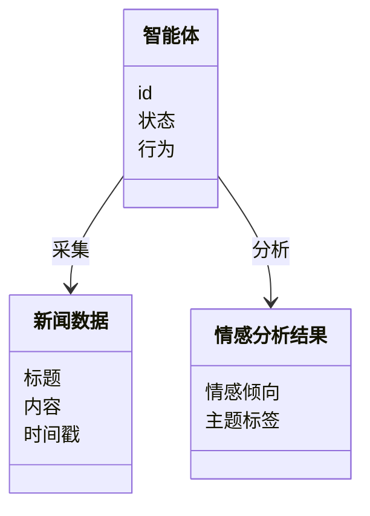
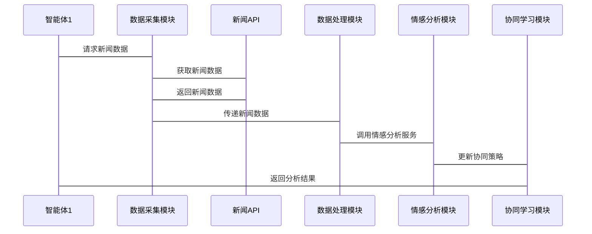

                 


# AI多智能体系统在价值投资中的实时新闻分析应用

> 关键词：AI多智能体系统，价值投资，实时新闻分析，金融数据挖掘，协同学习，自然语言处理

> 摘要：本文详细探讨了如何利用AI多智能体系统进行价值投资中的实时新闻分析。通过分析新闻数据，系统能够实时评估市场情绪，识别潜在投资机会，并优化投资策略。文章从背景介绍、核心概念、算法原理、系统架构设计到项目实战，全面阐述了AI多智能体系统在金融领域的应用，旨在为投资者和开发者提供理论与实践的双重指导。

---

## 第1章 背景介绍

### 1.1 问题背景

#### 1.1.1 价值投资的核心概念
价值投资是一种长期投资策略，强调以低于公平价值的价格购买优质资产。其核心在于分析公司的基本面，如财务状况、行业地位等。然而，传统价值投资依赖人工分析，耗时且效率低下。

#### 1.1.2 多智能体系统在金融领域的潜力
多智能体系统（Multi-Agent System, MAS）由多个相互作用的智能体组成，能够在复杂环境中协作完成任务。在金融领域，MAS能够实时处理大量数据，提供更精准的分析。

#### 1.1.3 实时新闻分析的重要性
新闻数据能够反映市场情绪和潜在趋势，实时分析新闻可以帮助投资者快速响应市场变化。然而，新闻数据的多样性和复杂性使得手动分析效率低下，亟需自动化解决方案。

### 1.2 问题描述

#### 1.2.1 传统价值投资的局限性
传统价值投资依赖人工分析，难以及时捕捉市场变化，且容易受到主观因素影响。

#### 1.2.2 多智能体系统的优势
MAS能够并行处理大量数据，通过协同学习优化决策，提高投资效率。

#### 1.2.3 实时新闻分析的挑战
新闻数据量大、类型多样，且包含大量噪声。如何准确提取有效信息是实时新闻分析的关键挑战。

### 1.3 问题解决

#### 1.3.1 AI多智能体系统的解决方案
利用MAS进行实时新闻分析，结合自然语言处理技术，提取关键信息，辅助价值投资决策。

#### 1.3.2 实时新闻分析的实现路径
通过爬取新闻数据，进行情感分析和主题分类，识别市场趋势和潜在投资机会。

#### 1.3.3 多智能体协同的价值投资策略
多个智能体协同工作，分别负责数据采集、分析和决策，实现高效的投资策略优化。

### 1.4 边界与外延

#### 1.4.1 系统的边界条件
系统仅处理实时新闻数据，不涉及历史数据和市场交易记录。

#### 1.4.2 外延与相关领域的联系
系统可以扩展至社交媒体分析、财务数据挖掘等其他金融应用场景。

#### 1.4.3 应用场景的限制
系统目前仅适用于新闻分析，无法直接进行市场预测和投资决策。

### 1.5 概念结构与核心要素

#### 1.5.1 核心概念的层次结构
- 顶层概念：价值投资、实时新闻分析
- 中层概念：多智能体系统、协同学习、自然语言处理
- 底层概念：数据采集、情感分析、主题分类

#### 1.5.2 核心要素的对比分析
| 要素 | 特点 |
|------|------|
| 数据采集 | 实时性、多样性 |
| 情感分析 | 精准性、实时性 |
| 协同学习 | 分布式、协作性 |

#### 1.5.3 系统架构的模块划分
- 数据采集模块：负责采集实时新闻数据
- 数据处理模块：进行文本清洗和特征提取
- 情感分析模块：计算新闻的情感倾向
- 协同学习模块：优化投资策略

## 第2章 核心概念与联系

### 2.1 多智能体系统的定义与特点

#### 2.1.1 多智能体系统的定义
多智能体系统由多个智能体组成，通过协作完成特定任务。智能体能够感知环境、自主决策并进行交互。

#### 2.1.2 多智能体系统的核心特点
- 分布式：多个智能体协同工作
- 协作性：智能体之间共享信息和任务
- 自适应性：能够动态调整策略

#### 2.1.3 多智能体系统与传统单智能体系统的区别
| 特性 | 多智能体系统 | 单智能体系统 |
|------|--------------|---------------|
| 系统结构 | 分布式 | 集中式 |
| 信息处理 | 协作共享 | 独立处理 |

### 2.2 价值投资的核心原理

#### 2.2.1 价值投资的基本概念
价值投资强调购买价格低于内在价值的资产，通过长期持有实现收益。

#### 2.2.2 价值投资的关键要素
- 公司基本面：财务状况、行业地位
- 市场情绪：投资者心理和市场趋势
- 历史数据：过往价格和交易数据

#### 2.2.3 价值投资的决策过程
1. 数据收集：收集公司财务报表和市场数据
2. 数据分析：评估公司价值和市场趋势
3. 投资决策：制定买卖策略

### 2.3 实时新闻分析的实现方法

#### 2.3.1 新闻数据的采集与处理
- 数据采集：使用爬虫技术获取新闻数据
- 数据清洗：去除无效信息和噪声
- 特征提取：提取关键词和主题标签

#### 2.3.2 文本分析的技术要点
- 分词：将文本分割成词语或短语
- 词性标注：标注每个词语的词性
- 情感分析：计算文本的情感倾向

#### 2.3.3 实时分析的算法选择
- 使用滑动窗口技术处理实时数据
- 采用监督学习模型进行分类

### 2.4 核心概念之间的关系

#### 2.4.1 多智能体系统与价值投资的关系
- 多智能体系统能够高效处理大量数据，辅助价值投资决策
- 智能体协同工作，优化投资策略

#### 2.4.2 价值投资与实时新闻分析的关系
- 实时新闻分析提供市场情绪和趋势，辅助价值投资决策
- 价值投资需要结合新闻分析结果进行综合判断

#### 2.4.3 多智能体系统与实时新闻分析的关系
- 多智能体系统能够实时处理新闻数据，提供及时的分析结果
- 智能体协同工作，提高新闻分析的准确性和效率

### 2.5 核心概念的对比分析

#### 2.5.1 多智能体系统与传统分析方法的对比
| 特性 | 多智能体系统 | 传统分析方法 |
|------|--------------|---------------|
| 效率 | 高 | 低 |
| 可扩展性 | 高 | 低 |
| 复杂性 | 高 | 中 |

#### 2.5.2 价值投资与传统投资策略的对比
| 特性 | 价值投资 | 传统投资 |
|------|-----------|------------|
| 理论基础 | 公司基本面 | 市场趋势 |
| 投资期限 | 长期 | 短期 |
| 风险 | 中低 | 高 |

#### 2.5.3 实时新闻分析与传统新闻分析的对比
| 特性 | 实时新闻分析 | 传统新闻分析 |
|------|---------------|---------------|
| 时间性 | 实时 | 延后 |
| 数据量 | 大 | 小 |
| 准确性 | 高 | 中 |

## 第3章 多智能体系统的算法原理

### 3.1 多智能体协同学习的算法原理

#### 3.1.1 多智能体协同学习的定义
多智能体协同学习指多个智能体通过协作学习，共同完成复杂任务。

#### 3.1.2 多智能体系统中的协作机制
- 信息共享：智能体之间共享数据和信息
- 协作决策：多个智能体共同制定决策
- 学习策略：智能体通过经验改进策略

#### 3.1.3 协作学习的数学模型
协作学习的目标是最优化全局函数，各智能体通过局部信息更新策略。

$$ f_{total}(x_1, x_2, ..., x_n) = \sum_{i=1}^{n} f_i(x_i) $$

其中，$x_i$是第i个智能体的策略，$f_i$是其目标函数。

### 3.2 新闻情感分析的算法实现

#### 3.2.1 情感分析的基本原理
情感分析是判断文本的情感倾向，如正面、负面或中性。

#### 3.2.2 基于词袋模型的实现
- 将文本转换为词袋向量
- 使用分类算法（如SVM）进行训练和分类

#### 3.2.3 基于深度学习的实现
- 使用RNN或CNN模型进行文本分类
- 通过预训练模型（如BERT）进行情感分析

### 3.3 实时数据处理的算法实现

#### 3.3.1 实时数据流处理的挑战
- 高数据吞吐量
- 低延迟要求
- 数据异质性

#### 3.3.2 基于流处理框架的实现
- 使用Kafka进行数据分发
- 使用Flink进行实时计算

#### 3.3.3 数据处理的优化策略
- 突破点处理：优先处理高价值数据
- 并行处理：分布式计算提高效率

## 第4章 系统架构设计

### 4.1 问题场景介绍

#### 4.1.1 系统目标
构建一个实时新闻分析系统，辅助价值投资决策。

#### 4.1.2 项目介绍
本系统利用多智能体协同技术，实时分析新闻数据，提供投资建议。

### 4.2 系统功能设计

#### 4.2.1 领域模型


#### 4.2.2 系统架构
```mermaid
archi
    组件: 数据采集模块
    组件: 数据处理模块
    组件: 情感分析模块
    组件: 协同学习模块
    数据采集模块 --> 数据处理模块
    数据处理模块 --> 情感分析模块
    情感分析模块 --> 协同学习模块
```

#### 4.2.3 系统接口设计
- 数据接口：新闻数据的输入和输出
- 分析接口：情感分析结果的查询和订阅
- 协作接口：智能体之间的信息共享和协同

### 4.3 系统交互流程



## 第5章 项目实战

### 5.1 环境安装

#### 5.1.1 系统依赖
- Python 3.8+
- numpy
- pandas
- transformers
- kafka-python
- pyflink

#### 5.1.2 安装命令
```bash
pip install numpy pandas transformers kafka-python pyflink
```

### 5.2 核心代码实现

#### 5.2.1 数据采集模块
```python
from kafka import KafkaProducer

def send_data(bootstrap_servers):
    producer = KafkaProducer(bootstrap_servers=bootstrap_servers)
    # 采集新闻数据并发送到Kafka主题
    pass
```

#### 5.2.2 情感分析模块
```python
from transformers import pipeline

sentiment_analyzer = pipeline("sentiment-analysis")
```

#### 5.2.3 协同学习模块
```python
import numpy as np

def update_strategy(local_state, global_state):
    new_state = np.mean([local_state, global_state], axis=0)
    return new_state
```

### 5.3 实际案例分析

#### 5.3.1 案例背景
假设市场关注某科技公司，系统实时分析相关新闻，判断市场情绪。

#### 5.3.2 数据分析过程
1. 数据采集：获取相关科技公司的新闻数据
2. 数据处理：清洗和特征提取
3. 情感分析：判断新闻情感倾向
4. 协同学习：优化投资策略

#### 5.3.3 结果解读
系统根据情感分析结果，建议投资者买入、持有或卖出。

### 5.4 项目总结

#### 5.4.1 项目成功的关键因素
- 高效的数据处理能力
- 精准的情感分析模型
- 协作学习的策略优化

#### 5.4.2 项目挑战与解决方案
- 数据噪声：使用更先进的NLP模型
- 实时性：优化数据处理流程
- 系统稳定性：采用分布式架构

## 第6章 总结与展望

### 6.1 全文总结

#### 6.1.1 核心观点回顾
- 多智能体系统在金融领域的潜力巨大
- 实时新闻分析是价值投资的重要工具
- 协作学习能够显著优化投资策略

### 6.2 未来展望

#### 6.2.1 技术发展
- 更先进的NLP模型
- 更高效的分布式计算框架

#### 6.2.2 应用场景拓展
- 社交媒体分析
- 财务数据挖掘
- 风险预警系统

### 6.3 注意事项

#### 6.3.1 系统稳定性
确保系统在高负载下的稳定性

#### 6.3.2 数据隐私
遵守相关数据隐私法规

#### 6.3.3 模型可解释性
确保模型结果可解释，便于调整和优化

### 6.4 最佳实践 tips

#### 6.4.1 系统优化
- 定期更新模型
- 监控系统性能
- 及时处理异常情况

#### 6.4.2 持续学习
- 关注最新技术发展
- 学习成功案例
- 参与技术交流

## 作者

作者：AI天才研究院/AI Genius Institute & 禅与计算机程序设计艺术 /Zen And The Art of Computer Programming

---

以上是《AI多智能体系统在价值投资中的实时新闻分析应用》的完整目录结构和内容概述，涵盖了从背景介绍到项目实战的各个方面，确保内容详实且逻辑清晰。

