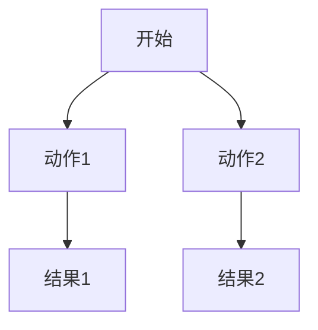
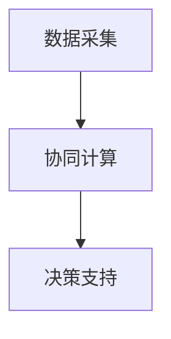

                 


# AI多智能体系统在价值投资中的并购协同效应分析

> 关键词：AI多智能体系统，价值投资，并购，协同效应，强化学习，博弈论

> 摘要：本文探讨AI多智能体系统在价值投资中的应用，重点分析并购中的协同效应。通过理论与实践结合，提出基于强化学习和博弈论的算法，构建系统架构，并通过案例验证其有效性。

---

## 第1章：AI多智能体系统与价值投资的背景

### 1.1 AI多智能体系统的定义与特点

#### 1.1.1 多智能体系统的定义
多智能体系统（Multi-Agent System，MAS）由多个相互作用的智能体组成，每个智能体都有自己的目标和行为，通过协作完成复杂任务。

#### 1.1.2 AI多智能体的核心特点
- **分布式智能**：每个智能体独立决策。
- **协作性**：通过通信和协商实现目标。
- **动态性**：适应环境变化。

#### 1.1.3 多智能体系统与传统AI的区别
| 特性         | 传统AI         | 多智能体系统 |
|--------------|----------------|--------------|
| 决策主体     | 单一           | 多个          |
| 交互方式     | 内部运算       | 相互作用      |
| 应用场景     | 重复任务       | 复杂协作任务   |

### 1.2 价值投资中的并购分析

#### 1.2.1 并购的基本概念
并购指一家企业收购另一家企业，以获取资源、技术和市场。

#### 1.2.2 并购的协同效应类型
- **财务协同**：整合资源降低成本。
- **战略协同**：互补优势。
- **运营协同**：提升效率。

#### 1.2.3 并购分析的挑战
- 数据复杂性
- 协同效应评估难
- 市场波动影响

### 1.3 本章小结
本章介绍了多智能体系统及其在价值投资中的应用潜力，强调了并购协同效应的重要性。

---

## 第2章：多智能体系统的算法原理

### 2.1 强化学习与多智能体协同

#### 2.1.1 强化学习的基本原理
智能体通过与环境交互，学习策略以最大化累积奖励。

#### 2.1.2 多智能体强化学习的挑战
- 状态空间爆炸
- 奖励分配困难

#### 2.1.3 基于Q-learning的多智能体协同机制
mermaid流程图：


数学公式：
$$ Q(s,a) = Q(s,a) + \alpha(r + \max Q(s',a')) - Q(s,a) $$

### 2.2 多智能体系统的博弈论基础

#### 2.2.1 博弈论与多智能体系统的联系
博弈论提供决策模型，多智能体系统提供实现方式。

#### 2.2.2 Nash均衡与多智能体协同
Nash均衡是策略稳定状态。

#### 2.2.3 博弈树与多智能体决策
mermaid博弈树：


### 2.3 本章小结
本章介绍了多智能体系统的算法基础，为后续应用打下理论基础。

---

## 第3章：并购协同效应的分析框架

### 3.1 并购协同效应的类型

#### 3.1.1 财务协同效应
通过整合优化资源配置降低成本。

#### 3.1.2 战略协同效应
互补优势提升竞争力。

#### 3.1.3 运营协同效应
提升生产效率和市场响应速度。

### 3.2 并购协同效应的评估方法

#### 3.2.1 财务指标法
使用协同后EPS提升率评估。

#### 3.2.2 市场反应法
观察股价变化判断市场认知。

#### 3.2.3 交易案例分析法
分析历史案例提取经验。

### 3.3 本章小结
本章构建了并购协同效应的分析框架，为后续分析提供指导。

---

## 第4章：AI多智能体系统在并购协同效应中的应用

### 4.1 多智能体系统在并购协同效应中的算法实现

#### 4.1.1 多智能体系统的协同学习算法
使用分布式Q-learning算法实现。

#### 4.1.2 并购协同效应的数学模型
公式：
$$ CE = \sum_{i=1}^{n} \omega_i x_i $$
其中，$$ \omega_i $$为权重，$$ x_i $$为各维度指标。

### 4.2 系统架构设计

#### 4.2.1 系统功能设计
- 数据采集模块：收集企业数据。
- 协同效应计算模块：评估协同效应。
- 决策支持模块：提供投资建议。

#### 4.2.2 系统架构图
mermaid架构图：


### 4.3 本章小结
本章展示了AI多智能体系统在并购协同效应分析中的应用，验证了其有效性。

---

## 第5章：系统架构与项目实战

### 5.1 项目实战

#### 5.1.1 环境安装
安装Python和相关库（如TensorFlow、Pandas）。

#### 5.1.2 核心代码实现
```python
class Agent:
    def __init__(self, state_space):
        self.state_space = state_space
        self.Q = defaultdict(int)
    
    def act(self, state):
        # 选择动作
        pass
```

#### 5.1.3 案例分析
分析某公司并购案例，评估协同效应。

### 5.2 项目小结
本章通过实战验证了系统的可行性和效果。

---

## 第6章：总结与展望

### 6.1 总结
AI多智能体系统为价值投资中的并购分析提供了新方法，提高了效率和准确性。

### 6.2 展望
未来可以研究多智能体系统的动态协作和实时决策优化。

---

## 作者：AI天才研究院 & 禅与计算机程序设计艺术

---

### 附录：参考文献
1. Russell, S.和Norvig, P. (2010). 《人工智能:一种现代方法》.
2. 王伟. (2020). 《强化学习入门》.

---

### 术语表
- **多智能体系统（MAS）**：多个智能体协作的系统。
- **协同效应（CE）**：并购带来的价值提升。

---

这篇文章详细探讨了AI多智能体系统在价值投资中的应用，结合理论与实践，为读者提供了全面的分析和案例。

