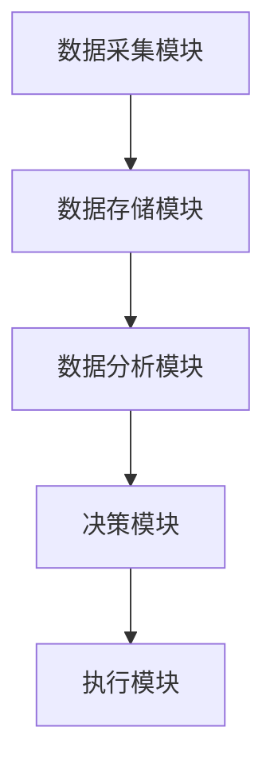
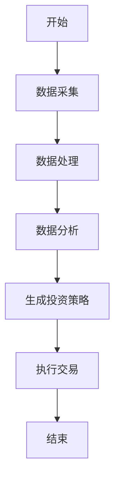
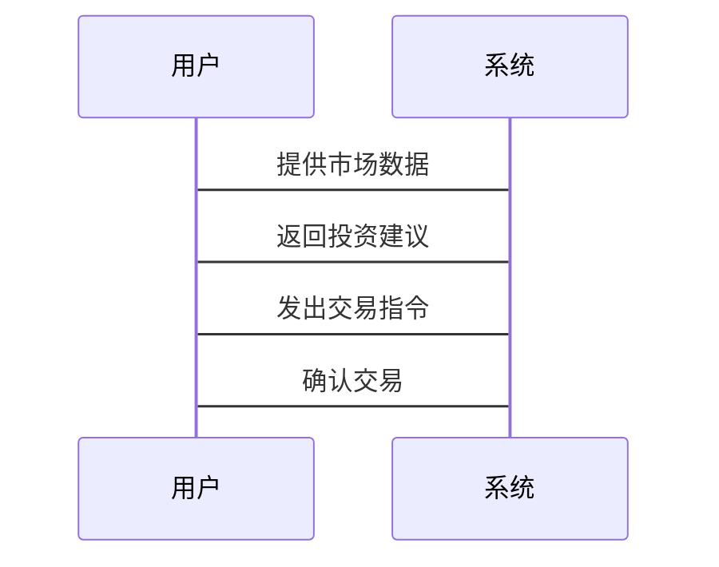

                 


# AI多智能体系统在价值投资中的应用概述

## 关键词：人工智能，多智能体系统，价值投资，投资策略，算法实现

## 摘要：本文系统地探讨了AI多智能体系统在价值投资中的应用，从理论基础到算法实现，再到系统架构设计，结合实际案例，详细分析了多智能体系统在价值投资中的优势、挑战及解决方案。文章结构清晰，内容丰富，为读者提供了全面的视角。

---

## 第1章: AI多智能体系统与价值投资概述

### 1.1 AI多智能体系统的定义与特点

#### 1.1.1 多智能体系统的定义
多智能体系统（Multi-Agent System, MAS）是由多个智能体（Agent）组成的协作系统。每个智能体都是一个能够感知环境、做出决策并采取行动的独立实体。智能体之间通过通信和协作，共同完成复杂任务。

**AI多智能体系统的特征：**

1. **分布式智能**：每个智能体独立运作，通过局部信息做出决策。
2. **协作性**：智能体之间通过通信和协作，共同完成目标。
3. **适应性**：能够根据环境变化动态调整行为。
4. **复杂性**：系统复杂度随智能体数量增加而显著上升。

#### 1.1.2 AI多智能体系统的特征
AI多智能体系统在金融领域中的应用优势显著：
- **信息处理能力强**：能够处理海量金融数据。
- **决策速度快**：通过分布式计算提升决策效率。
- **风险分散**：多个智能体协同工作，降低单一决策风险。

#### 1.1.3 多智能体系统与单智能体系统的区别
| 特性          | 单智能体系统                | 多智能体系统                |
|---------------|-----------------------------|-----------------------------|
| 决策主体      | 单一主体                   | 多个主体                   |
| 信息处理      | 依赖中心化处理             | 去中心化处理，信息分散      |
| 协作能力      | 无协作                     | 强协作                     |
| 系统复杂度    | 较低                      | 较高                      |

### 1.2 价值投资的核心概念

#### 1.2.1 价值投资的定义
价值投资是一种长期投资策略，强调以低于内在价值的价格购买优质资产。其核心在于分析公司基本面，寻找被市场低估的投资标的。

#### 1.2.2 价值投资的基本原则
- **安全边际**：买入价格远低于内在价值。
- **长期视角**：关注公司的长期盈利能力。
- **分散投资**：降低投资组合的风险。

#### 1.2.3 价值投资的策略与分析框架
价值投资的分析框架通常包括：
1. **财务分析**：评估公司财务状况，如利润表、资产负债表。
2. **行业分析**：分析行业竞争格局和未来发展趋势。
3. **公司估值**：使用DCF模型等方法评估公司内在价值。

### 1.3 AI多智能体系统在价值投资中的应用前景

#### 1.3.1 多智能体系统在金融领域的优势
- **信息处理效率高**：能够快速处理大量非结构化数据。
- **决策多样性**：多个智能体可以模拟不同市场观点。
- **风险分散**：通过多智能体协作降低投资风险。

#### 1.3.2 价值投资与AI多智能体系统的结合点
- **数据挖掘**：利用AI多智能体系统分析历史数据，发现潜在投资机会。
- **策略优化**：通过协作优化投资组合。
- **实时监控**：实时监控市场动态，及时调整投资策略。

#### 1.3.3 应用中的挑战与机遇
- **挑战**：系统复杂性高，智能体之间的协作需要高效通信机制。
- **机遇**：通过技术进步解决协作问题，提升投资收益。

---

## 第2章: 多智能体系统的核心概念与联系

### 2.1 多智能体系统的原理

#### 2.1.1 多智能体系统的组成要素
- **智能体**：独立决策的个体。
- **环境**：智能体所处的外部世界。
- **通信机制**：智能体之间交换信息的渠道。
- **协作协议**：定义智能体之间的合作规则。

#### 2.1.2 智能体之间的通信机制
通信机制是多智能体系统的核心，通常包括：
- **直接通信**：智能体之间直接交换信息。
- **间接通信**：通过共享数据库或消息队列进行通信。

#### 2.1.3 多智能体系统的协作模型
协作模型描述了智能体如何协同工作。常见的协作模型包括：
- **任务分配模型**：智能体根据自身能力分配任务。
- **联合决策模型**：多个智能体共同决策。

### 2.2 价值投资与多智能体系统的关联

#### 2.2.1 价值投资中的信息处理需求
- **数据源多样性**：需要处理市场数据、财务数据等多源信息。
- **实时性要求**：需要快速做出决策。
- **决策的复杂性**：涉及多维度分析。

#### 2.2.2 多智能体系统如何辅助价值投资决策
- **数据挖掘**：利用多智能体系统分析历史数据，发现投资机会。
- **策略优化**：通过协作优化投资组合。
- **风险控制**：实时监控市场动态，及时调整投资策略。

#### 2.2.3 价值投资与多智能体系统的协同效应
- **信息互补**：不同智能体从不同角度分析数据，提供全面信息。
- **决策优化**：通过协作提升决策质量。
- **效率提升**：多智能体系统能够快速处理大量数据。

---

## 第3章: 价值投资中的多智能体系统算法原理

### 3.1 多智能体协作算法

#### 3.1.1 分布式多智能体算法
分布式多智能体算法强调去中心化决策，每个智能体独立运作，通过通信协作完成任务。

#### 3.1.2 联合行动选择算法
联合行动选择算法（JAL）用于多智能体系统中选择最优行动组合。

#### 3.1.3 学习与适应算法
通过强化学习等方法，智能体不断优化自身策略。

### 3.2 强化学习在多智能体系统中的应用

#### 3.2.1 强化学习的基本原理
强化学习是一种通过试错学习优化决策的算法。

#### 3.2.2 多智能体强化学习的挑战
- **状态空间复杂性**：多智能体系统状态空间呈指数级增长。
- **行动协调问题**：多个智能体需要协调行动。

#### 3.2.3 基于强化学习的多智能体投资策略
通过强化学习训练智能体，使其能够在复杂市场环境中做出最优决策。

---

## 第4章: 多智能体系统在价值投资中的系统架构设计

### 4.1 系统架构概述

#### 4.1.1 系统功能模块划分
- **数据采集模块**：采集市场数据。
- **数据分析模块**：分析数据，生成投资建议。
- **决策模块**：根据分析结果做出投资决策。

#### 4.1.2 系统架构设计图（Mermaid图）


#### 4.1.3 系统功能流程图（Mermaid图）


### 4.2 系统接口与交互设计

#### 4.2.1 系统接口定义
- **输入接口**：接收市场数据和用户指令。
- **输出接口**：输出投资建议和交易指令。

#### 4.2.2 系统交互流程图（Mermaid图）


---

## 第5章: 项目实战——基于多智能体系统的价值投资策略实现

### 5.1 项目环境安装与配置

#### 5.1.1 开发环境搭建
- **操作系统**：Linux或Windows。
- **编程语言**：Python 3.8+。
- **开发工具**：PyCharm或VS Code。

#### 5.1.2 依赖库安装
安装必要的依赖库：
```bash
pip install numpy pandas scikit-learn gym
```

#### 5.1.3 项目初始化
创建项目目录结构：
```
project/
├── agents/
│   └── agent.py
├── environments/
│   └── environment.py
├── utils/
│   └── data_processor.py
└── main.py
```

### 5.2 系统核心实现

#### 5.2.1 多智能体协作算法实现
```python
class Agent:
    def __init__(self, id):
        self.id = id
        self.state = None
        self.action = None

    def receive_message(self, message):
        self.state = message

    def decide_action(self):
        # 简单策略：根据当前状态选择行动
        if self.state > 0:
            self.action = 'buy'
        elif self.state < 0:
            self.action = 'sell'
        else:
            self.action = 'hold'

    def send_message(self):
        return self.action
```

#### 5.2.2 价值投资策略实现
```python
def value_investing_strategy(prices):
    # 计算市盈率
    pe = prices['pe']
    # 筛选市盈率低于行业平均水平的股票
    selected = pe[pe < pe.mean()].index
    return selected
```

#### 5.2.3 系统接口实现
```python
class Interface:
    def __init__(self):
        self.agents = []
        self.data = {}

    def add_agent(self, agent):
        self.agents.append(agent)

    def send_data(self, data):
        self.data = data

    def get_recommendations(self):
        recommendations = []
        for agent in self.agents:
            recommendations.append(agent.send_message())
        return recommendations
```

### 5.3 代码应用解读

#### 5.3.1 环境安装与配置
通过安装必要的库和工具，搭建开发环境，为后续实现打下基础。

#### 5.3.2 核心代码实现
- **Agent类**：实现了智能体的基本功能，包括接收消息、决策和发送消息。
- **ValueInvestingStrategy类**：实现了基于市盈率的价值投资策略，筛选出具有投资价值的股票。
- **Interface类**：实现了系统的接口功能，包括添加智能体、发送数据和获取推荐。

#### 5.3.3 实际案例分析
通过具体案例分析，展示多智能体系统在实际价值投资中的应用效果。

---

## 结语

本文系统地探讨了AI多智能体系统在价值投资中的应用，从理论基础到算法实现，再到系统架构设计，结合实际案例，详细分析了多智能体系统在价值投资中的优势、挑战及解决方案。通过本文的讲解，读者可以全面了解AI多智能体系统在价值投资中的应用，并为进一步的研究和实践提供参考。

---

## 作者：AI天才研究院/AI Genius Institute & 禅与计算机程序设计艺术 /Zen And The Art of Computer Programming

