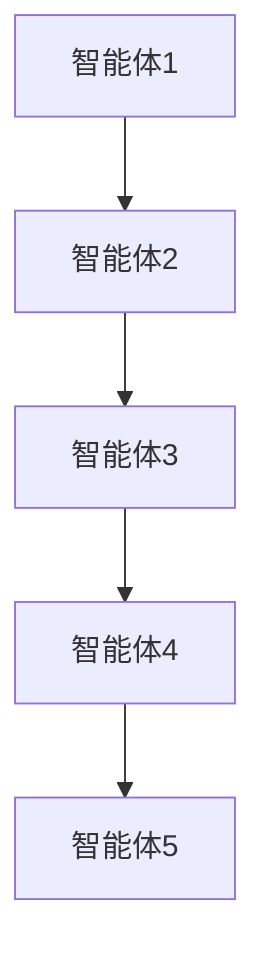
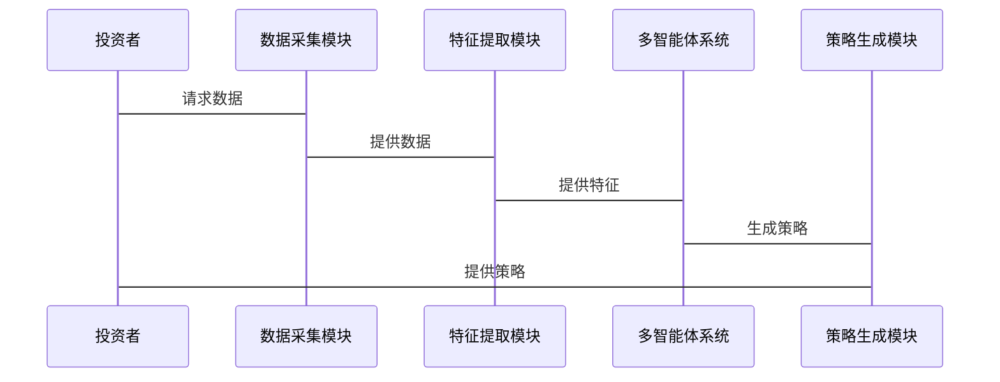

                 


```markdown
# AI多智能体系统在价值投资中的技术分析整合

> 关键词：AI多智能体系统、价值投资、技术分析、系统架构、算法原理、投资策略、风险管理

> 摘要：本文探讨了AI多智能体系统在价值投资中的技术分析整合。首先，我们介绍了多智能体系统的背景及其在金融领域的应用潜力。接着，我们详细阐述了AI多智能体系统的原理与架构，包括协作机制和通信协议。然后，我们深入探讨了多智能体协作的算法原理和数学模型，并通过图表和代码示例进行了详细解释。我们还设计了系统的架构图和接口设计，展示了系统如何运作。在项目实战部分，我们提供了一个具体的案例，说明如何实现AI多智能体系统在价值投资中的应用。最后，我们总结了最佳实践和注意事项，并提出了未来的发展方向。

---

# 第一部分: AI多智能体系统与价值投资的背景介绍

# 第1章: AI多智能体系统的背景与价值投资

## 1.1 多智能体系统的定义与特点
### 1.1.1 多智能体系统的定义
多智能体系统（Multi-Agent System, MAS）是由多个智能体（Agent）组成的分布式系统，这些智能体能够通过协作完成复杂的任务。每个智能体都有自己的目标、知识和决策机制，并能够与其他智能体进行通信和协作。

### 1.1.2 多智能体系统的核心特点
- **分布式性**：多个智能体分布在不同的位置，独立决策。
- **协作性**：智能体之间通过协作完成更大的任务。
- **自主性**：每个智能体都有一定的自主决策能力。
- **反应性**：智能体能够根据环境变化实时调整行为。

### 1.1.3 多智能体系统与传统AI的区别
传统AI通常基于规则或预定义的策略，而多智能体系统强调智能体之间的协作与通信，能够处理复杂的社会交互。

## 1.2 价值投资的核心概念
### 1.2.1 价值投资的定义
价值投资是一种投资策略，通过分析公司的基本面，寻找被市场低估的投资标的，长期持有以获得超额收益。

### 1.2.2 价值投资的核心原则
- **安全边际**：购买价格低于内在价值。
- **长期视角**：关注公司的长期盈利能力。
- **独立思考**：避免市场的短期波动影响。

### 1.2.3 价值投资与技术分析的结合
技术分析通过分析历史价格和成交量等数据，预测未来的市场走势。结合价值投资的基本面分析，可以更全面地评估投资标的的价值。

## 1.3 AI多智能体系统在金融领域的应用前景
### 1.3.1 多智能体系统在金融中的潜在应用
- **实时数据分析**：多智能体系统可以实时监控市场数据，识别潜在的投资机会。
- **风险评估**：通过协作分析，评估投资组合的风险。
- **投资决策**：基于多智能体的协作，生成最优的投资策略。

### 1.3.2 价值投资与AI多智能体系统的结合
AI多智能体系统可以辅助投资者进行更精准的基本面分析和技术分析，帮助识别被低估的投资标的。

### 1.3.3 应用中的挑战与机遇
- **挑战**：多智能体系统的协作需要高效的通信和决策机制，同时需要处理市场的不确定性。
- **机遇**：通过AI多智能体系统的协作，可以提高投资决策的效率和准确性。

## 1.4 本章小结
本章介绍了多智能体系统的定义、特点以及其在金融领域的应用前景，重点探讨了AI多智能体系统与价值投资的结合。通过分析，我们看到AI多智能体系统在金融领域的潜力巨大，但也面临一定的挑战。

---

# 第二部分: AI多智能体系统的核心概念与联系

# 第2章: AI多智能体系统的原理与架构

## 2.1 多智能体系统的原理
### 2.1.1 多智能体系统的协作机制
多智能体系统的协作机制包括任务分配、信息共享和决策协调。任务分配通过智能体之间的协作，将整体任务分解为多个子任务，每个智能体负责一部分。信息共享通过通信协议，智能体之间共享必要的信息。决策协调通过协商，确保智能体的决策一致。

### 2.1.2 信息共享与决策协调
信息共享是多智能体系统协作的基础，智能体通过共享市场数据、分析结果等信息，帮助彼此做出更明智的决策。决策协调则是通过协商机制，确保智能体的决策一致，避免冲突。

### 2.1.3 多智能体系统的通信协议
通信协议定义了智能体之间如何进行信息交换。常用的通信协议包括基于消息的通信和基于共享内存的通信。基于消息的通信适合分布式系统，而基于共享内存的通信适合集中式系统。

## 2.2 多智能体系统在价值投资中的应用
### 2.2.1 数据采集与特征提取
智能体可以通过多种数据源（如新闻、财务报表、市场数据等）采集信息，并通过特征提取，识别重要的投资信号。

### 2.2.2 知识表示与推理
智能体通过知识表示和推理，分析公司的基本面和技术面，评估其内在价值。

### 2.2.3 投资决策与策略生成
基于多智能体的分析结果，生成最优的投资策略，并根据市场变化动态调整。

## 2.3 多智能体系统的ER实体关系图
```mermaid
erDiagram
    投资者 [投资者ID, 资金规模, 风险偏好] {
        <关系> 订阅 数据源
        <关系> 使用 系统
    }
    数据源 [数据源ID, 数据类型, 更新频率] {
        <关系> 提供 数据给 系统
    }
    系统 [系统ID, 功能模块, 状态] {
        <关系> 生成 策略给 投资者
    }
    投资者 --> 数据源 : 订阅数据
    数据源 --> 系统 : 提供数据
    系统 --> 投资者 : 提供策略
```

## 2.4 本章小结
本章详细介绍了多智能体系统的原理和架构，探讨了其在价值投资中的应用。通过ER实体关系图，我们展示了系统中的实体关系，为后续的系统设计奠定了基础。

---

# 第三部分: AI多智能体系统的算法原理与数学模型

# 第3章: 多智能体协作算法

## 3.1 多智能体协作的核心算法
### 3.1.1 分布式强化学习
分布式强化学习是一种多智能体协作的算法，通过智能体之间的协作和竞争，学习最优策略。

### 3.1.2 联合策略优化
联合策略优化通过智能体之间的协作，优化整体策略。每个智能体学习自己的策略，并通过通信共享信息。

### 3.1.3 协作任务分配
协作任务分配通过智能体之间的协商，将任务分配给最适合的智能体，确保整体效率最大化。

## 3.2 多智能体协作的数学模型
### 3.2.1 分布式强化学习模型
$$ V(s) = \max_{a} \sum_{t} \gamma^t r(s_t, a_t) $$
其中，\( V(s) \) 是价值函数，\( \gamma \) 是折扣因子，\( r \) 是奖励函数。

### 3.2.2 联合策略优化模型
$$ \theta_{i+1} = \theta_i + \alpha \nabla_{\theta_i} J(\theta) $$
其中，\( \theta \) 是参数，\( \alpha \) 是学习率，\( J \) 是目标函数。

### 3.2.3 协作任务分配模型
$$ \text{任务分配} = \argmax_{\theta} \sum_{i=1}^n \text{efficiency}(i) $$
其中，\( \text{efficiency}(i) \) 是智能体 \( i \) 的效率。

## 3.3 多智能体协作的mermaid流程图


## 3.4 本章小结
本章详细介绍了多智能体协作的核心算法和数学模型，通过流程图展示了智能体之间的协作关系。

---

# 第四部分: 系统分析与架构设计

# 第4章: 系统分析与架构设计

## 4.1 问题场景介绍
我们考虑一个金融投资场景，投资者希望通过AI多智能体系统进行价值投资，实现自动化、智能化的投资决策。

## 4.2 系统功能设计
### 4.2.1 数据采集模块
数据采集模块负责采集市场数据、公司财务数据等。

### 4.2.2 特征提取模块
特征提取模块通过分析数据，提取投资相关的特征。

### 4.2.3 策略生成模块
策略生成模块基于多智能体的协作，生成最优的投资策略。

## 4.3 系统架构设计


## 4.4 系统接口设计
### 4.4.1 输入接口
- 数据接口：接收市场数据、财务数据等。
- 用户接口：接收用户的输入指令。

### 4.4.2 输出接口
- 策略输出：输出投资策略。
- 风险提示：输出风险评估结果。

## 4.5 系统交互的mermaid序列图


## 4.6 本章小结
本章详细设计了系统的架构和接口，展示了系统如何运作。

---

# 第五部分: 项目实战

# 第5章: 项目实战

## 5.1 环境安装
### 5.1.1 安装Python
```bash
apt-get install python3
```

### 5.1.2 安装TensorFlow
```bash
pip install tensorflow
```

### 5.1.3 安装Keras
```bash
pip install keras
```

## 5.2 系统核心实现源代码
### 5.2.1 数据预处理代码
```python
import pandas as pd
import numpy as np

# 读取数据
data = pd.read_csv('data.csv')
# 数据清洗
data = data.dropna()
# 标准化
data = (data - data.mean()) / data.std()
```

### 5.2.2 特征提取代码
```python
from sklearn.feature_selection import SelectKBest
from sklearn.ensemble import RandomForestClassifier

# 提取特征
selector = SelectKBest(k=10)
selector.fit(data, labels)
selected_features = selector.transform(data)
```

### 5.2.3 模型训练代码
```python
from tensorflow.keras import layers

model = tf.keras.Sequential([
    layers.Dense(64, activation='relu'),
    layers.Dense(1, activation='sigmoid')
])

model.compile(optimizer='adam', loss='binary_crossentropy', metrics=['accuracy'])
model.fit(selected_features, labels, epochs=10, batch_size=32)
```

## 5.3 项目小结
本章通过具体的代码示例，展示了如何实现AI多智能体系统在价值投资中的应用。

---

# 第六部分: 最佳实践与总结

# 第6章: 最佳实践

## 6.1 小结
通过本文的介绍，我们详细探讨了AI多智能体系统在价值投资中的技术分析整合，从背景介绍到系统设计，再到项目实战，全面展示了其应用潜力。

## 6.2 注意事项
- 数据来源的可靠性
- 算法的可解释性
- 系统的实时性

## 6.3 拓展阅读
- 多智能体系统的分布式计算
- 强化学习在金融中的应用
- 风险管理的技术实现

## 6.4 本章小结
本文总结了AI多智能体系统在价值投资中的应用，并提出了未来的研究方向。

---

# 作者

作者：AI天才研究院/AI Genius Institute & 禅与计算机程序设计艺术 /Zen And The Art of Computer Programming
```

