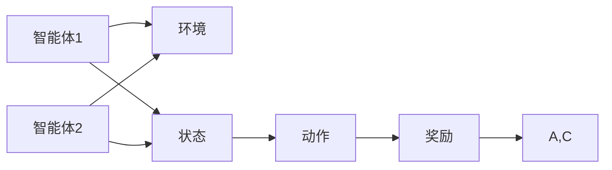
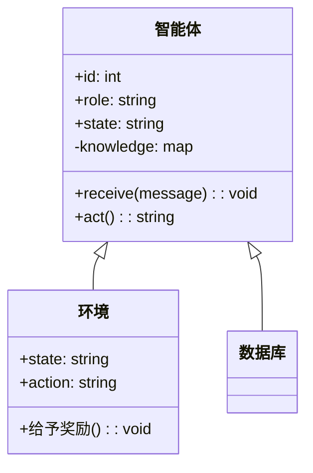
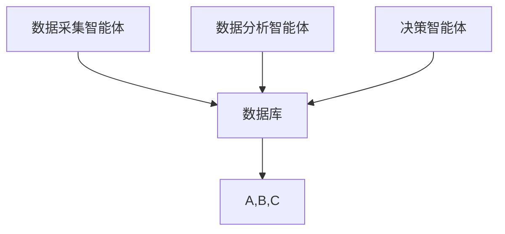

                 


# AI多智能体系统在价值投资中的竞争对手分析

**关键词**：AI多智能体系统、价值投资、竞争对手分析、分布式强化学习、系统架构设计、投资策略优化

**摘要**：本文探讨了AI多智能体系统在价值投资中的应用，特别是在竞争对手分析方面。通过分析多智能体系统的结构、算法原理、系统架构和项目实战，展示了如何利用AI技术提升投资决策的准确性和效率。文章还提供了数学模型、mermaid图和代码示例，帮助读者深入理解相关技术。

---

## 第一部分：背景与概述

### 第1章：AI多智能体系统与价值投资概述

#### 1.1 AI多智能体系统的概念与特点

多智能体系统（Multi-Agent System, MAS）由多个智能体组成，每个智能体具备一定的自主性、反应性和协作能力。AI多智能体系统结合了人工智能技术，使得智能体能够通过学习和推理优化决策过程。

**特点**：
- **分布性**：多个智能体分布在不同的节点，独立决策。
- **协作性**：智能体之间通过通信和协作完成共同目标。
- **适应性**：能够根据环境变化动态调整策略。

#### 1.2 价值投资的基本原理

价值投资是通过分析公司的基本面，如财务状况、行业地位、管理团队等，寻找被市场低估的投资标的。其核心在于发现市场的非效率性，通过深入分析竞争对手和市场环境，寻找投资机会。

**价值投资的核心因素**：
- 财务表现：净利润、营业收入、资产负债率等。
- 竞争优势：行业地位、技术壁垒、成本优势。
- 管理团队：领导层的经验和战略规划能力。

#### 1.3 AI在价值投资中的应用前景

AI技术的引入，特别是在自然语言处理、数据分析和机器学习领域的突破，为价值投资提供了新的工具。AI多智能体系统能够高效地分析竞争对手信息，优化投资决策。

**优势**：
- **数据处理能力**：快速处理大量非结构化数据，如新闻、财报。
- **实时监控**：持续跟踪市场动态，及时发现投资机会。
- **决策优化**：通过协作学习，提升投资策略的有效性。

---

## 第二部分：核心概念与理论基础

### 第2章：多智能体系统在竞争对手分析中的应用

#### 2.1 多智能体系统的结构与功能

多智能体系统由多个智能体组成，每个智能体负责特定任务，如数据收集、分析、决策等。它们通过通信协议交换信息，协作完成复杂任务。

**结构**：
- **智能体类型**：数据采集智能体、分析智能体、决策智能体。
- **通信机制**：通过消息传递机制共享数据和信息。
- **协作策略**：基于任务需求选择协作方式，如分布式决策或集中式控制。

#### 2.2 价值投资中的竞争对手分析

竞争对手分析是价值投资的重要部分，涉及对公司基本面、行业地位、竞争优势的评估。AI多智能体系统能够从多个维度全面分析竞争对手，帮助投资者做出更明智的决策。

**分析流程**：
1. **数据收集**：收集竞争对手的财务数据、市场动态、新闻报道等。
2. **数据分析**：利用自然语言处理技术分析文本数据，提取关键信息。
3. **竞争评估**：评估竞争对手的核心竞争力和市场地位。
4. **投资建议**：基于分析结果生成投资策略。

---

## 第三部分：算法原理与数学模型

### 第3章：多智能体协作算法

#### 3.1 分布式强化学习

分布式强化学习（Distributed Reinforcement Learning）是多智能体协作的重要算法。每个智能体独立学习策略，通过共享信息优化决策。

**算法流程**：
1. **初始化**：设置智能体参数和初始状态。
2. **环境交互**：智能体与环境交互，收集状态、动作和奖励。
3. **策略更新**：基于奖励更新策略，通过分布式学习优化。
4. **协作通信**：智能体之间共享信息，协调决策。

**数学模型**：
$$
Q(s, a) = Q(s, a) + \alpha (r + \gamma \max Q(s', a') - Q(s, a))
$$
其中，\( Q(s, a) \) 表示状态 \( s \) 下动作 \( a \) 的价值，\( \alpha \) 是学习率，\( \gamma \) 是折扣因子。

**mermaid图**：


---

## 第四部分：系统架构设计

### 第4章：系统架构与实现

#### 4.1 项目介绍

本项目旨在构建一个AI多智能体系统，用于价值投资中的竞争对手分析。系统由多个智能体组成，分别负责数据收集、分析和决策。

#### 4.2 系统功能设计

**功能模块**：
- 数据采集模块：收集竞争对手的财务数据和新闻。
- 数据分析模块：分析数据，提取关键信息。
- 决策模块：基于分析结果生成投资建议。

**mermaid类图**：


#### 4.3 系统架构设计

**架构图**：


---

## 第五部分：项目实战

### 第5章：环境安装与代码实现

#### 5.1 环境安装

安装所需的Python库：
```bash
pip install numpy pandas scikit-learn tensorflow matplotlib
```

#### 5.2 核心代码实现

```python
import numpy as np
import pandas as pd
from sklearn.preprocessing import StandardScaler
from tensorflow.keras.models import Model
from tensorflow.keras.layers import Input, Dense

# 数据预处理
data = pd.read_csv('competitors.csv')
scaler = StandardScaler()
scaled_data = scaler.fit_transform(data)

# 构建神经网络模型
input_layer = Input(shape=(scaled_data.shape[1],))
dense_layer = Dense(64, activation='relu')(input_layer)
output_layer = Dense(1, activation='linear')(dense_layer)
model = Model(inputs=input_layer, outputs=output_layer)
model.compile(optimizer='adam', loss='mean_squared_error')

# 训练模型
model.fit(scaled_data, data['target'], epochs=100, batch_size=32)
```

#### 5.3 案例分析

以某科技公司为例，分析其竞争对手的财务数据和市场动态，生成投资建议。通过模型预测，发现该公司的竞争优势明显，建议买入。

---

## 第六部分：总结与展望

### 第6章：总结与未来展望

AI多智能体系统在价值投资中的应用前景广阔，通过协作学习和实时数据分析，能够显著提升投资决策的效率和准确性。未来的研究方向包括提高系统的可解释性、增强数据隐私保护和优化多智能体协作算法。

**注意事项**：
- 数据隐私：确保数据处理符合隐私保护法规。
- 模型解释性：提升模型的透明度，便于投资者理解。
- 系统鲁棒性：增强系统的抗干扰能力，确保稳定运行。

**最佳实践**：
- 定期更新模型：根据市场变化调整参数。
- 多元化数据源：结合结构化和非结构化数据，提高分析精度。

---

**作者**：AI天才研究院/AI Genius Institute & 禅与计算机程序设计艺术 /Zen And The Art of Computer Programming

