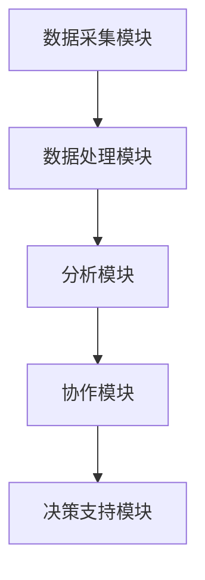
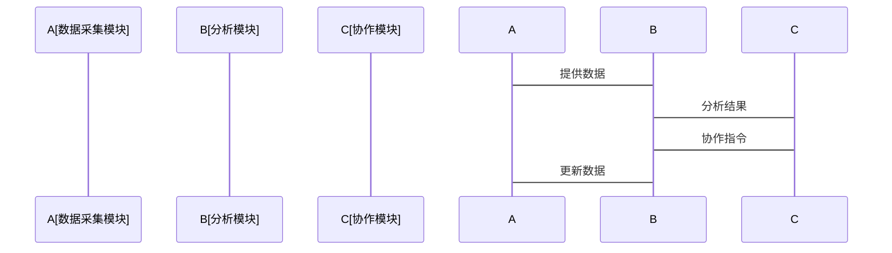

                 


# AI多智能体系统如何改进传统的价值投资尽职调查流程

## 关键词：AI多智能体系统，价值投资，尽职调查流程，分布式计算，协作算法，金融分析，投资决策支持

## 摘要：  
本文探讨了AI多智能体系统如何改进传统的价值投资尽职调查流程。通过分析多智能体系统的协作机制、算法原理和系统架构，本文详细阐述了其在金融领域的应用潜力。结合实际案例，展示了如何利用AI多智能体系统提高信息收集的全面性、优化分析效率与准确性，并减少人为判断的偏差。文章最后总结了当前研究成果，并展望了未来的发展方向。

---

# 第一部分: AI多智能体系统与价值投资尽职调查的背景与概念

## 第1章: AI多智能体系统的概念与核心原理

### 1.1 多智能体系统的定义与特点

#### 1.1.1 多智能体系统的定义  
多智能体系统（Multi-Agent System, MAS）是由多个智能体（Agent）组成的分布式系统，每个智能体都是一个能够感知环境、自主决策并执行任务的实体。这些智能体通过通信和协作完成复杂的任务，共同实现系统目标。

#### 1.1.2 多智能体系统的核心特点  
- **分布式性**：多个智能体独立运行，分布在网络的各个节点上。  
- **协作性**：智能体之间通过通信和协作完成共同目标。  
- **自治性**：每个智能体都具有自主决策的能力，无需外部干预。  
- **动态性**：系统能够适应环境的变化，实时调整策略。  

#### 1.1.3 多智能体系统与单智能体系统的区别  
| 特性         | 单智能体系统         | 多智能体系统         |
|--------------|----------------------|----------------------|
| 结构         | 单一结构             | 分布式结构           |
| 决策         | 中央决策             | 分散决策             |
| 信息处理     | 单点处理             | 多点协作             |
| 灵活性       | 较低                 | 较高                 |

### 1.2 多智能体系统的协作机制

#### 1.2.1 分布式协作的基本原理  
多智能体系统的协作基于通信和信息共享。智能体通过发送消息、交换数据和协调任务来实现协作。例如，在价值投资中，不同的智能体可以负责收集财务数据、市场分析和行业趋势。

#### 1.2.2 通信协议与信息交换  
智能体之间的通信需要遵循特定的协议，如基于消息队列的通信机制。信息交换可以采用基于JSON或XML的格式，确保数据的准确性和一致性。

#### 1.2.3 协作任务分配与资源管理  
任务分配是多智能体系统的核心问题。常见的任务分配算法包括基于规则的分配和基于优化的分配。资源管理则涉及计算资源的分配和负载均衡。

### 1.3 多智能体系统的应用场景

#### 1.3.1 金融领域的应用潜力  
多智能体系统在金融领域的应用包括股票预测、风险评估和投资组合优化。在价值投资中，智能体可以实时监控市场动态，提供数据支持。

#### 1.3.2 价值投资与尽职调查的核心挑战  
传统尽职调查流程存在信息收集片面、分析效率低和人为判断偏差的问题。多智能体系统能够通过分布式计算和协作优化这些问题。

#### 1.3.3 多智能体系统在尽职调查中的独特优势  
多智能体系统通过并行处理和协作机制，显著提高了信息处理效率和分析准确性。同时，智能体之间的分工合作减少了人为错误。

---

## 第2章: 传统价值投资尽职调查的痛点与改进方向

### 2.1 传统尽职调查流程的局限性

#### 2.1.1 信息收集的片面性  
传统尽职调查依赖人工收集信息，容易遗漏重要数据。例如，财务数据和市场趋势可能无法全面覆盖。

#### 2.1.2 分析效率的低下  
传统方法依赖人工分析，效率低且容易出错。例如，手动分析财务报表耗时且容易遗漏关键指标。

#### 2.1.3 人为判断的主观性  
投资决策受到分析师主观判断的影响，可能导致错误决策。例如，过度依赖历史数据而忽视市场变化。

### 2.2 AI多智能体系统如何解决尽职调查的核心问题

#### 2.2.1 提高信息收集的全面性  
多智能体系统能够同时处理多个数据源，覆盖更多的信息。例如，智能体可以实时监控新闻、社交媒体和财务报表。

#### 2.2.2 优化分析效率与准确性  
通过并行计算和分布式协作，多智能体系统能够快速处理大量数据，提高分析效率和准确性。例如，智能体可以同时分析财务数据和市场趋势。

#### 2.2.3 减少人为判断的偏差  
多智能体系统通过数据驱动的分析，减少人为判断的影响。例如，智能体可以基于算法生成投资建议，降低主观性。

### 2.3 多智能体系统在尽职调查中的具体应用方向

#### 2.3.1 数据整合与分析  
多智能体系统可以整合多个数据源，如财务数据、市场新闻和行业报告，提供全面的分析结果。

#### 2.3.2 风险评估与预警  
智能体可以实时监控市场动态，识别潜在风险，并及时发出预警。例如，检测市场波动异常。

#### 2.3.3 投资决策支持  
多智能体系统可以为投资决策提供数据支持，如预测股票价格走势和评估投资组合的风险。

---

## 第3章: 多智能体系统的算法原理与数学模型

### 3.1 多智能体系统的算法基础

#### 3.1.1 分布式计算与协作算法  
分布式计算是多智能体系统的核心，通过任务分配和资源协调实现协作。协作算法可以采用基于规则的方法或基于优化的方法。

#### 3.1.2 基于强化学习的协作优化  
强化学习是一种有效的协作优化方法。智能体通过与环境互动，学习最优策略。例如，智能体可以学习在市场波动中调整投资策略。

#### 3.1.3 基于博弈论的决策优化  
博弈论为多智能体系统的决策优化提供了理论基础。通过分析智能体之间的互动，优化整体决策。

### 3.2 多智能体系统的数学模型与公式

#### 3.2.1 分布式协作的基本公式  
协作收益可以通过以下公式计算：  
$$ R = \sum_{i=1}^{n} R_i $$  
其中，$R_i$ 是第i个智能体的收益。

#### 3.2.2 信息交换的数学模型  
信息交换可以通过以下公式描述：  
$$ I_{ij} = \text{通信协议}(S_i, S_j) $$  
其中，$S_i$ 和 $S_j$ 分别是第i个和第j个智能体的状态。

#### 3.2.3 任务分配的优化公式  
任务分配可以通过以下优化问题描述：  
$$ \max \sum_{i=1}^{n} \text{收益}(x_i) $$  
$$ \text{约束条件}：\sum_{i=1}^{n} x_i \leq X $$

---

## 第4章: 系统设计与实现

### 4.1 系统架构设计

#### 4.1.1 功能模块设计  
系统主要包括数据采集、分析、协作和决策支持模块。

#### 4.1.2 系统架构图  


#### 4.1.3 接口设计  
系统接口包括数据输入接口、通信接口和用户界面。

### 4.2 接口与交互设计

#### 4.2.1 接口设计  


#### 4.2.2 交互流程  
1. 数据采集模块收集数据。
2. 分析模块处理数据。
3. 协作模块协调各智能体。
4. 决策支持模块提供投资建议。

---

## 第5章: 项目实战与案例分析

### 5.1 项目实战

#### 5.1.1 环境安装  
安装Python、TensorFlow和Kafka等工具。

#### 5.1.2 核心代码实现  
```python
class Agent:
    def __init__(self, id):
        self.id = id
        self.data = {}
    
    def collect_data(self):
        # 数据采集逻辑
        pass
    
    def analyze(self):
        # 分析逻辑
        pass
    
    def collaborate(self, agents):
        # 协作逻辑
        pass
```

#### 5.1.3 代码解读与分析  
核心代码实现了智能体的基本功能，包括数据采集、分析和协作。

### 5.2 案例分析

#### 5.2.1 案例背景  
分析某公司股票，数据包括财务报表和市场新闻。

#### 5.2.2 分析过程  
智能体分别收集数据，协作分析，生成投资建议。

#### 5.2.3 结果解读  
通过多智能体协作，生成准确的投资建议，帮助投资者做出决策。

### 5.3 项目小结

---

## 第6章: 总结与展望

### 6.1 全文总结  
本文探讨了AI多智能体系统在价值投资中的应用，展示了其在尽职调查中的优势。

### 6.2 未来展望  
未来的研究方向包括优化算法和扩展应用场景。

---

## 作者：AI天才研究院/AI Genius Institute & 禅与计算机程序设计艺术 /Zen And The Art of Computer Programming

