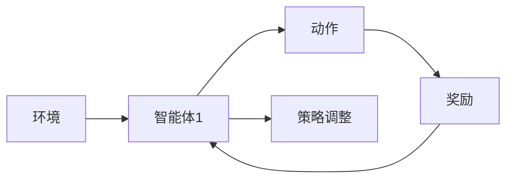
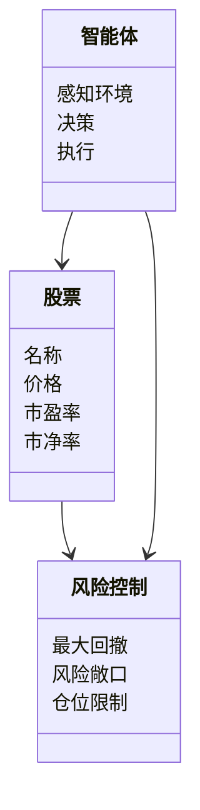
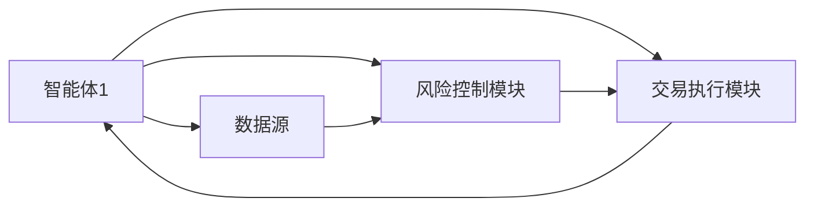
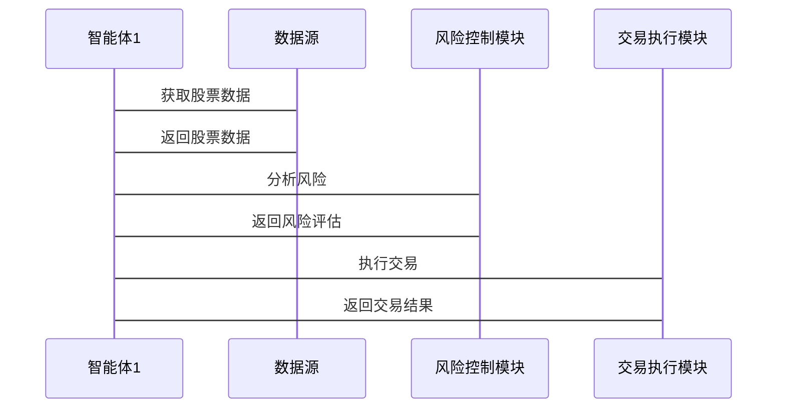

                 


# AI多智能体系统如何改进传统的价值投资风险控制方法

> 关键词：AI多智能体系统，价值投资，风险控制，强化学习，分布式计算

> 摘要：本文探讨了AI多智能体系统如何改进传统的价值投资风险控制方法。通过分析多智能体系统的概念、算法原理及实际应用场景，结合具体案例，展示了AI技术在金融领域的创新应用。文章从背景介绍、核心概念、算法原理、系统设计到项目实战，全面解析了AI多智能体系统在价值投资中的优势与实现细节。

---

## 第一部分: AI多智能体系统的背景与基础

### 第1章: 传统价值投资与风险控制概述

#### 1.1 传统价值投资的基本概念

##### 1.1.1 价值投资的定义与核心理念
价值投资是一种以基本面分析为基础的投资策略，核心理念是通过分析企业的财务状况、行业地位、竞争优势等因素，寻找被市场低估的股票进行长期投资。其核心在于“买得好”，而非“频繁交易”。

##### 1.1.2 价值投资的核心方法与步骤
1. **基本面分析**：分析企业的财务报表、行业地位、竞争优势等。
2. **估值分析**：通过市盈率、市净率等指标判断股票是否被低估。
3. **长期持有**：买入后长期持有，等待价值回归。

##### 1.1.3 价值投资的风险控制方法
1. **分散投资**：通过投资不同行业的股票降低风险。
2. **严格选股**：通过严格的选股标准降低投资风险。
3. **止损策略**：设定止损点，避免亏损过大。

#### 1.2 传统风险控制方法的局限性

##### 1.2.1 传统风险控制的主要手段
1. **分散投资**：通过投资多样化降低风险。
2. **止损策略**：设定止损点，限制亏损。
3. **定期调整**：根据市场变化调整投资组合。

##### 1.2.2 传统方法在实际应用中的不足
1. **主观性**：依赖分析师的主观判断，存在人为误差。
2. **反应速度慢**：传统方法依赖人工分析，难以及时捕捉市场变化。
3. **难以应对复杂市场**：在市场剧烈波动时，传统方法往往失效。

##### 1.2.3 传统方法面临的挑战与改进方向
1. **数据量爆炸**：金融市场数据日益复杂，传统方法难以处理。
2. **市场非理性**：市场情绪化波动难以用传统模型捕捉。
3. **技术进步的需求**：需要引入新技术提高风险控制的效率和精度。

### 第2章: AI多智能体系统的概念与特点

#### 2.1 AI多智能体系统的定义

##### 2.1.1 多智能体系统的定义
多智能体系统（Multi-Agent System, MAS）是由多个相互作用的智能体组成的系统，这些智能体能够通过协作和竞争完成复杂的任务。

##### 2.1.2 AI多智能体系统的独特性
1. **分布式智能**：多个智能体协同工作，避免单点故障。
2. **自主性**：每个智能体能够独立决策。
3. **协作性**：智能体之间能够通过通信协作完成复杂任务。

##### 2.1.3 多智能体系统与单智能体系统的区别
| 特性                | 单智能体系统         | 多智能体系统         |
|---------------------|----------------------|----------------------|
| 决策主体            | 单一主体            | 多个主体            |
| 协作能力            | 无协作              | 强协作              |
| 系统复杂度          | 较低                | 较高                |
| 容错性              | 较低                | 较高                |

#### 2.2 AI多智能体系统在金融领域的应用

##### 2.2.1 金融领域的应用
1. **股票交易**：通过多智能体协同完成股票买卖决策。
2. **风险管理**：利用多智能体系统实时监控和管理风险。
3. **市场预测**：通过多智能体协同分析市场趋势。

##### 2.2.2 多智能体系统在金融投资中的优势
1. **高效性**：多个智能体协同工作，提高决策效率。
2. **准确性**：通过协作提高预测和分析的准确性。
3. **适应性**：能够快速适应市场变化。

### 第3章: AI多智能体系统的核心概念与联系

#### 3.1 多智能体系统的核心原理

##### 3.1.1 智能体的定义与属性
智能体（Agent）是指能够感知环境、自主决策并采取行动的实体。其主要属性包括：
1. **自主性**：能够自主决策。
2. **反应性**：能够感知环境并实时响应。
3. **协作性**：能够与其他智能体协作。

##### 3.1.2 智能体之间的协作与竞争
协作与竞争是多智能体系统的核心机制。通过协作，智能体能够共同完成复杂任务；通过竞争，系统能够保持活力和创新。

##### 3.1.3 多智能体系统的整体架构
多智能体系统的架构通常包括：
1. **感知层**：感知环境信息。
2. **决策层**：智能体自主决策。
3. **执行层**：执行决策并反馈结果。

#### 3.2 AI多智能体系统与传统风险控制方法的对比

##### 3.2.1 传统风险控制方法的特征
1. **依赖人工判断**：需要分析师主观判断。
2. **反应速度慢**：难以实时调整策略。
3. **单一决策主体**：决策依赖单一主体。

##### 3.2.2 AI多智能体系统的特征
1. **分布式决策**：多个智能体协同决策。
2. **实时响应**：能够实时感知和调整。
3. **协作与竞争并存**：通过协作和竞争优化决策。

##### 3.2.3 两者在风险控制中的异同
| 特性                | 传统风险控制方法    | AI多智能体系统         |
|---------------------|---------------------|------------------------|
| 决策主体            | 单一主体            | 多个主体              |
| 决策速度            | 较慢                | 较快                  |
| 决策准确性          | 较低                | 较高                  |
| 系统复杂度          | 较低                | 较高                  |

---

## 第二部分: AI多智能体系统的算法原理

### 第4章: AI多智能体系统的算法原理

#### 4.1 多智能体协作与竞争的算法

##### 4.1.1 基于强化学习的协作与竞争算法
强化学习是一种通过试错来优化决策的算法。在多智能体系统中，每个智能体通过与环境和其他智能体的交互，不断优化自己的策略。



##### 4.1.2 分布式计算框架
分布式计算框架是多智能体系统的重要组成部分，通过分布式计算实现多个智能体的协作与竞争。

```python
# 分布式计算框架实现
import os
import sys
from datetime import datetime

def main():
    os.environ['MASTER_ADDR'] = 'localhost'
    os.environ['MASTER_PORT'] = '1234'
    os.environ['NUM_PROC'] = '4'

    from torch.distributed import init_process_group
    init_process_group(rank=0, world_size=4)
    print(f"Initialized with rank {rank}")

if __name__ == "__main__":
    main()
```

##### 4.1.3

---

## 第三部分: 系统分析与架构设计方案

### 第5章: 系统分析与架构设计方案

#### 5.1 问题场景介绍

##### 5.1.1 项目介绍
本项目旨在利用AI多智能体系统改进传统价值投资的风险控制方法，通过多智能体协同完成股票交易决策。

#### 5.2 系统功能设计

##### 5.2.1 领域模型类图


#### 5.3 系统架构设计

##### 5.3.1 系统架构图


#### 5.4 系统接口设计

##### 5.4.1 系统交互序列图


---

## 第四部分: 项目实战

### 第6章: 项目实战

#### 6.1 环境安装

##### 6.1.1 安装Python
```bash
python --version
pip install --upgrade pip
```

##### 6.1.2 安装相关库
```bash
pip install numpy pandas matplotlib torch
```

#### 6.2 系统核心实现

##### 6.2.1 核心代码实现
```python
import numpy as np
import pandas as pd
import torch

class MultiAgentSystem:
    def __init__(self, num_agents):
        self.num_agents = num_agents
        self.agents = [Agent() for _ in range(num_agents)]
    
    def step(self, prices):
        for agent in self.agents:
            action = agent.decide_action(prices)
            agent.take_action(action)

class Agent:
    def __init__(self):
        self.state = None
    
    def decide_action(self, prices):
        # 示例策略：如果价格上升，买入；否则卖出
        if prices[-1] > prices[-2]:
            return 1  # 买入
        else:
            return 0  # 卖出
    
    def take_action(self, action):
        # 示例执行：记录交易结果
        pass

# 示例运行
mas = MultiAgentSystem(4)
prices = np.array([10, 11, 9, 12])
mas.step(prices)
```

---

## 第五部分: 总结与展望

### 第7章: 总结与展望

#### 7.1 最佳实践 tips
1. **数据质量**：确保输入数据的准确性和完整性。
2. **模型调优**：根据实际效果不断优化智能体的决策策略。
3. **持续学习**：保持对市场变化的敏感性，及时调整系统。

#### 7.2 项目小结
通过本文的介绍，我们可以看到，AI多智能体系统在价值投资风险控制中的应用具有显著优势。通过多智能体协同工作，能够提高决策的准确性和效率，同时降低风险。

#### 7.3 展望未来
随着AI技术的不断发展，多智能体系统在金融领域的应用前景广阔。未来，我们可以进一步优化算法，提高系统的智能化水平，为投资者提供更高效的决策支持。

---

**作者：AI天才研究院/AI Genius Institute & 禅与计算机程序设计艺术 /Zen And The Art of Computer Programming**

---

### END

