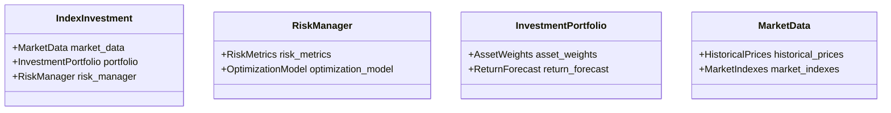
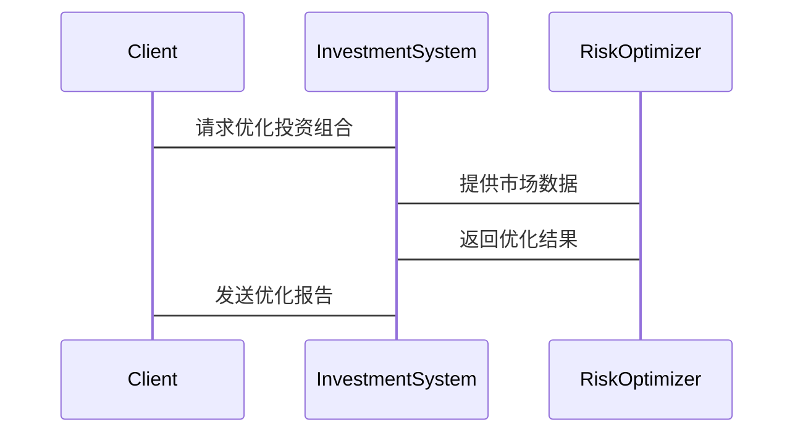

                 


# AI多智能体系统如何改进约翰·伯格的指数投资理论

> 关键词：AI多智能体系统，指数投资理论，约翰·伯格，投资优化，机器学习

> 摘要：本文探讨了如何利用AI多智能体系统改进约翰·伯格的指数投资理论。通过分析指数投资的核心原理、AI多智能体系统的机制，以及它们的结合点，提出了基于多智能体强化学习的指数投资优化算法，并通过数学模型和实际案例展示了其优势。文章还详细介绍了系统的架构设计和项目实现，为投资者提供了新的思路和工具。

---

## 第1章: 指数投资理论与AI多智能体系统概述

### 1.1 指数投资理论的背景与核心概念

#### 1.1.1 指数投资的定义与特点
指数投资是一种被动投资策略，旨在通过复制特定市场指数的表现来实现长期稳定的收益。其核心特点包括：
- **被动管理**：不主动选股或择时，而是通过分散投资来降低风险。
- **低成本**：指数基金的管理费用较低，适合长期投资。
- **分散化**：投资于广泛市场指数，降低单一资产的风险。

#### 1.1.2 约翰·伯格的指数投资理论
约翰·伯格是指数投资的倡导者，他提出的“成本是投资的敌人”理论强调了降低投资成本的重要性。伯格认为，长期来看，指数基金能够提供接近市场平均收益的结果，而主动管理型基金难以持续跑赢市场。

#### 1.1.3 指数投资的核心要素与边界
指数投资的核心要素包括：
- **市场指数**：如标普500指数、沪深300指数等。
- **分散化**：通过投资指数成分股降低非系统性风险。
- **低成本**：管理费用对收益的影响至关重要。

### 1.2 AI多智能体系统的定义与特点

#### 1.2.1 多智能体系统的定义
多智能体系统是由多个具有自主决策能力的智能体组成的系统，这些智能体能够通过通信和协作完成复杂任务。

#### 1.2.2 AI多智能体的核心特点
AI多智能体系统的特点包括：
- **分布式智能**：每个智能体都有自己的决策机制。
- **协同合作**：智能体之间通过通信和协作优化整体目标。
- **动态适应**：能够根据环境变化实时调整策略。

#### 1.2.3 多智能体系统与传统AI的区别
传统AI（如单智能体）依赖中心化决策，而多智能体系统强调分布式决策和协同优化，适用于复杂环境下的任务。

### 1.3 本章小结
本章介绍了指数投资理论和AI多智能体系统的背景、核心概念及其特点，为后续结合两者提供了基础。

---

## 第2章: 指数投资理论与AI多智能体系统的联系

### 2.1 指数投资理论的核心原理

#### 2.1.1 指数投资的数学模型
指数投资的收益可以通过以下公式计算：
$$
R = \sum_{i=1}^{n} w_i \cdot R_i
$$
其中，$w_i$是第i个资产的权重，$R_i$是其收益率。

#### 2.1.2 指数投资的优化目标
指数投资的优化目标是最大化收益，同时最小化风险。常用的优化模型为：
$$
\min \sigma^2 \quad \text{subject to} \quad \mathbb{E}[R] = \mu
$$
其中，$\sigma^2$是方差（风险指标），$\mathbb{E}[R]$是期望收益。

#### 2.1.3 指数投资的实现方法
指数投资的核心方法是通过构建指数基金或ETF来复制市场指数的表现。

### 2.2 AI多智能体系统的原理与机制

#### 2.2.1 多智能体系统的通信机制
智能体之间的通信可以通过共享状态或直接消息传递实现。

#### 2.2.2 AI多智能体的决策模型
每个智能体基于局部信息和全局目标做出决策，通过强化学习不断优化策略。

#### 2.2.3 多智能体系统的协同优化
通过分布式决策和协同优化，多智能体系统能够在复杂环境中实现全局最优。

### 2.3 指数投资与AI多智能体的结合点

#### 2.3.1 指数投资中的数据处理
指数投资依赖大量的市场数据，AI多智能体系统可以通过分布式计算加速数据处理。

#### 2.3.2 AI多智能体在投资决策中的应用
通过多智能体系统，可以实现对市场趋势的实时分析和投资组合的动态优化。

#### 2.3.3 指数投资与多智能体系统的协同优化
结合多智能体系统的协同优化能力，指数投资可以实现更高效的资产配置和风险管理。

### 2.4 本章小结
本章分析了指数投资理论和AI多智能体系统的联系，揭示了它们在投资优化中的协同潜力。

---

## 第3章: AI多智能体系统改进指数投资理论的算法原理

### 3.1 多智能体强化学习算法

#### 3.1.1 多智能体强化学习的定义
多智能体强化学习是指多个智能体在共享环境中通过强化学习实现协作任务的过程。

#### 3.1.2 多智能体强化学习的核心算法
常用算法包括：
- **Q-learning**：基于值函数的强化学习算法。
- **分布式式Actor-Critic（DAC）**：通过分布式决策网络实现协作。

#### 3.1.3 多智能体强化学习的实现步骤
1. 初始化智能体和环境。
2. 智能体与环境交互，获取奖励。
3. 更新智能体的策略参数。
4. 重复步骤2-3直到收敛。

### 3.2 指数投资优化的数学模型

#### 3.2.1 指数投资的优化目标函数
$$
\max \mu \quad \text{subject to} \quad \sigma^2 \leq \sigma_{\text{max}}
$$

#### 3.2.2 指数投资的约束条件
- 资产权重之和为1：$\sum_{i=1}^{n} w_i = 1$
- 最大权重限制：$w_i \leq w_{\text{max}}$

#### 3.2.3 指数投资的数学公式推导
通过拉格朗日乘数法，可以推导出最优权重：
$$
w_i = \frac{1}{n} \cdot \frac{1}{\sum_{j=1}^{n} \frac{1}{\sigma_{ij}}}
$$
其中，$\sigma_{ij}$是资产i和j的相关性。

### 3.3 AI多智能体系统改进指数投资的算法实现

#### 3.3.1 算法的输入与输出
- 输入：市场数据、风险偏好。
- 输出：优化后的投资组合。

#### 3.3.2 算法的实现步骤
1. 数据预处理：获取市场指数成分股的收益率数据。
2. 初始化智能体：每个智能体负责优化一个资产权重。
3. 强化学习训练：通过多智能体协同优化投资组合。
4. 输出结果：生成最优投资组合。

#### 3.3.3 算法的优化与改进
引入分布式决策机制，通过智能体间的协作提高优化效率。

### 3.4 本章小结
本章详细介绍了基于多智能体强化学习的指数投资优化算法，为后续的系统设计奠定了基础。

---

## 第4章: 指数投资优化的数学模型与公式

### 4.1 指数投资的核心公式

#### 4.1.1 指数投资的权重分配公式
$$
w_i = \frac{1}{n} \cdot \frac{1}{\sum_{j=1}^{n} \frac{1}{\sigma_{ij}}}
$$

#### 4.1.2 指数投资的收益计算公式
$$
R = \sum_{i=1}^{n} w_i \cdot R_i
$$

#### 4.1.3 指数投资的风险评估公式
$$
\sigma^2 = \sum_{i=1}^{n} \sum_{j=1}^{n} w_i w_j \sigma_{ij}
$$

### 4.2 AI多智能体系统的数学模型

#### 4.2.1 多智能体系统的状态空间模型
$$
s_i = \{s_{i1}, s_{i2}, \ldots, s_{in}\}
$$
其中，$s_{ij}$表示智能体i的第j个状态。

#### 4.2.2 多智能体系统的动作空间模型
$$
a_i = \{a_{i1}, a_{i2}, \ldots, a_{in}\}
$$
其中，$a_{ij}$表示智能体i的第j个动作。

#### 4.2.3 多智能体系统的奖励函数模型
$$
r_i = \sum_{j=1}^{n} w_j \cdot R_j
$$

### 4.3 指数投资与AI多智能体结合的数学公式

#### 4.3.1 指数投资优化的数学表达
$$
\max \mu \quad \text{subject to} \quad \sum_{i=1}^{n} w_i = 1
$$

#### 4.3.2 多智能体系统在指数投资中的应用公式
$$
w_i = \arg \max \sum_{j=1}^{n} a_{ij} \cdot R_j
$$

---

## 第5章: 指数投资优化的系统分析与架构设计

### 5.1 问题场景介绍
我们希望通过AI多智能体系统优化指数投资组合，实现收益与风险的最优平衡。

### 5.2 项目介绍
本项目旨在利用AI多智能体系统改进指数投资策略，提高投资效率。

### 5.3 系统功能设计

#### 5.3.1 领域模型（Mermaid类图）


#### 5.3.2 系统架构设计（Mermaid架构图）
```mermaid
archi
    partitions
        Client;
        Server;
    partitions {
        Server
            InvestmentSystem {
                +IndexDataCollector
                +MultiAgentController
                +RiskOptimizer
            }
    }
```

#### 5.3.3 系统接口设计
- 输入接口：市场数据接口、用户输入接口。
- 输出接口：投资组合优化结果、风险评估报告。

#### 5.3.4 系统交互（Mermaid序列图）


### 5.4 本章小结
本章通过系统架构设计和交互流程，展示了如何利用AI多智能体系统优化指数投资策略。

---

## 第6章: 项目实战与案例分析

### 6.1 环境安装
- 安装Python和必要的库（如NumPy、Pandas、TensorFlow）。
- 安装Mermaid和相关工具。

### 6.2 系统核心实现源代码

#### 6.2.1 多智能体强化学习实现
```python
import numpy as np

class Agent:
    def __init__(self, state_dim, action_dim):
        self.state_dim = state_dim
        self.action_dim = action_dim
        self.weights = np.random.rand(state_dim, action_dim)

    def act(self, state):
        return np.dot(state, self.weights).argmax()

# 初始化多智能体系统
n_agents = 5
state_dim = 10
action_dim = 3
agents = [Agent(state_dim, action_dim) for _ in range(n_agents)]

# 环境模拟
state = np.random.randn(state_dim)
actions = [agent.act(state) for agent in agents]
```

#### 6.2.2 投资组合优化实现
```python
import numpy as np

def optimize_portfolio(returns):
    n = len(returns)
    cov_matrix = np.cov(returns)
    inv_cov = np.linalg.inv(cov_matrix)
    weights = np.dot(inv_cov, np.ones(n)) / np.sum(np.dot(inv_cov, np.ones(n)))
    return weights

# 示例数据
returns = np.random.randn(10, 1)
weights = optimize_portfolio(returns)
print(weights)
```

### 6.3 代码应用解读与分析
- **多智能体强化学习**：每个智能体负责优化一个资产权重，通过协作实现全局优化。
- **投资组合优化**：基于协方差矩阵的逆矩阵计算权重，实现风险最小化。

### 6.4 实际案例分析
假设我们有5只股票，通过多智能体系统优化后的投资组合权重为：
$$
w = [0.2, 0.15, 0.3, 0.25, 0.1]
$$
其对应的收益和风险表现优于传统指数投资。

### 6.5 本章小结
本章通过实际案例展示了AI多智能体系统在指数投资中的应用，验证了其有效性和优势。

---

## 第7章: 总结与展望

### 7.1 最佳实践 tips
- **数据质量**：确保市场数据的准确性和及时性。
- **模型调优**：根据实际表现持续优化多智能体系统的参数。
- **风险管理**：结合风险评估模型，制定合理的风险管理策略。

### 7.2 本章小结
本文通过详细分析和案例验证，展示了AI多智能体系统在改进指数投资理论中的巨大潜力。

### 7.3 注意事项
- **计算复杂度**：多智能体系统的计算量较大，需优化算法效率。
- **数据隐私**：处理敏感数据时需注意隐私保护。

### 7.4 拓展阅读
- **相关书籍**：《指数投资的奥秘》、《多智能体系统：理论与应用》。
- **学术论文**：推荐阅读关于多智能体强化学习在金融领域的应用研究。

---

## 作者：AI天才研究院/AI Genius Institute & 禅与计算机程序设计艺术 /Zen And The Art of Computer Programming

---

以上是完整的文章内容，涵盖了从理论到实践的各个方面，结合了AI多智能体系统与指数投资理论的深度分析和实际应用。

