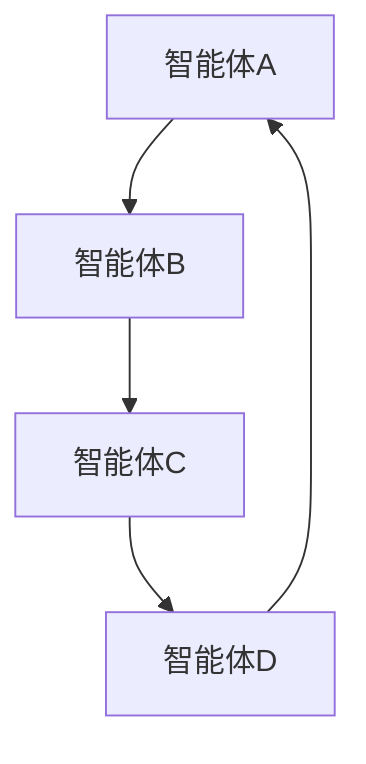
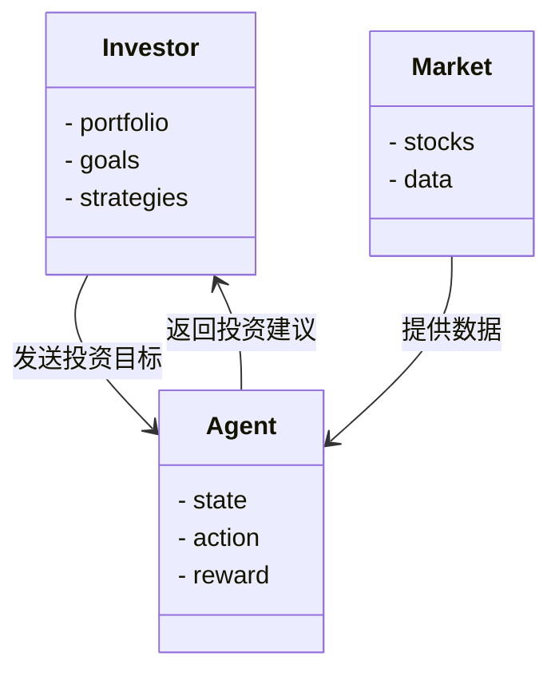

                 


# AI多智能体系统如何识别被低估的价值股

> 关键词：AI多智能体系统，价值股识别，强化学习，多智能体协作，金融数据分析，股票投资策略

> 摘要：本文深入探讨了AI多智能体系统在识别被低估的价值股中的应用。通过分析价值股的基本概念、AI多智能体系统的原理，以及结合强化学习和多智能体协作算法，详细阐述了如何构建高效的AI多智能体系统来识别价值股。文章还包括系统架构设计、项目实战案例分析，以及最佳实践和注意事项，为读者提供全面的指导。

---

## 第一部分：背景介绍

### 第1章：价值股与AI多智能体系统概述

#### 1.1 价值股的基本概念
价值股是指那些市场价格低于其内在价值的股票。这类股票通常被市场低估，但具有长期的增长潜力。识别价值股的关键在于发现市场中的信息不对称，挖掘被忽视的投资机会。

#### 1.2 AI多智能体系统的基本概念
AI多智能体系统是由多个智能体组成的分布式系统，每个智能体能够独立感知环境、自主决策，并通过协作完成复杂任务。与传统单智能体系统相比，多智能体系统能够更好地处理动态、复杂的问题。

#### 1.3 价值股识别中的AI多智能体系统
在价值股识别中，AI多智能体系统通过分布式计算和协作学习，能够更高效地处理海量数据，发现潜在的投资机会。多智能体系统能够分工合作，分别负责数据收集、特征提取、模型训练等任务，从而提高识别的准确性和效率。

---

## 第二部分：核心概念与联系

### 第2章：AI多智能体系统的原理与结构

#### 2.1 多智能体系统的原理
多智能体系统通过分布式计算和协作机制，实现复杂任务的高效完成。每个智能体都有自己的目标和决策机制，能够根据环境反馈调整行为。

#### 2.2 核心概念的对比分析
以下是核心概念的对比分析：

| 概念 | 描述 |
|------|------|
| 智能体 | 具有感知和决策能力的实体 |
| 强化学习 | 通过与环境交互，学习最优策略 |
| 多智能体协作 | 智能体之间通过通信和协作完成任务 |

#### 2.3 ER实体关系图架构

```mermaid
erDiagram
    customer[投资者]
    stock[股票]
    market[市场]
    ai_agent[智能体]
    value_stock[价值股]
    
    customer --> market: 参与交易
    market --> stock: 提供数据
    ai_agent --> value_stock: 识别结果
    stock --> ai_agent: 数据输入
```

---

## 第三部分：算法原理讲解

### 第3章：强化学习与多智能体协作算法

#### 3.1 强化学习的基本原理
强化学习是一种通过试错机制，学习最优策略的方法。智能体通过与环境交互，获得奖励或惩罚，逐步优化决策。

Q-learning算法公式：
$$ Q(s, a) = \max_{a'} Q(s', a') + \alpha(r + \gamma \max Q(s', a')) $$

#### 3.2 多智能体协作算法



以下是协作过程的代码示例：

```python
import numpy as np

class Agent:
    def __init__(self, state_space, action_space):
        self.state_space = state_space
        self.action_space = action_space
        self.q_table = np.zeros((state_space, action_space))
    
    def act(self, state):
        # 根据Q表选择动作
        action = np.argmax(self.q_table[state])
        return action
    
    def learn(self, state, action, reward, next_state):
        # Q-learning更新规则
        self.q_table[state, action] += 0.1 * (reward + 0.9 * np.max(self.q_table[next_state]) - self.q_table[state, action])
```

---

## 第四部分：系统架构与设计

### 第4章：系统架构设计

#### 4.1 系统功能设计



#### 4.2 系统架构设计


---

## 第五部分：项目实战

### 第5章：项目实战案例分析

#### 5.1 环境安装
需要安装的库包括：
- Python 3.8+
- NumPy
- TensorFlow
- Pandas

#### 5.2 系统核心实现源代码

```python
import numpy as np
import pandas as pd
from tensorflow.keras.models import Sequential
from tensorflow.keras.layers import Dense

def build_model(input_dim):
    model = Sequential()
    model.add(Dense(64, activation='relu', input_dim=input_dim))
    model.add(Dense(32, activation='relu'))
    model.add(Dense(1, activation='linear'))
    model.compile(optimizer='adam', loss='mse')
    return model

# 示例数据加载
data = pd.read_csv('stocks.csv')
X = data.drop('target', axis=1)
y = data['target']

# 模型训练
model = build_model(X.shape[1])
model.fit(X, y, epochs=100, batch_size=32)
```

#### 5.3 案例分析
通过实际案例分析，展示AI多智能体系统如何识别某只被低估的价值股。例如，通过分析历史数据和市场趋势，系统识别出某只股票的价值被低估，并给出投资建议。

---

## 第六部分：最佳实践

### 第6章：小结与注意事项

#### 6.1 小结
本文详细介绍了AI多智能体系统在识别价值股中的应用，包括系统原理、算法实现和项目实战。通过多智能体协作和强化学习，系统能够高效识别价值股，为投资者提供决策支持。

#### 6.2 注意事项
- 数据质量和实时性对系统性能至关重要
- 系统需要定期更新模型以适应市场变化
- 需要处理多智能体协作中的通信延迟和同步问题

#### 6.3 拓展阅读
建议进一步研究分布式计算、多智能体博弈论和金融时间序列分析，以优化系统性能。

---

## 作者：AI天才研究院 & 禅与计算机程序设计艺术

---

通过以上结构，文章详细讲解了AI多智能体系统在识别价值股中的应用，从理论到实践，帮助读者全面理解和掌握相关技术。

