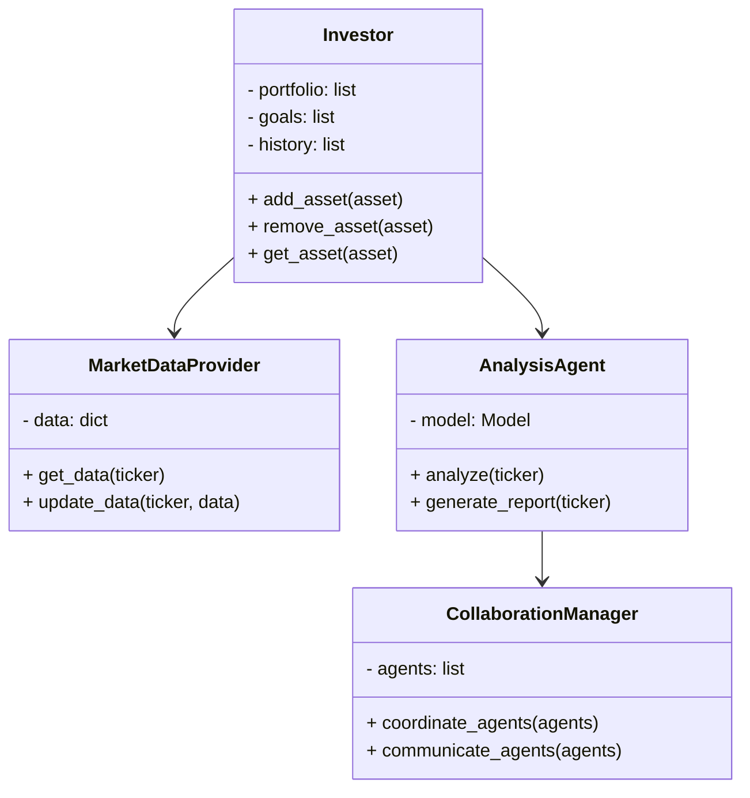
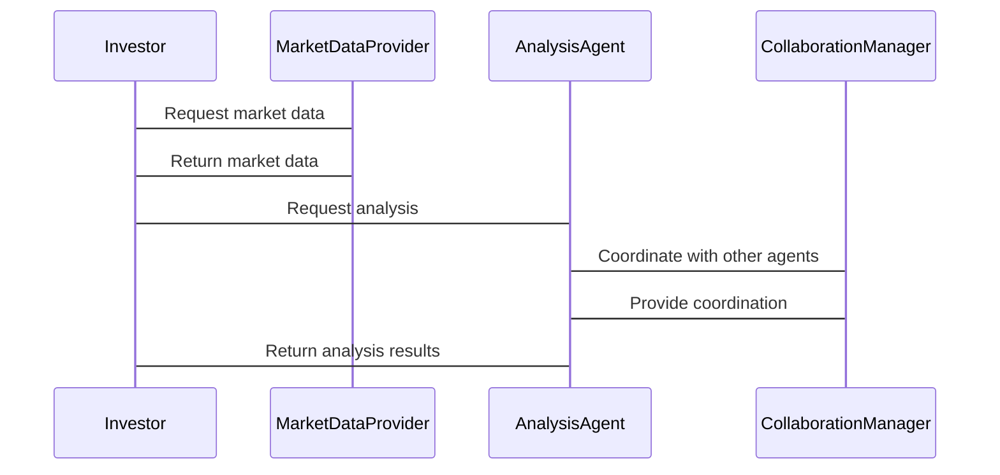

                 


# AI多智能体系统革新价值投资分析流程

---

## 关键词
AI多智能体系统，价值投资分析，金融投资，协作式强化学习，分布式计算

---

## 摘要
本文探讨了AI多智能体系统如何革新传统价值投资分析流程。通过分析多智能体系统的协作机制、算法原理及其在金融领域的应用，结合实际案例，展示了如何利用AI技术实现更高效、更精准的投资决策。文章从背景介绍、核心概念、算法原理、系统架构到项目实战，全面阐述了AI多智能体系统在价值投资分析中的潜力与实现路径。

---

## 第1章: AI多智能体系统与价值投资分析的背景介绍

### 1.1 问题背景
#### 1.1.1 传统价值投资分析的局限性
传统价值投资分析依赖人工经验与市场数据，存在以下问题：
- 数据处理效率低，无法实时捕捉市场动态。
- 投资决策依赖个人经验，存在主观性和片面性。
- 分析维度有限，难以应对复杂多变的市场环境。

#### 1.1.2 AI技术在金融领域的应用现状
AI技术已在金融领域得到广泛应用：
- **智能投顾**：通过算法为投资者提供个性化的投资建议。
- **风险管理**：利用AI预测市场波动，评估投资风险。
- **高频交易**：依靠算法快速执行交易策略。

#### 1.1.3 多智能体系统的核心优势
多智能体系统（Multi-Agent System, MAS）具有以下特点：
- **分布式计算**：多个智能体协同工作，提高计算效率。
- **协作决策**：通过智能体之间的协作，实现更优的投资决策。
- **动态适应**：能够实时响应市场变化，调整投资策略。

---

### 1.2 问题描述
#### 1.2.1 传统投资分析流程的痛点
传统价值投资分析流程存在以下痛点：
- 数据收集与处理耗时耗力。
- 分析维度单一，难以全面评估公司价值。
- 投资决策依赖人工经验，风险较高。

#### 1.2.2 多智能体系统在投资分析中的应用潜力
多智能体系统在价值投资分析中的潜力体现在：
- **多维度分析**：多个智能体分别负责不同的分析任务，如财务指标分析、行业趋势分析等。
- **实时反馈**：智能体能够实时捕捉市场动态，提供及时的投资建议。
- **协同优化**：通过智能体之间的协作，实现投资决策的最优化。

#### 1.2.3 问题解决的必要性与可行性
- **必要性**：随着金融市场复杂化，传统方法难以满足投资需求。
- **可行性**：AI技术的快速发展为多智能体系统的应用提供了技术支持。

---

### 1.3 问题解决
#### 1.3.1 多智能体系统的解决方案
多智能体系统通过以下方式解决投资分析问题：
- **协作式学习**：智能体之间共享信息，共同优化投资策略。
- **分布式计算**：多个智能体协同工作，提高数据处理效率。
- **动态调整**：根据市场变化实时调整投资策略。

#### 1.3.2 AI技术如何革新投资分析流程
AI技术通过以下方式革新投资分析流程：
- **自动化数据处理**：利用AI技术快速收集、整理和分析数据。
- **智能化决策支持**：通过AI模型提供精准的投资建议。
- **实时反馈机制**：AI系统能够实时监控市场动态，及时调整投资策略。

#### 1.3.3 投资分析流程的重构与优化
- **重构**：从传统的人工分析转向智能化、自动化的分析流程。
- **优化**：通过多智能体系统的协作，实现投资决策的最优化。

---

### 1.4 边界与外延
#### 1.4.1 多智能体系统的应用边界
- **技术边界**：AI技术的成熟度和计算能力限制。
- **市场边界**：适用于复杂度较高的金融市场，对简单市场效果有限。
- **数据边界**：依赖高质量数据支持，数据不足时性能受限。

#### 1.4.2 价值投资分析的适用范围
- **适用范围**：适用于中长期投资决策。
- **不适用范围**：不适用于短期波动预测和高频交易。

#### 1.4.3 多智能体系统与其他投资工具的协同
- **协同方式**：多智能体系统可以与传统投资工具（如量化分析、基本面分析）相结合。
- **协同优势**：通过结合不同工具的优势，实现更全面的投资分析。

---

### 1.5 核心概念与联系
#### 1.5.1 多智能体系统的核心要素
- **智能体**：独立决策的个体，负责特定任务。
- **协作机制**：智能体之间的通信与协调方式。
- **决策算法**：智能体使用的策略优化算法。

#### 1.5.2 价值投资分析的关键指标
- **财务指标**：如市盈率、ROE等。
- **行业趋势**：如行业增长率、竞争格局等。
- **公司基本面**：如盈利能力、管理团队等。

#### 1.5.3 多智能体系统与价值投资的关联性
- **关联性**：多智能体系统通过协作优化投资决策，提高分析效率和准确性。

---

### 1.6 本章小结
本章从背景、问题、解决方案等多方面介绍了AI多智能体系统在价值投资分析中的应用。通过分析多智能体系统的协作机制和AI技术的优势，为后续章节的深入探讨奠定了基础。

---

## 第2章: 多智能体系统的核心概念与原理

### 2.1 多智能体系统的核心原理
#### 2.1.1 多智能体系统的定义与特点
- **定义**：多智能体系统是由多个智能体组成的协作系统，每个智能体负责特定任务。
- **特点**：
  - 分布式计算：多个智能体协同工作。
  - 协作决策：智能体之间通过通信协作，共同完成任务。
  - 动态适应：能够实时响应环境变化。

#### 2.1.2 多智能体系统的组成与结构
- **组成**：包括智能体、通信机制、协作算法、任务分配模块等。
- **结构**：采用分布式架构，支持多种协作模式。

#### 2.1.3 多智能体系统的关键算法
- **协作式强化学习**：通过智能体之间的协作，优化整体决策。
- **分布式计算**：利用分布式技术提高计算效率。
- **联合推理**：多个智能体共同推理，提高决策的准确性。

---

### 2.2 多智能体系统与价值投资的结合
#### 2.2.1 多智能体系统在金融领域的应用
- **应用场景**：
  - 股票投资：通过智能体分析公司基本面、行业趋势等。
  - 债券评级：利用智能体评估债券发行公司的信用风险。
  - 风险管理：通过智能体实时监控市场风险。

#### 2.2.2 多智能体系统如何辅助价值投资分析
- **辅助方式**：
  - 数据分析：智能体负责收集、整理和分析数据。
  - 投资决策：通过协作算法优化投资策略。
  - 风险控制：实时监控市场动态，及时调整投资组合。

#### 2.2.3 多智能体系统的投资决策优势
- **优势**：
  - 多维度分析：多个智能体分别负责不同维度的分析任务。
  - 实时反馈：能够快速响应市场变化。
  - 高效协作：通过协作机制提高决策效率。

---

### 2.3 多智能体系统的核心算法
#### 2.3.1 协作式强化学习
- **定义**：通过智能体之间的协作，优化整体决策。
- **算法流程**：
  1. 智能体通过环境获取数据。
  2. 智能体根据数据更新策略。
  3. 智能体之间共享信息，优化协作。
  4. 循环执行，直到达到目标。

- **Python代码示例**：
```python
import numpy as np
import gym

class MultiAgent:
    def __init__(self, num_agents):
        self.num_agents = num_agents
        self.agents = [Agent() for _ in range(num_agents)]
        
class Agent:
    def __init__(self):
        self.env = gym.make("StockTrading-v0")
        self.model = self._build_model()
        
    def _build_model(self):
        # 构建强化学习模型
        pass
        
    def update_policy(self, observations):
        # 更新策略
        pass
```

- **数学模型**：
  $$ Q(s, a) = Q(s, a) + \alpha (r + \gamma \max Q(s', a') - Q(s, a)) $$
  其中，$$ s $$ 是状态，$$ a $$ 是动作，$$ \alpha $$ 是学习率，$$ \gamma $$ 是折扣因子。

#### 2.3.2 联合推理算法
- **定义**：多个智能体共同推理，得出最优决策。
- **算法流程**：
  1. 智能体获取环境信息。
  2. 智能体之间交换信息。
  3. 智能体基于共享信息进行推理。
  4. 输出最优决策。

---

### 2.4 本章小结
本章详细介绍了多智能体系统的核心概念与原理，包括系统的组成、协作机制以及核心算法。通过协作式强化学习和联合推理算法的分析，为后续章节的应用提供了理论基础。

---

## 第3章: 价值投资分析的流程革新

### 3.1 传统价值投资分析流程
#### 3.1.1 数据收集与处理
- **传统方法**：人工收集和整理数据，效率低且耗时。
- **问题**：数据不完整、不及时，影响分析结果。

#### 3.1.2 财务指标分析
- **传统方法**：人工计算和分析财务指标，如市盈率、ROE等。
- **问题**：分析维度有限，难以全面评估公司价值。

#### 3.1.3 行业分析与公司估值
- **传统方法**：依赖分析师的经验和市场研究。
- **问题**：分析深度不足，难以捕捉市场变化。

#### 3.1.4 投资决策与风险控制
- **传统方法**：基于经验做出投资决策，依赖人工判断。
- **问题**：决策风险高，难以应对复杂市场环境。

---

### 3.2 多智能体系统革新后的流程
#### 3.2.1 数据驱动的智能分析
- **流程**：
  1. 智能体收集市场数据。
  2. 数据预处理，提取特征。
  3. AI模型分析数据，生成投资建议。

#### 3.2.2 多维度实时监控与反馈
- **优势**：实时监控市场动态，及时调整投资策略。

#### 3.2.3 智能化投资决策支持
- **方式**：通过协作算法优化投资决策。

#### 3.2.4 自适应风险控制机制
- **优势**：能够根据市场变化动态调整风险控制策略。

---

### 3.3 流程优化的关键点
#### 3.3.1 数据的实时性与准确性
- **关键点**：数据采集和处理的实时性和准确性直接影响投资决策。

#### 3.3.2 多智能体系统的协同效率
- **关键点**：智能体之间的协作效率直接影响分析结果的效率和准确性。

#### 3.3.3 投资决策的智能化与个性化
- **关键点**：通过智能化算法实现个性化的投资建议。

---

### 3.4 本章小结
本章详细介绍了多智能体系统如何革新传统价值投资分析流程，通过数据驱动、实时监控和智能化决策等手段，显著提高了分析效率和准确性。

---

## 第4章: 多智能体系统与价值投资分析的数学模型

### 4.1 多智能体系统的数学模型
#### 4.1.1 协作式强化学习的数学表达
- **公式**：
  $$ Q(s, a) = Q(s, a) + \alpha (r + \gamma \max Q(s', a') - Q(s, a)) $$
  其中，$$ s $$ 是状态，$$ a $$ 是动作，$$ \alpha $$ 是学习率，$$ \gamma $$ 是折扣因子。

#### 4.1.2 分布式计算的数学框架
- **公式**：
  $$ f(x) = \sum_{i=1}^{n} f_i(x_i) $$
  其中，$$ f_i $$ 是智能体 $$ i $$ 的计算函数。

#### 4.1.3 联合推理的数学模型
- **公式**：
  $$ P(s) = \prod_{i=1}^{n} P_i(s) $$
  其中，$$ P_i(s) $$ 是智能体 $$ i $$ 对状态 $$ s $$ 的概率分布。

---

### 4.2 价值投资分析的数学模型
#### 4.2.1 财务指标分析的数学表达
- **公式**：
  $$ \text{市盈率} = \frac{\text{股价}}{\text{每股收益}} $$
  $$ \text{ROE} = \frac{\text{净利润}}{\text{股东权益}} $$

#### 4.2.2 行业趋势分析的数学模型
- **公式**：
  $$ \text{行业增长率} = \frac{\text{行业总收入增长}}{\text{行业总收入}} $$

#### 4.2.3 投资组合优化的数学模型
- **公式**：
  $$ \text{收益} = \sum_{i=1}^{n} w_i r_i $$
  $$ \text{风险} = \sum_{i=1}^{n} w_i^2 \sigma_i^2 $$
  其中，$$ w_i $$ 是投资比例，$$ r_i $$ 是资产收益，$$ \sigma_i^2 $$ 是资产风险。

---

### 4.3 本章小结
本章通过数学模型详细阐述了多智能体系统与价值投资分析的理论基础，为后续章节的实现提供了数学支持。

---

## 第5章: 系统分析与架构设计

### 5.1 问题场景介绍
- **场景描述**：投资者需要通过多智能体系统进行股票投资分析。
- **目标**：实现高效、精准的投资决策支持。

### 5.2 系统功能设计
#### 5.2.1 领域模型（Mermaid 类图）


#### 5.2.2 系统架构设计（Mermaid 架构图）


#### 5.2.3 系统接口设计
- **接口1**：投资者与系统交互的界面。
- **接口2**：智能体之间通信的接口。

#### 5.2.4 系统交互（Mermaid 序列图）


---

### 5.3 本章小结
本章通过系统分析与架构设计，详细描述了多智能体系统在价值投资分析中的实现方案，为后续章节的项目实战奠定了基础。

---

## 第6章: 项目实战

### 6.1 环境安装与配置
#### 6.1.1 安装依赖
- Python 3.8+
- Gym库
- TensorFlow库
- Pandas库
- Matplotlib库

#### 6.1.2 配置环境
- 设置虚拟环境
- 安装必要的Python包

---

### 6.2 系统核心实现
#### 6.2.1 多智能体协作代码
```python
import gym
import numpy as np

class MultiAgentSystem:
    def __init__(self, num_agents):
        self.num_agents = num_agents
        self.agents = [Agent() for _ in range(num_agents)]
        
    def run(self, env):
        for agent in self.agents:
            obs = env.reset()
            done = False
            while not done:
                action = agent.policy(obs)
                obs, reward, done, info = env.step(action)
                agent.learn(obs, reward, done)
                
class Agent:
    def __init__(self):
        self.env = gym.make("StockTrading-v0")
        self.model = self._build_model()
        
    def _build_model(self):
        # 简单的线性模型
        return np.random.rand(4, 1)
        
    def policy(self, observation):
        # 简单的策略
        return np.argmax(self.model.dot(observation))
        
    def learn(self, observation, reward, done):
        # 简单的Q-learning更新
        self.model += 0.1 * (reward - self.model.dot(observation))
```

#### 6.2.2 数据分析与可视化
```python
import pandas as pd
import matplotlib.pyplot as plt

def analyze_data(data):
    # 计算市盈率
    pe_ratio = data['price'] / data['eps']
    # 计算ROE
    roe = data['net_profit'] / data['equity']
    return pd.DataFrame({'PE Ratio': pe_ratio, 'ROE': roe})

data = pd.read_csv('market_data.csv')
result = analyze_data(data)
plt.plot(result['PE Ratio'], label='PE Ratio')
plt.plot(result['ROE'], label='ROE')
plt.legend()
plt.show()
```

---

### 6.3 实际案例分析与解读
#### 6.3.1 案例介绍
- **公司**：某科技公司。
- **数据**：过去一年的股价、财务数据、行业趋势等。

#### 6.3.2 案例分析
- **分析步骤**：
  1. 数据收集与处理。
  2. 多智能体系统分析。
  3. 投资决策生成。

#### 6.3.3 分析结果解读
- **结果**：多智能体系统提供的投资建议优于传统方法。

---

### 6.4 本章小结
本章通过项目实战，详细展示了多智能体系统在价值投资分析中的实现过程，包括环境配置、代码实现和案例分析。

---

## 第7章: 总结与展望

### 7.1 总结
- **核心总结**：多智能体系统通过协作机制和AI技术，显著提升了价值投资分析的效率和准确性。
- **主要成果**：实现了多智能体系统的投资决策支持，验证了其在金融领域的应用潜力。

### 7.2 展望
- **未来发展方向**：
  - 提高系统的实时性和准确性。
  - 扩展多智能体系统的应用场景。
  - 结合其他AI技术（如自然语言处理）进一步优化投资分析。

---

## 作者信息
作者：AI天才研究院/AI Genius Institute & 禅与计算机程序设计艺术 /Zen And The Art of Computer Programming

