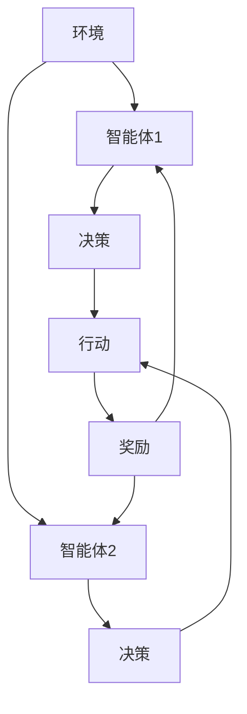
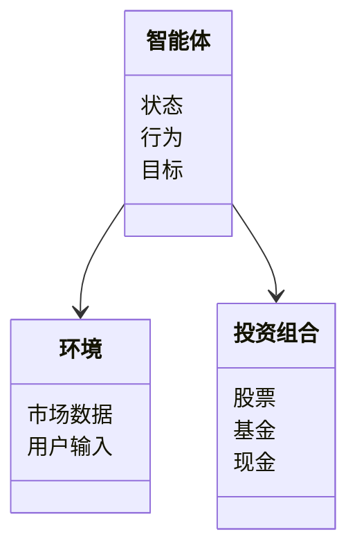
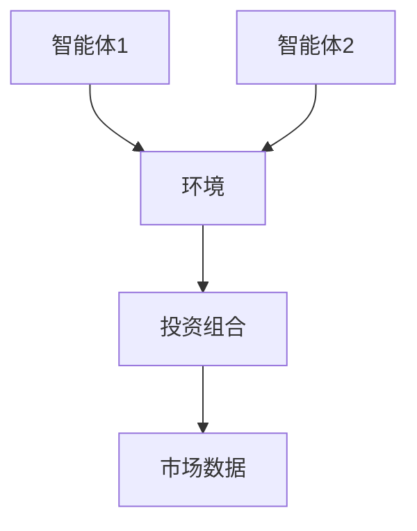
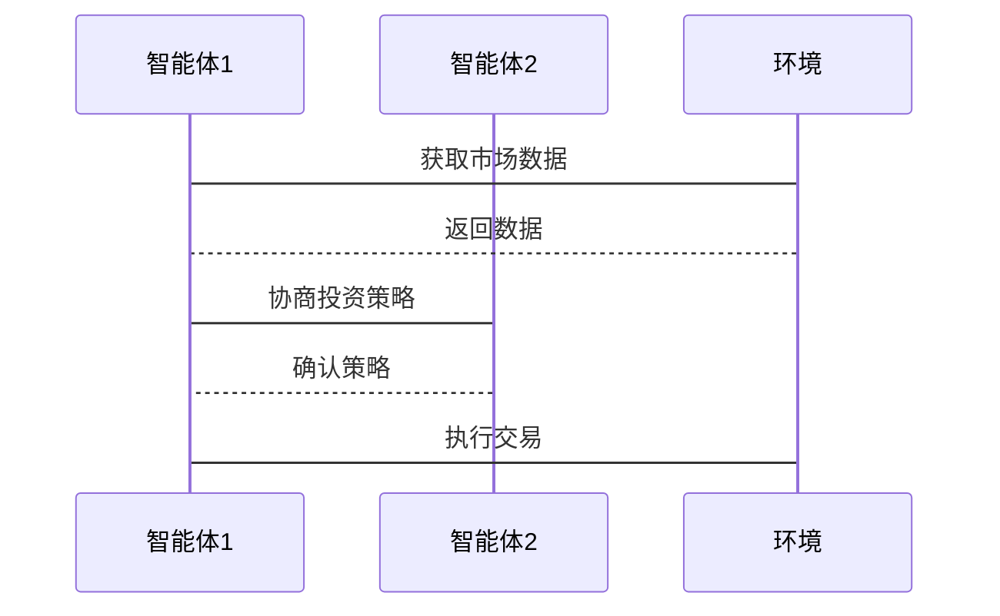

                 


# AI多智能体系统革新价值投资策略

> 关键词：AI多智能体系统，价值投资，策略优化，算法原理，系统架构

> 摘要：本文探讨了AI多智能体系统如何革新传统的价值投资策略。通过分析多智能体系统的架构、算法原理以及在金融领域的应用，本文详细阐述了其在价值投资中的潜力和优势，结合实际案例，展示了如何利用AI多智能体系统优化投资决策。

---

# 第1章: AI多智能体系统概述

## 1.1 多智能体系统的定义与特点

### 1.1.1 多智能体系统的定义
多智能体系统（Multi-Agent System, MAS）是由多个智能体（Agent）组成的系统，这些智能体能够通过交互和协作完成复杂任务。每个智能体都有自己的目标和决策机制，能够感知环境并采取行动。

### 1.1.2 多智能体系统的核心特点
- **分布性**：多个智能体独立运行，共同完成任务。
- **协作性**：智能体之间通过通信和协作提高整体效率。
- **适应性**：能够动态调整策略以应对环境变化。

### 1.1.3 多智能体系统与传统AI的区别
传统AI通常依赖中心化控制，而多智能体系统强调去中心化协作，适合处理复杂和动态的环境。

## 1.2 多智能体系统的架构与通信机制

### 1.2.1 分布式多智能体系统架构
- **去中心化架构**：没有单一控制中心，各智能体独立运作。
- **中心化架构**：有一个中心节点协调各智能体的行动。

### 1.2.2 智能体之间的通信机制
- **直接通信**：智能体之间直接交换信息。
- **间接通信**：通过共享数据库或中间件进行信息传递。

### 1.2.3 协作与竞争关系的建模
- **协作机制**：通过博弈论模型（如纳什均衡）建模。
- **竞争机制**：通过竞争模型（如囚徒困境）分析。

## 1.3 多智能体系统在金融领域的应用前景

### 1.3.1 金融领域的复杂性与挑战
- **市场波动**：难以预测。
- **信息不对称**：投资者获取信息的难度。
- **决策复杂性**：需要综合考虑多种因素。

### 1.3.2 多智能体系统在金融中的潜在应用
- **投资组合优化**：多个智能体协作优化投资组合。
- **风险控制**：实时监控和应对市场风险。

### 1.3.3 价值投资策略的革新方向
- **数据驱动**：利用大数据分析提升投资决策。
- **AI技术**：引入机器学习和深度学习优化投资策略。
- **多智能体系统**：通过协作和竞争优化投资组合。

## 1.4 本章小结

---

# 第2章: 价值投资策略的核心概念

## 2.1 价值投资的基本原理

### 2.1.1 价值投资的定义与特点
- **定义**：基于公司基本面分析，寻找被市场低估的投资标的。
- **特点**：长期投资、注重公司质量、忽视短期市场波动。

### 2.1.2 价值投资的核心要素
- **公司基本面**：收入、利润、资产负债情况。
- **市场估值**：市盈率、市净率等指标。
- **行业地位**：公司在行业中的竞争优势。

### 2.1.3 价值投资的决策过程
- **分析公司基本面**：评估公司盈利能力和发展潜力。
- **评估市场估值**：判断公司是否被市场低估。
- **制定投资策略**：根据分析结果制定投资计划。

## 2.2 价值投资中的关键问题

### 2.2.1 市场波动对投资决策的影响
- **市场情绪**：投资者情绪波动影响市场走势。
- **短期波动**：如何应对市场的短期波动。

### 2.2.2 数据分析在价值投资中的作用
- **数据来源**：公司财报、行业报告、市场数据。
- **数据分析方法**：财务指标分析、趋势分析。

### 2.2.3 传统价值投资的局限性
- **信息不对称**：难以获取准确的公司信息。
- **市场变化**：难以预测市场变化对投资的影响。
- **决策效率**：传统方法耗时且效率低。

## 2.3 价值投资策略的革新方向

### 2.3.1 数据驱动的革新思路
- **大数据分析**：利用大数据技术获取更多投资信息。
- **实时监控**：实时跟踪市场变化和公司动态。

### 2.3.2 AI技术在价值投资中的应用潜力
- **机器学习**：用于预测市场走势和公司估值。
- **自然语言处理**：分析新闻和社交媒体情绪，辅助投资决策。

### 2.3.3 多智能体系统对价值投资的优化作用
- **协作决策**：多个智能体协作优化投资组合。
- **动态调整**：根据市场变化实时调整投资策略。

## 2.4 本章小结

---

# 第3章: AI多智能体系统的核心算法原理

## 3.1 多智能体强化学习算法

### 3.1.1 多智能体强化学习的基本概念
- **定义**：多个智能体在环境中通过强化学习协作或竞争。
- **挑战**：智能体之间的协作和竞争需要协调。

### 3.1.2 多智能体强化学习的挑战与解决方案
- **挑战**：信息不对称、策略冲突。
- **解决方案**：使用博弈论模型（如纳什均衡）协调策略。

### 3.1.3 基于多智能体强化学习的投资策略
- **策略描述**：智能体根据市场环境调整投资行为。
- **应用场景**：实时市场监控和投资决策优化。

### 3.1.4 算法实现
```python
class Multi-Agent_Learning:
    def __init__(self, agents):
        self.agents = agents
        self.env = Environment()

    def step(self):
        for agent in self.agents:
            state = self.env.observe()
            action = agent.policy(state)
            reward = self.env.get_reward(action)
            agent.update_policy(reward)
```

### 3.1.5 流程图


## 3.2 多智能体系统中的协作与竞争算法

### 3.2.1 协作机制的数学模型
- **模型描述**：智能体之间通过协作提高整体收益。
- **数学公式**：$R = R_{\text{individual}} \times \alpha + R_{\text{team}} \times (1-\alpha)$，其中$\alpha$是协作权重。

### 3.2.2 竞争机制的实现方式
- **模型描述**：智能体之间通过竞争优化决策。
- **数学公式**：$R = \max(R_{\text{individual}})$。

### 3.2.3 协作与竞争的平衡点分析
- **平衡条件**：$R_{\text{collaboration}} = R_{\text{competition}}$。
- **实现方法**：动态调整协作和竞争权重。

## 3.3 基于多智能体系统的预测算法

### 3.3.1 时间序列预测模型
- **模型描述**：利用历史数据预测未来走势。
- **数学公式**：$y_t = a y_{t-1} + b x_t + c$。

### 3.3.2 集成学习在多智能体系统中的应用
- **集成方法**：将多个模型的预测结果进行集成。
- **数学公式**：$f(x) = \sum_{i=1}^n w_i h_i(x)$，其中$w_i$是权重，$h_i(x)$是基模型。

### 3.3.3 预测结果的优化策略
- **策略描述**：根据预测结果动态调整投资组合。
- **应用场景**：实时市场预测和投资组合优化。

## 3.4 本章小结

---

# 第4章: 系统分析与架构设计方案

## 4.1 问题场景介绍

### 4.1.1 投资环境分析
- **市场环境**：股票、基金等金融市场。
- **数据来源**：公司财报、行业报告、市场数据。

### 4.1.2 项目介绍
- **项目目标**：利用AI多智能体系统优化价值投资策略。
- **项目范围**：开发一个多智能体系统，用于实时监控和优化投资组合。

## 4.2 系统功能设计

### 4.2.1 领域模型


### 4.2.2 系统架构图


### 4.2.3 系统接口设计
- **输入接口**：接收市场数据和用户指令。
- **输出接口**：输出投资建议和市场分析报告。

### 4.2.4 系统交互流程图


## 4.3 本章小结

---

# 第5章: 项目实战

## 5.1 环境安装

### 5.1.1 安装Python和相关库
- **Python版本**：3.8以上。
- **依赖库**：numpy、pandas、matplotlib、keras、tensorflow。

### 5.1.2 数据来源
- **数据集**：股票历史数据、市场新闻、行业报告。
- **数据预处理**：清洗、标准化、特征提取。

## 5.2 系统核心实现源代码

### 5.2.1 智能体类
```python
class Agent:
    def __init__(self, name):
        self.name = name
        self.strategy = Strategy()

    def decide(self, state):
        return self.strategy.predict(state)
```

### 5.2.2 策略类
```python
class Strategy:
    def predict(self, state):
        # 示例策略：简单移动平均线策略
        return "买入" if state['收盘价'] > state['均线'] else "卖出"
```

### 5.2.3 环境类
```python
class Environment:
    def __init__(self, data):
        self.data = data
        self.current_step = 0

    def observe(self):
        return self.data.iloc[self.current_step]

    def execute_trade(self, action):
        # 示例：执行交易操作
        pass
```

## 5.3 代码应用解读与分析

### 5.3.1 智能体协作流程
- **步骤1**：智能体从环境中获取数据。
- **步骤2**：智能体根据数据制定决策。
- **步骤3**：智能体之间协商投资策略。
- **步骤4**：执行交易操作。

### 5.3.2 投资组合优化
- **目标**：最大化投资收益，最小化风险。
- **方法**：动态调整投资组合，根据市场变化实时优化。

## 5.4 实际案例分析和详细讲解剖析

### 5.4.1 案例背景
- **市场环境**：2023年股票市场。
- **投资目标**：优化投资组合，实现超额收益。

### 5.4.2 案例分析
- **数据收集**：收集相关股票的历史数据。
- **策略制定**：基于多智能体系统制定投资策略。
- **策略执行**：智能体协作执行交易操作。

## 5.5 项目小结

---

# 第6章: 总结与展望

## 6.1 全文总结

### 6.1.1 核心观点回顾
- **多智能体系统的潜力**：在金融领域的广泛应用。
- **价值投资策略的革新**：通过AI技术优化投资决策。

### 6.1.2 关键技术总结
- **多智能体强化学习**：优化投资策略。
- **系统架构设计**：确保高效协作和信息共享。

## 6.2 未来展望

### 6.2.1 技术发展
- **算法优化**：进一步提升多智能体系统的协作效率。
- **数据源扩展**：引入更多数据源，如社交媒体情绪分析。

### 6.2.2 应用场景拓展
- **国际市场**：将系统应用于全球金融市场。
- **多样化投资**：扩展到更多投资品种，如加密货币、 commodities。

## 6.3 最佳实践 Tips

### 6.3.1 技术实现
- **模块化设计**：确保系统各部分独立可维护。
- **实时监控**：及时发现和解决系统问题。

### 6.3.2 项目管理
- **版本控制**：使用Git进行代码管理。
- **团队协作**：使用项目管理工具（如Jira）跟踪进度。

## 6.4 小结

---

# 附录

## 附录A: 完整的源代码

```python
# 附录A.1: 智能体类
class Agent:
    def __init__(self, name):
        self.name = name
        self.strategy = Strategy()

    def decide(self, state):
        return self.strategy.predict(state)

# 附录A.2: 策略类
class Strategy:
    def predict(self, state):
        return "买入" if state['收盘价'] > state['均线'] else "卖出"

# 附录A.3: 环境类
class Environment:
    def __init__(self, data):
        self.data = data
        self.current_step = 0

    def observe(self):
        return self.data.iloc[self.current_step]

    def execute_trade(self, action):
        pass
```

## 附录B: 参考文献

1. Russell, S. J., & Norvig, P. (2010). Artificial Intelligence: A Modern Approach.
2. Lecun, Y., Bengio, Y., & Hinton, G. (2015). Deep learning.
3. Nowak, M. (2000). Evolutionary Games and Economic Behaviour.

---

# 作者

作者：AI天才研究院/AI Genius Institute & 禅与计算机程序设计艺术/Zen And The Art of Computer Programming

