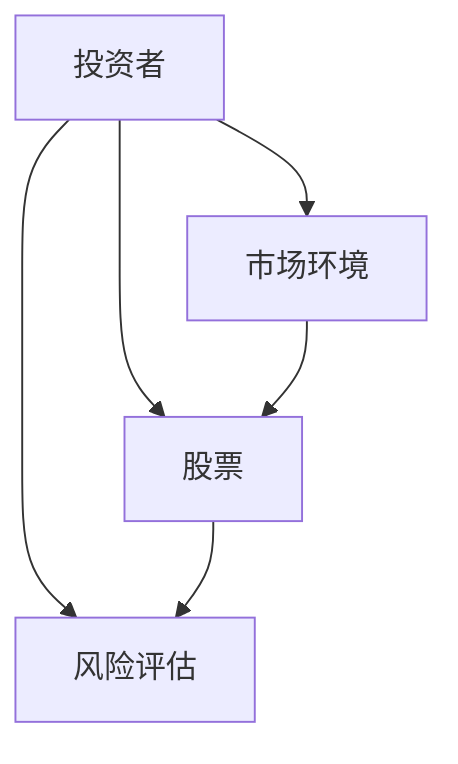
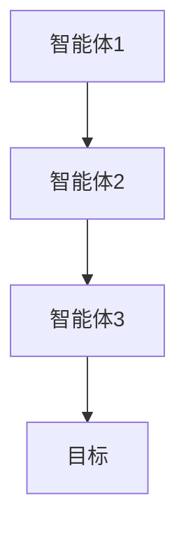
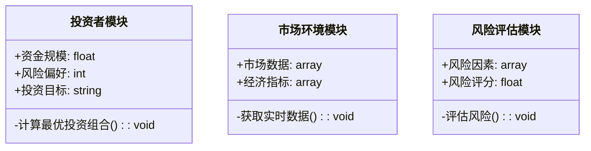
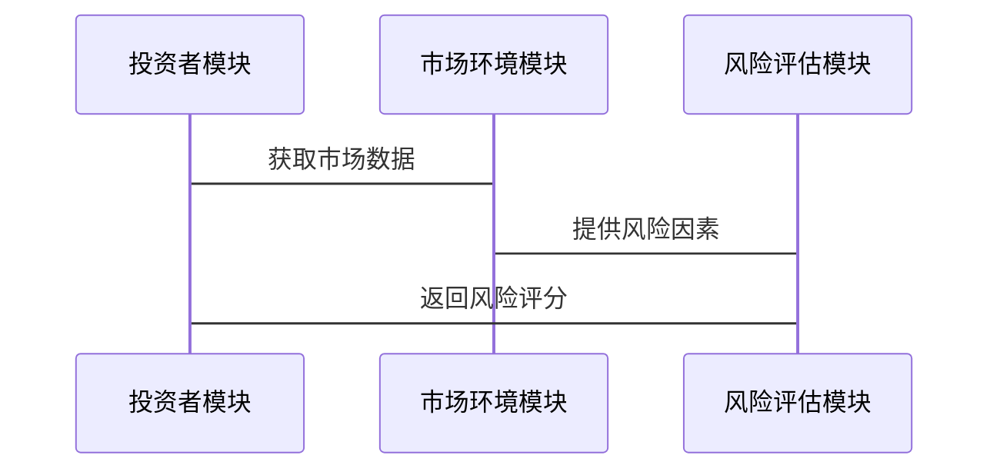

                 


# AI多智能体系统革新价值投资：传统与科技的完美融合

## 关键词：人工智能，多智能体系统，价值投资，金融分析，技术融合

## 摘要：本文探讨AI多智能体系统在价值投资中的应用，分析传统投资方法与现代科技的结合，通过算法、系统架构和实际案例，展示如何革新传统投资模式，实现更高效和精准的决策。

---

## 第一部分: AI多智能体系统与价值投资的背景与基础

### 第1章: AI多智能体系统概述

#### 1.1 多智能体系统的基本概念
多智能体系统（Multi-Agent System, MAS）是指多个智能体协作完成任务的系统，每个智能体都有自己的目标和决策机制，能够独立行动并与其他智能体交互。智能体可以是软件程序、算法或物理设备，具备感知环境、推理、规划和执行的能力。

#### 1.2 价值投资的传统方法
价值投资是一种长期投资策略，通过分析公司的基本面，如财务状况、行业地位和管理团队，寻找被市场低估的投资标的。传统方法依赖分析师的主观判断和经验，存在效率低、覆盖面有限的问题。

#### 1.3 AI技术在金融领域的应用现状
AI技术在金融领域的应用日益广泛，包括算法交易、风险评估、市场预测等。AI能够处理海量数据，发现复杂模式，提高决策的准确性和效率，但也面临数据质量和模型解释性的挑战。

---

### 第2章: AI多智能体系统的核心概念与联系

#### 2.1 多智能体系统的实体关系图


多智能体系统在价值投资中涉及多个实体：投资者、市场环境、股票和风险评估。投资者通过分析市场环境和股票信息，进行风险评估，做出投资决策。

#### 2.2 多智能体系统与价值投资的结合
多智能体系统在价值投资中的作用包括：
1. 协作分析：多个智能体分别负责数据收集、模型构建和结果评估，提高分析效率。
2. 风险分散：通过分布式计算，降低单一智能体决策风险。
3. 实时反馈：智能体能够快速响应市场变化，提供实时数据支持。

---

## 第二部分: AI多智能体系统的算法原理

### 第3章: 多智能体协作算法

#### 3.1 多智能体协作算法


多智能体协作算法通过智能体之间的信息共享和任务分配，实现共同目标。每个智能体负责特定任务，如数据清洗、模型训练和结果分析，最终协同完成价值评估。

#### 3.2 价值预测模型
价值预测模型基于历史数据和市场信息，预测股票的价值。模型输入包括财务数据、市场趋势和行业新闻，输出为股票的价值评分。

$$
\text{预测价值} = \alpha \times \text{财务指标} + \beta \times \text{市场趋势} + \gamma \times \text{行业新闻}
$$

---

### 第4章: 系统架构与设计

#### 4.1 系统模块划分


系统架构分为三个模块：投资者模块负责资金管理和目标设定，市场环境模块提供实时数据，风险评估模块进行风险分析。

#### 4.2 系统接口设计
投资者模块接口包括获取市场数据和评估风险，市场环境模块负责数据采集和更新，风险评估模块提供风险评分。

#### 4.3 系统交互流程


---

## 第三部分: 项目实战与案例分析

### 第5章: 项目实战

#### 5.1 环境配置
安装Python和相关库（如Pandas、Scikit-learn、TensorFlow），数据来源包括Yahoo Finance和新闻API。

#### 5.2 核心代码实现
```python
def calculate_portfolio(risk_tolerance, market_data):
    # 数据预处理
    normalized_data = normalize(market_data)
    
    # 风险评估
    risk_score = assess_risk(risk_tolerance, normalized_data)
    
    # 价值预测
    value_prediction = predict_value(normalized_data)
    
    return {
        'risk_score': risk_score,
        'value_prediction': value_prediction
    }

def normalize(data):
    # 数据标准化处理
    return (data - data.mean()) / data.std()

def assess_risk(risk_tolerance, data):
    # 风险评估模型
    return risk_tolerance * data.var()
```

#### 5.3 案例分析
以科技股为例，分析市场数据和风险因素，计算风险评分和价值预测，展示系统如何辅助投资决策。

---

### 第6章: 最佳实践与未来展望

#### 6.1 小结
AI多智能体系统通过协作和分布式计算，提升了价值投资的效率和精度，克服了传统方法的局限性。

#### 6.2 注意事项
模型的准确性和数据质量是关键，需注意数据偏差和模型过拟合问题。

#### 6.3 未来展望
未来发展方向包括结合博弈论优化协作机制，利用分布式计算提升性能，以及探索新的数据源如社交媒体情绪分析。

---

## 结语

AI多智能体系统革新了传统价值投资，通过科技的力量实现了更高效和精准的决策。本文通过理论分析和实际案例，展示了AI技术与传统投资的完美融合，为未来金融领域的发展提供了新的思路。

---

## 作者

作者：AI天才研究院/AI Genius Institute & 禅与计算机程序设计艺术/Zen And The Art of Computer Programming

