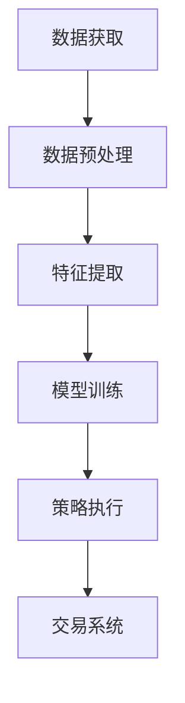

                 


---

# AI如何优化塞思·卡拉曼的特殊情况投资

## 关键词：
- AI，投资，特殊情况，塞思·卡拉曼，机器学习，自然语言处理，强化学习，金融数据分析

## 摘要：
本文探讨了如何利用人工智能技术优化塞思·卡拉曼的特殊情况投资策略。通过分析AI在金融领域的应用，特别是机器学习、自然语言处理和强化学习，本文展示了如何通过数据分析、模式识别和自动化决策来提升投资决策的效率和准确性。文章从背景介绍、核心概念、算法原理、系统架构、项目实战、数学模型到最佳实践，详细阐述了AI在特殊情况投资中的应用，并通过实际案例分析和代码实现，帮助读者更好地理解和应用这些技术。

---

## 第一部分：AI与特殊情况投资的背景

### 第1章：特殊情况投资与AI的结合

#### 1.1 特殊情况投资的定义与特点
- **1.1.1 特殊情况投资的定义**
  特殊情况投资是指识别那些具有独特情况、可能带来高回报的投资机会，通常涉及对公司基本面、市场趋势和潜在风险的深入分析。

- **1.1.2 特殊情况投资的核心特点**
  - 独特性：寻找市场上未被广泛认知的投资机会。
  - 高回报潜力：通过精准分析，抓住高回报的机会。
  - 风险较高：需要对潜在风险进行精确评估。

- **1.1.3 塞思·卡拉曼的投资理念**
  卡拉曼以寻找市场低估的股票闻名，他的投资策略强调对公司基本面的深入分析和对市场趋势的精准判断。

#### 1.2 AI在金融领域的应用背景
- **1.2.1 金融领域的数据特性**
  金融数据具有高频性、复杂性和不确定性，AI能够通过处理大量数据，发现隐藏的模式和趋势。

- **1.2.2 AI技术在金融中的潜力**
  AI在金融中的潜力体现在数据处理、预测分析和自动化决策等方面，能够显著提高投资决策的效率和准确性。

- **1.2.3 特殊情况投资与AI的契合点**
  AI能够通过分析非结构化数据（如新闻、财报）和结构化数据（如股价、财务指标），帮助投资者发现潜在的投资机会和风险。

---

## 第二部分：AI的核心概念与应用

### 第2章：机器学习在特殊情况投资中的应用

#### 2.1 机器学习的基本概念
- **2.1.1 机器学习的定义**
  机器学习是一种通过数据训练模型，使其能够从数据中学习并做出预测或决策的技术。

- **2.1.2 监督学习与无监督学习**
  - 监督学习：基于标注数据训练模型，用于分类和回归任务。
  - 无监督学习：在无标注数据中发现隐藏的结构和模式。

- **2.1.3 强化学习与迁移学习**
  - 强化学习：通过试错机制优化决策，常用于动态环境中的投资决策。
  - 迁移学习：将已学习的知识应用到新的任务中，提高模型的泛化能力。

#### 2.2 机器学习在投资中的具体应用
- **2.2.1 时间序列分析**
  使用ARIMA、LSTM等模型预测股价走势，帮助投资者做出买卖决策。

- **2.2.2 文本挖掘与情感分析**
  通过分析新闻、社交媒体等文本数据，判断市场情绪，预测股价波动。

- **2.2.3 风险评估与预测**
  利用机器学习模型评估投资组合的风险，预测潜在的市场风险。

### 第3章：自然语言处理在投资中的应用

#### 3.1 自然语言处理的基本概念
- **3.1.1 NLP的定义**
  NLP是研究如何让计算机理解和处理人类语言的学科，广泛应用于文本分类、信息提取等领域。

- **3.1.2 主要技术与工具**
  - 分词：将文本分割成词语或短语。
  - 词干提取与词性标注：对词语进行进一步处理。
  - 情感分析：判断文本的情感倾向。

- **3.1.3 NLP在金融中的潜力**
  NLP可以帮助投资者分析公司财报、新闻公告，提取关键信息，预测市场趋势。

#### 3.2 NLP在特殊情况投资中的应用
- **3.2.1 新闻与市场情绪分析**
  通过分析新闻标题和内容，判断市场情绪，预测股价波动。

- **3.2.2 公司财报与公告解读**
  自动提取财报中的关键指标，如收入、利润，帮助投资者做出决策。

- **3.2.3 行业趋势预测**
  通过分析行业报告和市场动态，预测行业发展趋势，指导投资决策。

### 第4章：强化学习在投资策略中的应用

#### 4.1 强化学习的基本原理
- **4.1.1 状态、动作与奖励**
  - 状态：环境中的当前情况，如当前股价、市场趋势。
  - 动作：模型采取的行动，如买入、卖出或持有。
  - 奖励：模型采取动作后获得的反馈，用于优化策略。

- **4.1.2 Q-learning算法**
  Q-learning是一种经典的强化学习算法，通过更新Q值表来学习最优策略。

- **4.1.3 策略网络与值函数**
  策略网络直接输出动作，值函数评估状态的价值，两者结合可以优化投资策略。

#### 4.2 强化学习在投资中的具体应用
- **4.2.1 动态投资组合优化**
  使用强化学习优化投资组合，平衡风险和收益，适应市场变化。

- **4.2.2 交易信号生成**
  通过强化学习模型生成买入或卖出信号，指导交易决策。

- **4.2.3 风险控制与收益最大化**
  强化学习可以帮助投资者在风险可控的前提下，最大化投资收益。

---

## 第三部分：系统架构与实现

### 第5章：系统架构设计

#### 5.1 系统架构设计
- **5.1.1 数据流与模块划分**
  - 数据获取模块：从数据库或API获取金融数据。
  - 数据预处理模块：清洗和转换数据，提取特征。
  - 模型训练模块：训练机器学习或强化学习模型。
  - 策略执行模块：根据模型输出执行投资策略。

- **5.1.2 数据库设计**
  使用关系型数据库存储历史股价、财务数据、新闻等信息，便于查询和分析。

- **5.1.3 API接口设计**
  设计API接口，方便与其他系统集成，如数据源、交易系统等。

#### 5.2 系统实现细节
- **5.2.1 数据预处理与特征提取**
  对原始数据进行清洗，提取有用的特征，如移动平均线、相对强弱指数等。

- **5.2.2 模型训练与部署**
  使用训练好的模型部署到生产环境，实时处理数据，生成交易信号。

- **5.2.3 界面设计与用户交互**
  设计友好的用户界面，方便用户查看数据、模型结果和执行交易。

### 第6章：系统架构图



---

## 第四部分：项目实战与案例分析

### 第7章：项目实战

#### 7.1 环境安装与配置
- **7.1.1 Python环境搭建**
  安装Python和必要的库，如NumPy、Pandas、Scikit-learn、TensorFlow等。

- **7.1.2 库的安装与配置**
  使用pip安装所需的库，配置虚拟环境，确保版本兼容。

- **7.1.3 数据源获取与处理**
  从Yahoo Finance获取历史股价数据，清洗数据，处理缺失值。

#### 7.2 核心实现

##### 7.2.1 数据预处理
```python
import pandas as pd
import numpy as np

# 获取数据
data = pd.read_csv('stock_data.csv')

# 处理缺失值
data = data.dropna()

# 标准化数据
from sklearn.preprocessing import StandardScaler
scaler = StandardScaler()
data_scaled = scaler.fit_transform(data)
```

##### 7.2.2 模型训练
```python
from sklearn.model_selection import train_test_split
from sklearn.linear_model import LinearRegression

# 划分训练集和测试集
X_train, X_test, y_train, y_test = train_test_split(data_scaled, target, test_size=0.2)

# 训练模型
model = LinearRegression()
model.fit(X_train, y_train)

# 预测与评估
y_pred = model.predict(X_test)
print('R² score:', model.score(X_test, y_test))
```

##### 7.2.3 策略执行
```python
from backtrader import Strategy

class MyStrategy(Strategy):
    def __init__(self):
        self.data = self.datas[0]
        self.order = None

    def next(self):
        if self.order:
            return
        # 根据模型预测结果生成信号
        if model.predict(X_current) > 0.5:
            self.order = self.buy()
        else:
            self.order = self.sell()
```

#### 7.3 案例分析
- **7.3.1 案例背景**
  分析某公司的历史股价数据，识别潜在的买入机会。

- **7.3.2 数据分析**
  使用机器学习模型预测股价走势，生成交易信号。

- **7.3.3 结果展示**
  展示交易结果，计算收益率和风险指标，如最大回撤、 Sharpe比率等。

---

## 第五部分：数学模型与公式

### 第8章：数学模型

#### 8.1 回归分析
- **8.1.1 线性回归**
  $$ y = \beta_0 + \beta_1 x + \epsilon $$
  其中，$\beta_0$是截距，$\beta_1$是回归系数，$\epsilon$是误差项。

- **8.1.2 逻辑回归**
  $$ P(y=1|x) = \frac{1}{1 + e^{-(\beta_0 + \beta_1 x)}} $$

#### 8.2 时间序列分析
- **8.2.1 ARIMA模型**
  $$ (1 - B)^d (1 - \theta B)^s X_t = \epsilon_t $$

- **8.2.2 LSTM网络**
  使用长短期记忆网络处理时间序列数据，捕捉长期依赖关系。

#### 8.3 强化学习模型
- **8.3.1 Q-learning算法**
  $$ Q(s, a) = Q(s, a) + \alpha [r + \gamma \max Q(s', a') - Q(s, a)] $$

---

## 第六部分：最佳实践与小结

### 第9章：最佳实践

#### 9.1 数据清洗的重要性
- 确保数据的准确性和完整性，避免噪声数据影响模型性能。

#### 9.2 模型的可解释性
- 选择可解释的模型，如线性回归，便于分析和优化策略。

#### 9.3 模型的实时性
- 确保模型能够实时处理数据，适应市场变化，及时生成交易信号。

#### 9.4 模型的鲁棒性
- 验证模型的鲁棒性，确保在不同市场条件下都能稳定运行。

### 第10章：小结

- AI技术在特殊情况投资中的应用潜力巨大，能够显著提高投资决策的效率和准确性。
- 通过机器学习、自然语言处理和强化学习等技术，投资者可以更好地识别投资机会，控制风险，实现收益最大化。
- 随着技术的进步，AI在金融领域的应用将更加广泛，投资者需要不断学习和适应新的技术，以保持竞争优势。

---

## 作者：AI天才研究院 & 禅与计算机程序设计艺术

---

以上是《AI如何优化塞思·卡拉曼的特殊情况投资》的完整目录大纲，涵盖了背景介绍、核心概念、算法原理、系统架构、项目实战、数学模型和最佳实践等部分。

