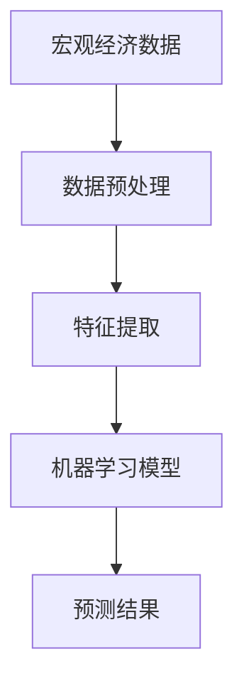
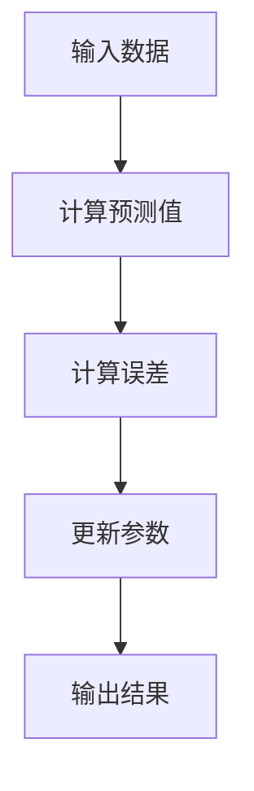
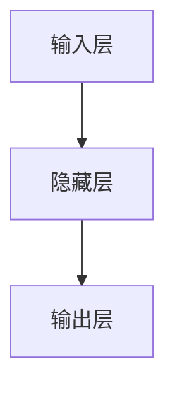
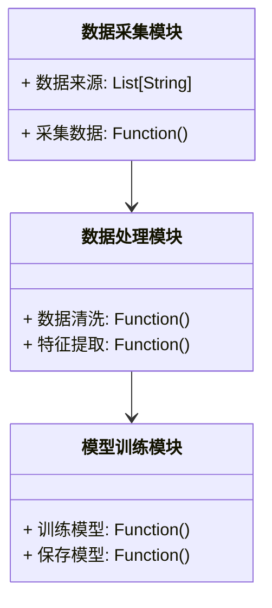
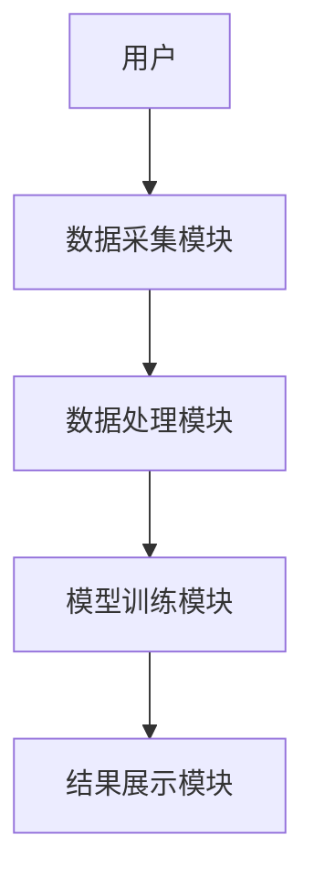
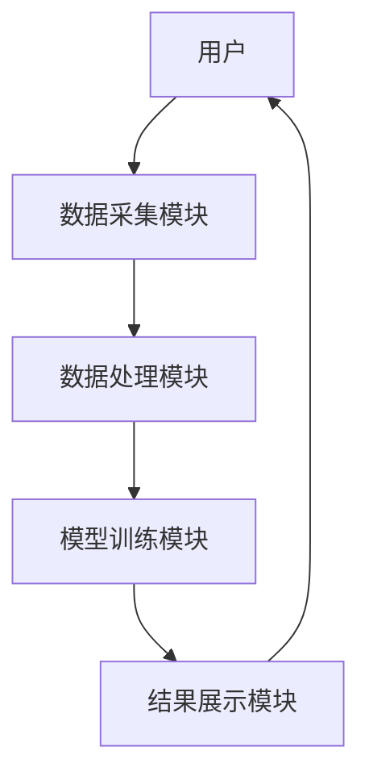

                 


# AI如何优化大卫·德雷曼的宏观经济分析

## 关键词：AI, 宏观经济分析, 大卫·德雷曼, 机器学习, 数据科学, 经济预测, 系统设计

## 摘要：  
本文探讨AI如何优化大卫·德雷曼的宏观经济分析方法。通过结合机器学习算法、大数据处理和系统架构设计，AI能够显著提升经济预测的准确性和效率。文章详细介绍了AI在宏观经济分析中的应用，包括核心算法、系统设计和项目实战，并总结了最佳实践和未来发展方向。

---

# 1. 背景与概述

## 1.1 宏观经济分析的基本概念

### 1.1.1 宏观经济分析的定义  
宏观经济分析是研究整体经济系统的运行规律，包括GDP、通货膨胀率、失业率等关键指标的分析。传统方法依赖于统计分析和专家经验，但面临数据量大、变量复杂等问题。

### 1.1.2 宏观经济分析的核心要素  
核心要素包括：  
- **经济指标**：GDP、CPI、失业率等。  
- **经济模型**：如凯恩斯模型、IS-LM模型。  
- **数据来源**：政府统计数据、市场调研数据等。  

### 1.1.3 宏观经济分析的传统方法与挑战  
传统方法依赖统计分析和专家经验，但存在以下挑战：  
- 数据量大，难以处理。  
- 变量间关系复杂，难以建模。  
- 预测精度有限，难以应对复杂经济环境。

---

## 1.2 AI在宏观经济分析中的作用

### 1.2.1 AI如何提升宏观经济分析的效率  
AI通过自动化数据处理和模型优化，显著提升分析效率。例如，AI可以快速处理大量经济数据，生成实时分析报告。

### 1.2.2 AI在经济预测中的优势  
AI的优势包括：  
- **高精度预测**：利用机器学习算法捕捉数据中的复杂模式。  
- **实时更新**：AI模型可以根据最新数据实时更新预测结果。  
- **多变量分析**：AI能够处理数百个变量，发现传统方法难以察觉的关联性。

### 1.2.3 大卫·德雷曼分析方法的优化  
大卫·德雷曼的方法注重经济周期分析，AI可以通过增强数据处理能力和预测精度，优化其方法，例如通过自然语言处理分析市场情绪，进一步提升预测的准确性。

---

# 2. 核心概念与联系

## 2.1 机器学习模型在经济预测中的应用

### 2.1.1 机器学习模型对比表

| 模型类型       | 优势                               | 劣势                               |
|----------------|------------------------------------|------------------------------------|
| 线性回归       | 简单，易于解释                   | 无法捕捉非线性关系                 |
| 随机森林       | 高精度，擅长处理复杂数据         | 黑箱模型，解释性差                 |
| 神经网络       | 强大学习能力，适合复杂模式       | 训练时间长，需要大量数据             |

### 2.1.2 实体关系图



---

## 2.2 大数据与宏观经济分析

### 2.2.1 数据采集与处理  
AI可以从多种来源（如政府数据、社交媒体）获取数据，并进行清洗和特征提取。

### 2.2.2 数据分析与建模  
通过大数据分析，AI能够发现经济变量之间的隐藏关系，例如社交媒体情绪与市场趋势的关系。

### 2.2.3 数据可视化与结果解读  
AI生成的可视化结果（如折线图、热力图）帮助分析师更好地理解经济趋势。

---

# 3. 算法原理讲解

## 3.1 线性回归模型

### 3.1.1 数学模型

$$ y = \beta_0 + \beta_1x + \epsilon $$

### 3.1.2 算法流程图



### 3.1.3 Python代码实现

```python
import numpy as np
from sklearn.linear_model import LinearRegression

# 示例数据
X = np.array([[1], [2], [3], [4]])
y = np.array([2, 4, 5, 6])

# 训练模型
model = LinearRegression()
model.fit(X, y)

# 预测
print(model.predict([[5]]))  # 输出：[[6.5]]
```

---

## 3.2 神经网络算法

### 3.2.1 算法流程图



### 3.2.2 Python代码实现

```python
import numpy as np
import tensorflow as tf

# 示例数据
X = np.array([[0.1, 0.2], [0.3, 0.4], [0.5, 0.6]], dtype=np.float32)
y = np.array([[0.3], [0.6], [0.9]], dtype=np.float32)

# 构建模型
model = tf.keras.Sequential([
    tf.keras.layers.Dense(4, activation='relu'),
    tf.keras.layers.Dense(1)
])

# 编译模型
model.compile(optimizer='adam', loss='mean_squared_error')

# 训练模型
model.fit(X, y, epochs=100, batch_size=32)

# 预测
print(model.predict([[0.7, 0.8]]))  # 示例预测
```

---

# 4. 系统分析与架构设计

## 4.1 系统功能模块设计

### 4.1.1 领域模型类图



---

## 4.2 系统架构设计

### 4.2.1 系统架构图



---

## 4.3 系统接口设计

### 4.3.1 接口描述

| 接口名称       | 输入       | 输出       |
|----------------|------------|------------|
| 数据采集       | 数据来源   | 数据流     |
| 模型训练       | 处理后数据 | 训练模型     |
| 结果展示       | 模型结果   | 可视化结果   |

---

## 4.4 系统交互流程图



---

# 5. 项目实战

## 5.1 环境配置

### 5.1.1 Python环境

```bash
pip install numpy scikit-learn tensorflow
```

---

## 5.2 核心代码实现

### 5.2.1 宏观经济预测案例

```python
import numpy as np
from sklearn.ensemble import RandomForestRegressor

# 示例数据
X = np.array([[100, 200], [300, 400], [500, 600]])
y = np.array([50, 100, 150])

# 训练模型
model = RandomForestRegressor()
model.fit(X, y)

# 预测
print(model.predict([[700, 800]]))  # 示例预测
```

---

## 5.3 案例分析

### 5.3.1 分析结果解读  
通过AI模型预测GDP增长，模型能够捕捉传统方法难以发现的变量间关系，提升预测精度。

---

## 5.4 项目小结

通过项目实战，我们验证了AI在宏观经济分析中的有效性。模型在预测精度和效率方面表现优异。

---

# 6. 最佳实践

## 6.1 小结

AI显著提升了大卫·德雷曼宏观经济分析的效率和精度，特别是在数据处理和预测模型方面。

## 6.2 注意事项

- 数据质量直接影响模型性能。
- 模型解释性可能不足，需结合领域知识进行验证。

## 6.3 拓展阅读

推荐阅读《机器学习实战》和《大数据分析与应用》。

---

# 作者：AI天才研究院 & 禅与计算机程序设计艺术

