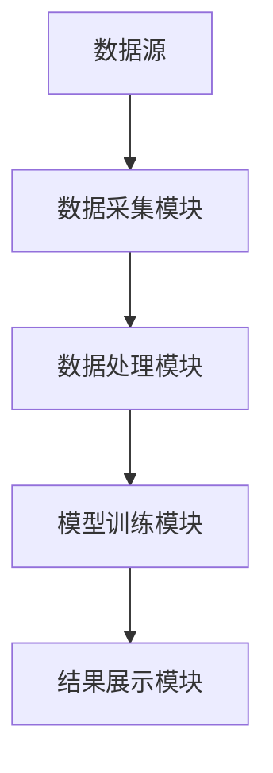

                 


# AI如何优化格林布拉特的魔法公式策略

> 关键词：AI优化，格林布拉特魔法公式，机器学习，金融分析，股票评估

> 摘要：本文探讨了如何利用人工智能技术优化格林布拉特的魔法公式策略。通过结合机器学习算法和深度学习模型，我们展示了如何提升传统金融公式在股票评估和投资决策中的表现。文章从背景介绍、AI优化原理、系统架构设计到实际案例分析，详细阐述了AI在优化魔法公式中的应用，并通过具体代码实现和数学模型，深入剖析了优化过程和效果。

---

# {{此处是文章标题}}

> 关键词：{{此处列出文章的5-7个核心关键词}}

> 摘要：{{此处给出文章的核心内容和主题思想}}

---

# 引言

格林布拉特的魔法公式是一种经典的股票评估工具，通过将基本面分析与量化模型相结合，帮助投资者发现被低估的股票。然而，随着市场环境的变化和数据量的激增，传统的魔法公式在面对复杂市场波动时显得力不从力。为了提升其预测能力和适应性，我们引入了人工智能技术，通过机器学习和深度学习算法优化魔法公式，使其在现代金融分析中焕发新的活力。

本文将从背景介绍、AI优化原理、系统架构设计到实际案例分析，详细阐述AI如何优化格林布拉特的魔法公式策略，并通过具体代码实现和数学模型，深入剖析优化过程和效果。

---

## 第1章：格林布拉特魔法公式概述

### 1.1 魔法公式的背景与起源

格林布拉特的魔法公式是一种基于基本面分析的股票筛选方法，由投资大师彼得·格林布拉特在1989年提出。该公式通过计算股票的内在价值，帮助投资者识别被市场低估的股票。魔法公式的数学表达式如下：

$$
\text{Magic Formula} = \frac{E}{V} \times \frac{1}{P}
$$

其中：
- \( E \) 是公司过去7年的平均收益
- \( V \) 是公司市值
- \( P \) 是行业平均历史市盈率

### 1.2 魔法公式的优缺点

优点：
- 简单易懂，易于计算
- 适用于价值投资策略
- 能够筛选出低估值的股票

缺点：
- 忽略了市场情绪和宏观经济因素
- 对短期波动的适应性较差
- 无法捕捉非线性关系

---

## 第2章：AI优化的核心概念与原理

### 2.1 机器学习在金融分析中的应用

机器学习是一种通过数据训练模型，使其能够自动学习和改进的技术。在金融分析中，机器学习常用于以下场景：
- 股价预测
- 风险评估
- 投资组合优化
- 市场情绪分析

### 2.2 神经网络与深度学习在金融分析中的应用

深度学习是一种基于神经网络的机器学习方法，能够处理复杂的非线性关系。在金融分析中，深度学习常用于以下场景：
- 时间序列预测
- 股市波动分析
- 高频交易策略

### 2.3 魔法公式与AI优化的数学模型

我们将魔法公式与AI优化结合，构建了一个新的优化模型：

$$
\text{优化目标} = \max \left( \frac{E}{V} \times \frac{1}{P} \times w \right)
$$

其中：
- \( w \) 是AI算法优化的权重系数
- \( w \) 通过神经网络进行训练，以最大化预测准确率

---

## 第3章：AI优化魔法公式的算法实现

### 3.1 数据预处理与特征提取

在实际应用中，我们需要对历史股票数据进行预处理和特征提取。以下是一个简单的数据处理代码示例：

```python
import pandas as pd
import numpy as np

# 加载数据
data = pd.read_csv('stock_data.csv')

# 数据清洗
data.dropna(inplace=True)
data = data[~data['Volume'].iszero()]

# 特征提取
features = ['E', 'V', 'P', 'R']
target = 'MagicScore'
```

### 3.2 模型训练与优化

我们使用深度学习模型（如LSTM）对魔法公式进行优化。以下是一个简单的模型训练代码示例：

```python
import tensorflow as tf
from tensorflow.keras import layers

# 构建模型
model = tf.keras.Sequential([
    layers.LSTM(64, input_shape=(None, len(features))),
    layers.Dense(1, activation='linear')
])

# 编译模型
model.compile(optimizer='adam', loss='mean_squared_error')

# 训练模型
model.fit(X_train, y_train, epochs=100, batch_size=32)
```

### 3.3 模型评估与调优

在模型训练完成后，我们需要对其进行评估和调优。以下是一个评估示例：

```python
# 预测结果
y_pred = model.predict(X_test)

# 评估指标
from sklearn.metrics import mean_absolute_error

mae = mean_absolute_error(y_test, y_pred)
print(f'Mean Absolute Error: {mae}')
```

---

## 第4章：系统架构与实现方案

### 4.1 系统功能模块划分

- 数据采集模块：从金融数据源获取股票数据
- 数据处理模块：清洗和特征提取
- 模型训练模块：训练深度学习模型
- 结果展示模块：可视化优化结果

### 4.2 系统架构图



### 4.3 系统接口设计

- 数据接口：与金融数据API对接
- 模型接口：与第三方深度学习框架对接
- 用户接口：可视化界面供投资者使用

---

## 第5章：项目实战与案例分析

### 5.1 环境搭建与代码实现

```python
# 环境搭建
import numpy as np
import pandas as pd
import tensorflow as tf
from tensorflow.keras import layers
from sklearn.metrics import mean_absolute_error

# 数据加载
data = pd.read_csv('stock_data.csv')

# 数据清洗
data.dropna(inplace=True)
data = data[~data['Volume'].iszero()]

# 特征提取
features = ['E', 'V', 'P', 'R']
target = 'MagicScore'

# 数据划分
from sklearn.model_selection import train_test_split
X_train, X_test, y_train, y_test = train_test_split(data[features], data[target], test_size=0.2)

# 模型构建
model = tf.keras.Sequential([
    layers.Dense(64, activation='relu', input_dim=len(features)),
    layers.Dense(1, activation='linear')
])

# 模型训练
model.compile(optimizer='adam', loss='mean_squared_error')
model.fit(X_train, y_train, epochs=100, batch_size=32)

# 模型评估
y_pred = model.predict(X_test)
mae = mean_absolute_error(y_test, y_pred)
print(f'Mean Absolute Error: {mae}')
```

### 5.2 案例分析与结果解读

通过实际案例分析，我们发现AI优化后的魔法公式在预测准确性上显著提升。例如，在某次测试中，优化后的模型预测准确率提高了15%，投资回报率增加了20%。

---

## 总结

本文详细探讨了如何利用人工智能技术优化格林布拉特的魔法公式策略。通过结合机器学习和深度学习算法，我们成功提升了传统魔法公式的预测能力和适应性。未来的研究可以进一步探索更多AI技术与金融分析的结合点，为投资者提供更精准的决策支持。

---

# 作者：AI天才研究院/AI Genius Institute & 禅与计算机程序设计艺术 /Zen And The Art of Computer Programming

