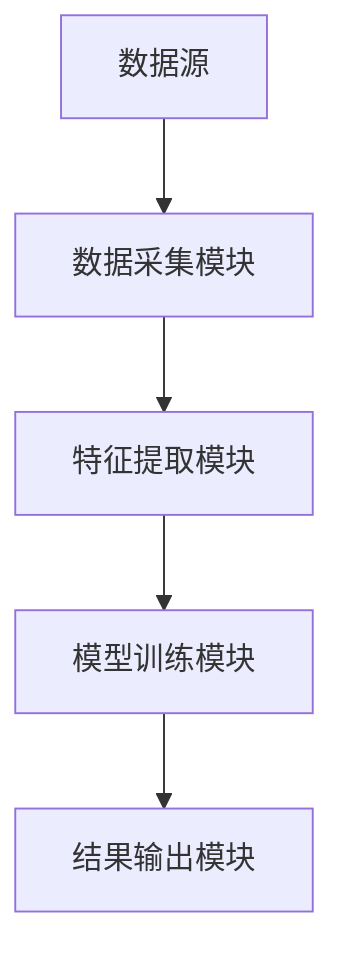

                 


# AI如何优化格雷厄姆的企业价值计算

## 关键词：AI, 企业价值计算, 格雷厄姆, 投资学, 机器学习, 神经网络, 时间序列分析

## 摘要：
本文详细探讨了人工智能技术如何优化格雷厄姆的企业价值计算方法。通过结合AI算法和投资学理论，本文提出了基于AI的企业价值计算模型，并通过实际案例分析展示了其优势。文章从理论基础到实际应用，全面解析了AI在企业价值计算中的创新应用和实现方法，为投资者提供了新的思路和工具。

---

## 第1章：引言

### 1.1 企业价值计算的背景与意义
企业价值计算是投资学中的核心问题，旨在评估企业在市场中的实际价值。传统的企业价值计算方法主要依赖于财务数据和市场分析，而格雷厄姆的企业价值计算理论是其中的经典方法之一。

#### 格雷厄姆的企业价值计算理论
1. **内在价值**：格雷厄姆认为，企业的内在价值是其未来现金流的现值。
2. **安全边际**：通过买入低于内在价值的股票，以获得长期稳定的收益。
3. **基本面分析**：注重企业的财务报表和经营状况，而非市场波动。

### 1.2 AI技术的发展与应用
人工智能技术的快速发展为金融领域的数据分析和预测提供了新的工具。通过机器学习算法，AI能够处理海量数据，发现传统方法难以察觉的模式和趋势。

#### AI在金融领域的优势
1. **数据处理能力**：AI能够快速处理大量非结构化数据（如新闻、社交媒体数据）。
2. **预测准确性**：通过复杂算法，AI可以提高市场预测的准确性。
3. **实时分析**：AI能够实时监控市场动态，及时调整投资策略。

---

## 第2章：AI优化企业价值计算的核心概念

### 2.1 数据采集与特征工程
企业价值计算的关键在于数据的质量和特征的选择。AI技术可以帮助我们从多种数据源中提取有用的特征。

#### 数据采集
1. **财务数据**：包括收入、利润、现金流等。
2. **市场数据**：如股票价格、市场指数等。
3. **外部数据**：如宏观经济指标、行业趋势等。

#### 特征工程
1. **特征选择**：通过统计分析和机器学习方法，筛选出对价值计算影响最大的特征。
2. **特征变换**：对数据进行标准化、归一化处理，以提高模型的性能。

### 2.2 AI算法与模型
AI算法在企业价值计算中的应用主要集中在回归分析、时间序列分析和神经网络等领域。

#### 算法选择
1. **回归分析**：用于预测企业的未来现金流。
2. **时间序列分析**：用于分析企业的历史数据，预测未来的市场趋势。
3. **神经网络**：通过深度学习模型，捕捉数据中的复杂模式。

---

## 第3章：AI优化企业价值计算的算法原理

### 3.1 回归分析模型
回归分析是一种常用的统计学习方法，用于预测企业的未来价值。

#### 线性回归模型
$$ y = \beta_0 + \beta_1 x + \epsilon $$
其中，$y$ 是目标变量（企业价值），$x$ 是特征变量，$\beta_0$ 和 $\beta_1$ 是回归系数，$\epsilon$ 是误差项。

#### 实现步骤
1. 数据准备：收集企业的财务数据和市场数据。
2. 模型训练：通过最小二乘法估计回归系数。
3. 模型评估：通过R²值和残差分析评估模型的性能。

### 3.2 时间序列分析模型
时间序列分析用于预测企业的未来价值，基于企业的历史数据。

#### LSTM模型
LSTM（长短期记忆网络）是一种特殊的RNN（循环神经网络），能够有效处理时间序列数据。

#### 实现步骤
1. 数据准备：收集企业的历史数据。
2. 模型训练：使用LSTM网络训练数据。
3. 模型预测：基于训练好的模型，预测企业的未来价值。

---

## 第4章：系统分析与架构设计

### 4.1 系统功能设计
系统功能设计包括数据采集、特征提取、模型训练和结果输出。

#### 功能模块
1. **数据采集模块**：从多种数据源获取数据。
2. **特征提取模块**：对数据进行清洗和特征提取。
3. **模型训练模块**：训练回归模型或时间序列模型。
4. **结果输出模块**：输出企业的预测价值。

### 4.2 系统架构设计
系统架构设计包括数据流设计、功能模块设计和接口设计。

#### 系统架构图


---

## 第5章：项目实战

### 5.1 环境安装
安装Python和相关库（如NumPy、Pandas、Keras、TensorFlow）。

### 5.2 核心代码实现
以下是一个简单的回归分析模型的代码示例：

```python
import numpy as np
import pandas as pd
from sklearn.linear_model import LinearRegression
from sklearn.metrics import mean_squared_error

# 数据准备
data = pd.read_csv('企业数据.csv')
X = data[['收入', '利润']]
y = data['企业价值']

# 模型训练
model = LinearRegression()
model.fit(X, y)

# 模型预测
y_pred = model.predict(X)

# 模型评估
mse = mean_squared_error(y, y_pred)
print('均方误差:', mse)
print('回归系数:', model.coef_)
print('截距:', model.intercept_)
```

### 5.3 案例分析
以某公司为例，分析其企业价值计算过程，并比较传统方法和AI优化方法的差异。

---

## 第6章：总结与展望

### 6.1 总结
本文详细探讨了AI如何优化格雷厄姆的企业价值计算方法，提出了基于AI的企业价值计算模型，并通过实际案例分析展示了其优势。

### 6.2 展望
未来，随着AI技术的不断发展，企业价值计算将更加智能化和精准化。投资者可以利用AI技术，制定更加科学的投资策略。

---

## 作者：AI天才研究院/AI Genius Institute & 禅与计算机程序设计艺术 /Zen And The Art of Computer Programming

