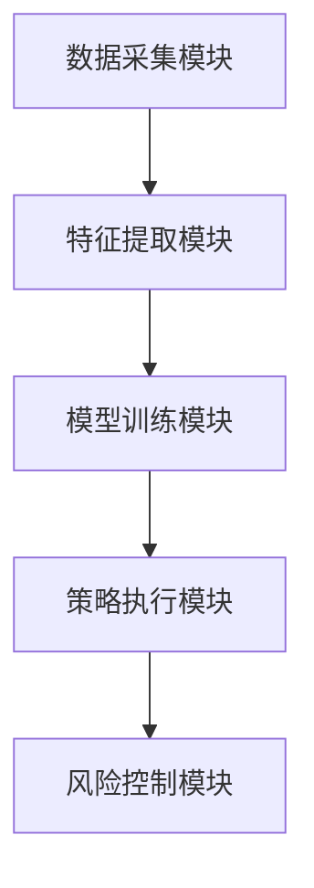

                 

# AI如何优化格雷厄姆的净净股策略

> **关键词**: 价值投资、净净股策略、人工智能、机器学习、投资优化

> **摘要**: 本文探讨了如何利用人工智能技术优化格雷厄姆的净净股策略，通过数据分析、特征工程和机器学习模型的构建，展示了AI在提升投资策略效果和效率方面的潜力。文章从净净股策略的基本原理出发，逐步分析了AI优化的核心概念、算法原理、系统架构设计，并通过实际案例展示了AI优化的实战应用。

---

## 第1章: 价值投资与净净股策略概述

### 1.1 价值投资的定义与核心理念

价值投资是一种长期投资策略，其核心理念是通过分析企业的内在价值，寻找市场价格低于内在价值的股票进行投资。这种策略强调安全边际和长期持有的理念，旨在通过长期稳定的收益实现财富增长。

#### 1.1.1 净净股策略的核心要素

格雷厄姆提出的净净股策略是价值投资的重要组成部分，其核心要素包括以下几点：

1. **净收益分析**: 通过分析企业的净利润、净资产收益率等指标，评估企业的盈利能力。
2. **市场价格与内在价值对比**: 计算股票的内在价值（如市净率、市盈率等指标），并与市场价格进行对比。
3. **安全边际**: 确保买入价格低于内在价值，以降低投资风险。

### 1.2 AI在投资领域的应用前景

随着大数据和人工智能技术的发展，AI在金融领域的应用越来越广泛。通过AI技术，投资者可以更高效地处理海量数据、发现市场趋势、优化投资策略。

#### 1.2.1 AI如何优化净净股策略

AI优化净净股策略的核心在于通过机器学习算法，对影响股票价值的多种因素进行建模和预测，从而更准确地评估股票的内在价值。具体而言，AI优化的步骤包括：

1. **数据特征提取**: 从财务报表、市场数据、行业趋势等多维度提取特征。
2. **模型训练**: 使用机器学习算法（如随机森林、支持向量机等）构建预测模型。
3. **策略优化**: 根据模型预测结果，优化买入和卖出时机，降低投资风险。

---

## 第2章: 净净股策略与AI优化的核心概念

### 2.1 净净股策略的数学模型

#### 2.1.1 净值比率计算公式

净值比率（Net Multiple）是格雷厄姆提出的用来衡量股票价值的重要指标，公式如下：

$$ \text{净多重率} = \frac{\text{市场价格}}{\text{内在价值}} $$

当净多重率低于1时，意味着市场价格低于内在价值，此时可能是买入的好时机。

#### 2.1.2 市场价与内在价值的对比

通过计算股票的市场价格与内在价值的对比，投资者可以判断股票是否被低估或高估。例如，假设某股票的市场价格为10元，内在价值为12元，则市场价格低于内在价值，此时可能是买入的好时机。

### 2.2 AI优化的核心算法

#### 2.2.1 机器学习在投资中的应用

机器学习算法可以通过历史数据，预测股票的未来走势。例如，使用线性回归模型预测股票价格的变化趋势，或者使用随机森林模型分析多维数据特征对股票价格的影响。

#### 2.2.2 常见的AI优化算法

- **线性回归**: 用于预测股票价格的趋势。
- **随机森林**: 用于分析多维数据特征对股票价格的影响。
- **支持向量机 (SVM)**: 用于分类问题，例如判断股票是否被低估或高估。

### 2.3 净净股策略与AI优化的结合

#### 2.3.1 数据特征提取

通过AI技术，可以从大量的财务数据和市场数据中提取关键特征，例如：

1. **财务指标**: 如净利润、营业收入、资产负债率等。
2. **市场指标**: 如市盈率、市净率、市值等。
3. **行业趋势**: 如行业增长率、行业竞争格局等。

#### 2.3.2 模型训练与优化

通过机器学习算法，构建股票价值预测模型。例如，使用随机森林模型，将多个特征输入模型，训练出股票的内在价值预测模型。

#### 2.3.3 模型评估与验证

通过回测（backtesting）验证模型的预测能力。例如，使用历史数据验证模型的预测准确率，并根据回测结果优化模型参数。

---

## 第3章: AI优化净净股策略的算法原理

### 3.1 机器学习模型的数学基础

#### 3.1.1 线性回归模型

线性回归是一种常用的回归分析方法，其基本假设是因变量与自变量之间存在线性关系。例如，可以使用线性回归模型预测股票价格的变化趋势。

$$ y = \beta_0 + \beta_1 x + \epsilon $$

其中，$y$ 是预测目标，$x$ 是自变量，$\beta_0$ 和 $\beta_1$ 是回归系数，$\epsilon$ 是误差项。

#### 3.1.2 随机森林模型

随机森林是一种基于决策树的集成学习算法，通过构建多个决策树并取其平均，可以有效提高模型的预测准确率和稳定性。

$$ y = \text{median}(\{y_1, y_2, \dots, y_n\}) $$

其中，$y_i$ 是每棵决策树的预测结果。

### 3.2 净净股价值预测的数学公式

通过机器学习模型，可以预测股票的内在价值。例如，使用随机森林模型，将多个财务指标和市场指标输入模型，输出股票的内在价值预测值。

$$ \text{内在价值} = f(\text{净利润, 营业收入, 资产负债率, \dots}) $$

其中，$f$ 是随机森林模型。

---

## 第4章: AI优化净净股策略的系统架构设计

### 4.1 系统功能模块设计

AI优化的净净股策略系统可以分为以下几个功能模块：

1. **数据采集模块**: 从数据源（如金融数据库、市场数据）获取相关数据。
2. **特征提取模块**: 对数据进行特征提取，生成可用于模型训练的特征向量。
3. **模型训练模块**: 使用机器学习算法训练股票价值预测模型。
4. **策略执行模块**: 根据模型预测结果，生成买入或卖出信号。
5. **风险控制模块**: 对投资组合进行风险评估和优化。

### 4.2 系统架构设计图

---

## 第5章: AI优化净净股策略的项目实战

### 5.1 环境安装与数据获取

1. **环境安装**: 安装Python、Pandas、Scikit-learn等依赖库。
2. **数据获取**: 从金融数据库获取历史股价、财务数据等。

### 5.2 特征工程与模型训练

1. **数据预处理**: 对数据进行清洗、标准化等处理。
2. **特征选择**: 选择影响股票价值的关键特征。
3. **模型训练**: 使用随机森林模型训练股票价值预测模型。

### 5.3 模型评估与优化

1. **模型评估**: 使用回测方法验证模型的预测能力。
2. **模型优化**: 根据回测结果优化模型参数。

---

## 第6章: 总结与展望

### 6.1 本章小结

通过AI技术优化格雷厄姆的净净股策略，可以显著提高投资策略的效率和准确性。AI技术的应用不仅能够处理海量数据，还能发现传统方法难以捕捉的市场趋势和投资机会。

### 6.2 最佳实践

1. 在实际投资中，建议结合多种技术指标和市场信息，综合评估股票的投资价值。
2. 定期对模型进行回测和优化，确保模型的预测能力。

### 6.3 注意事项

1. AI模型的预测结果仅供参考，实际投资需结合市场环境和风险偏好。
2. 投资者应具备一定的金融知识，避免盲目依赖AI模型。

### 6.4 拓展阅读

1. 《股票作手回忆录》：了解股票市场的历史与投资心理。
2. 《机器学习实战》：深入学习机器学习算法的实现与应用。

---

## 作者：AI天才研究院/AI Genius Institute & 禅与计算机程序设计艺术 /Zen And The Art of Computer Programming

