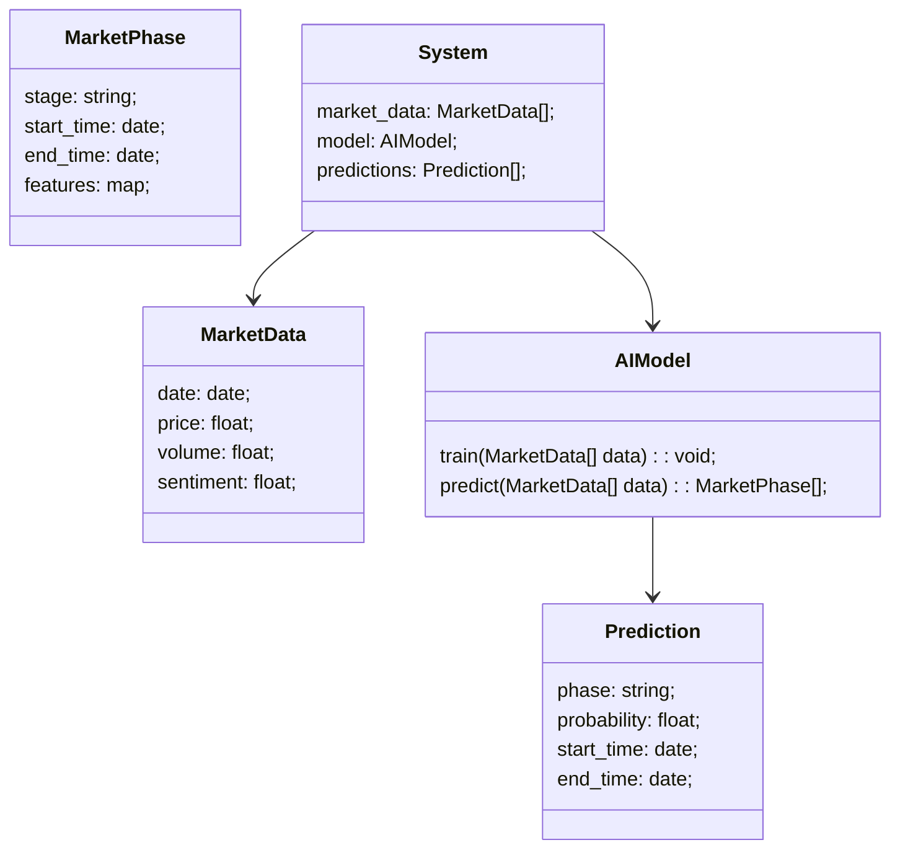
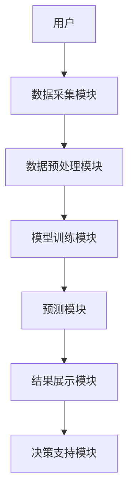
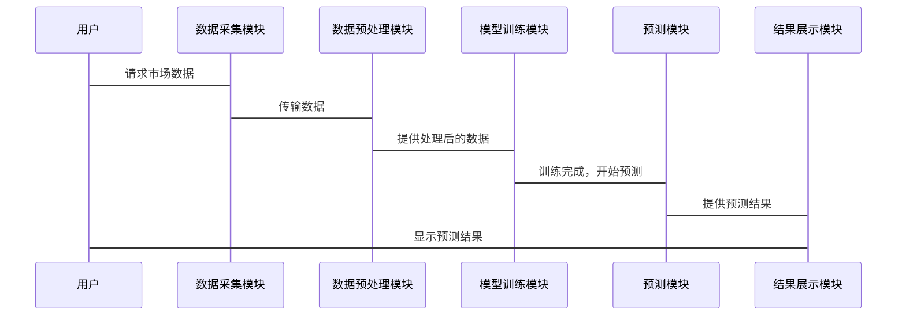

                 


# AI如何优化霍华德·马克斯的市场周期理论

## 关键词
霍华德·马克斯，市场周期理论，人工智能，金融分析，投资策略

## 摘要
本文探讨了如何利用人工智能技术优化霍华德·马克斯的市场周期理论。通过分析市场周期的特征，结合AI算法，提出了一种基于数据驱动的市场周期预测方法，并设计了一个AI辅助的市场周期分析系统。文章详细介绍了系统的架构、功能及实现案例，展示了AI如何提升市场周期分析的准确性和效率，为投资者提供了新的视角和工具。

---

## 第一部分: AI与市场周期理论的结合

### 第1章: 市场周期理论的背景与AI的引入

#### 1.1 市场周期理论概述

##### 1.1.1 霍华德·马克斯的市场周期理论核心观点
霍华德·马克斯的市场周期理论强调市场的周期性波动，认为市场参与者的情绪变化是驱动市场周期的核心因素。市场周期通常分为四个阶段：复苏、繁荣、衰退和萧条。每个阶段都有其独特的特征，例如复苏阶段市场逐渐恢复，繁荣阶段市场参与者乐观，衰退阶段市场开始下滑，萧条阶段市场情绪低落。

##### 1.1.2 市场周期理论的现实意义
市场周期理论为投资者提供了理解市场波动的框架，帮助他们在不同市场阶段做出相应的投资决策。然而，传统的市场周期分析依赖于主观判断和经验，难以量化和精确预测。

##### 1.1.3 AI技术在金融领域的应用现状
人工智能（AI）技术在金融领域的应用日益广泛，包括股票预测、风险管理、市场情绪分析等。AI能够处理大量数据，识别复杂模式，并提供实时反馈，为市场周期分析提供了新的可能性。

#### 1.2 AI在市场周期分析中的作用

##### 1.2.1 AI技术的基本原理
人工智能通过机器学习算法，从大量数据中学习特征，构建预测模型。常用的算法包括回归分析、聚类分析、时间序列分析等。

##### 1.2.2 AI如何优化市场周期理论
AI能够通过数据分析量化市场周期的特征，识别潜在的市场拐点，并提供实时预测。AI的引入使市场周期分析更加客观、精确和高效。

##### 1.2.3 AI在市场周期预测中的优势
AI能够处理海量数据，发现人类难以察觉的模式，提供高精度的预测。此外，AI模型能够实时更新，适应市场的动态变化。

#### 1.3 本章小结
本章介绍了霍华德·马克斯的市场周期理论及其现实意义，探讨了AI技术在金融领域的应用，强调了AI在优化市场周期分析中的潜力。

---

### 第2章: 市场周期的特征与AI分析方法

#### 2.1 市场周期的特征分析

##### 2.1.1 市场周期的四个阶段
复苏阶段：市场逐渐恢复，投资者信心回升。  
繁荣阶段：市场参与者乐观，资产价格上升。  
衰退阶段：市场开始下滑，投资者信心下降。  
萧条阶段：市场情绪低落，资产价格下降。

##### 2.1.2 市场参与者的心理变化
市场周期的变化与投资者心理密切相关。在繁荣阶段，投资者过度乐观；在衰退阶段，投资者过度悲观。

##### 2.1.3 市场波动的规律性
市场波动具有一定的周期性，AI可以通过分析历史数据，识别这些周期性规律。

#### 2.2 AI在市场周期分析中的方法

##### 2.2.1 数据驱动的市场周期识别
AI通过分析历史价格、成交量、情绪指标等数据，识别市场的周期性特征。

##### 2.2.2 基于机器学习的市场预测
使用机器学习算法，如支持向量机（SVM）、随机森林（Random Forest）等，构建市场周期预测模型。

##### 2.2.3 自然语言处理在市场情绪分析中的应用
通过自然语言处理技术，分析新闻、社交媒体等文本数据，捕捉市场情绪的变化。

#### 2.3 市场周期与AI分析的结合案例

##### 2.3.1 典型市场周期案例分析
以2008年金融危机为例，分析AI如何通过历史数据预测市场的衰退阶段。

##### 2.3.2 AI在案例分析中的应用
使用时间序列分析模型，预测市场的未来走势，并与实际数据对比，验证模型的有效性。

##### 2.3.3 结果对比与优化建议
对比传统方法和AI方法的预测结果，提出优化建议，如结合多模态数据（价格、新闻、情绪等）提高预测精度。

#### 2.4 本章小结
本章详细分析了市场周期的特征，并探讨了AI在市场周期分析中的方法，通过案例分析展示了AI的优势。

---

### 第3章: AI算法在市场周期分析中的应用

#### 3.1 常见AI算法简介

##### 3.1.1 线性回归分析
线性回归是一种简单而有效的预测方法，适用于线性关系的分析。

##### 3.1.2 聚类分析
聚类分析用于将市场数据分成不同的类别，识别市场的不同阶段。

##### 3.1.3 时间序列分析
时间序列分析适用于分析市场的历史数据，预测未来的市场趋势。

#### 3.2 市场周期预测的数学模型

##### 3.2.1 线性回归模型
$$ y = \beta_0 + \beta_1 x + \epsilon $$
其中，$y$是目标变量，$x$是自变量，$\beta_0$和$\beta_1$是回归系数，$\epsilon$是误差项。

##### 3.2.2 时间序列模型（ARIMA）
ARIMA模型适用于时间序列数据的预测，通过自回归和移动平均成分建模。

##### 3.2.3 长短期记忆网络（LSTM）
LSTM是一种递归神经网络，适用于捕捉时间序列中的长期依赖关系。

#### 3.3 基于机器学习的市场周期预测

##### 3.3.1 数据预处理
包括数据清洗、特征提取、数据标准化等步骤。

##### 3.3.2 模型训练与优化
使用训练数据训练模型，并通过交叉验证优化模型参数。

##### 3.3.3 模型评估与验证
使用测试数据评估模型的性能，常用指标包括均方误差（MSE）、平均绝对误差（MAE）等。

#### 3.4 本章小结
本章介绍了几种常用的AI算法，并详细讲解了市场周期预测的数学模型和实现步骤。

---

### 第4章: 市场周期分析的系统架构设计

#### 4.1 系统架构概述

##### 4.1.1 问题场景介绍
系统旨在帮助投资者利用AI技术优化市场周期分析，提供实时的市场预测和决策支持。

##### 4.1.2 项目介绍
本项目旨在开发一个基于AI的市场周期分析系统，整合多种数据源，提供全面的市场分析工具。

#### 4.2 系统功能设计

##### 4.2.1 领域模型


##### 4.2.2 系统架构设计


##### 4.2.3 系统接口设计
系统提供API接口，方便其他系统调用市场周期分析结果。

##### 4.2.4 系统交互


#### 4.3 本章小结
本章详细设计了市场周期分析系统的架构，包括功能模块、数据流和系统交互。

---

### 第5章: 项目实战

#### 5.1 环境配置

##### 5.1.1 安装Python
安装Python 3.8及以上版本。

##### 5.1.2 安装依赖库
安装必要的Python库，如Pandas、NumPy、Scikit-learn、Keras、TensorFlow等。

#### 5.2 系统核心实现源代码

##### 5.2.1 数据采集模块
```python
import pandas as pd
import requests

def get_market_data(start_date, end_date):
    # 示例：从API获取市场数据
    url = f"https://api.example.com/stock_data?start={start_date}&end={end_date}"
    response = requests.get(url)
    data = response.json()
    df = pd.DataFrame(data)
    return df
```

##### 5.2.2 数据预处理模块
```python
import pandas as pd
from sklearn.preprocessing import StandardScaler

def preprocess_data(df):
    # 提取特征
    features = df[['price', 'volume', 'sentiment']]
    # 标准化处理
    scaler = StandardScaler()
    features_scaled = scaler.fit_transform(features)
    return features_scaled
```

##### 5.2.3 模型训练模块
```python
from sklearn.ensemble import RandomForestClassifier

def train_model(features, labels):
    model = RandomForestClassifier(n_estimators=100, max_depth=10, random_state=42)
    model.fit(features, labels)
    return model
```

##### 5.2.4 预测模块
```python
import numpy as np
from sklearn.metrics import accuracy_score

def predict_phase(model, scaler, new_data):
    # 数据预处理
    features = new_data[['price', 'volume', 'sentiment']]
    features_scaled = scaler.transform(features)
    # 预测阶段
    predicted_phase = model.predict(features_scaled)
    return predicted_phase
```

#### 5.3 案例分析与解读

##### 5.3.1 数据获取
使用上述代码获取某段时间内的市场数据。

##### 5.3.2 数据预处理
对获取的数据进行标准化处理，提取相关特征。

##### 5.3.3 模型训练
使用训练数据训练随机森林模型，识别市场阶段。

##### 5.3.4 模型预测
使用训练好的模型预测未来的市场阶段，并与实际数据对比。

##### 5.3.5 结果分析
分析预测结果，评估模型的准确性和鲁棒性。

#### 5.4 本章小结
本章通过实际案例展示了AI如何优化市场周期分析，提供了系统的实现方法和代码示例。

---

### 第6章: 总结与展望

#### 6.1 总结
本文探讨了如何利用AI技术优化霍华德·马克斯的市场周期理论，提出了基于数据驱动的市场周期预测方法，并设计了一个AI辅助的市场周期分析系统。通过案例分析展示了AI在市场周期分析中的优势。

#### 6.2 未来研究方向

##### 6.2.1 多模态数据的整合
整合更多的数据源，如新闻、社交媒体、宏观经济指标等，提高预测的准确性。

##### 6.2.2 高频交易的应用
研究AI在高频交易中的应用，实时捕捉市场机会。

##### 6.2.3 模型的可解释性
提高AI模型的可解释性，帮助投资者更好地理解市场周期的变化。

#### 6.3 最佳实践 Tips

##### 6.3.1 数据质量
确保数据的准确性和完整性，避免噪声数据的影响。

##### 6.3.2 模型选择
根据具体问题选择合适的模型，避免过度复杂化。

##### 6.3.3 持续优化
定期更新模型，适应市场的变化。

#### 6.4 本章小结
本章总结了本文的主要内容，提出了未来的研究方向，并提供了最佳实践建议。

---

## 作者：AI天才研究院/AI Genius Institute & 禅与计算机程序设计艺术/Zen And The Art of Computer Programming

