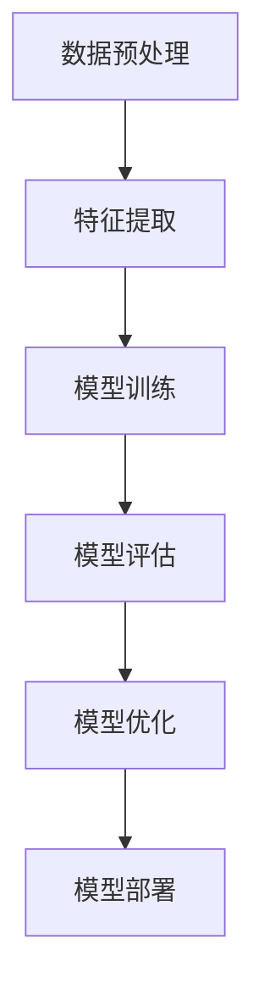
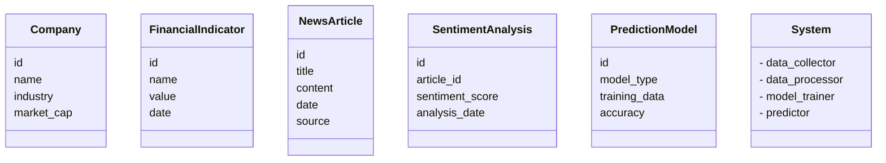
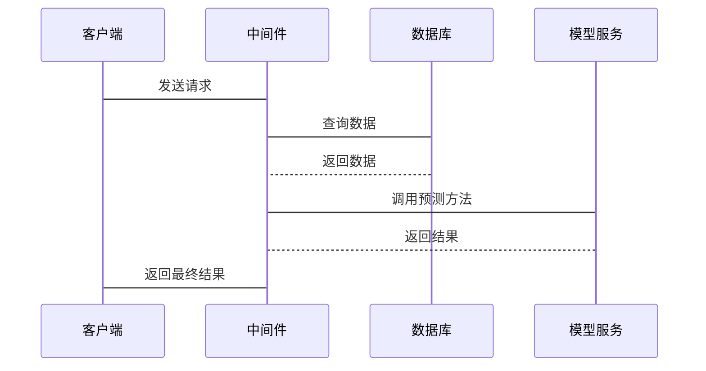

                 


```markdown
# AI如何增强巴菲特的商业分析方法

## 关键词
AI，巴菲特，商业分析，投资策略，机器学习，深度学习

## 摘要
本文探讨了如何利用人工智能技术增强巴菲特的经典商业分析方法。通过详细分析巴菲特的投资理念和AI技术的特点，结合实际案例，展示了AI在数据处理、预测模型构建和风险评估等方面的优势。文章还介绍了具体的算法实现、系统架构设计以及项目实战，为读者提供了全面的指导。

---

# 第一部分: 背景与核心概念

## 第1章: 巴菲特商业分析方法的AI增强背景

### 1.1 巴菲特投资理念的核心要素
1. **价值投资**：寻找具有持续竞争优势的企业，长期持有。
2. **基本面分析**：关注企业的财务报表、盈利能力、市场地位等。
3. **安全边际**：买入价格低于内在价值，以降低风险。

### 1.2 AI在商业分析中的潜力
1. **数据驱动决策**：利用大数据和机器学习模型，提升分析的准确性和效率。
2. **实时监控与预测**：通过AI实时跟踪市场动态，预测企业未来的财务表现。
3. **多维度分析**：结合文本分析、图像识别等技术，进行全面的企业评估。

### 1.3 巴菲特分析方法的局限性
1. **数据量限制**：传统方法依赖于少量财务数据，无法充分利用市场中的海量信息。
2. **主观判断**：分析师的主观判断可能影响决策的客观性。
3. **时间效率**：手动分析耗时长，难以应对快速变化的市场。

---

## 第2章: 核心概念与联系

### 2.1 巴菲特分析方法的数学模型
#### 2.1.1 企业价值评估公式
$$
\text{企业价值} = \text{净利润} \times \text{市盈率倍数}
$$

#### 2.1.2 现金流折现模型
$$
\text{企业价值} = \sum_{t=1}^{n} \frac{\text{现金流}_t}{(1 + r)^t}
$$
其中，\( r \) 是折现率，\( t \) 是时间周期。

#### 2.1.3 市盈率与市净率的比较
| 指标 | 定义 | 适用场景 |
|------|------|----------|
| 市盈率 | 市价/每股收益 | 用于评估企业盈利能力 |
| 市净率 | 市价/每股净资产 | 用于评估企业资产质量 |

### 2.2 AI算法的原理与特点
#### 2.2.1 机器学习模型
- **监督学习**：通过标签数据训练模型，预测未来趋势。
- **无监督学习**：发现数据中的隐藏模式，用于市场细分。
- **深度学习**：通过多层神经网络，提取高维特征。

#### 2.2.2 深度学习的特征提取能力
- **卷积神经网络（CNN）**：用于图像识别，分析公司财报中的图表。
- **循环神经网络（RNN）**：用于时间序列分析，预测股票价格。

#### 2.2.3 自然语言处理（NLP）
- **文本分析**：从新闻、财报中提取关键词，分析市场情绪。
- **情感分析**：判断市场对某公司的整体情绪，辅助投资决策。

### 2.3 核心概念的ER实体关系图
```mermaid
erDiagram
    company {
        id
        name
        industry
        market_cap
        revenue
        profit
    }
    financial_indicator {
        id
        name
        value
        date
    }
    news_article {
        id
        title
        content
        date
        source
    }
    sentiment_analysis {
        id
        article_id
        sentiment_score
        analysis_date
    }
    prediction_model {
        id
        model_type
        training_data
        accuracy
    }
```

---

## 第3章: 算法原理讲解

### 3.1 机器学习模型的训练流程


### 3.2 算法实现代码示例
```python
import pandas as pd
from sklearn.model_selection import train_test_split
from sklearn.ensemble import RandomForestRegressor

# 数据加载与预处理
data = pd.read_csv('financial_data.csv')
data = data.dropna()

# 特征与目标分离
X = data[['revenue', 'profit', 'market_cap']]
y = data['target_price']

# 数据分割
X_train, X_test, y_train, y_test = train_test_split(X, y, test_size=0.2)

# 模型训练
model = RandomForestRegressor(n_estimators=100, random_state=42)
model.fit(X_train, y_train)

# 模型预测
y_pred = model.predict(X_test)
```

### 3.3 算法的数学模型与公式
#### 3.3.1 随机森林
- **优势**：抗过拟合能力强，适合多特征数据。
- **公式**：随机森林通过集成多个决策树进行投票或平均，最终得到结果。

#### 3.3.2 线性回归
- **公式**：\( y = \beta_0 + \beta_1x_1 + \beta_2x_2 + \cdots + \beta_nx_n + \epsilon \)
- **应用**：用于简单线性关系的预测。

---

## 第4章: 系统分析与架构设计方案

### 4.1 问题场景介绍
- **目标**：构建一个基于AI的商业分析系统，增强巴菲特的投资决策。
- **用户角色**：投资者、分析师、企业高管。

### 4.2 系统功能设计


### 4.3 系统架构设计


### 4.4 系统接口设计
- **数据接口**：API用于数据采集和存储。
- **预测接口**：API用于模型预测和结果返回。

### 4.5 系统交互设计


---

## 第5章: 项目实战

### 5.1 环境安装与配置
1. **Python**：安装Anaconda或Miniconda。
2. **库依赖**：安装pandas、scikit-learn、tensorflow等。

### 5.2 核心系统实现
```python
# 数据预处理
import pandas as pd
from sklearn.impute import SimpleImputer

data = pd.read_csv('financial_data.csv')
imputer = SimpleImputer(strategy='mean')
data_imputed = imputer.fit_transform(data)

# 模型训练
from sklearn.ensemble import RandomForestClassifier
model = RandomForestClassifier(n_estimators=100)
model.fit(data_imputed, labels)
```

### 5.3 代码实现与解读
- **数据预处理**：处理缺失值和异常值。
- **特征工程**：提取关键特征，如营收增长率、净利润率等。
- **模型训练**：使用随机森林或神经网络进行训练。

### 5.4 案例分析与详细解读
- **案例背景**：选择一家公司，分析其财务数据和市场新闻。
- **AI增强分析**：利用模型预测公司未来股价走势，评估投资价值。

### 5.5 项目小结
- **成功经验**：AI显著提升了分析效率和准确性。
- **挑战与改进**：数据质量和模型解释性需要进一步优化。

---

## 第6章: 最佳实践与小结

### 6.1 最佳实践 tips
1. **数据质量**：确保数据的完整性和准确性。
2. **模型解释性**：选择可解释性较强的模型，便于投资决策。
3. **持续学习**：定期更新模型，适应市场变化。

### 6.2 小结
通过本文的分析，我们看到AI技术能够显著增强巴菲特的商业分析方法，帮助投资者做出更科学的投资决策。

### 6.3 注意事项
- **数据隐私**：遵守相关法律法规，保护数据隐私。
- **模型风险**：AI模型可能存在过拟合或欠拟合的问题，需谨慎使用。

### 6.4 拓展阅读
- 推荐书籍：《投资最重要的ことは何か》（巴菲特）
- 推荐技术书籍：《Hands-On Machine Learning with Scikit-Learn, Keras, and TensorFlow》

---

# 作者：AI天才研究院/AI Genius Institute & 禅与计算机程序设计艺术 /Zen And The Art of Computer Programming
```

