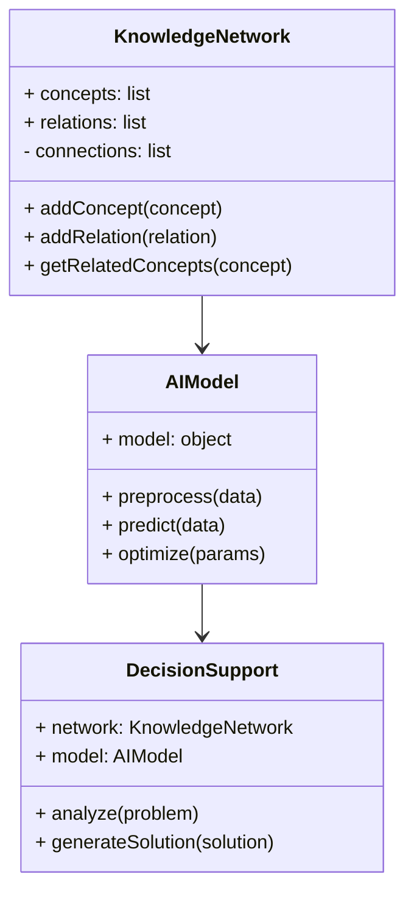
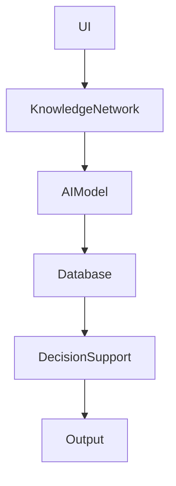
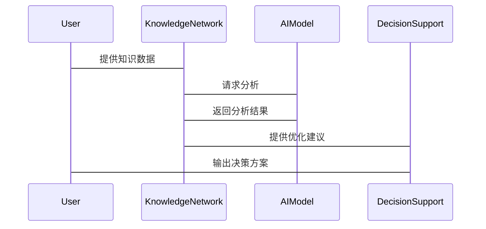

                 


# AI如何增强查理·芒格的多元思维模型

> 关键词：AI，多元思维模型，芒格，知识整合，决策支持，人工智能，系统架构

> 摘要：本文探讨了AI如何增强查理·芒格的多元思维模型，通过技术分析展示了AI在知识整合、决策支持和系统设计中的应用。文章从背景介绍、核心概念、算法原理、系统架构到项目实战，详细阐述了AI与多元思维模型的结合，帮助读者理解其在现代技术中的重要性。

---

## 第1章: 多元思维模型的起源与AI的引入

### 1.1 多元思维模型的定义与特点

#### 1.1.1 多元思维模型的核心概念
多元思维模型（Mental Model）是由查理·芒格提出的一种跨学科思考方法，强调通过多个学科的视角来理解问题，避免单一维度的思维局限。它通过整合不同领域的知识，帮助我们更全面地分析问题，做出更明智的决策。

- **核心概念**：
  - **知识整合**：将不同领域的知识和经验整合到一个统一的框架中。
  - **多维度分析**：从多个角度审视问题，避免单一视角的偏见。
  - **动态调整**：根据实际情况不断更新和优化思维模型。

#### 1.1.2 多元思维模型的特点与优势
- **特点**：
  - **跨学科性**：涵盖经济学、心理学、物理学等多个学科。
  - **系统性**：关注系统整体而非局部。
  - **动态性**：适应变化，不断更新。
- **优势**：
  - 提高决策的准确性和全面性。
  - 增强问题解决的能力。
  - 促进创新思维。

#### 1.1.3 多元思维模型的哲学基础
多元思维模型的哲学基础源于查理·芒格对“人类误判心理学”的研究，强调认识到自己的无知和局限性，通过不断学习和整合知识来弥补这些局限。

### 1.2 AI的基本概念与技术特点

#### 1.2.1 人工智能的定义与分类
- **定义**：人工智能（AI）是模拟人类智能的计算机系统，能够执行如学习、推理、问题解决等任务。
- **分类**：
  - **弱人工智能**：专注于特定任务（如语音识别）。
  - **强人工智能**：具备与人类相当或超越的通用智能。

#### 1.2.2 大模型的崛起与技术突破
- **大模型**：基于深度学习的大型神经网络模型，如GPT-4，具有强大的理解和生成能力。
- **技术突破**：
  - **大数据训练**：利用海量数据优化模型。
  - **分布式计算**：通过并行计算提高训练效率。
  - **模型优化**：如注意力机制的改进。

#### 1.2.3 AI与多元思维模型的结合点
- **结合点**：
  - **知识整合**：AI帮助构建跨学科的知识网络。
  - **模式识别**：AI能够识别复杂系统中的模式和关系。
  - **决策支持**：AI辅助多元思维模型的决策过程。

---

## 第2章: 多元思维模型与AI的结合背景

### 2.1 多元思维模型的现实需求

#### 2.1.1 现代社会的复杂性与多元思维的重要性
- **现代社会的复杂性**：涉及经济、社会、科技等多个领域，问题往往具有复杂性和不确定性。
- **多元思维的重要性**：通过多维度分析，避免单一视角的局限，提高决策的全面性。

#### 2.1.2 多元思维模型在决策中的作用
- **作用**：
  - 提供多角度的决策支持。
  - 帮助识别潜在风险和机会。
  - 优化决策过程的效率。

#### 2.1.3 多元思维模型的局限性与AI的补充作用
- **局限性**：
  - 依赖个体知识和经验，存在知识盲区。
  - 处理复杂系统时，可能遗漏关键因素。
- **AI的补充作用**：
  - 弥补知识盲区，提供更全面的信息。
  - 提高模式识别能力，发现潜在关系。
  - 实现动态更新，保持思维模型的实时性。

### 2.2 AI在知识整合中的优势

#### 2.2.1 AI的知识整合能力
- **知识图谱**：构建结构化的知识网络，连接不同领域的概念。
- **自然语言处理**：通过文本挖掘，提取隐含知识，丰富知识网络。

#### 2.2.2 AI在模式识别中的优势
- **图像识别**：识别图像中的模式和特征。
- **时间序列分析**：识别数据中的趋势和异常。

#### 2.2.3 AI在复杂系统模拟中的作用
- **系统建模**：建立系统的数学模型，模拟其行为。
- **预测与优化**：基于模型预测系统变化，优化决策。

---

## 第3章: AI如何增强多元思维模型的核心要素

### 3.1 AI对知识网络的构建与优化

#### 3.1.1 知识网络的构建原理
- **图论表示**：将知识表示为节点和边的图结构，节点代表概念，边代表关系。
- **网络分析**：通过度数、中心性等指标，分析网络的结构特征。

#### 3.1.2 AI在知识网络中的节点识别与连接优化
- **节点识别**：通过自然语言处理，自动识别文本中的概念。
- **连接优化**：利用图嵌入技术，优化节点之间的连接关系，提升网络的连通性和相关性。

#### 3.1.3 知识网络的动态更新与维护
- **动态更新**：实时更新网络，反映新知识和变化。
- **自动修复**：识别并修正网络中的错误连接。

### 3.2 AI在决策支持中的应用

#### 3.2.1 多元思维模型在决策中的应用
- **多角度分析**：从不同学科视角分析问题，提供全面的决策依据。
- **风险评估**：通过系统分析，识别潜在风险。

#### 3.2.2 AI如何优化决策过程
- **数据驱动决策**：利用AI分析数据，提供决策支持。
- **情景模拟**：模拟不同情景，预测决策结果，优化选择。

#### 3.2.3 AI在风险评估与概率计算中的作用
- **概率建模**：利用概率论建立风险评估模型。
- **贝叶斯网络**：通过贝叶斯推理，计算条件概率，支持决策。

---

## 第4章: 多元思维模型与AI的核心概念联系

### 4.1 多元思维模型的数学表示

#### 4.1.1 多元思维模型的图论表示
- **知识网络的图表示**：
  ```mermaid
  graph LR
    A[经济] --> B[数学]
    B --> C[物理]
    A --> D[心理学]
  ```

#### 4.1.2 多元思维模型的网络结构分析
- **层次化结构**：将知识网络分为多个层次，从宏观到微观逐步细化。

#### 4.1.3 多元思维模型的层次化结构
- **层次划分**：
  - **宏观层**：跨学科的宏观视角。
  - **中观层**：具体学科的视角。
  - **微观层**：具体问题的视角。

### 4.2 AI算法的核心原理

#### 4.2.1 大模型的训练原理
- **神经网络训练**：
  ```python
  import torch
  model = torch.nn.Sequential(...)
  criterion = torch.nn.CrossEntropyLoss()
  optimizer = torch.optim.Adam(model.parameters(), lr=0.001)
  ```

- **反向传播**：
  ```latex
  $$L = \text{cross-entropy}(y_{\text{pred}}, y_{\text{true}})$$
  $$\theta = \theta - \eta \frac{\partial L}{\partial \theta}$$
  ```

#### 4.2.2 大模型的推理机制
- **编码与解码**：
  ```mermaid
  graph LR
    Input --> Encoder
    Encoder --> Decoder
    Decoder --> Output
  ```

#### 4.2.3 大模型的知识表示与推理能力
- **向量表示**：通过词向量（如Word2Vec）表示知识。
- **注意力机制**：聚焦重要信息，提高推理能力。

---

## 第5章: 多元思维模型与AI的结合模型

### 5.1 多元思维模型与AI的结合框架

#### 5.1.1 多元思维模型的输入与输出
- **输入**：多学科知识和数据。
- **输出**：优化的决策方案。

#### 5.1.2 AI算法的输入与输出
- **输入**：结构化数据和非结构化数据。
- **输出**：预测结果和决策建议。

#### 5.1.3 多元思维模型的结合框架
- **知识整合层**：整合多学科知识。
- **AI处理层**：应用AI算法进行分析和优化。
- **决策输出层**：生成最终的决策方案。

---

## 第6章: 多元思维模型与AI的系统架构设计

### 6.1 问题场景介绍

#### 6.1.1 问题背景
- **复杂决策问题**：如投资决策、战略规划等。
- **数据来源**：多渠道、多格式的数据。

#### 6.1.2 项目介绍
- **项目目标**：构建一个基于AI的多元思维模型支持系统。
- **项目范围**：涵盖知识整合、决策支持、系统优化等方面。

### 6.2 系统功能设计

#### 6.2.1 领域模型类图


#### 6.2.2 系统架构图


#### 6.2.3 系统接口设计
- **输入接口**：接收多源数据。
- **输出接口**：提供决策支持结果。
- **API接口**：供其他系统调用。

#### 6.2.4 系统交互序列图


---

## 第7章: 项目实战

### 7.1 环境安装

#### 7.1.1 安装Python环境
- 使用Anaconda或虚拟环境，安装Python 3.8以上版本。

#### 7.1.2 安装依赖库
- 使用pip安装必要的库：
  ```bash
  pip install numpy torch transformers
  ```

### 7.2 系统核心实现源代码

#### 7.2.1 知识网络构建代码
```python
import networkx as nx

def build_knowledge_graph(concepts, relations):
    graph = nx.Graph()
    for concept in concepts:
        graph.add_node(concept)
    for relation in relations:
        graph.add_edge(relation[0], relation[1])
    return graph

# 示例数据
concepts = ['经济', '数学', '物理', '心理学']
relations = [('经济', '数学'), ('数学', '物理'), ('经济', '心理学')]
graph = build_knowledge_graph(concepts, relations)
```

#### 7.2.2 AI模型训练代码
```python
import torch
import torch.nn as nn
import torch.optim as optim

class SimpleModel(nn.Module):
    def __init__(self, input_size, output_size):
        super(SimpleModel, self).__init__()
        self.fc = nn.Linear(input_size, output_size)
    
    def forward(self, x):
        return self.fc(x)

# 初始化模型
input_size = 10
output_size = 5
model = SimpleModel(input_size, output_size)
criterion = nn.MSELoss()
optimizer = optim.SGD(model.parameters(), lr=0.01)
```

#### 7.2.3 决策支持系统实现
```python
def generate_solution(problem, graph, model):
    # 分析问题
    analysis = graph.nodes[problem]
    # 调用AI模型进行预测
    with torch.no_grad():
        output = model(torch.tensor(analysis).float())
    # 生成解决方案
    solution = output.argmax().item()
    return solution

solution = generate_solution('投资决策', graph, model)
```

### 7.3 代码应用解读与分析

#### 7.3.1 知识网络构建
- **功能**：将多学科知识整合到一个图结构中，便于分析和可视化。
- **优势**：清晰展示知识之间的关系，帮助识别潜在联系。

#### 7.3.2 AI模型训练
- **功能**：训练一个简单的神经网络模型，用于分类或预测任务。
- **优势**：通过反向传播优化模型，提高预测准确性。

#### 7.3.3 决策支持系统实现
- **功能**：结合知识网络和AI模型，生成优化的决策方案。
- **优势**：利用AI的强大能力，增强多元思维模型的决策支持能力。

### 7.4 实际案例分析

#### 7.4.1 投资决策案例
- **背景**：在投资决策中，需要综合考虑经济、金融、市场等多个因素。
- **AI增强的多元思维模型**：通过知识网络整合相关信息，利用AI模型预测市场趋势，辅助投资决策。

#### 7.4.2 案例分析与解读
- **步骤**：
  1. 构建知识网络，整合相关知识。
  2. 训练AI模型，分析数据。
  3. 结合知识网络和AI模型的预测结果，生成优化的决策方案。

### 7.5 项目小结
- **项目总结**：成功构建了一个基于AI的多元思维模型支持系统，证明了AI在增强多元思维模型中的有效性。
- **经验总结**：在实际应用中，需要结合具体问题，灵活调整知识网络和AI模型的参数，以获得最佳效果。

---

## 第8章: 最佳实践、小结、注意事项与拓展阅读

### 8.1 最佳实践

#### 8.1.1 知识整合的实践建议
- **持续更新**：定期更新知识网络，保持其时效性。
- **领域专家参与**：邀请领域专家参与知识网络的构建，确保准确性。

#### 8.1.2 AI模型的选择与优化
- **模型选择**：根据具体任务选择合适的模型。
- **模型优化**：通过调参和数据增强，提高模型性能。

### 8.2 小结
- **总结**：AI通过知识整合、模式识别和决策支持，显著增强了查理·芒格的多元思维模型。
- **意义**：这种结合不仅提高了决策的准确性，还为跨学科研究提供了新的方法。

### 8.3 注意事项

#### 8.3.1 知识网络的构建
- **数据质量**：确保数据的准确性和完整性。
- **隐私保护**：在处理敏感数据时，注意隐私保护。

#### 8.3.2 AI模型的应用
- **模型解释性**：确保模型的可解释性，便于分析和优化。
- **计算资源**：AI模型的训练需要大量计算资源，需提前做好规划。

### 8.4 拓展阅读

#### 8.4.1 推荐书籍
- 《芒格的多元思维模型》
- 《深度学习》

#### 8.4.2 推荐论文
- "Large Language Models：The New AI Frontier"
- "Knowledge Graphs in Decision Support Systems"

---

## 作者：AI天才研究院/AI Genius Institute & 禅与计算机程序设计艺术/Zen And The Art of Computer Programming

