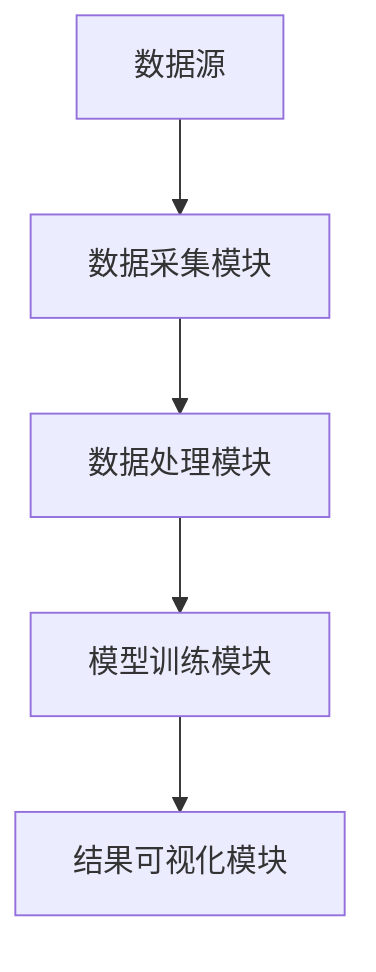

                 


# AI如何增强约翰·聂夫的小盘股分析

---

## 关键词

- AI技术
- 小盘股分析
- 约翰·聂夫
- 机器学习
- 金融分析

---

## 摘要

本文探讨了AI技术如何增强约翰·聂夫的小盘股分析方法。通过结合AI算法与传统投资策略，我们能够更精准地识别小盘股的投资机会，提高投资效率和准确性。文章从背景介绍、AI算法原理、系统架构设计到项目实战，全面分析了AI在小盘股分析中的应用，并通过具体案例展示了如何利用AI技术优化投资决策。

---

## 第1章：AI与小盘股分析的背景介绍

### 1.1 约翰·聂夫与小盘股投资

约翰·聂夫是美国著名的投资经理，以其在小盘股投资领域的卓越表现而闻名。他在投资过程中注重基本面分析，寻找那些具有高盈利能力和良好成长性的公司。然而，随着市场数据的复杂化和信息量的爆炸式增长，传统的基本面分析方法逐渐面临效率低下和决策滞后的问题。

### 1.2 AI技术与金融分析的结合

AI技术的快速发展为金融分析带来了新的可能性。通过机器学习算法，我们可以从海量数据中提取有价值的信息，预测市场趋势，并辅助投资决策。特别是在小盘股分析中，AI可以帮助投资者快速筛选出具有潜在增长的公司，提高投资效率。

### 1.3 本书的核心问题与目标

本文的核心问题是：如何利用AI技术增强约翰·聂夫的小盘股分析方法？我们的目标是通过结合AI算法与传统投资策略，优化小盘股的投资决策过程，提高投资收益。

---

## 第2章：AI技术的核心原理与小盘股分析的结合

### 2.1 AI技术的核心原理

机器学习是一种通过数据训练模型的技术，其核心是通过数据特征提取和模型训练，找到数据中的潜在规律。深度学习是一种基于神经网络的机器学习方法，能够处理复杂的非线性关系。

### 2.2 小盘股分析的关键要素

小盘股分析的核心要素包括财务数据、市场情绪、行业趋势等。通过AI技术，我们可以从这些数据中提取有价值的特征，帮助投资者做出更明智的决策。

### 2.3 AI与小盘股分析的关联性分析

AI技术能够帮助我们从海量数据中提取特征，建立预测模型，并实时监控市场动态。这些能力与小盘股分析的需求高度契合，能够显著提高投资效率和准确性。

---

## 第3章：AI算法在小盘股分析中的应用

### 3.1 机器学习算法的原理与实现

#### 3.1.1 线性回归

线性回归是一种用于预测连续变量的算法，其数学模型如下：

$$ y = \beta_0 + \beta_1x_1 + \beta_2x_2 + \dots + \beta_nx_n $$

其中，$y$ 是目标变量，$\beta_i$ 是系数，$x_i$ 是特征变量。

#### 3.1.2 支持向量机（SVM）

SVM是一种用于分类和回归的算法，其核心是通过找到一个超平面，将数据分为两类。对于线性可分的数据，SVM的数学模型如下：

$$ y = \text{sign}(\beta_0 + \beta_1x_1 + \beta_2x_2 + \dots + \beta_nx_n) $$

其中，$\beta_0$ 是截距，$\beta_i$ 是系数，$x_i$ 是特征变量。

#### 3.1.3 随机森林

随机森林是一种基于树的集成学习算法，其数学模型如下：

$$ y = \text{多数投票}(\text{决策树}_1(x), \text{决策树}_2(x), \dots, \text{决策树}_n(x)) $$

其中，$\text{决策树}_i(x)$ 是第i棵决策树的输出。

### 3.2 深度学习算法的原理与实现

#### 3.2.1 神经网络的基本结构

神经网络由输入层、隐藏层和输出层组成。其数学模型如下：

$$ y = f(Wx + b) $$

其中，$W$ 是权重矩阵，$x$ 是输入向量，$b$ 是偏置项，$f$ 是激活函数。

---

## 第4章：小盘股分析系统的架构设计

### 4.1 系统功能设计

#### 4.1.1 数据采集模块

数据采集模块负责从多种数据源（如财务报表、新闻报道）中获取数据。

#### 4.1.2 数据处理模块

数据处理模块对采集到的数据进行清洗、特征提取和标准化处理。

#### 4.1.3 模型训练模块

模型训练模块使用机器学习或深度学习算法对数据进行训练，生成预测模型。

#### 4.1.4 结果可视化模块

结果可视化模块将模型输出的结果以图形化的方式展示给用户。

### 4.2 系统架构图



---

## 第5章：基于AI的小盘股分析系统实现

### 5.1 环境搭建

安装Python和相关库（如NumPy、Pandas、Scikit-learn等）。

### 5.2 核心代码实现

#### 5.2.1 数据预处理

```python
import pandas as pd
import numpy as np

# 读取数据
data = pd.read_csv('small_cap_data.csv')

# 数据清洗
data.dropna(inplace=True)

# 特征提取
X = data[[' revenue', 'net_profit', 'market_cap']]
y = data['target']
```

#### 5.2.2 模型训练

```python
from sklearn.ensemble import RandomForestClassifier

# 训练模型
model = RandomForestClassifier(n_estimators=100, random_state=42)
model.fit(X, y)
```

#### 5.2.3 模型评估

```python
from sklearn.metrics import accuracy_score

# 预测
y_pred = model.predict(X)

# 计算准确率
accuracy = accuracy_score(y, y_pred)
print(f'Accuracy: {accuracy}')
```

---

## 第6章：项目实战与代码实现

### 6.1 项目实战

#### 6.1.1 数据采集与清洗

从多个数据源（如金融数据库、新闻网站）采集小盘股相关数据，并进行清洗和预处理。

#### 6.1.2 模型训练与评估

使用随机森林算法训练模型，并评估模型的准确率。

### 6.2 实际案例分析

通过具体案例分析，展示AI技术在小盘股分析中的应用效果。

---

## 第7章：系统分析与架构设计方案

### 7.1 问题场景介绍

在小盘股分析中，我们面临数据量大、信息复杂等问题。通过AI技术，我们可以更高效地处理数据，提高分析效率。

### 7.2 项目介绍

本项目旨在利用AI技术优化小盘股分析流程，提高投资决策的准确性和效率。

### 7.3 系统功能设计

系统功能包括数据采集、数据处理、模型训练和结果可视化。

### 7.4 系统架构设计


---

## 第8章：最佳实践与小结

### 8.1 最佳实践

- 使用高质量的数据源
- 选择合适的算法和模型
- 定期更新模型

### 8.2 小结

通过AI技术，我们可以显著提高小盘股分析的效率和准确性。然而，AI技术的应用也需要注意数据质量和模型选择等问题。

---

## 作者

作者：AI天才研究院/AI Genius Institute & 禅与计算机程序设计艺术/Zen And The Art of Computer Programming

---

通过本文的分析，我们详细探讨了AI技术如何增强约翰·聂夫的小盘股分析方法。从算法原理到系统设计，再到项目实战，我们全面展示了AI在小盘股分析中的应用潜力。希望本文能够为投资者提供新的思路，帮助他们在复杂多变的市场中做出更明智的投资决策。

