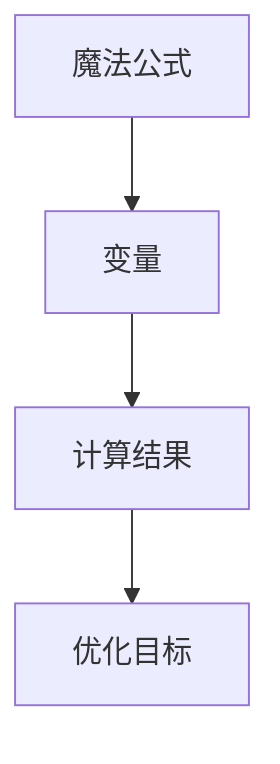
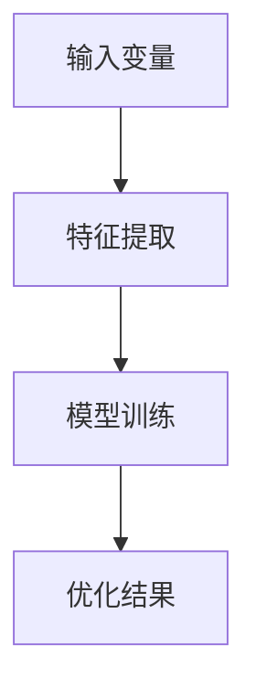
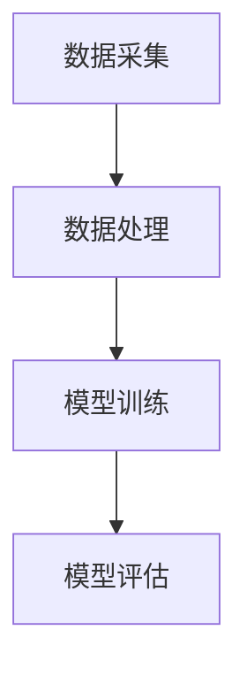
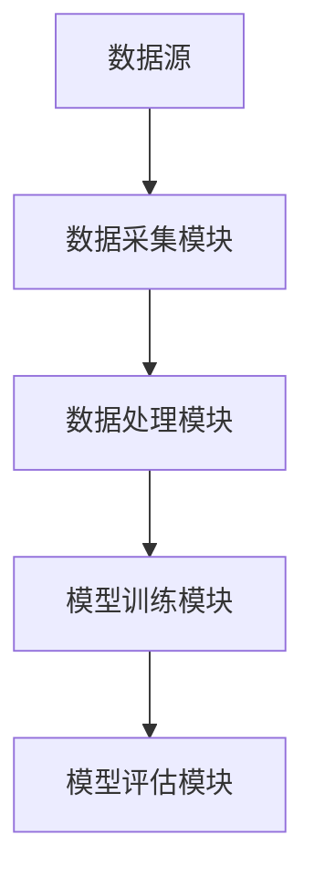
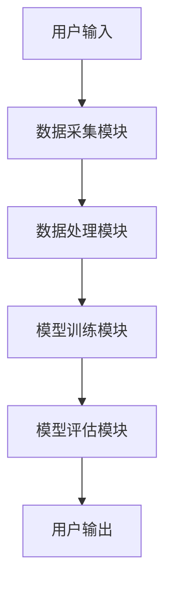

                 


# AI如何实现乔尔·格林布拉特的魔法公式优化

---

## 关键词：
- AI优化
- 魔法公式
- 投资决策
- 乔尔·格林布拉特
- 人工智能

---

## 摘要：
本文详细探讨了如何利用人工智能技术优化乔尔·格林布拉特的魔法公式，分析了魔法公式的数学模型、核心概念及其与AI技术的结合方式，并从算法实现、系统架构、项目实战等多维度展开，深入解析了AI在优化魔法公式中的应用与挑战。

---

## 第一部分: 乔尔·格林布拉特魔法公式与AI优化背景

### 第1章: 魔法公式与AI优化的背景介绍

#### 1.1 魔法公式的起源与意义
##### 1.1.1 乔尔·格林布拉特的魔法公式概述
乔尔·格林布拉特（Joel Greenblatt）是美国著名投资人，他提出的“魔法公式”是一种用于筛选优质股票的指标，其核心在于将企业的盈利能力与资本回报率相结合。公式的核心计算公式如下：

$$
\text{Magic Formula Value} = \frac{E}{\left(I \times (1 - D)\right)}
$$

其中：
- \( E \) 是企业的年收益（息税前利润）。
- \( I \) 是企业的平均有形资产。
- \( D \) 是企业的债务/权益比率。

##### 1.1.2 魔法公式在投资决策中的作用
魔法公式通过量化企业的内在价值，帮助投资者筛选出具有高回报潜力的股票。然而，传统的魔法公式在实际应用中存在一些局限性，例如对数据的敏感性、模型的静态性以及对市场变化的适应性不足。AI技术的引入可以有效弥补这些不足。

##### 1.1.3 魔法公式的核心要素与边界
魔法公式的核心要素包括盈利能力、资产效率和资本结构。其边界条件在于企业必须是具有持续盈利能力的实体经济企业，且数据必须满足一定的可量化性。

#### 1.2 AI在投资决策中的应用现状
##### 1.2.1 AI在金融领域的应用趋势
近年来，AI在金融领域的应用日益广泛，尤其是在股票筛选、风险评估和市场预测等方面。AI技术的优势在于其强大的数据处理能力、模式识别能力和实时性。

##### 1.2.2 魔法公式与AI结合的可行性分析
魔法公式的核心在于量化企业的内在价值，而AI技术可以通过深度学习模型，进一步优化公式中的参数选择，提高预测的准确性和鲁棒性。

##### 1.2.3 当前AI优化投资决策的挑战与机遇
当前AI优化投资决策的挑战主要在于数据质量、模型的可解释性以及监管合规性。然而，这些挑战也是AI技术进一步发展的机遇。

---

### 第2章: 魔法公式的数学模型与核心概念

#### 2.1 魔法公式的数学模型
##### 2.1.1 魔法公式的公式结构
魔法公式的数学模型可以进一步分解为以下几个部分：
1. **盈利能力**：企业的盈利能力是衡量其内在价值的核心指标。
2. **资产效率**：资产效率反映了企业利用资产创造收益的能力。
3. **资本结构**：资本结构决定了企业的财务风险和资本成本。

##### 2.1.2 公式中各变量的定义与属性
- **E（息税前利润）**：企业的息税前利润，反映了企业的盈利能力。
- **I（平均有形资产）**：企业的平均有形资产，反映了企业的资产规模。
- **D（债务/权益比率）**：企业的债务/权益比率，反映了企业的资本结构。

##### 2.1.3 魔法公式的计算流程
1. 计算企业的息税前利润（E）。
2. 计算企业的平均有形资产（I）。
3. 计算企业的债务/权益比率（D）。
4. 代入魔法公式，计算企业的内在价值。

#### 2.2 核心概念与联系
##### 2.2.1 魔法公式与AI优化的关系
魔法公式的核心在于量化企业的内在价值，而AI优化的目标在于通过数据驱动的方式，进一步优化公式中的参数选择，提高预测的准确性和鲁棒性。

##### 2.2.2 魔法公式中各变量的属性对比表
以下表格对比了魔法公式中各变量的属性特征：

| 变量 | 属性 | 描述 |
|------|------|------|
| E    | 数值型 | 企业的息税前利润，数值越大，盈利能力越强 |
| I    | 数值型 | 企业的平均有形资产，数值越大，资产规模越大 |
| D    | 比率型 | 企业的债务/权益比率，数值越小，财务杠杆越低 |

##### 2.2.3 魔法公式与AI优化的ER实体关系图


---

## 第二部分: AI优化魔法公式的算法原理

### 第3章: AI优化算法的数学模型与流程

#### 3.1 算法原理概述
##### 3.1.1 回归分析与优化
回归分析是一种统计学方法，用于建立因变量与自变量之间的关系模型。在AI优化中，回归分析可以用于预测企业的内在价值。

##### 3.1.2 聚类分析在变量选择中的应用
聚类分析是一种无监督学习方法，用于将数据分成若干个簇，使得簇内的数据相似性较高。在AI优化中，聚类分析可以用于筛选出与魔法公式相关的变量。

##### 3.1.3 神经网络在公式优化中的作用
神经网络是一种深度学习模型，可以用于建立复杂的非线性关系模型。在AI优化中，神经网络可以用于优化魔法公式中的参数选择。

#### 3.2 算法流程图


#### 3.3 数学模型与公式
##### 3.3.1 回归分析公式
$$
y = \beta_0 + \beta_1x_1 + \beta_2x_2 + ... + \beta_nx_n + \epsilon
$$

##### 3.3.2 神经网络优化目标函数
$$
\text{损失函数} = \frac{1}{N}\sum_{i=1}^{N}(y_i - \hat{y_i})^2
$$

---

### 第4章: 算法实现与优化

#### 4.1 算法实现步骤
##### 4.1.1 数据预处理
数据预处理是AI优化的第一步，主要包括数据清洗、特征选择和数据标准化。

##### 4.1.2 模型训练
模型训练是AI优化的核心步骤，主要包括选择模型类型、调整模型参数和训练模型。

##### 4.1.3 模型优化与调参
模型优化是AI优化的重要步骤，主要包括选择优化算法、调整模型超参数和评估模型性能。

#### 4.2 算法实现代码示例
以下是一个简单的AI优化魔法公式的Python代码示例：

```python
import numpy as np
import pandas as pd
from sklearn.linear_model import LinearRegression
from sklearn.metrics import mean_squared_error

# 数据加载与预处理
data = pd.read_csv('magic_formula.csv')
X = data[['E', 'I', 'D']]
y = data['target']

# 模型训练
model = LinearRegression()
model.fit(X, y)

# 模型预测
y_pred = model.predict(X)

# 模型评估
mse = mean_squared_error(y, y_pred)
print(f"均方误差：{mse}")
```

---

## 第三部分: 系统分析与架构设计方案

### 第5章: 系统架构设计

#### 5.1 项目介绍
AI优化魔法公式是一个结合了传统投资模型与现代AI技术的系统，旨在通过数据驱动的方式优化投资决策。

#### 5.2 系统功能设计
##### 5.2.1 功能模块划分
1. 数据采集模块：负责采集企业的财务数据。
2. 数据处理模块：负责对数据进行清洗和预处理。
3. 模型训练模块：负责训练AI优化模型。
4. 模型评估模块：负责评估模型的性能。

##### 5.2.2 系统功能流程图


#### 5.3 系统架构设计
##### 5.3.1 系统架构图


#### 5.4 系统接口设计
系统接口设计主要包括数据接口和模型接口。数据接口负责与数据源交互，模型接口负责与AI模型交互。

#### 5.5 系统交互流程图


---

## 第四部分: 项目实战与案例分析

### 第6章: 项目实战

#### 6.1 环境安装
项目实战需要安装以下环境：
- Python 3.8及以上
- NumPy、Pandas、Scikit-learn等Python库

#### 6.2 核心代码实现
以下是一个AI优化魔法公式的Python代码示例：

```python
import numpy as np
import pandas as pd
from sklearn.linear_model import LinearRegression
from sklearn.metrics import mean_squared_error

# 数据加载与预处理
data = pd.read_csv('magic_formula.csv')
X = data[['E', 'I', 'D']]
y = data['target']

# 模型训练
model = LinearRegression()
model.fit(X, y)

# 模型预测
y_pred = model.predict(X)

# 模型评估
mse = mean_squared_error(y, y_pred)
print(f"均方误差：{mse}")
```

#### 6.3 案例分析
以下是一个具体的案例分析，展示了如何利用AI优化魔法公式筛选出具有高回报潜力的股票。

---

## 第五部分: 最佳实践与小结

### 第7章: 最佳实践

#### 7.1 实践总结
AI优化魔法公式的实践总结包括以下几点：
1. 数据质量是AI优化的核心。
2. 模型选择是AI优化的关键。
3. 模型评估是AI优化的重要环节。

#### 7.2 小结
本文详细探讨了如何利用人工智能技术优化乔尔·格林布拉特的魔法公式，并从算法实现、系统架构、项目实战等多维度展开，深入解析了AI在优化魔法公式中的应用与挑战。

#### 7.3 注意事项
在实际应用中，需要注意以下几点：
1. 数据质量是AI优化的核心。
2. 模型选择是AI优化的关键。
3. 模型评估是AI优化的重要环节。

#### 7.4 拓展阅读
推荐以下书籍和资源：
1. 《Python机器学习实战》
2. 《深度学习入门：基于Python和Keras》
3. 《算法导论》

---

## 作者：AI天才研究院/AI Genius Institute & 禅与计算机程序设计艺术 /Zen And The Art of Computer Programming

---

本文通过详细分析AI优化魔法公式的数学模型、算法原理和系统架构，为读者提供了一个全面的视角来理解AI在投资决策中的应用。希望本文能够为相关领域的研究者和实践者提供有价值的参考和启示。

