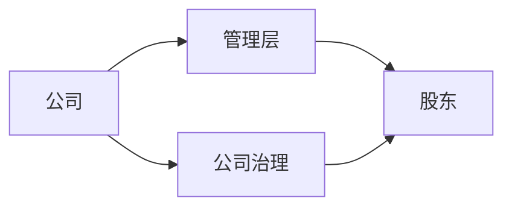
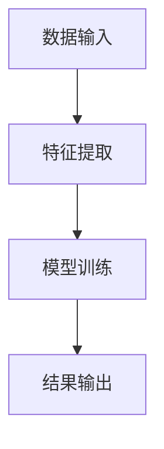
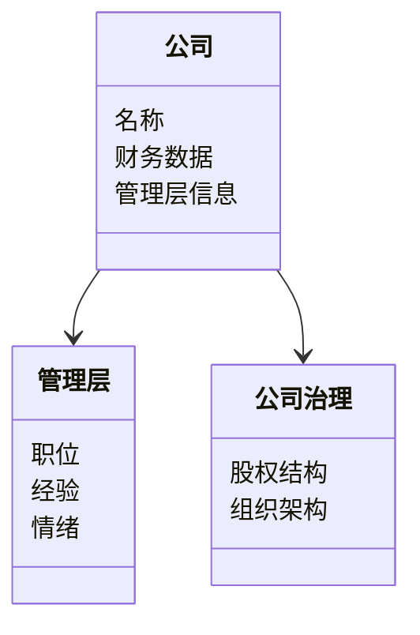
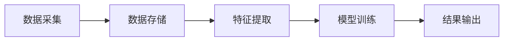
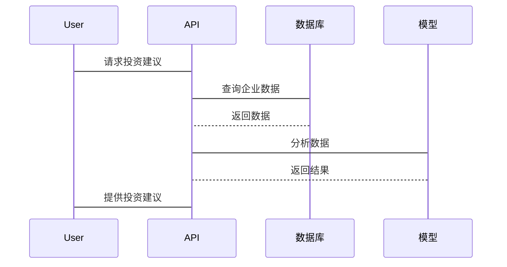

                 


# AI如何实现巴菲特的看人下注策略

## 关键词：人工智能、巴菲特、投资策略、公司治理、管理层分析

## 摘要：本文将探讨如何利用AI技术模拟巴菲特的“看人下注”投资策略，通过分析公司治理结构和管理层质量，实现智能化的投资决策。文章从理论到实践，详细讲解AI在投资决策中的应用，包括数据采集、模型训练、算法实现和系统架构设计等关键环节，最终构建一个能够辅助投资决策的AI系统。

---

# 第1章 巴菲特看人下注策略概述

## 1.1 巴菲特投资理念的核心要素

### 1.1.1 巴菲特的投资哲学
巴菲特的投资哲学以“价值投资”为核心，强调通过深入分析企业的基本面，寻找具有长期竞争优势和良好管理团队的企业进行投资。他特别关注企业的管理质量、财务健康状况以及行业地位。

### 1.1.2 看人下注策略的定义
“看人下注”策略是指巴菲特通过分析企业的管理层素质、公司治理结构和企业战略，判断企业未来的盈利能力。这种策略基于“人”的因素，认为优秀的管理层能够带领企业实现长期价值增长。

### 1.1.3 看人下注策略的背景与意义
在传统投资策略中，投资者往往依赖于财务指标和市场趋势进行决策。然而，管理层的质量和公司治理结构对企业的长期成功至关重要。巴菲特的“看人下注”策略通过分析“人”的因素，弥补了传统方法的不足。

---

## 1.2 AI在投资决策中的潜力

### 1.2.1 AI在金融领域的应用现状
AI技术已经在金融领域得到广泛应用，包括股票预测、风险评估、交易策略优化等。通过机器学习算法，AI能够从大量数据中提取有价值的信息，帮助投资者做出更明智的决策。

### 1.2.2 看人下注策略与AI的契合点
AI的自然语言处理（NLP）和数据分析能力能够帮助投资者快速分析企业的管理层背景、公司治理结构和企业战略。通过AI技术，投资者可以更高效地评估企业的潜在价值。

### 1.2.3 AI如何提升投资决策的效率与准确性
AI能够从海量数据中提取关键信息，构建量化模型，帮助投资者快速识别具有潜力的企业。同时，AI还可以实时监控企业动态，提供及时的投资建议。

---

## 1.3 本章小结
本章介绍了巴菲特的“看人下注”策略及其在投资决策中的重要性，并探讨了AI在金融领域的应用潜力。通过结合AI技术，投资者可以更高效地评估企业的潜在价值，做出更明智的投资决策。

---

# 第2章 AI如何模拟巴菲特的看人下注策略

## 2.1 巴菲特看人下注策略的AI实现路径

### 2.1.1 数据采集与处理
AI实现巴菲特策略的第一步是数据采集，包括企业的财务数据、管理层信息、公司治理结构等。这些数据需要经过清洗和预处理，以便后续分析。

### 2.1.2 模型训练与优化
通过机器学习算法，AI可以训练模型，识别企业的潜在价值。模型需要不断优化，以提高预测准确率。

### 2.1.3 结果输出与决策支持
AI通过分析数据，输出投资建议，帮助投资者做出决策。

---

## 2.2 AI在公司治理分析中的应用

### 2.2.1 公司治理结构的AI识别
AI可以通过分析企业的组织架构、股权结构等信息，识别公司治理中的潜在问题。

### 2.2.2 管理层质量的AI评估
通过NLP技术，AI可以分析管理层的公开演讲、社交媒体互动等，评估其能力和诚信度。

### 2.2.3 公司文化与战略的AI解读
AI可以通过分析企业的使命宣言、战略规划等文本，解读公司文化和战略方向。

---

## 2.3 本章小结
本章详细介绍了AI如何模拟巴菲特的“看人下注”策略，包括数据采集、模型训练和结果输出等关键步骤。通过AI技术，投资者可以更高效地评估企业的潜在价值。

---

# 第3章 AI看人下注策略的核心概念与联系

## 3.1 核心概念原理

### 3.1.1 看人下注策略的AI实现原理
AI通过分析企业的文本数据、财务数据等，构建模型，评估企业的潜在价值。

### 3.1.2 AI在公司治理分析中的数学模型
数学模型用于量化企业的治理结构和管理层质量，例如使用加权评分法。

### 3.1.3 管理层质量评估的算法框架
通过NLP和机器学习算法，AI可以评估管理层的质量。

---

## 3.2 核心概念属性特征对比

### 3.2.1 公司治理与管理层质量的对比分析
通过对比分析，识别公司治理和管理层质量之间的关联。

### 3.2.2 不同模型的性能对比
比较不同算法在公司治理分析中的性能。

### 3.2.3 数据特征与模型效果的关系
分析数据特征对模型效果的影响。

---

## 3.3 ER实体关系图


---

## 3.4 本章小结
本章通过分析AI看人下注策略的核心概念和联系，构建了数学模型和实体关系图，为后续的算法实现奠定了基础。

---

# 第4章 AI看人下注策略的算法原理

## 4.1 算法原理概述

### 4.1.1 看人下注策略的算法选择
选择适合的算法，如支持向量机（SVM）或随机森林（Random Forest）。

### 4.1.2 算法的输入与输出
输入：企业数据；输出：投资建议。

### 4.1.3 算法的优缺点分析
比较不同算法的优缺点，选择最优算法。

---

## 4.2 算法流程图


---

## 4.3 算法实现代码
```python
import pandas as pd
from sklearn.ensemble import RandomForestClassifier
from sklearn.metrics import accuracy_score

# 数据预处理
data = pd.read_csv('company_data.csv')
X = data.drop('target', axis=1)
y = data['target']

# 模型训练
model = RandomForestClassifier()
model.fit(X, y)

# 预测
predictions = model.predict(X)

# 评估
print(accuracy_score(y, predictions))
```

---

## 4.4 本章小结
本章详细介绍了AI看人下注策略的算法原理，包括算法选择、流程图和实现代码。通过这些方法，AI可以高效地评估企业的潜在价值。

---

# 第5章 系统分析与架构设计方案

## 5.1 问题场景介绍
构建一个AI系统，辅助投资者进行投资决策。

## 5.2 系统功能设计

### 5.2.1 领域模型


## 5.3 系统架构设计

### 5.3.1 系统架构图


## 5.4 系统接口设计

### 5.4.1 API接口
定义API接口，供投资者调用。

## 5.5 系统交互序列图

### 5.5.1 交互流程


---

## 5.6 本章小结
本章通过系统分析和架构设计，构建了一个完整的AI投资决策系统，为投资者提供高效的投资建议。

---

# 第6章 项目实战

## 6.1 环境安装

### 6.1.1 安装Python
安装Python 3.x。

### 6.1.2 安装依赖库
安装pandas、scikit-learn等库。

## 6.2 系统核心实现源代码

### 6.2.1 数据预处理
```python
import pandas as pd

data = pd.read_csv('company_data.csv')
data = data.dropna()
```

### 6.2.2 特征提取
```python
from sklearn.feature_extraction.text import TfidfVectorizer

vectorizer = TfidfVectorizer()
features = vectorizer.fit_transform(data['text'])
```

### 6.2.3 模型训练
```python
from sklearn.ensemble import RandomForestClassifier

model = RandomForestClassifier()
model.fit(features, data['target'])
```

## 6.3 代码应用解读与分析
解释代码的功能和实现细节。

## 6.4 实际案例分析
通过实际案例，展示系统的运行过程和结果。

---

## 6.5 项目小结
本章通过项目实战，展示了AI看人下注策略的具体实现过程，包括数据预处理、特征提取和模型训练等步骤。

---

# 第7章 总结与展望

## 7.1 总结
本文详细介绍了AI如何模拟巴菲特的“看人下注”策略，通过数据分析和机器学习算法，帮助投资者做出更明智的投资决策。

## 7.2 展望
未来，随着AI技术的不断发展，投资决策将更加智能化和精准化。AI可以帮助投资者发现更多潜在的价值企业，提升投资收益。

---

# 作者：AI天才研究院/AI Genius Institute & 禅与计算机程序设计艺术 /Zen And The Art of Computer Programming

