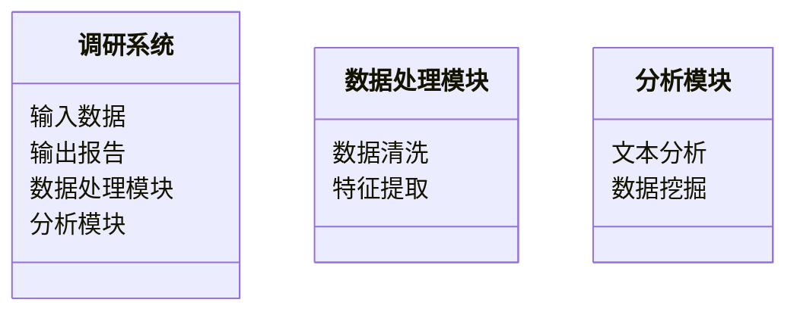
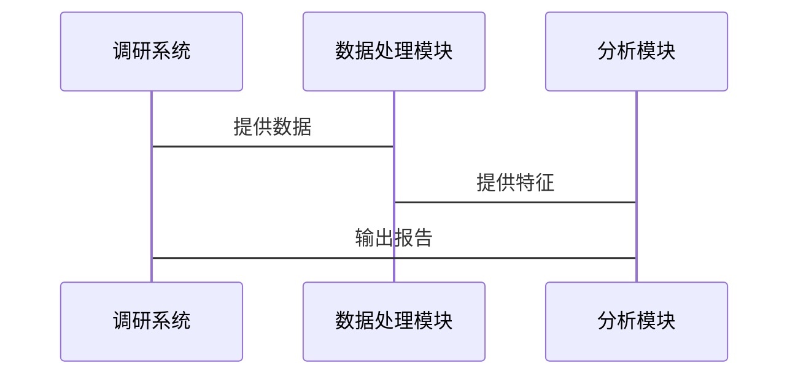

                 


# AI如何实现彼得·林奇的实地调研自动化

## 关键词：AI，彼得·林奇，实地调研，自动化，机器学习，NLP，数据挖掘

## 摘要：本文探讨了如何利用人工智能技术实现彼得·林奇风格的实地调研自动化。通过分析传统调研的局限性，结合机器学习、自然语言处理和数据挖掘等技术，提出了一种基于AI的自动化调研系统。该系统包括数据采集、预处理、特征提取、模式识别、知识图谱构建、预测与决策优化等核心模块，旨在提高调研效率和准确性，减少人为误差，为企业投资决策提供支持。文章详细讲解了算法原理、系统架构设计及项目实战案例，展示了AI在金融调研中的巨大潜力。

---

## 第一章：背景介绍与问题背景

### 1.1 彼得·林奇与实地调研方法

#### 1.1.1 彼得·林奇的实地调研方法概述

彼得·林奇是美国著名的基金经理，以其独特的实地调研方法闻名。他通过深入研究企业的基本面，包括管理层、产品、市场、财务状况等，寻找被低估的投资机会。实地调研的核心在于获取第一手信息，分析企业的运营状况，发现潜在的投资机会。

#### 1.1.2 实地调研的核心要素与挑战

实地调研的核心要素包括：

1. **信息获取**：通过访谈、参观、数据分析等方式获取企业信息。
2. **信息分析**：对获取的信息进行整理、分析，识别关键指标和趋势。
3. **决策支持**：基于分析结果，为企业投资决策提供支持。

然而，实地调研面临以下挑战：

1. **时间成本高**：需要大量时间进行实地考察和数据分析。
2. **主观性**：调研结果受调研人员的经验和判断影响较大。
3. **信息不全**：难以获取全面、准确的企业信息。

#### 1.1.3 传统调研方法的局限性

传统调研方法主要依赖人工操作，存在以下问题：

- **效率低下**：人工调研耗时长，难以覆盖大量企业。
- **一致性差**：不同调研人员的风格和标准不一，结果缺乏一致性。
- **深度不足**：人工分析难以从海量数据中提取有价值的信息。

---

### 1.2 AI技术与自动化调研的结合

#### 1.2.1 AI技术在金融领域的应用现状

AI技术在金融领域的应用广泛，包括股票预测、风险评估、欺诈检测等。然而，AI在实地调研自动化方面的应用仍处于起步阶段。

#### 1.2.2 自动化调研的定义与目标

自动化调研是指利用AI技术，从企业公开数据、新闻报道、社交媒体等多渠道自动获取、分析和总结信息，模拟传统实地调研的过程。

自动化调研的目标是：

1. 提高调研效率，缩短调研时间。
2. 提高调研结果的客观性和一致性。
3. 发现潜在信息，提供决策支持。

#### 1.2.3 AI实现调研自动化的可行性分析

AI实现调研自动化的可行性主要体现在以下方面：

- **数据来源丰富**：企业公开数据、新闻、社交媒体等提供了大量信息。
- **技术进步**：NLP、机器学习等技术的发展为自动化分析提供了基础。
- **计算能力提升**：云计算和大数据技术为处理海量数据提供了支持。

---

### 1.3 问题背景与研究意义

#### 1.3.1 传统调研效率低下的问题

传统调研依赖人工操作，效率低下，难以满足现代金融市场的快速需求。

#### 1.3.2 AI技术如何解决调研自动化的核心问题

AI技术可以通过自动化数据处理、智能分析和决策支持，解决传统调研中的效率和准确性问题。

#### 1.3.3 研究的创新点与实际应用价值

本文的创新点在于将AI技术应用于实地调研的自动化，提出了一种基于机器学习和NLP的自动化调研系统，具有较高的实际应用价值。

---

## 第二章：核心概念与原理

### 2.1 AI实现调研自动化的核心概念

#### 2.1.1 机器学习在调研数据处理中的应用

机器学习可以用于数据清洗、特征提取、分类和预测等任务。

#### 2.1.2 自然语言处理（NLP）在文本分析中的作用

NLP可以用于文本分类、信息提取、情感分析等任务，帮助从非结构化数据中提取有用信息。

#### 2.1.3 数据挖掘技术在模式识别中的应用

数据挖掘技术可以帮助发现数据中的潜在模式和规律。

---

### 2.2 核心概念的联系与对比

#### 2.2.1 机器学习、NLP与数据挖掘的对比分析

| 技术 | 应用场景 | 主要任务 |
|------|----------|----------|
| 机器学习 | 数据分类、预测 | 学习数据模式 |
| NLP | 文本分析、情感分析 | 处理自然语言数据 |
| 数据挖掘 | 模式识别、关联规则挖掘 | 发现数据中的规律 |

#### 2.2.2 核心概念的ER实体关系图

```mermaid
erDiagram
    company : 公司
    report : 调研报告
    document : 相关文档
    feature : 关键特征
    company --> report : 包含
    company --> document : 包含
    document --> feature : 包含
```

---

## 第三章：算法原理与数学模型

### 3.1 自然语言处理（NLP）算法

#### 3.1.1 文本预处理与特征提取

文本预处理包括分词、去除停用词、词干提取等。特征提取可以使用TF-IDF方法。

#### 3.1.2 基于词嵌入的文本相似度计算

使用Word2Vec或GloVe模型生成词向量，计算文本相似度。

#### 3.1.3 使用TF-IDF进行关键词提取

TF-IDF公式为：

$$ TF-IDF = \text{TF} \times \log(\frac{N}{DF}) $$

其中，TF是词频，DF是逆文档频率，N是总文档数。

---

### 3.2 机器学习算法

#### 3.2.1 支持向量机（SVM）在分类任务中的应用

SVM的数学模型为：

$$ \text{max} \frac{1}{2} \|\mathbf{w}\|^2 $$
$$ \text{subject to } y_i (\mathbf{w} \cdot \mathbf{x}_i + b) \geq 1 $$

#### 3.2.2 随机森林在特征选择中的作用

随机森林通过集成学习提高分类精度，同时进行特征重要性评估。

#### 3.2.3 神经网络模型在深度学习中的应用

使用卷积神经网络（CNN）进行图像识别，循环神经网络（RNN）进行序列分析。

---

## 第四章：系统架构设计

### 4.1 系统功能设计

#### 4.1.1 领域模型设计



#### 4.1.2 系统交互设计



---

## 第五章：项目实战

### 5.1 环境搭建

需要安装Python、TensorFlow、Scikit-learn、NLTK等库。

### 5.2 核心代码实现

#### 5.2.1 文本分析代码

```python
import nltk
from sklearn.feature_extraction.text import TfidfVectorizer

# 文本预处理
def preprocess(text):
    return nltk.word_tokenize(text.lower())

# TF-IDF计算
vectorizer = TfidfVectorizer(tokenizer=preprocess)
tfidf_matrix = vectorizer.fit_transform(documents)
```

#### 5.2.2 机器学习代码

```python
from sklearn.svm import SVC
from sklearn.metrics import accuracy_score

# 训练模型
model = SVC()
model.fit(X_train, y_train)

# 预测
y_pred = model.predict(X_test)
print(accuracy_score(y_test, y_pred))
```

---

## 第六章：总结与展望

### 6.1 项目总结

本文提出了一种基于AI的自动化调研系统，结合了NLP、机器学习和数据挖掘技术，实现了对企业的自动化分析。

### 6.2 经验与教训

在项目实施过程中，需要注意数据质量、模型选择和算法调优等问题。

### 6.3 未来展望

未来可以进一步优化算法，增加更多数据源，提升系统的准确性和效率。

---

## 作者：AI天才研究院 & 禅与计算机程序设计艺术

