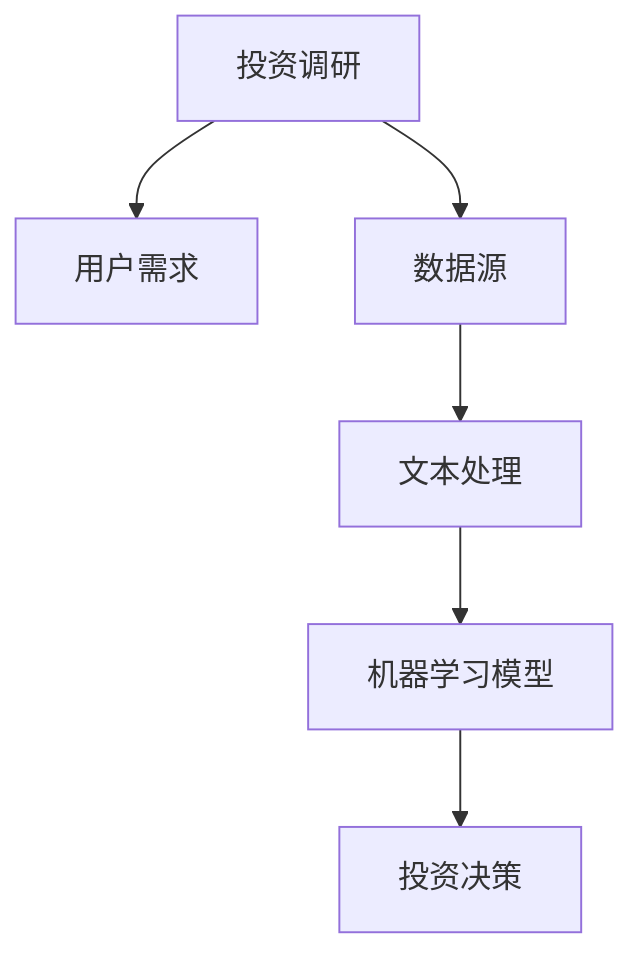
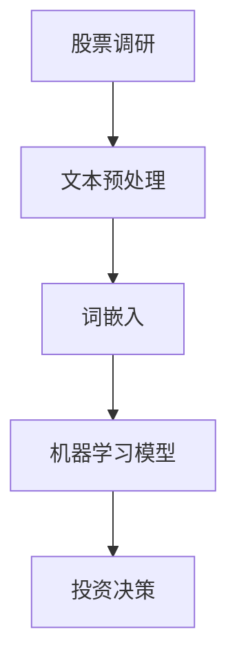
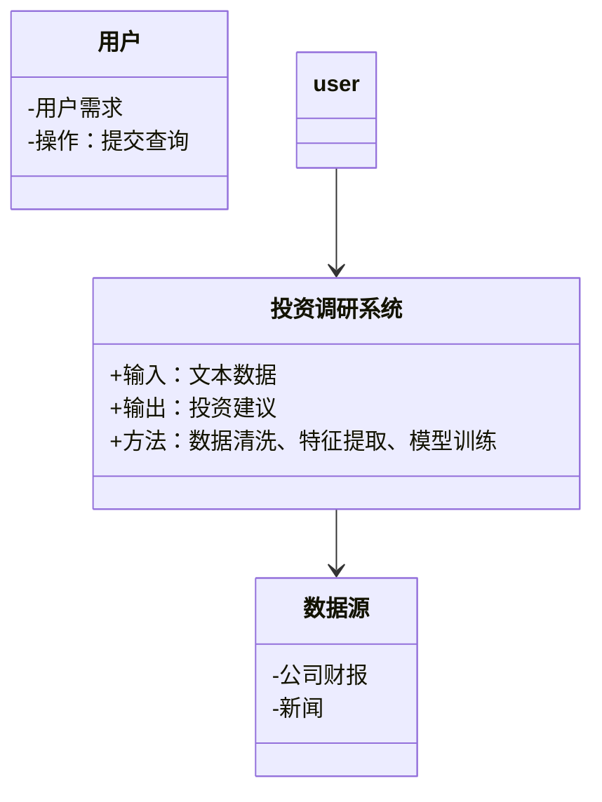

                 


# AI如何实现彼得林奇的实地调研策略

## 关键词：AI、投资、彼得·林奇、实地调研、自然语言处理、机器学习、数据挖掘

## 摘要：本文探讨如何利用AI技术模拟彼得·林奇的实地调研策略，结合自然语言处理和机器学习，分析公司财报、新闻、行业报告等数据，识别投资机会，评估风险，预测市场趋势。

---

# 第1章：投资调研的背景与AI的潜力

## 1.1 投资调研的核心概念

- **投资调研**是投资者通过分析公司、行业和市场数据，评估投资标的的价值和风险的过程。
- 彼得·林奇以其独特的实地调研方法闻名，强调通过深入研究公司基本面、管理层、行业地位等，发现价值投资机会。
- **AI技术**在投资调研中的应用，可以提高数据处理效率，发现隐藏的模式，辅助人类做出更明智的投资决策。

## 1.2 AI技术的基本原理

- **人工智能（AI）**通过模拟人类学习和推理能力，从数据中提取有用信息。
- **机器学习（ML）**是AI的核心，通过训练模型从数据中学习规律，并用于预测或分类。
- **自然语言处理（NLP）**使计算机能够理解人类语言，用于文本分析、情感分析等。

## 1.3 AI在金融领域的应用现状

- **股票分析**：AI通过分析历史价格、市场情绪、新闻等数据，预测股票走势。
- **风险评估**：利用AI识别潜在风险，评估投资组合的稳定性。
- **市场预测**：AI能够从海量数据中发现趋势，帮助投资者做出决策。

---

# 第2章：AI与彼得·林奇实地调研的结合

## 2.1 AI在投资调研中的核心原理

- **数据来源**：AI可以从公司财报、新闻、社交媒体等多种来源获取数据。
- **分析效率**：AI能够快速处理大量非结构化数据，显著提高调研效率。
- **模型准确性**：通过机器学习模型，AI能够发现传统方法难以察觉的模式。

## 2.2 核心概念对比

| **方面**         | **传统调研**          | **AI辅助调研**          |
|------------------|-----------------------|--------------------------|
| 数据来源         | 结构化数据为主        | 结构化与非结构化数据    |
| 分析效率         | 低，依赖人工           | 高，自动化处理           |
| 模型准确性       | 可能存在主观偏差       | 数据驱动，减少偏差       |
| 适用场景         | 宏观分析为主          | 微观分析与实时预测       |

## 2.3 实体关系图



---

# 第3章：AI算法在投资调研中的实现原理

## 3.1 自然语言处理（NLP）流程



## 3.2 算法实现

- **文本预处理**：去除停用词、分词、词干提取等。
- **词嵌入**：使用Word2Vec或BERT生成词向量。
- **模型训练**：训练分类模型（如SVM、随机森林）或深度学习模型（如LSTM）。

---

# 第4章：系统设计与架构

## 4.1 系统功能设计



---

# 第5章：项目实战

## 5.1 环境安装

- Python 3.8+
- 安装库：numpy、pandas、scikit-learn、spacy、transformers

## 5.2 核心代码实现

```python
import spacy
from sklearn.feature_extraction.text import TfidfVectorizer
from sklearn.svm import SVC

# 数据清洗
def preprocess(text):
    # 假设text是需要清洗的文本
    return text.lower()

# 特征提取
vectorizer = TfidfVectorizer()
X = vectorizer.fit_transform(texts)

# 模型训练
model = SVC()
model.fit(X, labels)

# 预测
new_text = ["公司收入增长显著"]
new_X = vectorizer.transform([new_text])
print(model.predict(new_X))
```

---

# 第6章：总结与展望

## 6.1 总结

- AI能够显著提高投资调研的效率和准确性。
- 通过NLP和机器学习，AI可以模拟彼得·林奇的调研方法，帮助投资者发现潜在机会。

## 6.2 未来展望

- 更复杂的模型（如BERT）将提升分析精度。
- 实时数据处理将使投资决策更加迅速。
- 多模态分析（文本、图像）将提供更全面的视角。

---

# 作者：AI天才研究院 & 禅与计算机程序设计艺术

---

**感谢您的阅读！**

