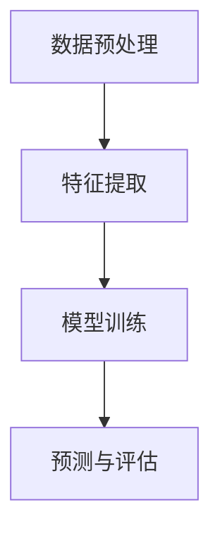
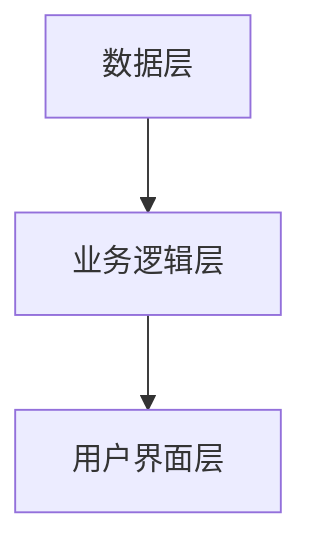
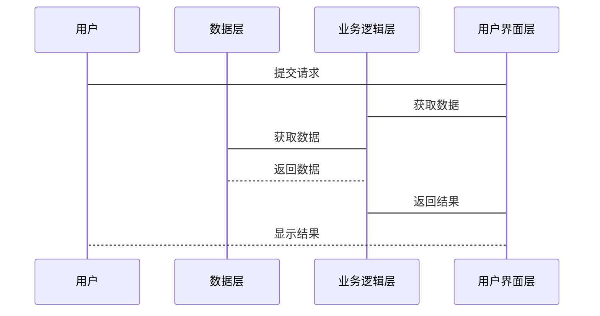

                 


# AI如何实现杰里米·格兰瑟姆的资源稀缺性投资

> 关键词：人工智能, 资源稀缺性, 投资策略, 杰里米·格兰瑟姆, 机器学习

> 摘要：本文探讨如何利用人工智能技术实现杰里米·格兰瑟姆提出的资源稀缺性投资策略。通过分析资源稀缺性与投资策略之间的关系，结合AI算法和系统架构设计，展示如何利用AI技术进行资源稀缺性分析、投资策略优化和实际案例分析，帮助投资者更好地把握投资机会。

---

# 第一部分: 背景与概念

## 第1章: 资源稀缺性与投资概述

### 1.1 资源稀缺性的定义与特征
#### 1.1.1 资源稀缺性的基本概念
资源稀缺性是指某种资源在市场上的供给无法满足需求的情况。这种稀缺性可能是由于自然限制、技术瓶颈或政策调控等因素导致的。资源稀缺性分析是投资决策中的重要环节，因为它直接影响投资策略的选择和实施效果。

#### 1.1.2 资源稀缺性的主要特征
资源稀缺性具有以下特征：
1. **供给刚性**：资源供给量有限，难以通过增加产量来满足需求。
2. **需求弹性**：需求可能因价格变化而波动，但稀缺性导致需求难以完全满足。
3. **长期性**：资源稀缺性通常具有较长的时间跨度，可能持续数年甚至数十年。

#### 1.1.3 资源稀缺性与经济发展的关系
资源稀缺性对经济发展有重要影响。一方面，稀缺资源可能成为经济发展的瓶颈；另一方面，稀缺资源的价格波动也为投资者提供了潜在的利润机会。

### 1.2 杰里米·格兰瑟姆的资源稀缺性投资理论
#### 1.2.1 杰里米·格兰瑟姆的简介
杰里米·格兰瑟姆（Jeremy Grantham）是英国著名投资经理人和作家，专注于长期投资策略和资源稀缺性分析。他的投资理论强调通过对资源稀缺性、市场周期和经济趋势的分析，寻找长期稳定的投资机会。

#### 1.2.2 资源稀缺性投资的核心观点
格兰瑟姆的核心观点是，资源稀缺性是投资成功的关键因素之一。他认为，随着全球人口增长和资源消耗增加，某些关键资源（如石油、矿产、水资源等）的稀缺性将长期存在，这为投资者提供了长期的投资机会。

#### 1.2.3 资源稀缺性与投资机会的关系
资源稀缺性直接影响投资机会。稀缺资源通常具有较高的市场价值，投资者可以通过投资稀缺资源或相关行业，获得超额收益。然而，资源稀缺性也伴随着较高的投资风险，因此需要通过深入分析和科学决策来规避风险。

### 1.3 AI在资源稀缺性投资中的应用背景
#### 1.3.1 AI技术的快速发展与投资领域的结合
近年来，人工智能技术在投资领域的应用越来越广泛。AI可以通过大数据分析、模式识别和预测模型，帮助投资者更好地识别投资机会和风险。

#### 1.3.2 资源稀缺性分析的AI方法
资源稀缺性分析需要考虑多种因素，如供给、需求、价格、政策等。AI可以通过机器学习算法，从海量数据中提取有用信息，帮助投资者更好地理解资源稀缺性的影响。

#### 1.3.3 AI在资源稀缺性投资中的优势与挑战
AI的优势在于其强大的数据处理能力和快速的计算速度。通过AI技术，投资者可以实时监控市场动态，快速调整投资策略。然而，AI的应用也面临一些挑战，如数据质量、模型选择和风险管理等。

---

## 第2章: 资源稀缺性投资的核心概念与联系

### 2.1 资源稀缺性与投资策略的关系
#### 2.1.1 资源稀缺性对投资策略的影响
资源稀缺性直接影响投资策略的选择。例如，当某种资源稀缺时，投资者可能选择长期持有该资源相关的股票，或者投资于该资源的上游企业。

#### 2.1.2 不同稀缺性下的投资策略选择
根据资源稀缺性的程度，投资者可以采用不同的投资策略。例如：
- **低稀缺性**：适合短期投资，通过波段操作获利。
- **中度稀缺性**：适合中期投资，通过持有优质资产获得稳定收益。
- **高度稀缺性**：适合长期投资，通过持有稀缺资源或相关行业股票获得超额收益。

#### 2.1.3 资源稀缺性与投资风险的关联
资源稀缺性与投资风险密切相关。高度稀缺的资源可能面临更高的价格波动风险，因此投资者需要通过多元化投资和风险管理来降低风险。

### 2.2 AI模型的核心原理与资源稀缺性分析
#### 2.2.1 AI模型的基本原理
AI模型通过学习大量数据，识别数据中的模式和趋势，从而做出预测和决策。在资源稀缺性分析中，AI模型可以用于预测资源价格走势、识别投资机会和优化投资组合。

#### 2.2.2 资源稀缺性分析的AI模型特点
资源稀缺性分析的AI模型具有以下特点：
1. **数据驱动**：基于大量历史数据，识别资源稀缺性与市场走势之间的关系。
2. **实时性**：能够实时更新数据，捕捉市场动态。
3. **可解释性**：模型需要具有较高的可解释性，以便投资者理解和调整策略。

#### 2.2.3 资源稀缺性与AI模型的结合方式
资源稀缺性与AI模型的结合可以通过以下方式实现：
1. **数据输入**：将资源供给、需求、价格等数据输入AI模型。
2. **特征提取**：通过特征工程，提取对资源稀缺性分析有用的特征。
3. **模型训练**：利用机器学习算法训练模型，预测资源稀缺性对投资的影响。
4. **结果输出**：根据模型预测结果，制定投资策略。

### 2.3 资源稀缺性与投资策略的ER实体关系图
```mermaid
er
    entity 资源稀缺性 {
        key 资源类型
        key 稀缺程度
        属性 稀缺原因
    }
    entity 投资策略 {
        key 策略类型
        属性 适用场景
        属性 风险评估
    }
    资源稀缺性 --> 投资策略: 影响关系
```

---

## 第3章: AI实现资源稀缺性投资的算法原理

### 3.1 基于AI的资源稀缺性分析算法
#### 3.1.1 算法概述
资源稀缺性分析算法的核心是通过机器学习模型，预测资源稀缺性对投资的影响。常用算法包括线性回归、支持向量机（SVM）、随机森林和神经网络等。

#### 3.1.2 算法流程图


#### 3.1.3 算法实现
##### 数据预处理
数据预处理是AI算法实现的第一步，包括数据清洗、特征选择和数据标准化等步骤。

##### 特征提取
特征提取是从数据中提取对资源稀缺性分析有用的特征。例如，可以提取资源供给、需求、价格、政策等特征。

##### 模型训练
模型训练是通过机器学习算法，训练模型以识别资源稀缺性与投资策略之间的关系。例如，可以使用线性回归模型进行预测。

##### 预测与评估
预测与评估是通过模型预测资源稀缺性对投资的影响，并评估模型的准确性和稳定性。

#### 3.1.4 数学模型与公式
##### 线性回归模型
线性回归是一种常用的预测模型，其数学公式为：
$$ y = \beta_0 + \beta_1x_1 + \beta_2x_2 + \ldots + \beta_nx_n + \epsilon $$
其中，$y$ 是目标变量（如资源价格），$x_i$ 是特征变量，$\beta_i$ 是回归系数，$\epsilon$ 是误差项。

##### 支持向量机（SVM）
SVM是一种常用的分类和回归模型，其数学公式为：
$$ y = \text{sign}(\beta_0 + \beta_1x_1 + \beta_2x_2 + \ldots + \beta_nx_n) $$
其中，$\beta_0$ 是截距，$\beta_i$ 是权重系数，$x_i$ 是特征变量，$\text{sign}$ 是符号函数。

#### 3.1.5 代码实现
##### Python代码示例
```python
import numpy as np
import pandas as pd
from sklearn.linear_model import LinearRegression
from sklearn.metrics import mean_squared_error

# 数据加载与预处理
data = pd.read_csv('resource_scarcity.csv')
X = data[['supply', 'demand', 'price']]
y = data['investment_return']

# 模型训练
model = LinearRegression()
model.fit(X, y)

# 预测与评估
predictions = model.predict(X)
mse = mean_squared_error(y, predictions)
print(f'均方误差：{mse}')
print(f'回归系数：{model.coef_}')
print(f'截距：{model.intercept_}')
```

#### 3.1.6 实际案例分析
通过实际案例分析，展示如何利用AI算法进行资源稀缺性分析和投资策略优化。例如，可以分析石油价格走势，预测未来石油价格的变化，并制定相应的投资策略。

---

## 第4章: 系统架构设计与实现

### 4.1 系统功能设计
系统功能设计包括数据采集、特征提取、模型训练、预测与评估等模块。

#### 4.1.1 数据采集
数据采集是从多个数据源获取资源供给、需求、价格等数据。

#### 4.1.2 特征提取
特征提取是从数据中提取对资源稀缺性分析有用的特征，如供给增长率、需求增长率、价格波动率等。

#### 4.1.3 模型训练
模型训练是通过机器学习算法，训练模型以识别资源稀缺性与投资策略之间的关系。

#### 4.1.4 预测与评估
预测与评估是通过模型预测资源稀缺性对投资的影响，并评估模型的准确性和稳定性。

### 4.2 系统架构设计
系统架构设计包括数据层、业务逻辑层和用户界面层。

#### 4.2.1 数据层
数据层负责数据的存储和管理，包括数据仓库、数据库等。

#### 4.2.2 业务逻辑层
业务逻辑层负责数据处理、模型训练和预测等核心功能。

#### 4.2.3 用户界面层
用户界面层负责与用户的交互，包括数据输入、结果展示等。

### 4.3 系统架构图


### 4.4 系统接口设计
系统接口设计包括数据接口、模型接口和用户接口。

#### 4.4.1 数据接口
数据接口负责与数据源的交互，获取资源供给、需求、价格等数据。

#### 4.4.2 模型接口
模型接口负责与机器学习模型的交互，进行模型训练和预测。

#### 4.4.3 用户接口
用户接口负责与用户的交互，展示分析结果和投资建议。

### 4.5 系统交互序列图


---

## 第5章: 项目实战与案例分析

### 5.1 项目实战
#### 5.1.1 环境安装
项目实战需要安装以下Python库：
- NumPy
- Pandas
- Scikit-learn
- Mermaid

#### 5.1.2 核心代码实现
以下是资源稀缺性分析的Python代码实现：
```python
import numpy as np
import pandas as pd
from sklearn.linear_model import LinearRegression
from sklearn.metrics import mean_squared_error

# 数据加载与预处理
data = pd.read_csv('resource_scarcity.csv')
X = data[['supply', 'demand', 'price']]
y = data['investment_return']

# 模型训练
model = LinearRegression()
model.fit(X, y)

# 预测与评估
predictions = model.predict(X)
mse = mean_squared_error(y, predictions)
print(f'均方误差：{mse}')
print(f'回归系数：{model.coef_}')
print(f'截距：{model.intercept_}')
```

#### 5.1.3 代码解读与分析
以上代码实现了线性回归模型，用于预测资源稀缺性对投资收益的影响。通过均方误差（MSE）评估模型的准确性，回归系数和截距展示了各特征对投资收益的影响程度。

### 5.2 实际案例分析
#### 5.2.1 案例背景
以石油价格为例，分析资源稀缺性对投资的影响。

#### 5.2.2 数据分析
通过数据分析，识别石油价格的波动趋势，预测未来石油价格的变化。

#### 5.2.3 投资策略优化
基于AI模型的预测结果，优化投资策略，制定长期投资计划。

#### 5.2.4 投资结果评估
评估投资结果，分析模型的准确性和稳定性，总结经验教训。

---

## 第6章: 总结与展望

### 6.1 总结
本文详细探讨了如何利用AI技术实现杰里米·格兰瑟姆提出的资源稀缺性投资策略。通过分析资源稀缺性与投资策略之间的关系，结合AI算法和系统架构设计，展示了如何利用AI技术进行资源稀缺性分析、投资策略优化和实际案例分析。

### 6.2 最佳实践 tips
- 数据质量是AI模型性能的关键，需要确保数据的准确性和完整性。
- 模型选择需要根据具体问题进行调整，不同算法适用于不同的场景。
- 风险管理是投资成功的重要保障，需要通过多元化投资和风险管理降低风险。

### 6.3 小结
通过本文的分析，读者可以更好地理解资源稀缺性对投资的影响，并掌握如何利用AI技术进行资源稀缺性分析和投资策略优化。

### 6.4 注意事项
- 数据隐私和安全问题需要高度重视，避免数据泄露和滥用。
- 模型的可解释性是投资者理解和调整策略的关键，需要确保模型的透明性和可解释性。
- 投资有风险，入市需谨慎。投资者需要根据自身情况和市场变化，灵活调整投资策略。

### 6.5 拓展阅读
- 《杰里米·格兰瑟姆的投资策略》
- 《机器学习在金融领域的应用》
- 《资源稀缺性与经济发展》

---

## 作者信息

作者：AI天才研究院/AI Genius Institute & 禅与计算机程序设计艺术/Zen And The Art of Computer Programming

---

**注意**：以上内容为示例，实际撰写时需要根据具体需求和数据进行调整和补充。

