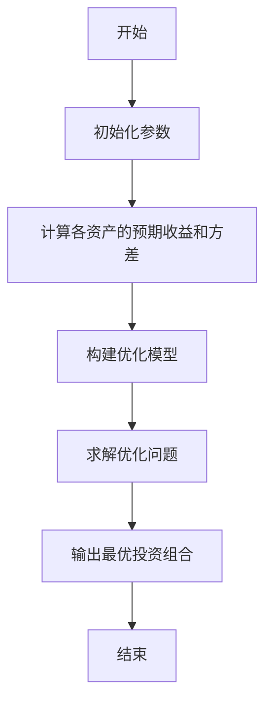
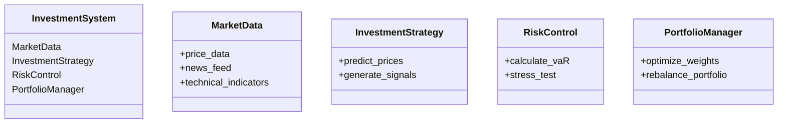
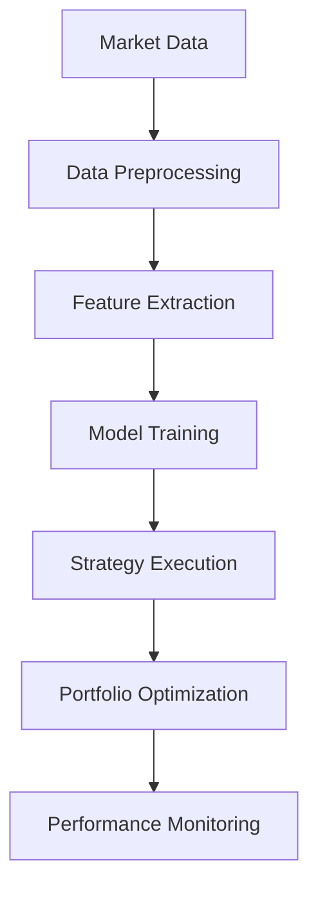
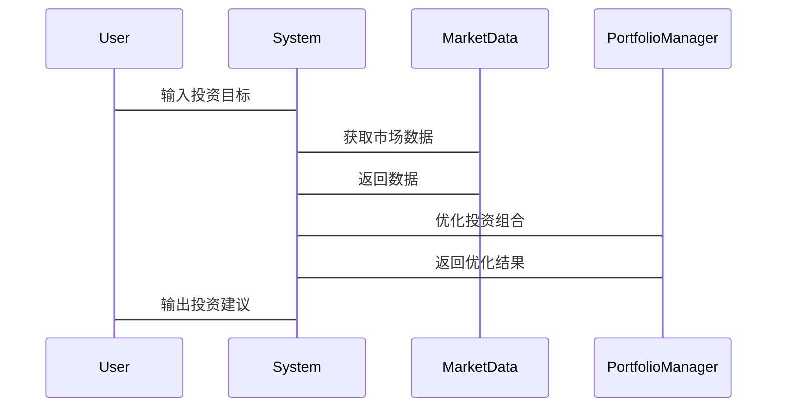

                 


# AI如何实现格雷厄姆的分散投资原则

## 关键词
AI, 分散投资, 价值投资, 机器学习, 投资组合优化, 风险控制

## 摘要
本文深入探讨了如何利用人工智能技术实现格雷厄姆的分散投资原则。通过结合传统投资学理论与现代AI算法，我们展示了如何构建高效、稳健的投资组合。文章详细介绍了AI在分散投资中的应用场景，分析了核心算法的实现原理，并通过实际案例展示了AI驱动的投资系统如何优化投资组合，降低风险，提高收益。

---

# 第1章: 格雷厄姆的分散投资原则

## 1.1 投资学基础

### 1.1.1 股票投资的基本概念
股票投资是通过购买公司股份，期望通过股价上涨获得收益的一种投资方式。股票市场的波动性较高，投资者需要通过分析市场趋势、公司基本面等因素来做出投资决策。

### 1.1.2 价值投资的核心理念
价值投资是由本杰明·格雷厄姆提出的投资策略，核心在于寻找市场价格低于其内在价值的股票。这种投资方法强调长期持有优质资产，而非短期市场波动。

### 1.1.3 分散投资的意义与作用
分散投资是指将资金分配到不同的资产类别或股票中，以降低单一投资的风险。通过分散投资，投资者可以减少因单一资产价格波动带来的损失，提高整体投资组合的稳定性。

## 1.2 格雷厄姆的投资策略

### 1.2.1 格雷厄姆的投资哲学
格雷厄姆认为，投资的本质是寻找具有安全边际的资产。他强调投资者应关注企业的内在价值，而非市场的短期波动。

### 1.2.2 分散投资的数学模型
格雷厄姆的分散投资策略可以通过数学模型进行优化。通过将资金分配到多个资产中，投资者可以降低整体投资组合的波动性。

### 1.2.3 风险与收益的平衡
在格雷厄姆的投资理论中，风险与收益是密切相关的。通过分散投资，投资者可以在一定风险水平下获得更高的收益。

---

# 第2章: 人工智能在金融中的应用

## 2.1 AI在金融领域的应用现状

### 2.1.1 AI在股票预测中的应用
AI可以通过分析历史数据、市场情绪等信息，预测股票价格的走势。基于机器学习的模型可以识别市场中的复杂模式，帮助投资者做出更明智的决策。

### 2.1.2 AI在风险控制中的作用
AI可以帮助投资者识别潜在风险，优化投资组合的结构，从而降低整体投资风险。

### 2.1.3 AI在投资组合管理中的应用
AI可以通过分析市场数据，优化投资组合的配置，提高收益，降低风险。

## 2.2 AI与分散投资的结合

### 2.2.1 AI如何优化投资组合
通过AI算法，投资者可以优化投资组合的配置，实现更好的分散投资效果。

### 2.2.2 AI在资产配置中的优势
AI可以通过分析市场数据，提供个性化的资产配置建议，帮助投资者实现更好的分散投资效果。

### 2.2.3 AI如何降低投资风险
AI可以通过预测市场波动、识别潜在风险，帮助投资者降低投资组合的整体风险。

---

# 第3章: AI驱动的分散投资模型

## 3.1 分散投资的数学模型

### 3.1.1 投资组合的数学表达
投资组合可以表示为多个资产的线性组合，权重表示每个资产在组合中的比例。

$$ \text{投资组合} = w_1 \times a_1 + w_2 \times a_2 + \dots + w_n \times a_n $$

其中，$w_i$ 是资产 $i$ 的权重，$a_i$ 是资产 $i$ 的收益。

### 3.1.2 均值-方差优化模型
均值-方差优化模型是优化投资组合的经典方法。该模型通过最小化投资组合的方差（风险），同时最大化预期收益。

$$ \text{目标函数} = \min \sum_{i=1}^n w_i^2 \sigma_i^2 $$
$$ \text{约束条件} = \sum_{i=1}^n w_i = 1 $$

### 3.1.3 马科维茨有效前沿理论
马科维茨有效前沿理论指出，在给定风险水平下，投资组合的预期收益最大化，或者在给定收益水平下，风险最小化。

---

## 3.2 AI算法在分散投资中的应用

### 3.2.1 基于机器学习的投资组合优化
通过机器学习算法，投资者可以预测资产的未来收益，优化投资组合的配置。

### 3.2.2 基于深度学习的市场预测
深度学习模型可以分析大量的市场数据，识别复杂的市场模式，帮助投资者做出更准确的市场预测。

### 3.2.3 基于强化学习的投资决策
强化学习算法可以模拟投资者在市场中的决策过程，通过不断试错，优化投资策略。

---

# 第4章: 分散投资的AI算法实现

## 4.1 均值-方差优化算法

### 4.1.1 算法原理与流程图



### 4.1.2 优化过程的数学推导
优化过程可以通过拉格朗日乘数法求解，目标是最小化投资组合的方差，同时满足约束条件。

### 4.1.3 算法实现的Python代码

```python
import numpy as np
from scipy.optimize import minimize

def portfolio_var(weights, covariance_matrix):
    return np.dot(weights.T, np.dot(covariance_matrix, weights))

def optimize_portfolio(covariance_matrix):
    n = covariance_matrix.shape[0]
    init_guess = np.array([1.0 / n] * n)
    constraints = [{'type': 'eq', 'fun': lambda w: sum(w) - 1}]
    result = minimize(portfolio_var, init_guess, args=(covariance_matrix,), constraints=constraints)
    return result.x

# 示例数据
covariance_matrix = np.array([[1, 0.5], [0.5, 1]])
weights = optimize_portfolio(covariance_matrix)
print(weights)
```

### 4.1.4 结果分析与

通过代码示例，我们可以看到AI算法如何优化投资组合的权重，从而降低整体投资组合的风险。

---

# 第5章: 系统分析与架构设计

## 5.1 问题场景介绍
在实际投资中，投资者需要实时监控市场数据，动态调整投资组合，以应对市场波动。

## 5.2 系统功能设计

### 5.2.1 领域模型



### 5.2.2 系统架构设计



### 5.2.3 系统接口设计
系统接口包括数据接口、算法接口和用户接口。

### 5.2.4 系统交互设计



---

# 第6章: 项目实战

## 6.1 环境安装

### 6.1.1 安装Python环境
```bash
python --version
pip install numpy scipy matplotlib
```

### 6.1.2 安装机器学习库
```bash
pip install scikit-learn
```

## 6.2 系统核心实现源代码

### 6.2.1 数据预处理

```python
import pandas as pd
import numpy as np

data = pd.read_csv('stock_data.csv')
data = data.dropna()
```

### 6.2.2 特征提取

```python
from sklearn.preprocessing import StandardScaler

scaler = StandardScaler()
features = scaler.fit_transform(data[['open', 'high', 'low', 'close']])
```

### 6.2.3 模型训练

```python
from sklearn.linear_model import LinearRegression

model = LinearRegression()
model.fit(features, data['target'])
```

### 6.2.4 模型预测

```python
predictions = model.predict(new_features)
```

### 6.2.5 投资组合优化

```python
from scipy.optimize import minimize

def portfolio_var(weights, covariance_matrix):
    return np.dot(weights.T, np.dot(covariance_matrix, weights))

covariance_matrix = np.cov(features.T)
weights = optimize_portfolio(covariance_matrix)
```

## 6.3 代码应用解读与分析

通过上述代码，我们可以实现从数据预处理到投资组合优化的完整流程，帮助投资者优化投资组合，降低风险。

---

# 第7章: 最佳实践

## 7.1 投资建议
基于AI的分散投资策略可以帮助投资者优化投资组合，降低风险，提高收益。

## 7.2 注意事项
在实际应用中，需要注意数据质量、模型选择和风险管理等问题。

## 7.3 拓展阅读
推荐阅读《Python机器学习实战》、《投资学基础》等书籍，深入学习AI在金融中的应用。

---

# 小结

通过本文的分析，我们展示了如何利用AI技术实现格雷厄姆的分散投资原则。从理论到实践，从算法到系统，我们为投资者提供了一套完整的解决方案。希望本文能为投资者在AI驱动的投资领域提供有价值的参考。

---

# 作者

作者：AI天才研究院/AI Genius Institute & 禅与计算机程序设计艺术/Zen And The Art of Computer Programming

