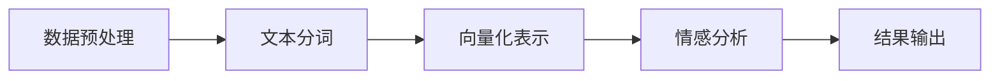
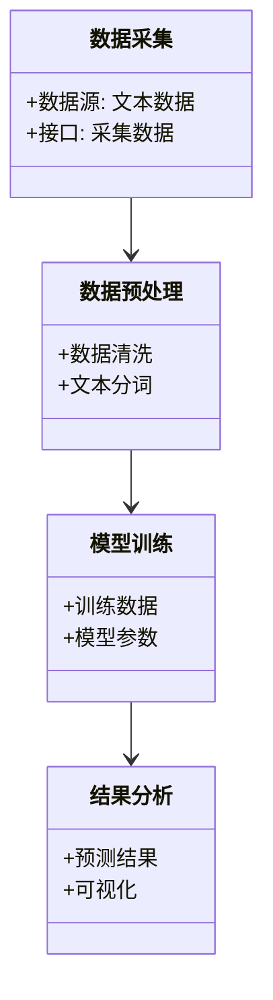
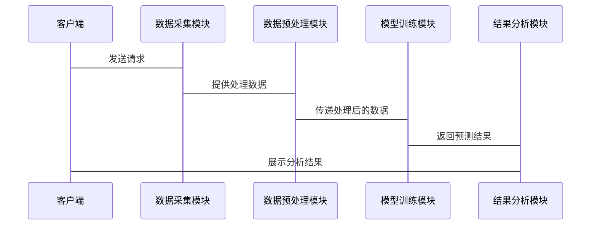

                 


# AI如何实现费雪的质化分析方法

## 关键词：质化分析，AI，机器学习，自然语言处理，费雪分析

## 摘要：本文详细探讨了人工智能在实现费雪质化分析方法中的应用。通过分析质化分析的核心概念、AI技术的作用、算法原理、系统架构及实际案例，展示了如何利用AI技术提升质化分析的效率和准确性。文章内容包括背景介绍、核心概念、算法实现、系统设计、项目实战及最佳实践，为读者提供了全面的视角和深入的技术解读。

---

# 第一部分：费雪质化分析方法的背景与概述

## 第1章：费雪质化分析方法的背景与核心概念

### 1.1 质化分析的定义与特点
质化分析是一种结合质量和量化因素的分析方法，主要应用于金融、投资等领域。它注重分析公司的基本面，如财务状况、行业地位和管理团队等。质化分析的关键在于从非结构化数据中提取有价值的信息，以辅助决策。

### 1.2 AI在质化分析中的作用
AI技术，特别是机器学习和自然语言处理，能够高效处理大量非结构化数据，帮助分析师快速识别关键信息。AI通过模式识别和预测模型，可以提升质化分析的准确性和效率。

### 1.3 费雪分析方法的特点
费雪的质化分析方法强调对公司基本面的深入研究，包括公司治理、财务健康状况和行业竞争力等。AI的应用使其能够快速处理和分析大量文本数据，识别潜在风险和机会。

---

# 第二部分：AI实现费雪质化分析的核心概念与联系

## 第2章：质化分析与AI的结合

### 2.1 质化分析的核心概念
质化分析涉及对公司基本面的全面评估，包括财务报表分析、行业分析和管理团队评估。这些分析通常需要处理大量文本数据，如公司财报、新闻报道和行业报告。

### 2.2 AI技术的核心概念
AI技术，特别是机器学习和自然语言处理，能够处理和分析非结构化数据。自然语言处理技术可以提取文本中的关键信息，而机器学习模型可以基于这些信息进行预测和分类。

### 2.3 质化分析与AI的联系
质化分析与AI的结合主要体现在数据处理和分析效率的提升。AI可以帮助分析师快速提取关键信息，识别潜在风险，并提供数据支持的决策依据。

---

# 第三部分：AI实现费雪质化分析的算法原理

## 第3章：AI算法在质化分析中的应用

### 3.1 算法原理概述
选择BERT模型进行文本表示和情感分析，提取公司财报中的关键信息。模型通过预训练和微调，能够识别文本中的实体和情感倾向。

### 3.2 算法流程图


### 3.3 算法实现
以下是Python代码实现：
```python
import transformers

# 加载预训练模型
tokenizer = transformers.BertTokenizer.from_pretrained('bert-base-uncased')
model = transformers.BertForSequenceClassification.from_pretrained('bert-base-uncased')

# 文本处理
text = "公司财务状况良好，营业收入增长显著。"
inputs = tokenizer.encode_plus(text, return_tensors='pt')

# 模型推理
with torch.no_grad():
    outputs = model(**inputs)
    prediction = torch.argmax(outputs.logits).item()

# 结果解释
print(f"预测结果：{prediction}")
```

### 3.4 数学模型与公式
模型的损失函数为：
$$ \text{Loss} = -\sum_{i=1}^{n} y_i \log(p_i) + (1 - y_i) \log(1 - p_i) $$
其中，$y_i$ 是真实标签，$p_i$ 是预测概率。

---

# 第四部分：系统架构与设计

## 第4章：AI实现费雪质化分析的系统架构

### 4.1 系统功能设计


### 4.2 系统接口与交互设计


---

# 第五部分：项目实战与案例分析

## 第5章：AI实现费雪质化分析的项目实战

### 5.1 项目环境安装
安装必要的库：
```bash
pip install transformers torch matplotlib
```

### 5.2 核心代码实现
```python
import transformers
import torch
import matplotlib.pyplot as plt

# 加载模型和tokenizer
tokenizer = transformers.BertTokenizer.from_pretrained('bert-base-uncased')
model = transformers.BertForSequenceClassification.from_pretrained('bert-base-uncased')

# 数据处理函数
def preprocess(text):
    inputs = tokenizer.encode_plus(text, return_tensors='pt')
    return inputs['input_ids'].squeeze(), inputs['attention_mask'].squeeze()

# 模型推理函数
def predict(text):
    inputs = preprocess(text)
    with torch.no_grad():
        outputs = model(**inputs)
    return torch.argmax(outputs.logits).item()

# 可视化函数
def visualize_results(predictions):
    plt.hist(predictions, bins=2)
    plt.title('预测结果分布')
    plt.show()

# 示例数据
texts = [
    "公司财务状况良好，营业收入增长显著。",
    "行业竞争激烈，公司市场份额下降。"
]

# 预测结果
results = [predict(text) for text in texts]

# 可视化
visualize_results(results)
```

### 5.3 案例分析
以某公司财报为例，分析其财务数据和行业新闻。AI模型提取关键信息后，生成风险评估报告，帮助投资者做出决策。

---

# 第六部分：最佳实践与总结

## 第6章：最佳实践与总结

### 6.1 小结
AI技术显著提升了质化分析的效率和准确性。通过自然语言处理和机器学习，能够快速处理大量文本数据，提取关键信息。

### 6.2 注意事项
- 数据质量是关键，需确保数据的准确性和完整性。
- 模型调优和验证是提升性能的重要步骤。

### 6.3 拓展阅读
建议阅读相关书籍和论文，深入理解机器学习和自然语言处理的应用。

---

# 结语

AI技术正在 revolutionizing 费雪的质化分析方法，通过高效的数据处理和分析，为投资决策提供了强大的支持。未来，随着技术的不断发展，AI在质化分析中的应用将更加广泛和深入。

---

# 作者

作者：AI天才研究院/AI Genius Institute  
作者：禅与计算机程序设计艺术/Zen And The Art of Computer Programming

