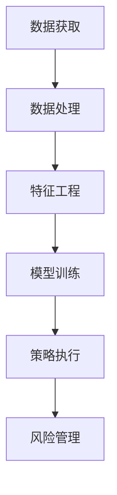
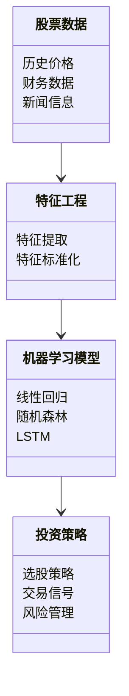
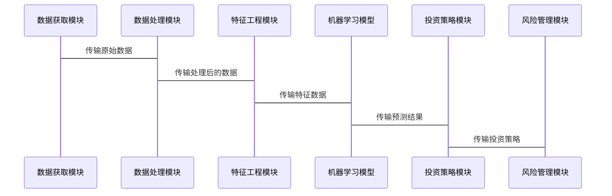

                 


# AI如何实现费雪的长期持股策略

> 关键词：AI, 费雪策略, 长期持股, 机器学习, 股票预测, 投资策略

> 摘要：本文详细探讨了如何利用人工智能技术实现费雪的长期持股策略。通过分析费雪策略的核心要素，结合机器学习算法和系统架构设计，展示了AI在股票投资中的潜力。文章从理论到实践，逐步解析了AI实现费雪策略的全过程，包括数据处理、模型构建、策略执行和风险管理等关键环节。

---

# 第1章: 费雪长期持股策略概述

## 1.1 费雪投资策略的核心理念
### 1.1.1 费雪策略的定义
费雪（Philip Fisher）是20世纪的投资大师，其策略强调选择基本面优秀的企业进行长期持有。他提出“购买并持有的”投资理念，认为优质股票的价值会随着时间的推移而增长。

### 1.1.2 费雪策略的核心要素
1. **企业质量**：选择具有强大竞争优势和良好管理的公司。
2. **长期视角**：不因短期市场波动而改变投资决策。
3. **持续研究**：通过深入研究企业基本面，筛选出具备长期增长潜力的股票。

### 1.1.3 费雪策略与现代投资理论的联系
费雪策略与现代投资组合理论（MPT）和行为金融学有重要联系，强调长期投资和价值发现。

## 1.2 AI在投资领域的应用前景
### 1.2.1 AI在金融领域的潜力
AI能够处理海量数据，发现复杂模式，帮助投资者做出更明智的决策。

### 1.2.2 AI在股票投资中的优势
1. **数据处理能力**：AI可以快速分析大量历史数据和实时信息。
2. **预测准确性**：通过机器学习模型，AI能够提高股票价格预测的准确性。
3. **自动化决策**：AI可以实现自动化交易和风险管理。

### 1.2.3 费雪策略与AI结合的可行性
AI可以帮助投资者更有效地筛选优质股票，优化投资组合，并实时监控市场变化。

## 1.3 费雪策略实现的关键问题
### 1.3.1 数据获取与处理
如何获取高质量的股票数据并进行有效的特征提取。

### 1.3.2 模型构建与优化
选择合适的机器学习算法，构建能够准确预测股票价格的模型。

### 1.3.3 策略执行与风险管理
如何将AI模型的预测结果转化为实际的投资策略，并有效控制风险。

## 1.4 本章小结
本章介绍了费雪长期持股策略的核心理念及其在现代投资理论中的地位，探讨了AI在股票投资中的潜力，并提出了实现费雪策略的关键问题。

---

# 第2章: AI实现费雪策略的核心概念与联系

## 2.1 费雪策略的核心要素
### 2.1.1 股票选择标准
费雪提出的“15个标准”用于筛选优质股票。

### 2.1.2 长期持有原则
避免频繁交易，降低交易成本，长期持有优质股票。

### 2.1.3 风险控制策略
通过分散投资和持续监控，降低投资组合的整体风险。

## 2.2 AI在股票分析中的应用
### 2.2.1 数据挖掘与特征提取
利用AI技术从海量数据中提取有用的特征，帮助筛选优质股票。

### 2.2.2 模型预测与决策支持
通过机器学习模型预测股票价格走势，辅助投资决策。

### 2.2.3 自动化交易与风险管理
AI可以实现自动化交易，并通过实时监控和调整来管理投资风险。

## 2.3 费雪策略与AI结合的系统架构
### 2.3.1 系统整体架构
包括数据获取、特征工程、模型训练、策略执行和风险管理五个模块。

### 2.3.2 数据流与信息处理
数据从多个来源获取，经过清洗、特征提取和标准化后，输入模型进行预测。

### 2.3.3 AI模型与策略执行
AI模型生成预测结果，策略执行模块根据预测结果制定投资策略。

## 2.4 本章小结
本章分析了费雪策略的核心要素，并探讨了AI在股票分析中的应用，提出了一个AI实现费雪策略的系统架构。

---

# 第3章: AI实现费雪策略的算法原理

## 3.1 线性回归模型
### 3.1.1 线性回归的基本原理
线性回归是一种简单的回归分析方法，用于预测目标变量与一个或多个特征变量之间的线性关系。

### 3.1.2 股票价格预测的线性回归模型
$$ y = \beta_0 + \beta_1x + \epsilon $$

### 3.1.3 模型优缺点分析
线性回归模型简单易懂，但可能无法捕捉复杂的非线性关系。

## 3.2 支持向量机（SVM）
### 3.2.1 SVM的基本原理
SVM是一种监督学习算法，用于分类和回归问题。

### 3.2.2 股票分类与预测应用
SVM可以用于股票涨跌分类和价格预测。

### 3.2.3 模型调优与优化
通过调整核函数和惩罚参数，提高SVM的预测性能。

## 3.3 随机森林与集成学习
### 3.3.1 随机森林的基本原理
随机森林是一种基于决策树的集成学习算法，具有高准确性和鲁棒性。

### 3.3.2 股票预测中的集成学习应用
通过集成多个模型的结果，提高股票价格预测的准确性。

### 3.3.3 模型性能评估与优化
通过交叉验证和特征重要性分析，优化随机森林模型的性能。

## 3.4 深度学习模型
### 3.4.1 神经网络的基本原理
神经网络是一种模仿人脑结构的深度学习模型，能够捕捉复杂的模式和特征。

### 3.4.2 LSTM在时间序列预测中的应用
LSTM（长短期记忆网络）特别适合处理时间序列数据，可以用于股票价格预测。

### 3.4.3 模型训练与优化策略
通过调整学习率、批量大小和网络结构，优化深度学习模型的性能。

## 3.5 本章小结
本章详细介绍了几种常用的机器学习算法，包括线性回归、SVM、随机森林和深度学习模型，并探讨了它们在股票价格预测中的应用。

---

# 第4章: AI实现费雪策略的数学模型与公式

## 4.1 线性回归模型
### 4.1.1 线性回归的数学公式
$$ y = \beta_0 + \beta_1x + \epsilon $$

### 4.1.2 模型的假设检验
通过t检验和F检验，验证线性回归模型的显著性和有效性。

## 4.2 时间序列预测模型
### 4.2.1 ARIMA模型的数学公式
$$ ARIMA(p, d, q) $$

### 4.2.2 LSTM模型的数学公式
$$ f(x) = \text{LSTM}(x) $$

## 4.3 集成学习模型
### 4.3.1 集成学习的基本原理
通过集成多个弱模型的结果，提高整体预测的准确性和稳定性。

### 4.3.2 随机森林的数学公式
$$ y = \text{投票}(f_1(x), f_2(x), ..., f_n(x)) $$

## 4.4 本章小结
本章通过数学公式详细介绍了几种常用的机器学习模型，包括线性回归、ARIMA和LSTM模型，以及集成学习的基本原理。

---

# 第5章: AI实现费雪策略的系统架构设计

## 5.1 系统整体架构
### 5.1.1 系统架构图


### 5.1.2 模块功能描述
1. **数据获取**：从多个数据源获取股票数据，包括历史价格、财务数据和新闻信息。
2. **数据处理**：清洗数据，处理缺失值和异常值。
3. **特征工程**：提取有用的特征，如市盈率、市净率和ROE等。
4. **模型训练**：使用机器学习算法训练模型，生成预测结果。
5. **策略执行**：根据模型预测结果制定投资策略。
6. **风险管理**：监控市场变化和投资组合风险，及时调整策略。

## 5.2 系统功能设计
### 5.2.1 领域模型


### 5.2.2 系统架构图


## 5.3 系统接口设计
### 5.3.1 数据接口
- 数据获取接口：从第三方数据源获取股票数据。
- 数据存储接口：将处理后的数据存储到数据库中。

### 5.3.2 模型接口
- 模型训练接口：接收特征数据，训练机器学习模型。
- 模型预测接口：根据输入数据，生成预测结果。

## 5.4 系统交互流程


## 5.5 本章小结
本章详细描述了AI实现费雪策略的系统架构设计，包括模块功能、系统架构图和系统交互流程。

---

# 第6章: 项目实战——AI选股模型实现

## 6.1 环境安装
### 6.1.1 安装Python
```bash
python --version
pip install numpy pandas scikit-learn tensorflow
```

### 6.1.2 数据获取
使用`pandas`库从Yahoo Finance获取股票数据。

## 6.2 系统核心实现
### 6.2.1 数据预处理
```python
import pandas as pd
import numpy as np

# 获取股票数据
data = pd.read_csv('stock_data.csv')

# 数据清洗
data.dropna(inplace=True)
data = data[~data['Adj Close'].isnull()]
```

### 6.2.2 特征工程
```python
from sklearn.preprocessing import StandardScaler

# 提取特征
features = data[['Close', 'Volume', 'EMA_20', 'EMA_50']]
scaler = StandardScaler()
features_scaled = scaler.fit_transform(features)
```

### 6.2.3 模型训练
```python
from sklearn.ensemble import RandomForestRegressor

# 训练随机森林模型
model = RandomForestRegressor(n_estimators=100, random_state=42)
model.fit(features_scaled, data['Target'])
```

### 6.2.4 模型预测
```python
# 预测股票价格
predicted_prices = model.predict(new_features_scaled)
```

## 6.3 代码应用解读与分析
### 6.3.1 代码功能分析
详细解读每一段代码的功能和作用。

### 6.3.2 模型性能评估
通过均方误差（MSE）和R平方值评估模型的性能。

## 6.4 实际案例分析
### 6.4.1 案例背景
选择一只股票作为案例，分析其历史数据和预测结果。

### 6.4.2 案例分析
通过模型预测，制定投资策略并进行实际操作。

## 6.5 本章小结
本章通过实际案例展示了AI选股模型的实现过程，从数据获取到模型训练，再到模型预测，详细解读了每一步的操作和注意事项。

---

# 第7章: AI实现费雪策略的最佳实践与小结

## 7.1 最佳实践
### 7.1.1 数据处理
确保数据的完整性和准确性，选择合适的特征工程方法。

### 7.1.2 模型选择
根据实际需求选择合适的机器学习算法，进行模型调优和优化。

### 7.1.3 风险管理
制定合理的风险管理策略，避免过度集中投资和市场波动带来的风险。

## 7.2 小结
AI技术为实现费雪的长期持股策略提供了新的可能性，通过机器学习算法和系统架构设计，投资者可以更高效地筛选优质股票，优化投资组合，并实时监控市场变化。

## 7.3 注意事项
### 7.3.1 数据依赖性
AI模型的预测结果依赖于数据的质量和数量，数据不足可能导致模型性能下降。

### 7.3.2 市场不确定性
股市具有不确定性，AI模型无法完全预测市场波动，投资者需保持谨慎。

### 7.3.3 技术局限性
当前AI技术在股票预测中的应用仍存在局限性，需结合人工判断和经验进行投资决策。

## 7.4 拓展阅读
### 7.4.1 推荐书籍
1. 《The Intelligent Investor》
2. 《Machine Learning for Asset Managers》

### 7.4.2 推荐博客和资源
1. Towards Data Science
2. QuantInst Int

---

# 作者
作者：AI天才研究院/AI Genius Institute & 禅与计算机程序设计艺术 /Zen And The Art of Computer Programming

