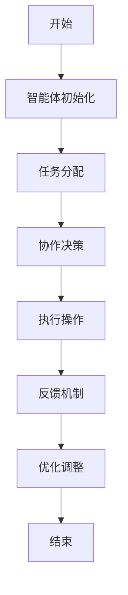
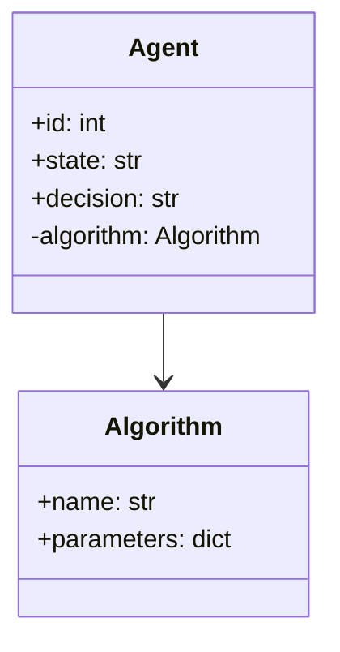
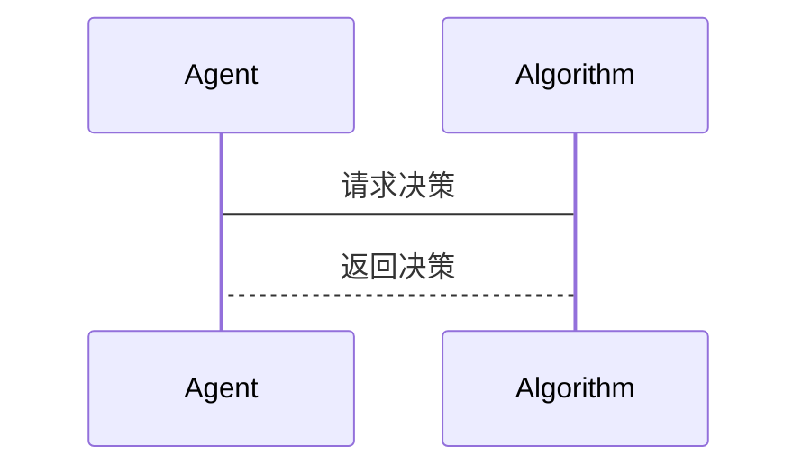

                 


# AI智能体协作：优化价值投资的全球产业链布局策略

## 关键词：AI智能体协作、价值投资、全球产业链布局、多智能体系统、分布式决策

## 摘要：  
本文探讨AI智能体协作在优化价值投资和全球产业链布局中的应用策略。通过分析AI智能体协作的核心原理、算法模型和系统架构，提出基于多智能体协作的优化方法，结合实际案例和项目实战，为全球产业链布局提供创新思路。

---

# 目录

1. [AI智能体协作的概述](#ai智能体协作的概述)
2. [AI智能体协作的核心原理与机制](#ai智能体协作的核心原理与机制)
3. [AI智能体协作的算法原理与数学模型](#ai智能体协作的算法原理与数学模型)
4. [AI智能体协作的系统分析与架构设计](#ai智能体协作的系统分析与架构设计)
5. [AI智能体协作的项目实战](#ai智能体协作的项目实战)
6. [AI智能体协作的最佳实践与未来展望](#ai智能体协作的最佳实践与未来展望)

---

# 第一部分: AI智能体协作的背景与概念

## 第1章: AI智能体协作的概述

### 1.1 AI智能体协作的核心概念

#### 1.1.1 AI智能体的定义与特点

AI智能体（Artificial Intelligence Agent）是一种能够感知环境、自主决策、执行任务的智能实体。其特点包括：

- **自主性**：能够在无外部干预的情况下完成任务。
- **反应性**：能够根据环境变化动态调整行为。
- **协作性**：能够与其他智能体或人类协同工作，实现共同目标。
- **学习性**：能够通过数据学习和优化决策模型。

#### 1.1.2 智能体协作的背景与意义

随着全球化进程的加快，企业在全球产业链中的布局需要更加灵活和高效。AI智能体协作能够通过分布式决策和协同优化，帮助企业在复杂多变的市场环境中快速响应，降低成本，提升效率。

#### 1.1.3 价值投资与全球产业链布局的关联

价值投资关注企业的内在价值，而全球产业链布局则是企业实现价值最大化的重要手段。通过AI智能体协作，可以优化投资决策和产业布局，实现价值投资的全球化和智能化。

### 1.2 AI智能体协作的背景介绍

#### 1.2.1 问题背景与问题描述

- **问题背景**：全球经济的不确定性、产业链的复杂性以及信息的不对称性，使得传统投资和产业布局方式难以适应现代市场需求。
- **问题描述**：如何利用AI技术优化价值投资和全球产业链布局，实现高效协同和智能决策。

#### 1.2.2 问题解决的必要性与目标

- **必要性**：通过AI智能体协作，提升投资决策的准确性和效率，优化产业链布局。
- **目标**：构建一个基于多智能体协作的系统，实现价值投资和产业链布局的智能化、全球化。

#### 1.2.3 边界与外延

- **边界**：仅限于AI智能体协作的技术层面，不涉及具体的企业战略。
- **外延**：可扩展至多个行业和应用场景，如金融、制造、物流等。

#### 1.2.4 核心要素与概念结构

- **核心要素**：智能体、协作机制、目标函数、反馈机制。
- **概念结构**：通过ER图展示智能体协作的核心要素及其关系。

---

## 第2章: AI智能体协作的核心原理与机制

### 2.1 AI智能体协作的核心原理

#### 2.1.1 智能体协作的基本原理

智能体协作基于分布式决策和多智能体系统，通过任务分配、信息共享和协同优化实现目标。其核心思想是通过局部决策的最优性，达到全局优化。

#### 2.1.2 协作机制的分类与特点

- **任务分配机制**：基于角色分配和资源分配。
- **信息共享机制**：基于知识共享和信息同步。
- **协同优化机制**：基于局部最优和全局最优的平衡。

### 2.2 核心概念的属性特征对比

通过对比分析，展示AI智能体协作与传统算法的异同。

| **特性**       | **AI智能体协作** | **传统算法**
|----------------|------------------|----------------|
| **自主性**       | 高              | 低或无         |
| **协作性**       | 高              | 低或无         |
| **适应性**       | 高              | 中或低         |
| **决策效率**     | 高              | 中或低         |

### 2.3 本章小结

---

## 第3章: AI智能体协作的算法原理

### 3.1 协作算法的数学模型

#### 3.1.1 基于多智能体的协作模型

$$ \text{目标函数} = \sum_{i=1}^{n} f_i(x_i) $$

其中，$f_i$ 是第$i$个智能体的目标函数，$x_i$ 是其决策变量。

#### 3.1.2 分布式决策算法

通过分布式计算，实现多智能体协作的全局优化。算法步骤如下：

1. 初始化智能体参数。
2. 智能体根据局部信息进行决策。
3. 通过通信机制共享信息。
4. 根据共享信息优化决策。
5. 重复步骤2-4，直至收敛。

### 3.2 算法的流程图

```


### 3.3 算法的Python实现

```python
def collaborative_algorithm():
    agents = initialize_agents()
    tasks = distribute_tasks(agents)
    decisions = make_collaborative_decisions(agents, tasks)
    return optimize_decisions(decisions)
```

---

## 第4章: AI智能体协作的系统分析与架构设计

### 4.1 系统功能设计

- **领域模型**：通过类图展示系统功能模块。

```


- **系统架构**：通过分层架构图展示系统设计。

```


- **接口设计**：通过序列图展示系统交互。

```


---

## 第5章: AI智能体协作的项目实战

### 5.1 环境安装

- **工具安装**：安装Python、机器学习库（如TensorFlow、PyTorch）。
- **依赖管理**：使用pip管理Python包。

### 5.2 核心代码实现

```python
class Agent:
    def __init__(self, id):
        self.id = id
        self.state = "idle"
    
    def make_decision(self, input):
        # 具体决策逻辑
        return "action"
```

### 5.3 案例分析与解读

- **案例背景**：某企业的全球产业链布局优化。
- **实施步骤**：
  1. 数据收集与预处理。
  2. 智能体初始化与任务分配。
  3. 协作决策与优化。
  4. 反馈与调整。

### 5.4 项目总结

---

## 第6章: AI智能体协作的最佳实践与未来展望

### 6.1 最佳实践

- **数据质量**：确保数据的准确性和完整性。
- **算法选择**：根据实际需求选择合适的算法。
- **系统优化**：通过迭代优化提升系统性能。

### 6.2 小结

### 6.3 注意事项

- **隐私保护**：注意数据隐私和安全问题。
- **系统维护**：定期更新和维护系统。

### 6.4 拓展阅读

- 推荐相关书籍和论文。

---

# 作者：AI天才研究院 & 禅与计算机程序设计艺术

