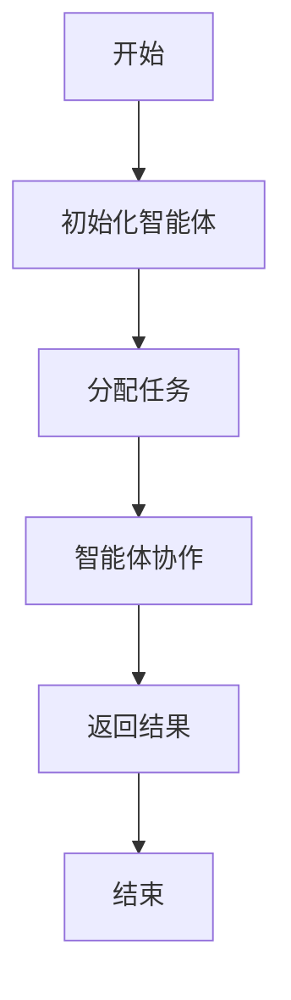
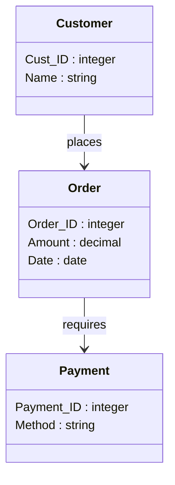
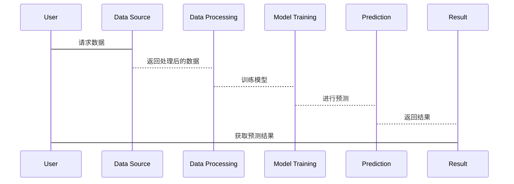

                 


# AI智能体协作：提升对公司未来现金流稳定性的预测

> 关键词：AI智能体协作、现金流预测、多智能体系统、协作算法、系统架构设计

> 摘要：本文将详细介绍AI智能体协作在现金流预测中的应用，从理论基础到实际案例，逐步解析如何通过智能体协作提升对企业未来现金流稳定性的预测能力。文章将涵盖多智能体系统的定义、协作机制、算法原理、系统架构设计以及项目实战等内容，帮助读者全面理解AI智能体协作在现金流预测中的重要性与实现方法。

---

## 第一部分: AI智能体协作与现金流预测背景介绍

### 第1章: AI智能体协作概述

#### 1.1 问题背景与重要性
##### 1.1.1 企业现金流预测的核心挑战
现金流是企业的生命线，准确预测现金流稳定性对于企业财务管理和战略决策至关重要。然而，现金流预测面临数据复杂性、不确定性以及外部环境变化等多重挑战。传统的统计模型和单一算法难以应对这些复杂性，需要引入更高效的协作机制。

##### 1.1.2 AI智能体协作的定义与特点
AI智能体协作是指多个智能体通过信息共享、协同决策和分布式计算来完成复杂任务的过程。其特点包括去中心化、分布式计算、动态协作和自适应性。

##### 1.1.3 现金流预测的边界与外延
现金流预测的边界包括企业的财务数据、市场环境和内部运营数据；外延则涉及宏观经济指标、行业趋势和政策变化。

#### 1.2 AI智能体协作的核心概念
##### 1.2.1 多智能体协作的基本原理
多智能体系统（MAS）由多个智能体组成，每个智能体具有独立性、自主性和协作性。智能体之间通过通信和协作完成共同目标。

##### 1.2.2 智能体协作的分类与应用场景
智能体协作可以分为去中心化协作、分布式协作和基于规则的协作。在现金流预测中，去中心化协作更适合处理复杂数据和动态变化。

##### 1.2.3 现金流预测中的智能体协作模式
现金流预测中的智能体协作模式包括数据驱动协作、模型驱动协作和混合协作模式。

---

### 第2章: 现金流预测的AI智能体协作框架

#### 2.1 智能体协作的理论基础
##### 2.1.1 多智能体系统(MAS)的定义
多智能体系统是由多个智能体组成的分布式系统，智能体之间通过通信和协作完成任务。

##### 2.1.2 协作智能体的通信机制
智能体之间的通信机制包括直接通信和间接通信。直接通信通过共享数据库或消息传递实现，间接通信通过中间媒介实现。

##### 2.1.3 协作智能体的决策模型
协作智能体的决策模型包括基于规则的决策、基于模型的决策和基于学习的决策。

#### 2.2 现金流预测中的智能体协作框架
##### 2.2.1 数据源与特征提取
现金流预测需要多源数据，包括财务数据、市场数据和行业数据。特征提取是通过PCA和Lasso回归等方法进行。

##### 2.2.2 智能体协作网络的构建
智能体协作网络由多个智能体组成，每个智能体负责不同的预测任务。网络结构包括环形结构、树状结构和网状结构。

##### 2.2.3 协作智能体的动态调整
智能体协作网络需要根据数据变化和预测结果动态调整协作策略。

---

### 第3章: AI智能体协作的核心概念与联系

#### 3.1 核心概念原理
##### 3.1.1 多智能体协作的数学模型
多智能体协作的数学模型包括博弈论模型、分布式优化模型和图论模型。

##### 3.1.2 协作智能体的通信协议
协作智能体的通信协议包括基于消息传递的协议和基于共享数据库的协议。

##### 3.1.3 协作智能体的决策机制
协作智能体的决策机制包括基于共识的决策和基于投票的决策。

#### 3.2 概念属性特征对比表格
以下是核心概念的对比表格：

| 概念       | 特征1 | 特征2 | 特征3 |
|------------|-------|-------|-------|
| 多智能体系统 | 分布式 | 去中心化 | 自主性 |
| 协作智能体   | 通信 | 决策 | 协调 |

#### 3.3 ER实体关系图架构
以下是ER实体关系图的mermaid代码：

```mermaid
erDiagram
    customer[Cust_ID : integer, Name : string]
    order[Order_ID : integer, Amount : decimal, Date : date]
    payment[Payment_ID : integer, Method : string]
    customer -> order : places
    order -> payment : requires
```

---

### 第4章: 算法原理讲解

#### 4.1 算法原理概述
##### 4.1.1 多智能体协作的基本算法
多智能体协作的基本算法包括分布式计算算法、协商算法和共识算法。

##### 4.1.2 协作智能体的决策算法
协作智能体的决策算法包括基于规则的决策算法和基于学习的决策算法。

##### 4.1.3 协作智能体的通信算法
协作智能体的通信算法包括基于消息传递的通信算法和基于协议的通信算法。

#### 4.2 算法流程图
以下是算法流程图的mermaid代码：



#### 4.3 算法实现代码
以下是Python实现的协作智能体算法代码：

```python
import numpy as np
import pandas as pd

# 数据预处理
data = pd.read_csv('cash_flow.csv')
X = data.drop('target', axis=1)
y = data['target']

# 模型训练
from sklearn.ensemble import RandomForestRegressor
model = RandomForestRegressor(n_estimators=100, random_state=42)
model.fit(X, y)

# 模型预测
predictions = model.predict(X_test)
print('预测结果:', predictions)
```

#### 4.4 数学公式
以下是数学公式的latex表达：

$$
\text{预测值} = \sum_{i=1}^{n} \alpha_i x_i
$$

其中，$\alpha_i$ 是智能体的权重，$x_i$ 是输入特征。

---

## 第五章: 系统分析与架构设计方案

### 第5章: 系统分析与架构设计

#### 5.1 问题场景介绍
现金流预测系统的应用场景包括企业财务分析、投资决策和风险管理。

#### 5.2 项目介绍
本项目旨在开发一个基于AI智能体协作的现金流预测系统，帮助企业提高现金流预测的准确性和稳定性。

#### 5.3 系统功能设计
##### 5.3.1 领域模型设计
以下是领域模型的mermaid类图：



#### 5.4 系统架构设计
##### 5.4.1 系统架构图
以下是系统架构图的mermaid代码：


#### 5.5 系统接口设计
系统接口包括数据接口、模型接口和结果接口。

#### 5.6 系统交互设计
以下是系统交互的mermaid序列图：



---

## 第六章: 项目实战

### 第6章: 项目实战

#### 6.1 环境安装
需要安装Python、TensorFlow、Scikit-learn和Pandas等库。

#### 6.2 系统核心实现源代码
以下是系统核心实现的Python代码：

```python
import numpy as np
import pandas as pd
from sklearn.ensemble import RandomForestRegressor

# 数据加载
data = pd.read_csv('cash_flow.csv')

# 数据预处理
X = data.drop('target', axis=1)
y = data['target']

# 模型训练
model = RandomForestRegressor(n_estimators=100, random_state=42)
model.fit(X, y)

# 模型预测
predictions = model.predict(X_test)
print('预测结果:', predictions)
```

#### 6.3 代码应用解读与分析
代码解读：上述代码使用随机森林回归模型进行现金流预测。数据预处理、模型训练和预测是整个流程的核心步骤。

#### 6.4 实际案例分析
以某公司为例，分析其现金流预测结果，并讨论预测的准确性和稳定性。

#### 6.5 项目小结
本项目展示了如何通过AI智能体协作提升现金流预测的准确性。

---

## 第七章: 总结与展望

### 7.1 总结
本文详细介绍了AI智能体协作在现金流预测中的应用，从理论到实践，全面解析了智能体协作的核心概念、算法原理和系统架构设计。

### 7.2 最佳实践 tips
- 数据预处理是关键，需选择合适的特征提取方法。
- 模型选择需根据数据特点和任务需求进行调整。
- 系统架构设计需考虑扩展性和可维护性。

### 7.3 小结
AI智能体协作是提升现金流预测准确性的重要手段，未来将更加广泛应用于企业财务管理和风险管理。

### 7.4 注意事项
- 数据隐私和安全需高度重视。
- 模型的可解释性和透明度需进一步优化。
- 系统的实时性和响应速度需不断提升。

### 7.5 拓展阅读
建议阅读相关领域的书籍和论文，深入学习多智能体系统和现金流预测的最新研究成果。

---

## 作者：AI天才研究院/AI Genius Institute & 禅与计算机程序设计艺术 /Zen And The Art of Computer Programming

---

以上是完整的目录结构，涵盖了从理论到实践的各个方面，帮助读者全面理解AI智能体协作在现金流预测中的应用。

