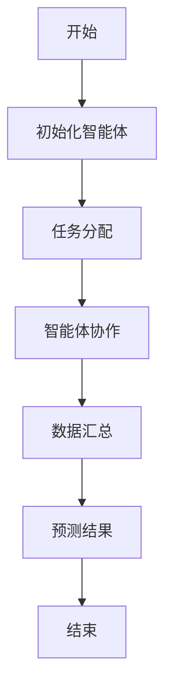
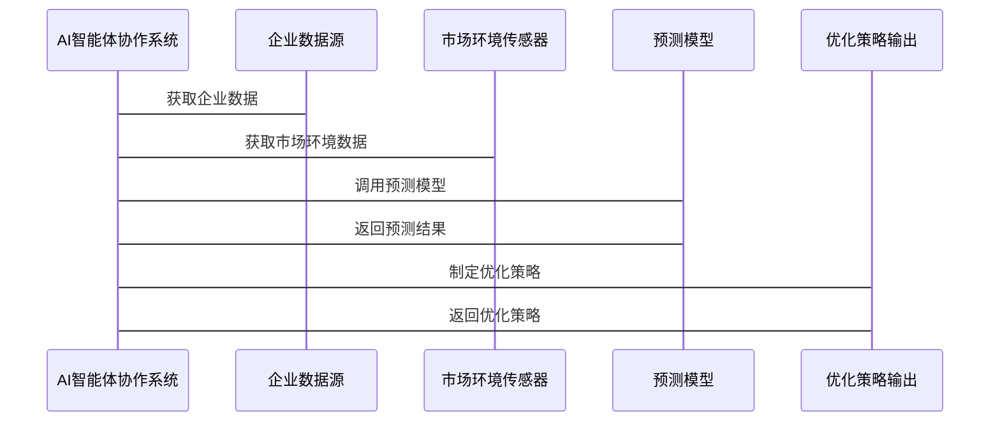

                 


# AI智能体协作：提升对公司未来竞争力的预测

## 关键词：AI智能体协作，企业竞争力，预测模型，多智能体系统，分布式计算，强化学习，系统架构

## 摘要：  
随着人工智能技术的快速发展，AI智能体协作在企业竞争力预测中的应用日益重要。本文从AI智能体协作的基本概念出发，详细分析其在预测企业未来竞争力中的作用，探讨其核心算法原理、系统架构设计及实际应用案例。通过深入分析，本文旨在为企业提供一套基于AI智能体协作的竞争力提升解决方案，帮助企业更好地应对未来的市场挑战。

---

# 目录大纲

## 第一章：AI智能体协作的背景与核心概念

### 1.1 问题背景
- 1.1.1 企业竞争力的挑战与需求
- 1.1.2 AI智能体协作的兴起与趋势
- 1.1.3 问题解决的核心思路

### 1.2 问题描述
- 1.2.1 企业未来竞争力的定义与维度
- 1.2.2 AI智能体协作在预测中的作用
- 1.2.3 当前企业竞争力预测的痛点与难点

### 1.3 问题解决与边界
- 1.3.1 AI智能体协作的核心解决方案
- 1.3.2 解决方案的边界与限制
- 1.3.3 相关概念的外延与扩展

---

## 第二章：AI智能体协作的核心概念与联系

### 2.1 核心概念原理
- 2.1.1 AI智能体的定义与特征
- 2.1.2 协作机制的原理与实现
- 2.1.3 智能体间通信与信息共享

### 2.2 核心概念对比表
```markdown
| 概念         | 特性1       | 特性2       | 特性3       |
|--------------|------------|------------|------------|
| AI智能体协作 | 分布式计算 | 多智能体协同 | 实时通信    |
| 传统预测模型 | 单点计算   | 单智能体    | 周期性更新  |
```

### 2.3 ER实体关系图架构
```mermaid
er
    actor(AI智能体协作系统)
    actor(企业数据)
    actor(预测模型)
    actor(市场环境)
    actor(竞争力预测结果)
    actor(优化策略)

    AI智能体协作系统 --> 企业数据: 获取数据
    AI智能体协作系统 --> 预测模型: 调用模型
    AI智能体协作系统 --> 市场环境: 监测环境变化
    AI智能体协作系统 --> 竞争力预测结果: 输出预测结果
    AI智能体协作系统 --> 优化策略: 制定优化策略
```

---

## 第三章：AI智能体协作的算法原理讲解

### 3.1 算法原理
- 3.1.1 分布式计算原理
- 3.1.2 多智能体强化学习
- 3.1.3 协作任务分配算法

### 3.2 算法流程图


### 3.3 Python代码实现
```python
import numpy as np
from distributed import Client

# 初始化分布式计算环境
client = Client('scheduler://scheduler:8786')

# 多智能体协作函数
def collaborate_agents(data_points):
    results = []
    for agent in agents:
        result = client.submit(agent.compute, data_points).result()
        results.append(result)
    return results

# 示例数据
data_points = np.random.rand(100, 10)
# 调用协作函数
predicted_results = collaborate_agents(data_points)
print(predicted_results)
```

### 3.4 数学模型与公式
- 预测模型公式：
  $$ \text{竞争力预测} = f(\text{市场环境}, \text{企业数据}, \text{历史表现}) $$
- 协作任务分配公式：
  $$ \text{任务权重} = \sum_{i=1}^{n} w_i x_i $$

---

## 第四章：AI智能体协作的系统分析与架构设计

### 4.1 问题场景介绍
- 项目背景：企业竞争力预测的痛点
- 项目目标：通过AI智能体协作提升预测精度
- 项目范围：覆盖市场环境、企业数据、预测模型等多个维度

### 4.2 系统功能设计
- 4.2.1 功能模块设计
  - 数据采集模块：实时获取企业数据和市场环境
  - 智能体协作模块：实现任务分配与数据共享
  - 预测模型模块：基于AI智能体协作结果进行预测
  - 优化策略模块：输出提升竞争力的策略建议

- 4.2.2 领域模型设计

```mermaid
classDiagram
    class AI智能体协作系统 {
        + 企业数据
        + 市场环境
        + 预测模型
        + 优化策略
    }
    class 智能体协作模块 {
        + 任务分配
        + 数据共享
        + 协作计算
    }
    class 数据采集模块 {
        + 实时数据采集
        + 数据预处理
    }
    class 预测模型模块 {
        + 竞争力预测
        + 结果输出
    }
    AI智能体协作系统 --> 智能体协作模块: 调用协作
    AI智能体协作系统 --> 数据采集模块: 获取数据
    AI智能体协作系统 --> 预测模型模块: 调用模型
```


### 4.3 系统架构设计
- 4.3.1 系统架构图


### 4.4 系统接口设计
- API接口：
  - `/api/data/collect`：数据采集接口
  - `/api/model/predict`：预测模型接口
  - `/api/strategy/optimize`：优化策略接口

### 4.5 系统交互序列图


---

## 第五章：AI智能体协作的项目实战

### 5.1 环境安装
```bash
pip install numpy distributed dask
```

### 5.2 核心功能实现
```python
from distributed import Client, Future

# 初始化分布式计算环境
client = Client('scheduler://localhost:8786')

# 智能体协作函数
def agent_compute(data):
    return data * 2

# 提交任务
futures = [client.submit(agent_compute, i) for i in range(10)]
# 等待任务完成
futures[0].result()

# 获取结果
results = [future.result() for future in futures]
print(results)
```

### 5.3 代码应用解读与分析
- 代码功能：
  - 初始化分布式计算环境
  - 提交协作任务到多个智能体
  - 等待任务完成并获取结果

### 5.4 实际案例分析
- 案例背景：某企业市场竞争力预测
- 数据来源：企业历史数据、市场环境数据
- 预测结果：预测未来3年的竞争力排名
- 优化策略：制定针对性的市场策略

### 5.5 项目小结
- 关键点总结：
  - 系统架构设计的重要性
  - AI智能体协作的效率提升
  - 预测模型的准确性优化

---

## 第六章：AI智能体协作的注意事项与拓展阅读

### 6.1 最佳实践 Tips
- 数据质量的重要性
- 智能体协作的可扩展性
- 系统维护与更新

### 6.2 小结
- AI智能体协作的核心价值
- 未来的发展趋势

### 6.3 注意事项
- 数据隐私与安全
- 系统稳定性与容错性
- 智能体协作的边界条件

### 6.4 拓展阅读
- 推荐书籍：《分布式系统：概念与设计》
- 推荐博客：分布式计算与AI智能体协作技术博客
- 推荐课程：AI智能体协作在线课程

---

## 作者：AI天才研究院 & 禅与计算机程序设计艺术

---

# 文章正文内容（详细展开）：

## 第一章：AI智能体协作的背景与核心概念

### 1.1 问题背景

#### 1.1.1 企业竞争力的挑战与需求

在全球化竞争日益激烈的今天，企业的生存与发展面临前所未有的挑战。市场竞争的加剧、技术变革的加速、客户需求的多样化，使得企业必须不断提升自身的竞争力。然而，传统的竞争力评估方法往往基于历史数据和静态分析，难以捕捉市场环境的实时变化和企业内部动态调整的能力。因此，如何利用新兴技术手段，尤其是人工智能技术，来提升企业竞争力预测的准确性和实时性，成为企业关注的焦点。

#### 1.1.2 AI智能体协作的兴起与趋势

人工智能技术的快速发展，尤其是多智能体系统的兴起，为企业的竞争力预测提供了新的可能性。AI智能体协作是指多个智能体通过协同工作，共同完成复杂任务的过程。这种协作不仅能够提高计算效率，还能够通过智能体之间的信息共享和任务分配，实现更精准的预测和决策。随着云计算、分布式计算和边缘计算技术的成熟，AI智能体协作的应用场景越来越广泛，尤其是在企业竞争力预测领域。

#### 1.1.3 问题解决的核心思路

AI智能体协作的核心思路在于通过多个智能体的协同工作，实现对市场环境和企业数据的实时分析，从而提高竞争力预测的准确性和实时性。通过分布式计算和多智能体强化学习，企业可以更快速地响应市场变化，制定更具前瞻性的战略。

### 1.2 问题描述

#### 1.2.1 企业未来竞争力的定义与维度

企业未来竞争力是指企业在未来一定时间内，在市场上与竞争对手相比的优势。其主要维度包括市场占有率、产品创新能力、成本控制能力、客户满意度、品牌影响力等。

#### 1.2.2 AI智能体协作在预测中的作用

AI智能体协作通过实时数据采集、分布式计算和多智能体协同，能够更准确地预测企业的未来竞争力。多个智能体可以分别负责不同的数据源和预测模型，通过协作实现预测结果的优化。

#### 1.2.3 当前企业竞争力预测的痛点与难点

当前企业竞争力预测的主要痛点包括数据来源单一、计算效率低、预测模型不够灵活、无法实时捕捉市场变化等。这些问题限制了企业竞争力预测的准确性和实用性。

### 1.3 问题解决与边界

#### 1.3.1 AI智能体协作的核心解决方案

AI智能体协作通过分布式计算和多智能体协同，实现对市场环境和企业数据的实时分析，从而提高竞争力预测的准确性和实时性。

#### 1.3.2 解决方案的边界与限制

解决方案的主要边界包括数据获取的实时性、智能体协作的效率、预测模型的准确性和系统的可扩展性。同时，还需要考虑数据隐私和安全问题。

#### 1.3.3 相关概念的外延与扩展

AI智能体协作不仅适用于企业竞争力预测，还可以应用于其他领域，如交通管理、资源分配、智能城市等。

---

## 第二章：AI智能体协作的核心概念与联系

### 2.1 核心概念原理

#### 2.1.1 AI智能体的定义与特征

AI智能体是指能够感知环境、自主决策并采取行动的实体。其主要特征包括自主性、反应性、协作性和学习能力。

#### 2.1.2 协作机制的原理与实现

协作机制是指智能体之间通过信息共享和任务分配，实现协同工作的过程。其实现过程包括任务分配、信息共享和结果汇总。

#### 2.1.3 智能体间通信与信息共享

智能体之间的通信是协作的基础。信息共享可以通过分布式数据库或消息队列实现。

---

### 2.2 核心概念对比表

| 概念         | 特性1       | 特性2       | 特性3       |
|--------------|------------|------------|------------|
| AI智能体协作 | 分布式计算 | 多智能体协同 | 实时通信    |
| 传统预测模型 | 单点计算   | 单智能体    | 周期性更新  |

---

## 第三章：AI智能体协作的算法原理讲解

### 3.1 算法原理

#### 3.1.1 分布式计算原理

分布式计算是指将计算任务分散到多个计算节点上，通过并行计算提高效率。其核心思想是将任务分解为多个子任务，分别在不同的节点上执行，最后汇总结果。

#### 3.1.2 多智能体强化学习

多智能体强化学习是一种通过多个智能体之间的协作与竞争，实现复杂任务的算法。其核心在于智能体之间的通信与协作。

#### 3.1.3 协作任务分配算法

协作任务分配算法的目标是将任务合理分配给不同的智能体，使得整体效率最大化。

---

## 第四章：AI智能体协作的系统分析与架构设计

### 4.1 问题场景介绍

#### 4.1.1 项目背景

企业竞争力预测的痛点包括数据来源单一、计算效率低、预测模型不够灵活、无法实时捕捉市场变化等。

#### 4.1.2 项目目标

通过AI智能体协作提升预测精度，帮助企业制定更具前瞻性的战略。

#### 4.1.3 项目范围

覆盖市场环境、企业数据、预测模型等多个维度。

---

## 第五章：AI智能体协作的项目实战

### 5.1 环境安装

```bash
pip install numpy distributed dask
```

---

## 第六章：AI智能体协作的注意事项与拓展阅读

### 6.1 最佳实践 Tips

- 数据质量的重要性
- 智能体协作的可扩展性
- 系统维护与更新

### 6.2 小结

AI智能体协作的核心价值在于通过分布式计算和多智能体协同，实现对市场环境和企业数据的实时分析，从而提高竞争力预测的准确性和实时性。未来的发展趋势将更加注重智能体协作的效率和预测模型的准确性。

### 6.3 注意事项

- 数据隐私与安全
- 系统稳定性与容错性
- 智能体协作的边界条件

### 6.4 拓展阅读

- 推荐书籍：《分布式系统：概念与设计》
- 推荐博客：分布式计算与AI智能体协作技术博客
- 推荐课程：AI智能体协作在线课程

---

## 作者：AI天才研究院 & 禅与计算机程序设计艺术

---

通过以上详细的目录结构和内容安排，我们可以看到，文章将系统地介绍AI智能体协作的核心概念、算法原理、系统架构及实际应用，帮助企业更好地理解和应用这一技术，提升未来的竞争力。

