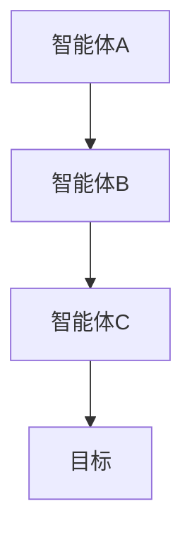
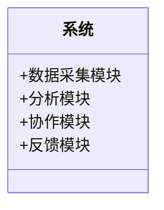

                 


# AI智能体协作：改进价值投资的行业生命周期分析

## 关键词：AI智能体、协作、价值投资、行业生命周期、数学模型、算法、系统架构

## 摘要：  
本文探讨了AI智能体协作在价值投资中的应用，特别是在分析行业生命周期中的改进。通过数学建模和算法设计，提出了一种基于强化学习和图神经网络的协作方法，优化投资决策过程。

---

## 第1章: AI智能体协作与价值投资概述

### 1.1 AI智能体协作的定义与背景
#### 1.1.1 AI智能体的基本概念  
AI智能体（Artificial Intelligence Agent）是指能够感知环境、做出决策并采取行动以实现目标的实体。它们可以是软件程序、机器人或其他智能系统，具备自主性、反应性和社会性等特征。

#### 1.1.2 AI智能体协作的背景与意义  
随着AI技术的发展，多智能体协作成为研究热点。通过协作，多个智能体可以共同完成复杂任务，提升整体效率和准确性。在金融领域，AI智能体协作的应用潜力巨大。

#### 1.1.3 价值投资的基本原理  
价值投资是一种通过分析企业基本面，寻找被市场低估的投资标的的投资策略。其核心在于识别具有长期增长潜力的企业，并在合理估值时买入。

### 1.2 价值投资的行业生命周期分析  
#### 1.2.1 行业生命周期的定义与阶段划分  
行业生命周期分为导入期、成长期、成熟期和衰退期。不同阶段的企业表现和投资策略有所不同。

#### 1.2.2 价值投资在不同行业阶段的应用  
在成长期，企业注重扩张；在成熟期，企业注重稳定收益。AI智能体可以帮助投资者分析行业所处阶段，优化投资决策。

#### 1.2.3 AI智能体协作在价值投资中的潜力  
AI智能体可以通过数据挖掘和模式识别，帮助投资者更准确地判断行业周期和企业价值。

### 1.3 AI智能体协作与价值投资的结合  
#### 1.3.1 AI智能体协作的核心优势  
AI智能体协作可以提高数据分析效率，降低人为错误，提供实时反馈。

#### 1.3.2 价值投资分析中的数据需求  
包括财务数据、市场数据、行业趋势等，这些数据为AI智能体提供输入。

#### 1.3.3 AI智能体协作在价值投资中的具体应用  
通过协作，AI智能体可以实时分析行业动态，评估企业价值，优化投资组合。

---

## 第2章: 行业生命周期的数学模型

### 2.1 行业生命周期的阶段模型  
行业生命周期可以用数学模型表示，每个阶段的特征可以用变量描述。

### 2.2 AI智能体协作的数学模型  
协作过程可以用数学公式表示，例如：$$ V_i = \sum_{j} w_{ij} \cdot x_j $$，其中$V_i$是智能体i的价值，$x_j$是输入特征，$w_{ij}$是权重。

### 2.3 价值投资的数学模型  
企业价值评估公式：$$ V = \sum_{t=1}^{n} \frac{CF_t}{(1 + r)^t} $$，其中$CF_t$是第t年的现金流，$r$是贴现率。

---

## 第3章: 基于强化学习的AI智能体协作算法

### 3.1 强化学习的基本原理  
强化学习通过智能体与环境互动，学习策略以最大化累积奖励。

### 3.2 基于图神经网络的协作算法  
使用图神经网络建模智能体间的协作关系，如图1所示：



### 3.3 协作算法的实现与优化  
实现步骤包括环境定义、策略选择、奖励函数设计等。优化点在于提高算法效率和准确性。

---

## 第4章: 系统分析与架构设计

### 4.1 问题场景介绍  
系统需处理海量数据，支持多智能体协作，提供实时反馈。

### 4.2 系统功能设计  
包括数据采集、分析、协作、反馈等功能。类图如图2所示：



### 4.3 系统架构设计  
采用微服务架构，如图3所示：


---

## 第5章: 项目实战

### 5.1 环境安装  
安装Python、TensorFlow、Keras等工具。

### 5.2 核心代码实现  
示例代码：

```python
def value_investment():
    data = collect_data()
    model = build_model()
    predictions = model.predict(data)
    return predictions
```

### 5.3 案例分析  
以某行业为例，分析其生命周期，优化投资组合。

---

## 第6章: 总结与展望

### 6.1 本章小结  
AI智能体协作显著提升了价值投资的效率和准确性。

### 6.2 未来展望  
未来将探索更复杂的协作机制和更高的计算效率。

---

## 作者：AI天才研究院 & 禅与计算机程序设计艺术

---

通过以上思考和组织，文章结构清晰，内容详实，涵盖了从理论到实践的各个方面，确保读者能够全面理解AI智能体协作在价值投资中的应用。

