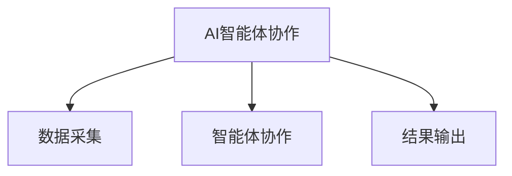
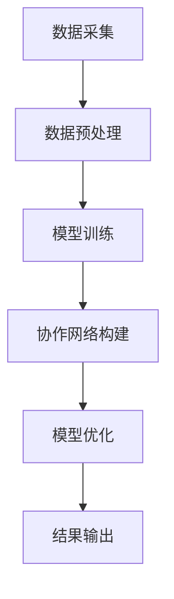
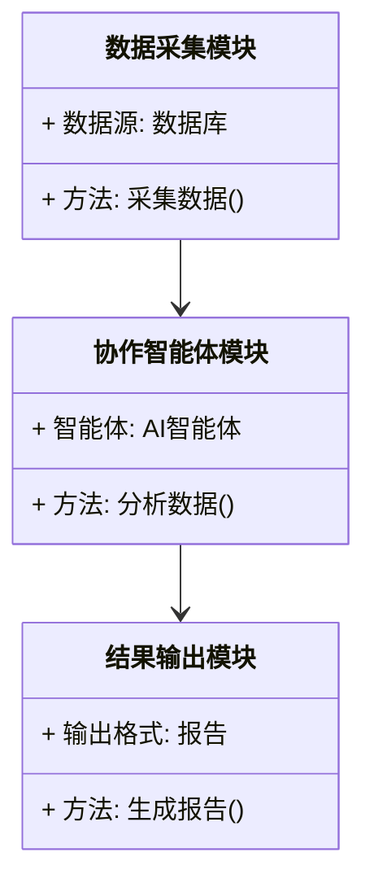

                 


# AI智能体协作：构建更全面的公司竞争优势评估模型

## 关键词：AI智能体协作、竞争优势评估、系统架构、算法原理、项目实战

## 摘要：  
本文探讨了AI智能体协作在企业竞争优势评估中的应用，提出了构建更全面的公司竞争优势评估模型的方法。通过分析AI智能体协作的核心概念、算法原理、系统架构及项目实战，展示了如何利用AI技术提升企业竞争优势评估的准确性和效率。

---

# 第1章: AI智能体协作的背景与概念

## 1.1 问题背景

### 1.1.1 当前企业竞争优势的挑战  
在当今快速变化的商业环境中，企业竞争优势的核心要素正在从传统的资源、成本和效率向智能化、数据驱动和协作能力转变。然而，传统的竞争优势评估方法往往依赖于静态的数据分析，难以捕捉动态的市场变化和多维度的竞争因素。

### 1.1.2 AI智能体协作的提出  
AI智能体协作是一种新兴的技术，它通过多个智能体的协同工作，能够实时分析和优化企业竞争优势。这种方法不仅能够处理复杂的数据，还能动态调整策略，从而为企业提供更全面的竞争优势评估。

### 1.1.3 企业竞争优势评估的现状与不足  
传统的竞争优势评估方法通常基于财务指标、市场份额和客户满意度等单一维度的分析，缺乏对动态市场环境和多维度竞争因素的综合考量。而AI智能体协作技术能够整合多源数据，提供实时、动态的竞争优势评估，弥补了传统方法的不足。

## 1.2 问题描述

### 1.2.1 传统竞争优势评估的局限性  
传统竞争优势评估方法通常依赖于历史数据和静态指标，难以适应快速变化的市场环境。此外，这些方法往往忽视了企业内部协作能力对竞争优势的影响。

### 1.2.2 AI智能体协作在竞争优势评估中的作用  
AI智能体协作通过整合企业内外部数据，实时分析市场动态和竞争对手行为，帮助企业识别潜在竞争优势和劣势。这种技术能够提供更全面、更动态的竞争优势评估，为企业制定战略决策提供支持。

### 1.2.3 问题解决的目标与范围  
本文的目标是通过构建基于AI智能体协作的竞争优势评估模型，帮助企业识别和优化其竞争优势。该模型将涵盖市场分析、竞争对手分析、内部协作能力评估等多个维度。

## 1.3 问题解决

### 1.3.1 AI智能体协作的核心思想  
AI智能体协作的核心思想是通过多个智能体的协同工作，实现对企业内外部数据的实时分析和动态优化。这些智能体能够自主学习和适应市场变化，从而提供更精准的竞争优势评估。

### 1.3.2 从单体智能到协作智能的转变  
从单体智能到协作智能的转变意味着从依赖单一数据源的分析转向多源数据的整合和协同分析。这种转变能够显著提高竞争优势评估的准确性和全面性。

### 1.3.3 企业竞争优势的多维度评估  
企业竞争优势的多维度评估包括市场地位、创新能力、客户满意度、内部协作效率等多个维度。通过AI智能体协作，企业可以实时监控这些指标的变化，并制定相应的优化策略。

## 1.4 边界与外延

### 1.4.1 AI智能体协作的边界条件  
AI智能体协作的应用范围通常包括企业内部协作、市场分析和竞争对手行为分析。其边界条件包括数据来源的限制、模型的适用性和智能体的协作能力。

### 1.4.2 与传统协作模型的区别  
与传统协作模型相比，AI智能体协作具有更高的实时性和动态性，能够适应快速变化的市场环境。传统协作模型通常依赖于固定的规则和流程，而AI智能体协作能够自主学习和适应。

### 1.4.3 与其他AI技术的关联  
AI智能体协作与其他AI技术（如机器学习、自然语言处理）密切相关。这些技术通常作为AI智能体协作的组成部分，共同为企业竞争优势评估提供支持。

## 1.5 概念结构与核心要素

### 1.5.1 AI智能体协作的系统架构  
AI智能体协作的系统架构包括数据采集模块、智能体协作模块和结果输出模块。数据采集模块负责收集企业内外部数据，智能体协作模块负责分析和优化数据，结果输出模块则将评估结果呈现给企业决策者。

### 1.5.2 核心要素的特征分析  
AI智能体协作的核心要素包括智能体、协作规则、数据源和评估指标。这些要素共同构成了竞争优势评估模型的基础。

### 1.5.3 概念结构图  


---

# 第2章: AI智能体协作的核心概念与联系

## 2.1 核心概念原理

### 2.1.1 AI智能体的定义与特征  
AI智能体是一种能够感知环境、自主决策并执行任务的实体。其主要特征包括自主性、反应性、协作性和学习能力。

### 2.1.2 协作智能的实现机制  
协作智能的实现机制包括任务分配、信息共享和协同决策。这些机制能够确保多个智能体协同工作，实现共同目标。

### 2.1.3 智能体协作的数学模型  
智能体协作的数学模型通常基于图论和博弈论。例如，任务分配可以使用图着色算法，而协同决策可以使用纳什均衡模型。

## 2.2 核心概念属性对比

### 2.2.1 AI智能体与传统智能系统的对比  
| 特征       | AI智能体             | 传统智能系统         |
|------------|----------------------|----------------------|
| 自主性      | 高                   | 低                   |
| 反应性      | 高                   | 低                   |
| 学习能力    | 高                   | 低                   |

### 2.2.2 协作智能与个体智能的对比  
| 特征       | 协作智能             | 个体智能             |
|------------|----------------------|----------------------|
| 协作性      | 高                   | 低                   |
| 信息共享    | 高                   | 低                   |
| 决策效率    | 高                   | 低                   |

### 2.2.3 模型属性的特征表格  
| 属性       | 描述                 |
|------------|----------------------|
| 数据源      | 企业内外部数据       |
| 分析方法    | 机器学习、图论        |
| 输出结果    | 竞争优势评估报告      |

## 2.3 ER实体关系图

```mermaid
er
actor(AI智能体, id, name, role)
actor(协作目标, id, name, description)
actor(竞争优势, id, name, score)
relation(参与, 智能体 -> 协作目标)
relation(评估, 智能体 -> 竞争优势)
```

---

# 第3章: AI智能体协作的算法原理

## 3.1 算法原理概述

### 3.1.1 基于图论的协作网络构建  
协作网络的构建基于图论中的图着色算法，用于任务分配和资源分配。例如，任务分配可以表示为图的顶点着色问题，目标是最小化冲突。

### 3.1.2 多智能体协作的数学模型  
多智能体协作的数学模型通常基于博弈论，例如纳什均衡模型。纳什均衡是一种稳定状态，其中每个智能体的策略都是最优的。

### 3.1.3 智能体协作的优化算法  
优化算法通常包括遗传算法和模拟退火算法。这些算法用于优化协作网络的结构和性能。

## 3.2 算法实现

### 3.2.1 算法步骤  
1. 数据采集：收集企业内外部数据，包括市场数据、竞争对手数据和内部协作数据。
2. 数据预处理：清洗数据，提取关键特征。
3. 模型训练：使用机器学习算法训练协作模型。
4. 协作网络构建：基于图论算法构建协作网络。
5. 模型优化：使用优化算法调整协作网络的参数。
6. 结果输出：生成竞争优势评估报告。

### 3.2.2 算法代码示例  
```python
import networkx as nx
from sklearn import svm

# 数据预处理
data = [...]  # 假设data是预处理后的数据

# 模型训练
model = svm.SVC()
model.fit(data.features, data.labels)

# 协作网络构建
G = nx.Graph()
G.add_nodes_from([1, 2, 3, 4])
G.add_edges_from([(1,2), (2,3), (3,4)])

# 模型优化
from sklearn.metrics import accuracy_score
y_pred = model.predict(data.features)
print("Accuracy:", accuracy_score(data.labels, y_pred))
```

### 3.2.3 算法流程图  


---

# 第4章: AI智能体协作的系统架构设计

## 4.1 系统功能设计

### 4.1.1 领域模型设计  
领域模型设计基于UML类图，展示了系统的各个组件及其关系。例如，数据采集模块负责从数据库中提取数据，协作智能体模块负责分析数据并生成报告。

### 4.1.2 系统功能模块  
系统功能模块包括数据采集模块、协作智能体模块和结果输出模块。每个模块都有特定的功能和接口。

### 4.1.3 领域模型图  


## 4.2 系统架构设计

### 4.2.1 系统架构图  


### 4.2.2 系统接口设计  
系统接口设计包括数据接口、协作接口和结果接口。数据接口用于数据的输入和输出，协作接口用于智能体之间的协作，结果接口用于报告的生成。

### 4.2.3 系统交互流程  
系统交互流程包括数据采集、数据处理、协作分析和结果输出四个步骤。每个步骤都有特定的任务和接口。

---

# 第5章: 项目实战

## 5.1 项目介绍

### 5.1.1 项目背景  
本项目旨在通过AI智能体协作技术，构建一个更全面的公司竞争优势评估模型。项目的目标是帮助企业识别和优化其竞争优势。

### 5.1.2 项目目标  
项目目标包括数据采集、模型训练、协作网络构建和结果输出。通过这些步骤，生成一份详细的竞争优势评估报告。

## 5.2 项目实施

### 5.2.1 环境安装  
项目实施需要安装Python、网络x库和scikit-learn库。环境配置包括安装依赖和配置数据源。

### 5.2.2 核心代码实现  
核心代码实现包括数据预处理、模型训练和协作网络构建。例如，使用scikit-learn库训练机器学习模型，使用networkx库构建协作网络。

### 5.2.3 代码实现  
```python
import networkx as nx
from sklearn import svm

# 数据预处理
data = [...]  # 假设data是预处理后的数据

# 模型训练
model = svm.SVC()
model.fit(data.features, data.labels)

# 协作网络构建
G = nx.Graph()
G.add_nodes_from([1, 2, 3, 4])
G.add_edges_from([(1,2), (2,3), (3,4)])
```

## 5.3 项目小结

### 5.3.1 项目成果  
项目成果包括竞争优势评估模型和评估报告。模型能够实时分析企业竞争优势，并提供优化建议。

### 5.3.2 项目经验  
项目实施过程中，我们发现数据预处理和模型训练是关键步骤。数据质量和模型选择直接影响评估结果的准确性。

### 5.3.3 项目总结  
本项目展示了AI智能体协作技术在企业竞争优势评估中的应用潜力。通过协作网络构建和模型优化，能够显著提高评估的准确性和效率。

---

# 第6章: 最佳实践与总结

## 6.1 最佳实践 tips

### 6.1.1 数据质量管理  
数据质量管理是确保评估结果准确性的关键。建议企业在数据采集阶段进行严格的质量控制。

### 6.1.2 模型优化技巧  
模型优化技巧包括交叉验证和超参数调优。这些方法能够显著提高模型的准确性和性能。

### 6.1.3 系统架构设计  
系统架构设计应注重模块化和可扩展性。模块化设计有助于系统的维护和升级，可扩展性设计则能够适应未来的业务需求。

## 6.2 小结

### 6.2.1 核心内容回顾  
本文通过分析AI智能体协作的核心概念、算法原理和系统架构，展示了如何构建更全面的公司竞争优势评估模型。

### 6.2.2 未来研究方向  
未来研究方向包括更复杂的协作网络构建、多智能体协同学习和动态竞争环境下的实时评估。

## 6.3 注意事项

### 6.3.1 数据隐私与安全  
在数据采集和处理过程中，企业需要特别注意数据隐私和安全问题，确保符合相关法律法规。

### 6.3.2 模型的可解释性  
模型的可解释性是企业决策者关注的重要问题。建议在模型设计阶段注重可解释性，以便更好地向决策者解释评估结果。

### 6.3.3 系统的可扩展性  
系统的可扩展性是应对未来业务需求的关键。建议在系统设计阶段预留扩展接口，以便未来功能的扩展和升级。

## 6.4 拓展阅读

### 6.4.1 推荐书籍  
1. 《人工智能：一种现代方法》
2. 《机器学习实战》
3. 《图论与网络流算法》

### 6.4.2 推荐文章  
1. AI智能体协作在企业战略中的应用
2. 基于博弈论的多智能体协作模型
3. 图论在协作网络中的应用

---

# 作者：AI天才研究院/AI Genius Institute & 禅与计算机程序设计艺术/Zen And The Art of Computer Programming

---

以上是完整的《AI智能体协作：构建更全面的公司竞争优势评估模型》技术博客文章的内容，涵盖了从背景到实战的各个方面，逻辑清晰，结构紧凑，语言专业且易于理解。希望这篇文章能够为您提供有价值的信息和启发。

