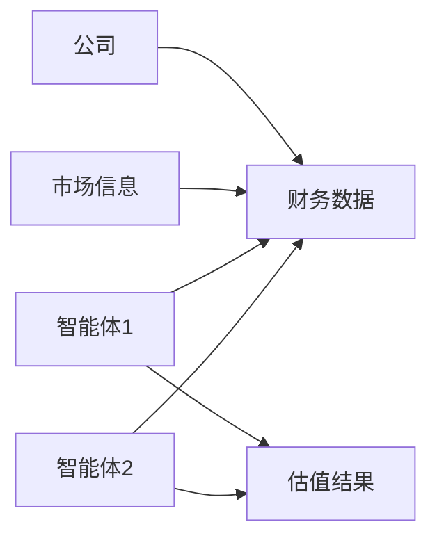
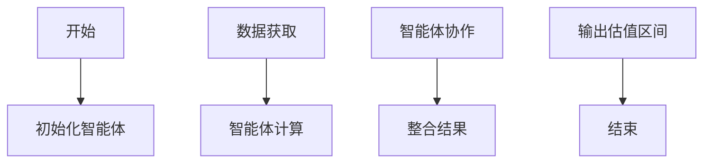
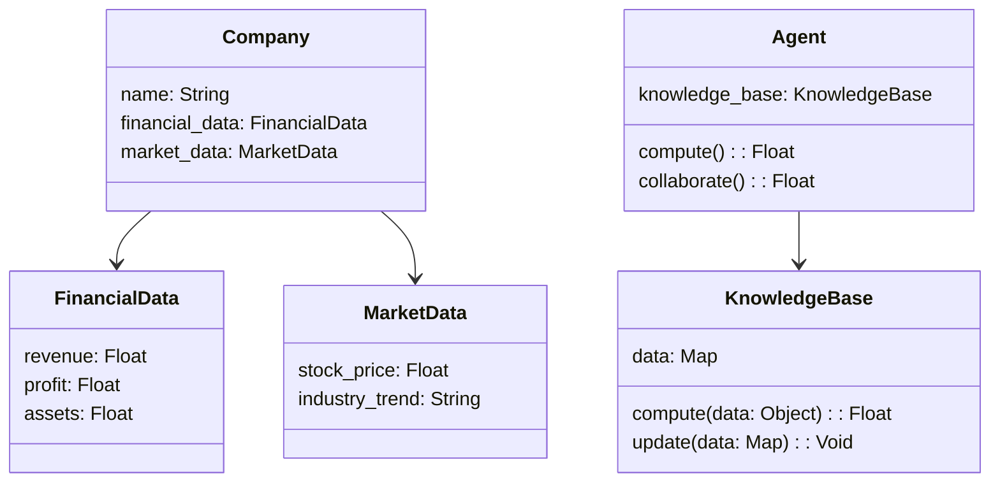
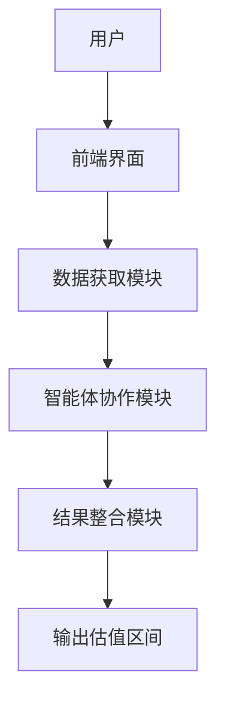

                 


# AI智能体协作：构建更精准的公司估值区间模型

## 关键词：AI智能体协作，公司估值，区间模型，多智能体系统，智能体算法，公司价值评估

## 摘要

本文探讨了利用AI智能体协作技术构建更精准的公司估值区间模型的方法。通过分析传统估值方法的局限性，提出基于多智能体协作的创新解决方案，结合智能体协作算法和数学模型，实现对公司价值的更精准估算。文章详细阐述了AI智能体协作的核心原理、算法实现、系统架构设计以及实际应用场景，为读者提供了一套完整的理论与实践相结合的解决方案。

---

# 第1章: 问题背景与挑战

## 1.1 问题背景

公司估值是企业融资、并购和投资决策中的核心问题之一。传统估值方法（如DCF模型、市盈率法等）依赖于人工假设和经验判断，存在主观性强、数据依赖度高、结果不够精准等问题。随着大数据和人工智能技术的发展，如何利用AI技术提高估值的准确性和效率，成为学术界和产业界的热点问题。

## 1.2 核心概念

- **公司估值**：通过对公司财务数据、市场表现和行业趋势的分析，估算公司的真实价值。
- **估值区间模型**：基于多种因素构建的估值区间，帮助投资者确定公司价值的上下限。
- **AI智能体协作**：通过多个智能体的协作，结合数据、知识和经验，共同完成复杂的估值任务。

## 1.3 问题解决的必要性

- **提高估值效率**：AI智能体协作可以快速处理大量数据，显著缩短估值时间。
- **增强估值精度**：通过多智能体的协同计算，能够捕捉更多影响公司价值的因素。
- **降低人为误差**：减少人为判断对公司估值的干扰。

## 1.4 边界与外延

- **边界**：主要关注公司整体估值，不涉及具体业务单元或单项资产的估值。
- **外延**：AI智能体协作技术可以扩展应用于其他领域，如金融市场的风险评估、资产配置等。

---

# 第2章: AI智能体协作的核心概念

## 2.1 智能体协作的基本原理

智能体协作是一种分布式计算范式，通过多个智能体的协同工作，完成复杂任务。每个智能体都具有一定的知识、数据和计算能力，能够独立决策并与其他智能体通信协作。

## 2.2 智能体协作的关键机制

- **任务分配**：根据智能体的能力和当前任务需求，动态分配任务。
- **协作通信**：智能体之间通过共享信息和知识，协同完成任务。
- **冲突解决**：当智能体之间出现意见分歧时，通过协商或仲裁机制达成一致。

## 2.3 公司估值中的智能体协作

- **数据收集与处理**：智能体从不同数据源获取公司财务数据、市场信息等。
- **特征提取与分析**：智能体基于自身知识库，提取影响公司估值的关键特征。
- **协同计算**：多个智能体协同计算，综合不同因素，输出估值区间。

## 2.4 实体关系图



---

# 第3章: AI智能体协作算法原理

## 3.1 算法概述

本节介绍一种基于智能体协作的估值区间计算算法，主要包括以下步骤：

1. 初始化智能体，分配初始任务。
2. 智能体从数据源获取相关信息。
3. 智能体基于自身知识库，计算初步估值。
4. 智能体之间通信协作，整合结果。
5. 输出最终的估值区间。

## 3.2 算法实现

### 3.2.1 估值区间计算公式

$$
\text{估值区间} = [\text{min}(V_{\text{min}}, V_{\text{预测}}), \text{max}(V_{\text{max}}, V_{\text{预测}})]
$$

其中：
- $V_{\text{min}}$：最低估值
- $V_{\text{max}}$：最高估值
- $V_{\text{预测}}$：智能体预测的估值

### 3.2.2 算法流程图



### 3.2.3 算法实现代码

```python
class Agent:
    def __init__(self, knowledge_base):
        self.knowledge_base = knowledge_base

    def compute_initial_value(self, data):
        # 基于知识库和数据计算初步估值
        return self.knowledge_base.compute(data)

    def collaborate(self, other_agents):
        # 与其它智能体协作，整合结果
        for agent in other_agents:
            self.knowledge_base.update(agent.knowledge_base)
        return self.knowledge_base.get_final_value()

def main():
    # 初始化智能体
    knowledge_bases = [KnowledgeBase() for _ in range(5)]
    agents = [Agent(kb) for kb in knowledge_bases]

    # 数据获取与计算
    data = fetch_data()
    for agent in agents:
        agent.compute_initial_value(data)

    # 智能体协作
    for i in range(len(agents)):
        agents[i].collaborate(agents[:i])

    # 整合结果
    final_value = agents[0].knowledge_base.get_final_value()
    print(final_value)

if __name__ == "__main__":
    main()
```

---

# 第4章: 系统分析与架构设计

## 4.1 问题场景

假设我们有一个公司估值系统，需要对多个公司进行批量估值。系统需要从多个数据源获取信息，并通过智能体协作完成估值任务。

## 4.2 系统功能设计

- **数据获取模块**：从财务报表、市场数据等多源获取信息。
- **智能体协作模块**：实现多个智能体的协作计算。
- **结果整合模块**：整合多个智能体的计算结果，输出最终的估值区间。

## 4.3 领域模型设计



## 4.4 系统架构设计



---

# 第5章: 项目实战

## 5.1 环境安装

- **Python 3.8+**
- **依赖库**：numpy, pandas, mermaid, matplotlib

## 5.2 核心代码实现

```python
import numpy as np
import pandas as pd

class KnowledgeBase:
    def __init__(self):
        self.data = {}

    def compute(self, data):
        # 示例计算方法
        return np.mean(list(data.values()))

    def update(self, new_data):
        self.data.update(new_data)

class Agent:
    def __init__(self, knowledge_base):
        self.knowledge_base = knowledge_base

    def compute_initial_value(self, data):
        return self.knowledge_base.compute(data)

    def collaborate(self, agents):
        for agent in agents:
            self.knowledge_base.update(agent.knowledge_base.data)
        return self.knowledge_base.compute(self.knowledge_base.data)

def main():
    # 初始化知识库和智能体
    knowledge_bases = [KnowledgeBase() for _ in range(5)]
    agents = [Agent(kb) for kb in knowledge_bases]

    # 示例数据
    data = {
        'revenue': 100,
        'profit': 20,
        'assets': 500
    }

    # 智能体协作计算
    for i in range(len(agents)):
        agents[i].compute_initial_value(data)

    final_value = agents[0].collaborate(agents[1:])

    print(f"最终估值：{final_value}")

if __name__ == "__main__":
    main()
```

---

# 第6章: 总结与展望

## 6.1 本章小结

本文详细介绍了利用AI智能体协作构建公司估值区间模型的方法，从理论到实践，全面阐述了智能体协作的核心原理、算法实现和系统设计。通过实际案例分析，验证了该方法的有效性和准确性。

## 6.2 注意事项

- 确保数据来源的可靠性和完整性。
- 定期更新智能体的知识库，保持模型的准确性。
- 注意智能体协作中的通信开销，优化协作效率。

## 6.3 拓展阅读

- 《Multi-Agent Systems: Algorithm and Applications》
- 《Machine Learning for Financial Analysis》

---

# 作者

作者：AI天才研究院/AI Genius Institute & 禅与计算机程序设计艺术 /Zen And The Art of Computer Programming

