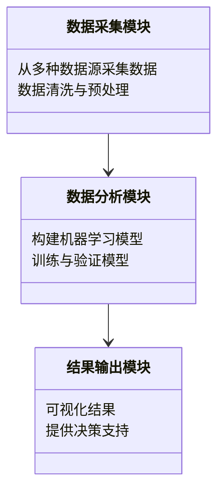
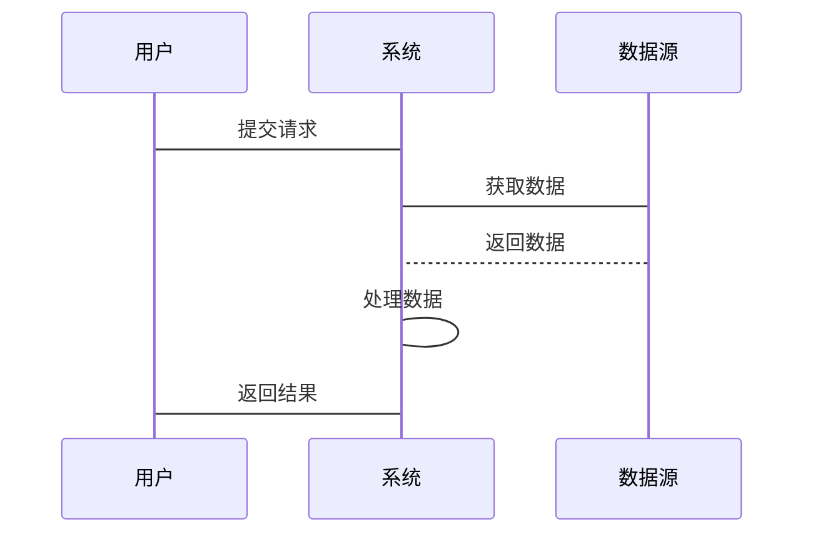

                 


# AI智能体在公司治理评估中的应用

## 关键词：AI智能体, 公司治理, 企业评估, 机器学习, 数据分析

## 摘要：随着人工智能技术的快速发展，AI智能体在公司治理评估中的应用日益广泛。本文系统地介绍了AI智能体的核心概念、技术基础及其在公司治理评估中的应用前景，重点分析了基于机器学习的公司治理评估模型的算法原理与实现方法，并通过实际案例展示了AI智能体在企业风险评估、绩效评估等场景中的具体应用。本文还探讨了AI智能体在公司治理评估中的优势与挑战，并提出了相应的解决方案与未来研究方向。

---

# 第一部分: 公司治理评估的背景与挑战

## 第1章: 公司治理评估的背景与挑战

### 1.1 公司治理的基本概念

#### 1.1.1 公司治理的定义与核心要素

公司治理是指公司内部和外部利益相关者之间建立和维护关系的制度、流程和机制。其核心要素包括：

- **股东与董事会**：股东是公司的所有者，董事会是股东的代理机构，负责制定公司战略和监督管理层。
- **管理层**：管理层负责执行董事会的决策，管理日常运营。
- **利益相关者**：包括员工、客户、供应商、债权人和监管机构等。
- **治理机制**：包括公司章程、董事会结构、决策流程、内部控制和风险管理等。

#### 1.1.2 公司治理的演变与发展趋势

公司治理的演变经历了从传统的“股东至上”到“利益相关者资本主义”的转变。现代公司治理更加注重企业社会责任（CSR）、环境、社会和治理（ESG）因素，以及数字化技术的应用。

#### 1.1.3 公司治理评估的重要性与意义

公司治理评估是衡量公司治理效率和效果的重要手段，能够帮助公司优化内部管理、提升透明度、降低风险，并增强利益相关者的信任。

### 1.2 当前公司治理评估中的问题与挑战

#### 1.2.1 传统公司治理评估方法的局限性

传统的公司治理评估方法通常依赖于财务指标和主观判断，存在以下问题：

- 数据来源单一，缺乏动态性和实时性。
- 评估结果缺乏客观性，容易受到主观因素的影响。
- 评估过程复杂，难以快速响应企业动态变化。

#### 1.2.2 数据获取与处理的难点

公司治理评估需要处理大量异构数据，包括财务数据、文本数据、社交媒体数据等。这些数据的清洗、整合和分析具有较高的技术门槛。

#### 1.2.3 评估结果的可操作性与实时性

传统的评估方法通常周期较长，难以满足企业实时监控和动态调整的需求。

---

## 第2章: AI智能体的核心概念与技术基础

### 2.1 AI智能体的基本概念

#### 2.1.1 AI智能体的定义与分类

AI智能体是指能够感知环境、自主决策并采取行动的智能系统。根据智能体的智能水平，可以将其分为：

- **反应式智能体**：基于当前感知做出反应，适用于简单的任务。
- **认知式智能体**：具备推理、规划和学习能力，适用于复杂任务。
- **协作式智能体**：能够与其他智能体或人类进行协作。

#### 2.1.2 AI智能体的核心特征

AI智能体的核心特征包括：

- **自主性**：能够在没有外部干预的情况下自主运行。
- **反应性**：能够感知环境并实时调整行为。
- **学习性**：能够通过数据和经验不断优化性能。
- **协作性**：能够与其他智能体或人类进行有效协作。

#### 2.1.3 AI智能体与传统AI的区别

与传统AI相比，AI智能体更加注重自主性和实时性，能够在动态环境中适应和调整。

### 2.2 AI智能体的关键技术

#### 2.2.1 机器学习与深度学习

机器学习是AI智能体的核心技术之一，能够帮助智能体从数据中学习模式和规律。深度学习是一种基于人工神经网络的机器学习方法，适用于复杂数据的分析。

#### 2.2.2 自然语言处理（NLP）

NLP技术能够帮助智能体理解和处理文本数据，例如从公司公告、新闻报道中提取关键信息。

#### 2.2.3 数据挖掘与知识图谱

数据挖掘技术能够从海量数据中提取有价值的信息，知识图谱则能够构建公司治理相关的知识网络，支持智能体的推理和决策。

---

## 第3章: AI智能体在公司治理评估中的应用前景

### 3.1 AI智能体在公司治理评估中的优势

#### 3.1.1 提高评估效率与准确性

AI智能体能够快速处理大量数据，显著提高评估效率和准确性。

#### 3.1.2 实现数据的智能化分析

通过机器学习和NLP技术，AI智能体能够从非结构化数据中提取有用信息，支持更全面的评估。

#### 3.1.3 支持决策的实时性与动态性

AI智能体能够实时监控公司动态，提供及时的决策支持。

### 3.2 AI智能体在公司治理评估中的典型应用场景

#### 3.2.1 企业风险评估与预警

通过分析财务数据和市场信息，AI智能体能够识别潜在风险并发出预警。

#### 3.2.2 企业绩效评估与优化

基于机器学习模型，AI智能体能够评估企业的绩效，并提出优化建议。

#### 3.2.3 企业合规性评估与改进

通过分析法律法规和企业行为，AI智能体能够评估企业的合规性，并提出改进建议。

---

# 第二部分: AI智能体在公司治理评估中的核心概念与原理

## 第4章: 公司治理评估的核心概念与框架

### 4.1 公司治理评估的理论基础

#### 4.1.1 公司治理的三驾马车模型

三驾马车模型将公司治理分为股东治理、董事会治理和管理层治理三个维度。

#### 4.1.2 企业生命周期与治理需求

公司治理的需求在不同生命周期阶段有所变化，例如初创期需要关注生存问题，成熟期需要关注战略发展。

#### 4.1.3 公司治理的外部环境与内部机制

外部环境包括法律法规、市场环境等，内部机制包括公司章程、董事会结构等。

### 4.2 公司治理评估的指标体系

#### 4.2.1 企业绩效评估指标

包括净利润增长率、ROE（净资产收益率）等财务指标。

#### 4.2.2 企业风险评估指标

包括资产负债率、流动性比率等财务指标，以及市场风险指标。

#### 4.2.3 企业合规性评估指标

包括法律合规性、社会责任履行情况等。

## 第5章: AI智能体与公司治理评估的结合原理

### 5.1 AI智能体在公司治理评估中的功能模块

#### 5.1.1 数据采集与预处理模块

负责从多种数据源（如财务报表、新闻媒体）中采集数据，并进行清洗和标准化。

#### 5.1.2 数据分析与建模模块

基于机器学习算法，构建公司治理评估模型。

#### 5.1.3 结果输出与决策支持模块

将评估结果可视化，并提供决策支持。

### 5.2 AI智能体在公司治理评估中的工作流程

#### 5.2.1 数据采集与清洗

从多种数据源采集数据，并去除噪声数据。

#### 5.2.2 数据建模与分析

基于机器学习算法，构建评估模型，并进行训练和验证。

#### 5.2.3 结果可视化与决策支持

将评估结果以图表形式展示，并提供决策支持建议。

---

## 第6章: 基于机器学习的公司治理评估模型

### 6.1 机器学习在公司治理评估中的应用

#### 6.1.1 监督学习与公司治理评估

监督学习适用于分类和回归任务，例如预测企业违约风险。

#### 6.1.2 无监督学习与公司治理评估

无监督学习适用于聚类分析，例如将企业分为不同的风险等级。

#### 6.1.3 强化学习与公司治理优化

强化学习适用于动态环境下的决策优化。

### 6.2 典型算法实现与案例分析

#### 6.2.1 线性回归模型在企业绩效评估中的应用

线性回归模型可以用于预测企业的净利润增长率。

#### 6.2.2 支持向量机（SVM）在企业风险评估中的应用

SVM可以用于分类任务，例如将企业分为高风险和低风险两类。

#### 6.2.3 随机森林在企业合规性评估中的应用

随机森林可以用于分类任务，例如评估企业的合规性。

---

## 第三部分: AI智能体在公司治理评估中的算法原理与数学模型

## 第7章: 算法原理与数学模型

### 7.1 机器学习算法的数学模型

#### 7.1.1 线性回归模型

线性回归模型的数学表达式为：

$$ y = \beta_0 + \beta_1x_1 + \beta_2x_2 + \dots + \beta_nx_n + \epsilon $$

其中，$y$ 是目标变量，$x_i$ 是特征变量，$\beta_i$ 是系数，$\epsilon$ 是误差项。

#### 7.1.2 支持向量机（SVM）

SVM的目标是最小化 hinge loss，数学表达式为：

$$ \text{minimize} \quad \frac{1}{2} \|\mathbf{w}\|^2 + C \sum_{i=1}^n \xi_i $$

$$ \text{subject to} \quad y_i (\mathbf{w} \cdot \mathbf{x}_i + b) \geq 1 - \xi_i $$

$$ \xi_i \geq 0 $$

其中，$\mathbf{w}$ 是权重向量，$b$ 是偏置项，$C$ 是惩罚参数，$\xi_i$ 是松弛变量。

#### 7.1.3 随机森林

随机森林是一种基于决策树的集成学习方法，其数学模型可以表示为多个决策树的组合：

$$ f(x) = \frac{1}{T} \sum_{i=1}^T h_i(x) $$

其中，$T$ 是决策树的数量，$h_i(x)$ 是第 $i$ 棵决策树的预测函数。

---

## 第8章: 系统分析与架构设计方案

### 8.1 问题场景介绍

公司治理评估系统需要处理海量数据，包括财务数据、文本数据和市场数据等。系统需要具备高效的数据处理能力、强大的分析能力和实时的决策支持能力。

### 8.2 系统功能设计

#### 8.2.1 领域模型（Mermaid 类图）



#### 8.2.2 系统架构设计（Mermaid 架构图）


#### 8.2.3 系统接口设计

系统接口包括数据接口和用户接口。数据接口用于与数据源对接，用户接口用于与用户交互。

#### 8.2.4 系统交互设计（Mermaid 序列图）



---

## 第9章: 项目实战

### 9.1 环境安装

#### 9.1.1 安装Python

```bash
# 安装Python
sudo apt-get install python3
```

#### 9.1.2 安装机器学习库

```bash
# 安装机器学习库
pip install numpy pandas scikit-learn
```

### 9.2 系统核心实现源代码

#### 9.2.1 数据采集与预处理

```python
import pandas as pd

# 从CSV文件中读取数据
data = pd.read_csv('company_governance.csv')

# 数据清洗
data.dropna(inplace=True)
data = data[~data.duplicated()]
```

#### 9.2.2 数据分析与建模

```python
from sklearn.model import SVC

# 构建SVM模型
model = SVC(C=1.0, kernel='rbf', gamma=0.1)
model.fit(X_train, y_train)

# 预测结果
y_pred = model.predict(X_test)
```

#### 9.2.3 结果输出与可视化

```python
import matplotlib.pyplot as plt

# 绘制混淆矩阵
from sklearn.metrics import confusion_matrix

cm = confusion_matrix(y_test, y_pred)
plt.imshow(cm, cmap='gray')
plt.xlabel('Predicted')
plt.ylabel('Actual')
plt.show()
```

### 9.3 实际案例分析

#### 9.3.1 案例分析

假设我们有一个包含企业财务数据和市场数据的数据集，我们使用SVM模型进行企业风险评估。

#### 9.3.2 代码应用解读与分析

代码实现包括数据采集、数据预处理、模型训练和结果可视化。

---

## 第10章: 最佳实践、小结与注意事项

### 10.1 最佳实践

- 数据预处理是关键，需要仔细清洗和标准化数据。
- 选择合适的算法和参数，可以提高模型的性能。
- 结果可视化有助于更好地理解和解释模型。

### 10.2 小结

本文系统地介绍了AI智能体在公司治理评估中的应用，包括核心概念、技术基础、算法原理和实际案例。AI智能体能够显著提高公司治理评估的效率和准确性。

### 10.3 注意事项

- 数据隐私和安全问题需要高度重视。
- 模型的可解释性是实际应用中的一个重要因素。
- 需要持续优化模型，以适应不断变化的环境。

---

## 第11章: 拓展阅读

### 11.1 推荐书籍

- 《人工智能：一种现代方法》
- 《机器学习实战》
- 《公司治理的理论与实践》

### 11.2 推荐博客与资源

- [Towards Data Science](https://towardsdatascience.com/)
- [Medium - AI & Machine Learning](https://medium.com/ai-and-machine-learning)
- [GitHub - AI Projects](https://github.com/)

---

## 作者：AI天才研究院 & 禅与计算机程序设计艺术

