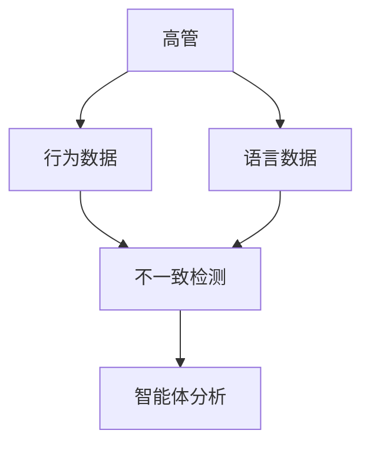
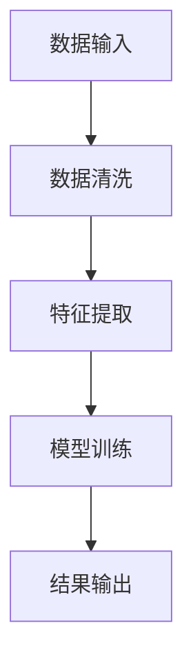
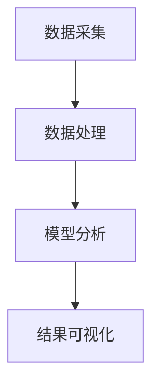
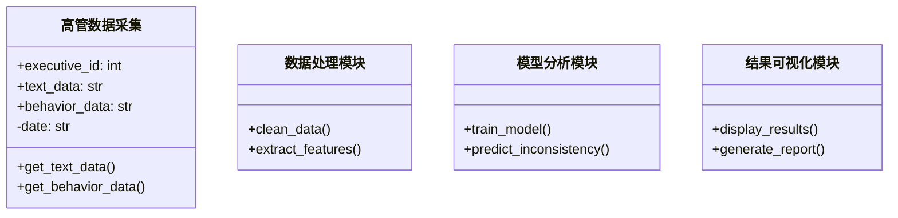

                 


# AI智能体在分析公司高管言行不一致性中的应用

## 关键词：AI智能体，高管言行，不一致性分析，自然语言处理，行为模式识别，企业治理

## 摘要：
本文探讨了AI智能体在分析公司高管言行不一致中的应用。通过详细分析高管的行为和语言数据，结合自然语言处理和行为模式识别技术，AI智能体能够有效检测和评估高管的言行一致性问题。文章从问题背景、核心概念、算法原理、系统架构到实际案例，全面阐述了AI智能体的应用价值和实现方法，为现代企业治理提供了新的思路和工具。

---

## 第一部分：问题背景与核心概念

### 第1章：问题背景与核心概念

#### 1.1 高管言行不一致的背景与挑战

在现代企业中，高管的行为和言论对公司的发展、声誉和员工士气有着深远影响。然而，高管的言行有时会出现不一致的情况，这可能引发决策失误、员工信任度下降，甚至导致法律风险。传统上，企业依赖人工观察和反馈来发现高管的言行问题，这种方式效率低下且容易遗漏关键信息。随着AI技术的快速发展，AI智能体为企业提供了一种高效、精准的解决方案。

---

#### 1.2 AI智能体的核心概念与定义

AI智能体是一种能够感知环境、分析数据并做出决策的智能系统。在分析高管言行不一致性中，AI智能体通过整合高管的语言数据（如会议记录、邮件）和行为数据（如决策记录、工作表现）来识别潜在的不一致行为。

---

#### 1.3 核心概念的属性特征对比

下表展示了高管言行一致性和不一致性的特征对比：

| 特性               | 行为一致性       | 行为不一致性       |
|--------------------|------------------|-------------------|
| 数据来源           | 一致的言行记录   | 不一致的言行记录   |
| 表现形式           | 逻辑一致         | 逻辑矛盾         |
| 影响               | 员工信任增强     | 员工信任下降     |

---

#### 1.4 实体关系图（ER图）



---

## 第二部分：算法原理

### 第2章：AI智能体的算法原理

#### 2.1 算法流程概述

AI智能体的核心算法流程包括以下几个步骤：

1. **数据预处理**：清洗和整合高管的行为数据和语言数据。
2. **特征提取**：通过NLP技术提取语言数据的关键词和情感特征。
3. **模型训练**：使用机器学习算法（如逻辑回归、支持向量机）训练分类模型。
4. **结果分析**：根据模型预测结果，识别高管的不一致行为。

---

#### 2.2 算法实现细节

##### 2.2.1 自然语言处理（NLP）技术

自然语言处理技术用于提取高管语言数据中的关键词和情感特征。例如，可以使用TF-IDF算法对文本进行关键词提取：

$$
\text{TF-IDF}(t, d) = \text{TF}(t, d) \times \text{IDF}(t)
$$

其中，$\text{TF}$是词频，$\text{IDF}$是逆文档频率。

##### 2.2.2 情感分析与意图识别

情感分析用于判断高管言论中的情感倾向（正面、中性、负面）。意图识别则用于识别高管言论中的隐含意图。

##### 2.2.3 行为模式识别

行为模式识别通过分析高管的行为数据（如会议出席率、决策通过率）来判断其行为一致性。

##### 2.2.4 不一致检测算法

不一致检测算法通过对比语言数据和行为数据，识别高管的不一致行为。常用的方法包括：

1. **基于相似度的检测**：使用余弦相似度计算语言数据和行为数据的相似度。
$$
\text{相似度} = \frac{\sum_{i=1}^{n} w_i \cdot w'_i}{\sqrt{\sum_{i=1}^{n} w_i^2} \times \sqrt{\sum_{i=1}^{n} w'_i^2}}
$$

2. **基于分类的检测**：使用逻辑回归或支持向量机对高管的行为数据和语言数据进行分类。

---

#### 2.3 算法流程图



---

#### 2.4 算法实现代码

以下是基于Python的算法实现代码示例：

```python
import pandas as pd
from sklearn.feature_extraction.text import TfidfVectorizer
from sklearn.model_selection import train_test_split
from sklearn.linear_model import LogisticRegression
from sklearn.metrics import accuracy_score

# 数据预处理
data = pd.read_csv('executive_data.csv')
data_clean = data.dropna()

# 特征提取
vectorizer = TfidfVectorizer()
features = vectorizer.fit_transform(data_clean['text'])

# 模型训练
X_train, X_test, y_train, y_test = train_test_split(features, data_clean['label'], test_size=0.2)
model = LogisticRegression()
model.fit(X_train, y_train)

# 结果分析
predictions = model.predict(X_test)
print(f"Accuracy: {accuracy_score(y_test, predictions)}")
```

---

## 第三部分：系统架构与设计

### 第3章：系统架构与设计

#### 3.1 系统架构概述

##### 3.1.1 系统功能模块划分

1. **数据采集模块**：负责采集高管的行为数据和语言数据。
2. **数据处理模块**：对数据进行清洗和特征提取。
3. **模型分析模块**：训练模型并进行不一致行为检测。
4. **结果可视化模块**：展示检测结果并提供改进建议。

##### 3.1.2 系统整体架构



---

#### 3.2 系统功能设计

##### 3.2.1 领域模型类图



---

## 第四部分：项目实战

### 第4章：项目实战

#### 4.1 项目背景与数据采集

假设我们有一个高管数据集，其中包含高管的会议记录、邮件内容和决策记录。我们首先需要采集这些数据并进行清洗。

#### 4.2 系统部署与实现

以下是系统部署的主要步骤：

1. **环境安装**：安装Python、Scikit-learn、NLTK等工具。
2. **数据预处理**：清洗数据并提取特征。
3. **模型训练**：训练逻辑回归模型。
4. **结果分析**：输出模型预测结果并分析。

#### 4.3 实际案例分析

以某公司高管为例，分析其言行不一致的情况。假设模型预测该高管在某次会议中存在不一致行为，我们需要进一步分析其原因并提出改进建议。

---

## 第五部分：总结与展望

### 第5章：总结与展望

#### 5.1 总结

本文详细探讨了AI智能体在分析公司高管言行不一致中的应用，从算法原理到系统架构，再到实际案例，全面阐述了AI智能体的优势和实现方法。

#### 5.2 展望

未来，随着AI技术的进一步发展，AI智能体在企业治理中的应用将更加广泛。我们可以进一步优化模型，引入更复杂的行为分析算法，并扩展其在其他领域的应用。

---

## 第六部分：最佳实践与小结

### 第6章：最佳实践与小结

#### 6.1 最佳实践

1. 在使用AI智能体分析高管言行时，确保数据的准确性和完整性。
2. 定期更新模型以适应高管行为的变化。
3. 结合人工分析，提高检测的准确性。

#### 6.2 小结

本文通过详细分析AI智能体在高管言行不一致性中的应用，展示了AI技术在企业治理中的巨大潜力。我们相信，随着技术的进步，AI智能体将成为企业治理的重要工具。

---

## 作者：AI天才研究院 & 禅与计算机程序设计艺术

---

希望这篇技术博客文章能够为读者提供清晰的思路和实用的知识。

