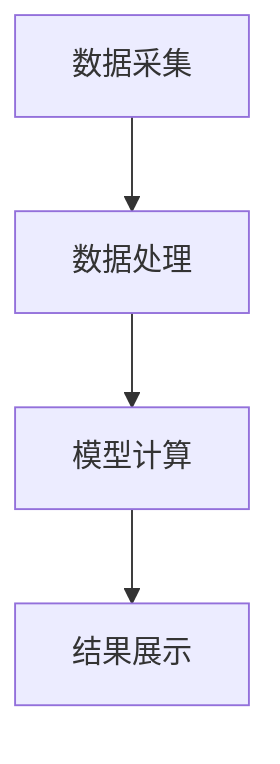
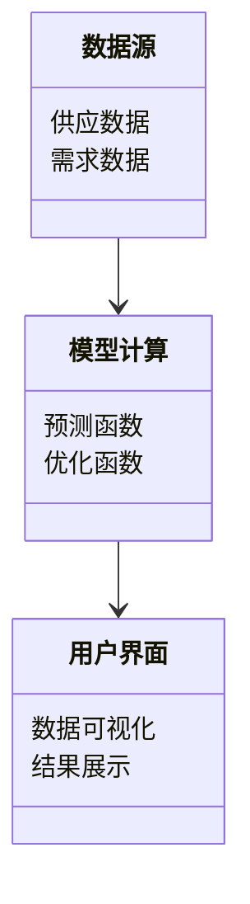
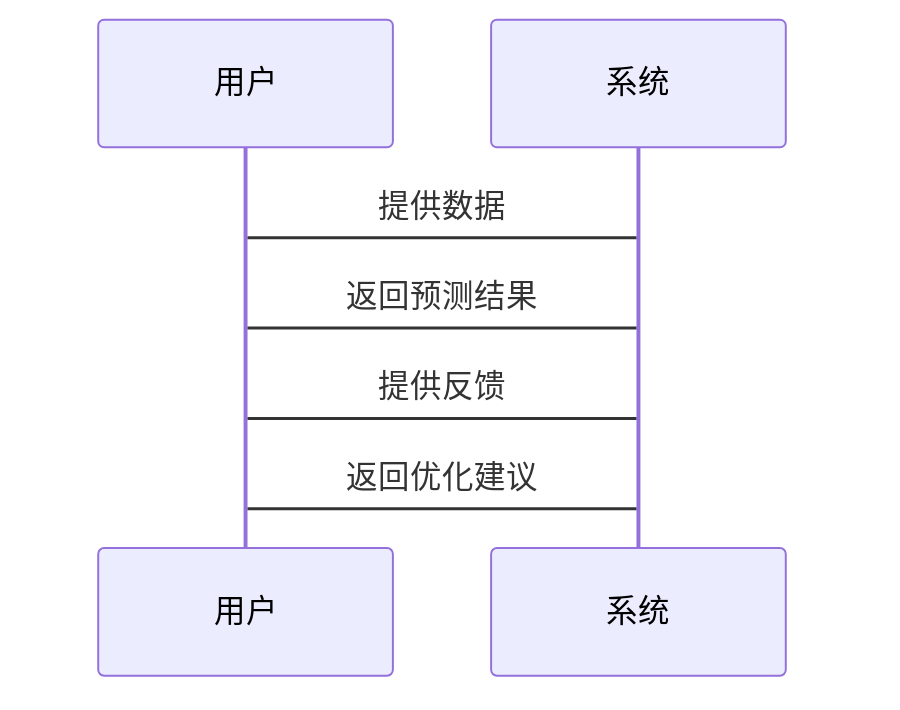

                 


# AI智能体在评估公司供应链弹性中的作用

## 关键词：AI智能体，供应链弹性，预测模型，优化算法，系统架构

## 摘要：  
随着全球供应链的复杂性和不确定性增加，企业面临着前所未有的挑战。AI智能体通过实时数据分析、预测和优化，能够显著提升供应链弹性的评估和管理能力。本文将深入探讨AI智能体在供应链弹性评估中的作用，分析其算法原理、系统架构，并通过实际案例展示其在项目中的应用。本文还提供了最佳实践和未来发展方向的建议，为企业的供应链管理提供新的视角和方法。

---

## 第一部分：供应链弹性评估的背景与问题

### 第1章：供应链弹性评估的背景与问题

#### 1.1 供应链弹性的定义与重要性

供应链弹性是指供应链在面对外部干扰、市场波动或内部变化时，能够快速恢复、调整并保持稳定运作的能力。弹性供应链能够适应不确定性，减少中断对业务的影响。

- **供应链弹性的重要性**  
  在全球化和数字化的今天，供应链的中断可能对企业的财务、声誉和客户关系造成严重损失。弹性供应链能够帮助企业应对突发事件，确保业务连续性。

- **供应链弹性评估的挑战**  
  传统供应链管理依赖人工判断，存在效率低、数据不足和响应慢的问题。现代供应链弹性评估需要实时数据分析、动态调整和智能化决策支持。

#### 1.2 AI智能体在供应链管理中的作用

- **AI智能体的基本概念**  
  AI智能体是一种能够感知环境、自主决策并执行任务的智能系统。它通过数据驱动的方法，优化复杂系统的运作效率。

- **AI智能体在供应链管理中的应用**  
  AI智能体可以用于预测需求、优化库存、协调供应商、监控物流，以及应对突发事件。它通过自动化和智能化的方式，显著提升了供应链的响应速度和抗风险能力。

- **AI智能体如何提升供应链弹性**  
  AI智能体通过实时数据分析和预测模型，帮助企业提前识别潜在风险，优化资源配置，快速调整供应链策略，从而增强弹性。

---

### 第2章：AI智能体与供应链弹性的核心概念

#### 2.1 供应链弹性评估的核心要素

- **供应链弹性评估的关键维度**  
  弹性评估通常包括供应链的响应速度、资源冗余度、供应商多样性、库存管理策略和风险管理能力。

- **供应链弹性评估的指标体系**  
  常见的指标包括交货时间、库存周转率、供应商可靠性和成本波动率。

- **供应链弹性评估的模型框架**  
  弹性评估模型通常包括数据采集、数据分析、预测建模和优化建议四个阶段。

#### 2.2 AI智能体与供应链弹性的关系

- **AI智能体在供应链弹性评估中的角色**  
  AI智能体作为数据驱动的决策工具，能够实时监控供应链状态、预测潜在风险并提出优化建议。

- **AI智能体如何优化供应链弹性**  
  通过机器学习算法，AI智能体可以分析历史数据和实时信息，预测供应链中断的可能性，并制定应急策略。

- **AI智能体与供应链弹性的边界与外延**  
  AI智能体的应用范围不仅限于供应链弹性评估，还包括生产计划、库存管理和客户关系管理等领域。

---

### 第3章：AI智能体评估供应链弹性的算法原理

#### 3.1 基于预测的供应链弹性评估算法

- **预测模型的构建**  
  使用时间序列分析（如ARIMA模型）或机器学习算法（如随机森林、XGBoost）进行需求预测和风险评估。

- **预测模型的优化**  
  通过历史数据训练模型，调整参数以提高预测精度。例如，使用交叉验证优化模型的超参数。

- **预测模型的实现步骤**  
  1. 数据清洗与特征工程  
  2. 模型训练与验证  
  3. 模型部署与实时预测  

#### 3.2 基于优化的供应链弹性评估算法

- **优化模型的选择**  
  使用线性规划、整数规划或遗传算法优化供应链的资源分配和库存管理。

- **优化模型的实现步骤**  
  1. 定义目标函数与约束条件  
  2. 模型求解与结果分析  
  3. 结果反馈与策略调整  

#### 3.3 算法原理的数学模型

- **预测模型的数学公式**  
  例如，使用ARIMA模型进行需求预测：  
  $$ \hat{y}_t = \alpha + \beta \hat{y}_{t-1} + \gamma \hat{y}_{t-2} + \epsilon_t $$  

- **优化模型的数学公式**  
  例如，使用线性规划优化库存：  
  $$ \text{min} \sum_{i=1}^n c_i x_i $$  
  $$ \text{s.t.} \quad \sum_{i=1}^n a_i x_i \geq D $$  

---

## 第四部分：系统分析与架构设计

### 第4章：系统分析与架构设计方案

#### 4.1 系统架构图

- **系统架构图的描述**  
  下图展示了AI智能体评估供应链弹性的系统架构，包括数据采集、数据处理、模型计算和结果展示四个模块。



#### 4.2 系统功能设计

- **系统功能设计的描述**  
  系统功能包括数据采集、预测计算、优化建议和结果展示。

- **系统功能设计的类图**  
  下图展示了系统功能的类图，包括数据源、模型计算和用户界面三个主要组件。



#### 4.3 系统交互流程图

- **系统交互流程图的描述**  
  下图展示了AI智能体评估供应链弹性的系统交互流程，包括数据采集、计算处理和结果反馈三个阶段。



---

## 第五部分：项目实战与案例分析

### 第5章：项目实战与案例分析

#### 5.1 项目环境安装

- **项目环境要求**  
  - Python 3.8+
  - numpy、pandas、scikit-learn等库

#### 5.2 核心代码实现

- **数据采集与处理**  
  ```python
  import pandas as pd
  data = pd.read_csv('supply_chain.csv')
  ```

- **预测模型实现**  
  ```python
  from sklearn.ensemble import RandomForestRegressor
  model = RandomForestRegressor(n_estimators=100)
  model.fit(X_train, y_train)
  ```

- **优化模型实现**  
  ```python
  from scipy.optimize import minimize
  def objective_function(x):
      return np.sum(c * x)
  ```

#### 5.3 案例分析与结果解读

- **案例分析**  
  通过实际案例分析AI智能体如何优化供应链弹性，包括预测需求、优化库存和减少中断。

---

## 第六部分：最佳实践与总结

### 第6章：最佳实践与总结

#### 6.1 最佳实践

- **数据质量管理**  
  确保数据的准确性和完整性，避免因数据问题导致模型失效。

- **模型定期更新**  
  根据市场变化和数据更新，定期重新训练模型，确保预测准确性。

- **团队协作与沟通**  
  供应链弹性评估需要跨部门协作，确保AI智能体的输出能够被有效应用。

#### 6.2 小结

AI智能体在供应链弹性评估中的应用显著提升了企业的应对能力和运营效率。通过实时数据分析和智能决策支持，企业能够更好地适应市场变化和突发事件。

#### 6.3 注意事项

- **数据隐私与安全**  
  确保供应链数据的安全性，防止数据泄露和滥用。

- **模型的可解释性**  
  提供可解释的模型输出，帮助决策者理解AI智能体的建议。

- **持续学习与优化**  
  根据反馈不断优化模型，提升预测和优化的准确性。

---

## 作者：AI天才研究院 & 禅与计算机程序设计艺术

本文由AI天才研究院与“禅与计算机程序设计艺术”联合撰写，结合了人工智能领域的最新研究成果和实际应用案例，旨在为企业提供实用的供应链弹性评估方法和最佳实践。

