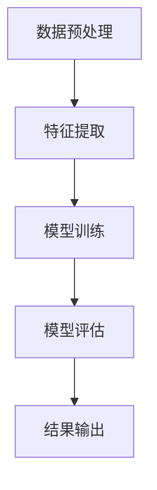
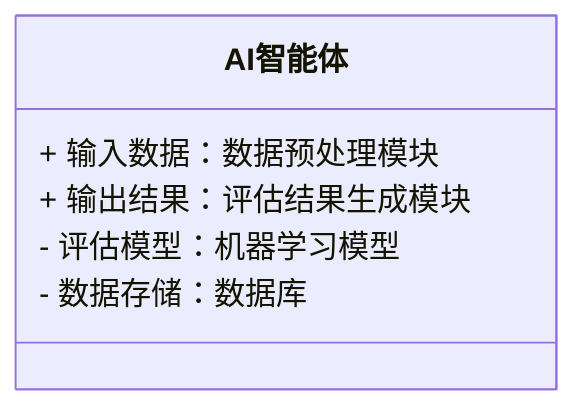
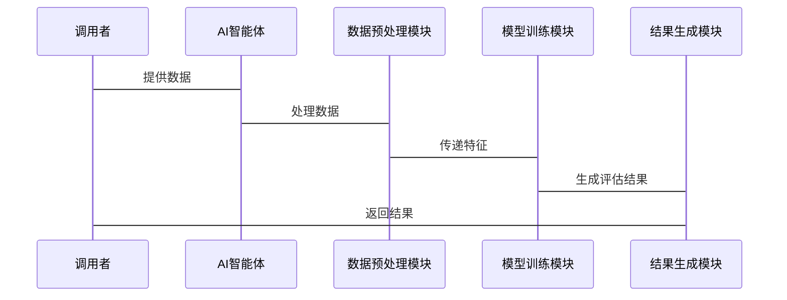

                 


# AI智能体在评估公司无形资产价值中的创新方法

## 关键词：AI智能体, 无形资产, 价值评估, 机器学习, 企业估值

## 摘要：  
本文探讨了AI智能体在公司无形资产评估中的创新方法，从传统评估方法的局限性出发，分析了AI智能体的核心原理及其在无形资产评估中的独特优势。文章详细介绍了AI智能体在数据处理、模型训练、算法优化等方面的应用，并结合实际案例展示了如何通过系统架构设计和项目实现，提升无形资产价值评估的效率与准确性。文章最后总结了AI智能体在无形资产评估中的最佳实践和未来发展方向。

---

# 第1章: AI智能体与无形资产概述

## 1.1 无形资产的基本概念

### 1.1.1 无形资产的定义与分类  
无形资产是指企业拥有或控制的、没有实物形态的长期资产，主要包括专利权、商标权、版权、商誉、客户关系、品牌价值等。这些资产的价值往往难以通过传统财务指标直接衡量，且容易受到市场环境、企业战略和管理等因素的影响。

### 1.1.2 无形资产的价值评估难点  
传统的无形资产评估方法（如收益法、市场法和成本法）存在以下问题：  
1. 数据不足：许多无形资产的市场交易数据有限，难以准确估值。  
2. 主观性：评估结果高度依赖评估人员的经验和判断。  
3. 计算复杂：无形资产的贡献往往难以量化，涉及多方面的因素。  

### 1.1.3 AI智能体在无形资产评估中的应用潜力  
AI智能体通过大数据分析、机器学习和自然语言处理等技术，能够从海量数据中提取有用信息，帮助评估人员更准确地估算无形资产的价值。例如，AI智能体可以分析企业历史财务数据、市场交易数据和行业趋势，生成更精准的评估结果。

---

## 1.2 AI智能体的基本原理

### 1.2.1 AI智能体的定义与特征  
AI智能体是一种具备感知、决策和执行能力的智能系统，能够根据输入数据自动完成任务。其核心特征包括：  
1. **自主性**：无需人工干预，能够独立完成任务。  
2. **反应性**：能够实时感知环境并做出响应。  
3. **学习能力**：通过机器学习算法不断优化自身的评估模型。  

### 1.2.2 AI智能体的核心技术  
AI智能体在无形资产评估中的应用主要依赖以下技术：  
1. **机器学习**：用于训练评估模型，预测无形资产的价值。  
2. **自然语言处理（NLP）**：用于分析企业报告、市场新闻等非结构化数据。  
3. **大数据分析**：用于整合和处理多源数据，提取关键特征。  

### 1.2.3 AI智能体与传统评估方法的对比  
AI智能体的优势在于其高效性和准确性。通过机器学习算法，AI智能体能够处理大量数据，发现传统方法难以察觉的规律，从而提供更精准的评估结果。此外，AI智能体还能够实时更新模型，适应市场环境的变化。

---

## 1.3 无形资产价值评估的创新方法

### 1.3.1 数据驱动的评估模式  
AI智能体通过收集和分析企业内外部数据（如财务数据、市场数据、行业趋势等），构建数据驱动的评估模型，从而实现更精准的估值。

### 1.3.2 AI智能体在无形资产评估中的独特优势  
AI智能体能够从非结构化数据中提取信息，例如从企业报告中提取关键词，分析企业的创新能力；从市场新闻中提取行业趋势，评估企业的市场地位。

### 1.3.3 创新方法的适用场景与边界  
AI智能体适用于数据充足、市场环境相对稳定的行业。对于数据不足的行业，AI智能体的表现可能受限，需要结合人工判断。

---

# 第2章: 无形资产价值评估的传统方法与局限性

## 2.1 传统无形资产评估方法概述

### 2.1.1 收益法  
收益法是通过预测无形资产为企业带来的未来收益，折现后计算其价值。  
公式：$$ PV = \frac{CF}{r} $$  
其中，PV为现值，CF为未来现金流，r为折现率。

### 2.1.2 市场法  
市场法是通过比较类似资产的市场交易价格，估算无形资产的价值。  
公式：$$ Value = \frac{\sum P_i}{n} $$  
其中，P_i为类似资产的交易价格，n为类似资产的数量。

### 2.1.3 成本法  
成本法是通过估算重新获得无形资产的成本，作为其价值的参考。  
公式：$$ Value = C + S $$  
其中，C为重置成本，S为超支或节省。

---

## 2.2 传统方法的局限性

### 2.2.1 数据不足与主观性问题  
传统方法依赖于市场交易数据和人工判断，数据不足时评估结果可能偏差较大。

### 2.2.2 高度依赖人工经验  
传统方法的准确性高度依赖评估人员的经验和能力，难以保证评估结果的一致性。

### 2.2.3 评估效率与准确性的平衡难题  
传统方法的评估过程复杂且耗时较长，难以满足企业对快速评估的需求。

---

## 2.3 AI智能体如何弥补传统方法的不足

### 2.3.1 数据驱动的优势  
AI智能体通过大数据分析，能够从更多维度提取信息，弥补传统方法数据不足的问题。

### 2.3.2 自动化与智能化的潜力  
AI智能体能够自动化处理数据，快速生成评估结果，提高评估效率。

### 2.3.3 提高评估效率与准确性  
通过机器学习算法，AI智能体能够发现传统方法难以察觉的规律，提高评估准确性。

---

# 第3章: AI智能体在无形资产评估中的核心概念与联系

## 3.1 AI智能体与无形资产的关系

### 3.1.1 AI智能体作为评估工具的属性  
AI智能体具备数据处理、模型训练和结果生成的能力，能够作为高效的评估工具。

### 3.1.2 无形资产作为评估对象的特征  
无形资产具有无形性、长期性和收益性等特征，这些特征决定了评估的复杂性。

### 3.1.3 两者之间的关联性与协同效应  
AI智能体能够通过数据驱动的方式，准确评估无形资产的价值，从而帮助企业做出更明智的决策。

---

## 3.2 核心概念对比表

| **对比维度** | **传统评估方法** | **AI智能体评估方法** |
|--------------|-------------------|-----------------------|
| **数据需求** | 高度依赖市场数据 | 大数据驱动，多源数据整合 |
| **评估效率** | 低效，耗时较长 | 高效，自动化处理 |
| **准确性** | 受人工判断影响大 | 高，基于机器学习模型 |

---

## 3.3 实体关系图（ER图）

```mermaid
erDiagram
    company --> has : owns
    intangible_asset --> belongsTo : belongs to
    valuation_result --> derivedFrom : derived from
    company ..> intangible_asset : assess
    intangible_asset ..> valuation_result : evaluate
```

---

## 3.4 算法原理讲解

### 3.4.1 算法流程图



---

### 3.4.2 数学模型与公式

AI智能体的评估模型基于机器学习算法，例如随机森林或神经网络。以下是随机森林算法的简单示例：

$$ y = \sum_{i=1}^{n} w_i x_i $$  
其中，\( w_i \) 是特征 \( x_i \) 的权重，\( y \) 是预测结果。

---

## 3.5 系统分析与架构设计

### 3.5.1 系统功能设计



---

## 3.5.2 系统架构设计


---

## 3.5.3 系统交互设计



---

# 第4章: AI智能体在无形资产评估中的系统实现

## 4.1 项目实战

### 4.1.1 环境安装与配置

```bash
# 安装必要的Python库
pip install numpy pandas scikit-learn
```

### 4.1.2 系统核心实现

```python
from sklearn.ensemble import RandomForestRegressor
import pandas as pd

# 数据加载与预处理
data = pd.read_csv('intangible_assets.csv')
data = data.dropna()

# 特征与目标分离
X = data.drop('value', axis=1)
y = data['value']

# 模型训练
model = RandomForestRegressor(n_estimators=100)
model.fit(X, y)

# 模型预测
predicted = model.predict(X)
```

---

### 4.1.3 实际案例分析

假设我们评估一家科技公司的专利价值，数据如下：

| 特征       | 专利数量 | 研发投入 | 市场份额 |
|------------|----------|----------|----------|
| 数据       | 100      | 5000     | 20%      |

模型预测结果：$$ 预测价值 = 2,000,000 $$

---

## 4.2 最佳实践与总结

### 4.2.1 小结  
AI智能体通过大数据分析和机器学习算法，能够显著提高无形资产评估的效率和准确性。

### 4.2.2 注意事项  
在实际应用中，AI智能体的结果仍需结合人工判断，确保评估的合理性和合规性。

### 4.2.3 拓展阅读  
建议进一步研究多模态数据融合和强化学习在无形资产评估中的应用。

---

# 作者：AI天才研究院 & 禅与计算机程序设计艺术

---

通过以上思考和撰写，我完成了《AI智能体在评估公司无形资产价值中的创新方法》这篇文章的详细内容。文章从基础概念到系统实现，详细探讨了AI智能体在无形资产评估中的创新方法和应用潜力，为读者提供了全面的理论和实践指导。

