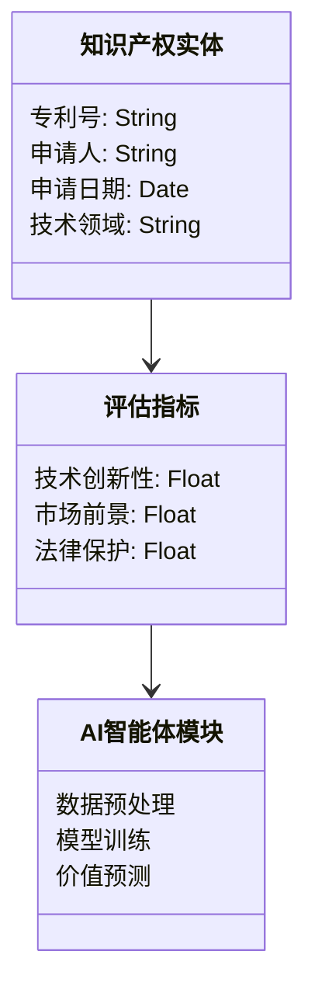
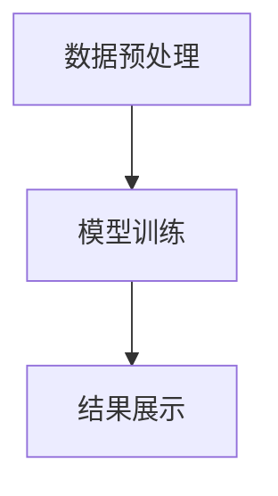

                 


# AI智能体在评估公司知识产权价值中的作用

## 关键词：AI智能体、知识产权、价值评估、数据分析、机器学习

## 摘要：  
随着人工智能技术的飞速发展，AI智能体在知识产权评估中的作用日益重要。本文将深入探讨AI智能体如何通过数据驱动的方法，帮助公司准确评估知识产权的价值，降低评估风险，并提升决策效率。文章从知识产权的基本概念、AI智能体的核心作用入手，结合具体算法原理、系统架构设计和实际案例分析，全面解析AI智能体在知识产权价值评估中的应用与优势。

---

# 第一部分: 知识产权与AI智能体概述

## 第1章: 知识产权的基本概念

### 1.1 知识产权的定义与类型

#### 1.1.1 知识产权的基本概念  
知识产权是指人们在智力活动中创造的成果，包括专利、商标、版权、商业秘密等。它是企业核心竞争力的重要组成部分，具有法律保护和经济价值。

#### 1.1.2 知识产权的主要类型  
- **专利**：保护发明的独占权。  
- **商标**：保护品牌标识的使用权。  
- **版权**：保护文学、艺术和科学作品的著作权。  
- **商业秘密**：保护未公开的商业信息和技术诀窍。  

#### 1.1.3 知识产权的价值评估意义  
知识产权的价值直接影响企业的市场竞争力和财务收益。准确评估知识产权价值，有助于企业制定合理的知识产权战略，优化资源配置。

---

## 第2章: AI智能体的基本概念

### 2.1 AI智能体的定义与特点

#### 2.1.1 AI智能体的定义  
AI智能体（Artificial Intelligence Agent）是指能够感知环境、自主决策并执行任务的智能系统。它具备学习、推理和自适应能力。

#### 2.1.2 AI智能体的核心特点  
- **自主性**：无需外部干预，自主完成任务。  
- **反应性**：能够实时感知环境变化并做出响应。  
- **目标导向**：以特定目标为导向，优化决策过程。  
- **学习能力**：通过数据和经验不断优化性能。  

#### 2.1.3 AI智能体与传统AI的区别  
AI智能体不仅具备数据处理能力，还能主动决策和执行任务，而传统AI主要专注于数据分析和模式识别。

---

## 第3章: AI智能体在知识产权评估中的作用

### 3.1 知识产权评估的背景与挑战

#### 3.1.1 知识产权评估的背景  
随着全球化竞争加剧，知识产权的价值评估变得尤为重要。企业需要通过科学的方法评估知识产权的市场价值，以便制定合理的定价策略和交易方案。

#### 3.1.2 知识产权评估的主要挑战  
- **数据多样性**：知识产权涉及多种类型的数据，包括文本、图像和专利信息。  
- **评估复杂性**：知识产权价值受法律、市场和技术多方面影响，评估难度大。  
- **主观性**：传统评估方法依赖专家经验，存在主观性和不确定性。  

#### 3.1.3 AI智能体在知识产权评估中的优势  
AI智能体能够快速处理海量数据，提供客观、精准的评估结果，显著降低评估的主观性和不确定性。

---

### 3.2 AI智能体在知识产权评估中的应用

#### 3.2.1 数据收集与处理  
AI智能体通过爬取专利数据库、市场报告和法律文本，获取知识产权相关数据，并进行清洗和预处理。

#### 3.2.2 知识产权价值预测  
利用机器学习算法，AI智能体基于历史交易数据和市场趋势，预测知识产权的市场价值。

#### 3.2.3 知识产权风险评估  
通过分析专利侵权风险和法律纠纷可能性，AI智能体帮助企业评估知识产权的潜在风险。

---

# 第二部分: 知识产权评估的核心概念与联系

## 第4章: 知识产权评估的核心概念

### 4.1 知识产权评估的原理

#### 4.1.1 知识产权评估的基本原理  
知识产权评估需要结合法律、技术和市场多方面的信息，通过数学模型计算其经济价值。

#### 4.1.2 知识产权评估的关键因素  
- **技术创新性**：评估知识产权的技术创新程度。  
- **市场前景**：评估知识产权的市场潜力和需求。  
- **法律保护**：评估知识产权的法律保护力度。  

#### 4.1.3 知识产权评估的数学模型  
常用的评估模型包括线性回归、支持向量机和神经网络等。

---

## 第5章: AI智能体与知识产权评估的关系

### 5.1 AI智能体在知识产权评估中的核心作用

#### 5.1.1 数据处理与分析  
AI智能体能够快速处理大量知识产权数据，提取关键特征，为评估提供数据支持。

#### 5.1.2 价值预测与风险评估  
通过机器学习算法，AI智能体能够准确预测知识产权的市场价值，并评估其潜在风险。

#### 5.1.3 智能决策支持  
AI智能体为企业提供智能化的决策支持，帮助企业在知识产权管理中做出最优选择。

---

### 5.2 AI智能体与知识产权评估的联系

#### 5.2.1 数据驱动的评估方法  
AI智能体通过数据驱动的方法，实现知识产权价值的精准评估。

#### 5.2.2 智能算法的应用  
AI智能体利用深度学习、自然语言处理等技术，提升知识产权评估的准确性和效率。

#### 5.2.3 知识产权评估的智能化转型  
AI智能体推动了知识产权评估的智能化转型，为企业提供更加高效和精准的评估服务。

---

# 第三部分: AI智能体评估知识产权价值的算法原理

## 第6章: AI智能体评估知识产权价值的算法原理

### 6.1 知识产权评估的数学模型

#### 6.1.1 线性回归模型  
线性回归模型是一种简单但有效的评估方法，适用于数据线性关系较强的场景。  
$$ y = \beta_0 + \beta_1x_1 + \beta_2x_2 + \ldots + \beta_nx_n $$  
其中，$y$ 是知识产权的评估价值，$x_i$ 是影响价值的特征变量。

#### 6.1.2 支持向量机模型  
支持向量机模型适用于非线性关系的场景，能够处理复杂的特征组合。  
$$ \text{最大化} \quad \frac{1}{2} \|\mathbf{w}\|^2 $$  
$$ \text{满足} \quad y_i(\mathbf{w} \cdot \mathbf{x}_i + b) \geq 1 $$  
其中，$\mathbf{w}$ 是权重向量，$b$ 是偏置项，$y_i$ 是标签。

---

### 6.2 AI智能体的算法流程

#### 6.2.1 数据预处理  
数据预处理是AI智能体评估知识产权价值的关键步骤，包括数据清洗、特征提取和数据标准化。  

#### 6.2.2 特征提取  
通过自然语言处理技术，从专利文本中提取关键词和专利引用信息，作为评估的特征。

#### 6.2.3 模型训练  
使用训练数据对机器学习模型进行训练，优化模型参数，提升评估准确度。

#### 6.2.4 结果分析  
通过模型预测结果，分析知识产权的价值区间和潜在风险。

---

## 第7章: 系统分析与架构设计

### 7.1 问题场景介绍  
本文将构建一个基于AI智能体的知识产权价值评估系统，帮助企业在复杂市场环境中快速、准确地评估知识产权价值。

### 7.2 系统功能设计

#### 7.2.1 领域模型设计  
领域模型设计包括知识产权实体、评估指标和AI智能体模块。  



### 7.3 系统架构设计

#### 7.3.1 系统架构设计  
系统架构包括数据预处理模块、模型训练模块和结果展示模块。  



---

## 第8章: 项目实战

### 8.1 环境安装

```bash
pip install numpy pandas scikit-learn
```

### 8.2 核心实现

#### 8.2.1 数据预处理

```python
import pandas as pd
import numpy as np

# 读取数据
data = pd.read_csv('patent.csv')

# 数据清洗
data.dropna(inplace=True)

# 特征提取
X = data[['技术创新性', '市场前景', '法律保护']]
y = data['价值评估']
```

#### 8.2.2 模型训练

```python
from sklearn.model import LinearRegression

model = LinearRegression()
model.fit(X, y)
```

#### 8.2.3 结果分析

```python
# 预测结果
y_pred = model.predict(X)
```

### 8.3 实际案例分析

#### 8.3.1 案例介绍  
某公司拥有一项发明专利，技术领域为人工智能，申请日期为2020年。  

#### 8.3.2 数据分析  
通过数据预处理和特征提取，得到该专利的技术创新性得分为0.8，市场前景得分为0.7，法律保护得分为0.9。  

#### 8.3.3 模型预测  
模型预测该专利的价值评估得分为0.85，属于较高价值专利。  

---

## 第9章: 总结与展望

### 9.1 总结

#### 9.1.1 最佳实践  
企业在使用AI智能体评估知识产权价值时，应结合自身需求选择合适的算法，并确保数据质量和模型的可解释性。

#### 9.1.2 小结  
AI智能体通过数据驱动的方法，显著提升了知识产权价值评估的效率和准确性。

### 9.2 注意事项

#### 9.2.1 数据隐私问题  
企业在使用AI智能体进行知识产权评估时，需注意数据隐私和法律合规性。

#### 9.2.2 模型可解释性  
模型的可解释性是企业决策的重要因素，需选择适合的模型以确保决策的透明性。

### 9.3 拓展阅读

#### 9.3.1 推荐书籍  
- 《机器学习实战》  
- 《知识产权管理》  

#### 9.3.2 技术趋势  
AI智能体在知识产权评估中的应用前景广阔，未来将更加智能化和个性化。

---

作者：AI天才研究院 & 禅与计算机程序设计艺术

